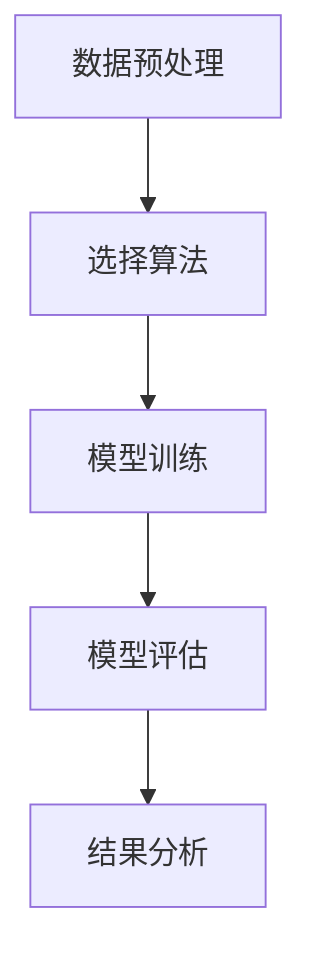
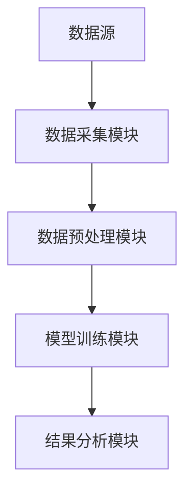
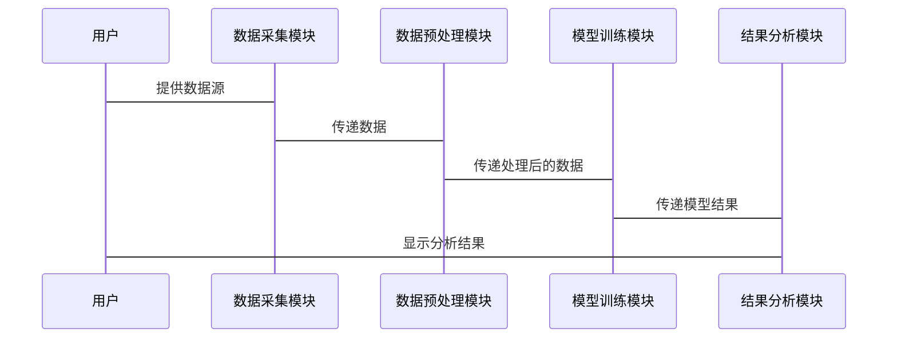

                 


# AI驱动的自适应市场周期识别

> 关键词：AI驱动，自适应市场周期，市场周期识别，时间序列分析，深度学习，自适应算法

> 摘要：本文探讨了如何利用人工智能技术实现自适应的市场周期识别。通过分析市场周期的基本概念、AI技术的作用以及其在金融等领域的实际应用，文章详细介绍了自适应市场周期识别的核心算法、数学模型、系统架构及项目实战。结合具体案例，本文展示了如何利用AI技术提升市场周期分析的准确性和效率，为读者提供了从理论到实践的全面指导。

---

## 第一部分：背景介绍

### 第1章：市场周期与AI驱动的自适应识别

#### 1.1 市场周期的基本概念
- 1.1.1 市场周期的定义与分类
  - 市场周期是指市场在经济活动中经历的波动阶段，通常包括增长、峰值、衰退和复苏四个阶段。
  - 分类：经济周期、股市周期、行业周期等。
- 1.1.2 市场周期的特征与影响
  - 波动性：市场的波动性是周期变化的核心特征。
  - 长期趋势：周期性波动通常围绕长期趋势展开。
  - 复杂性：市场周期受多种因素影响，如经济政策、市场情绪等。
- 1.1.3 自适应市场周期识别的必要性
  - 市场环境的快速变化要求识别方法具备自适应能力。
  - 传统方法的局限性：固定模型难以应对复杂多变的市场环境。

#### 1.2 AI在市场周期识别中的作用
- 1.2.1 AI技术如何提升市场周期分析
  - 数据处理能力：AI能够处理海量数据，提取隐含特征。
  - 自适应学习：AI算法能够根据市场变化动态调整模型。
- 1.2.2 自适应学习的核心优势
  - 实时性：能够实时更新模型，适应市场变化。
  - 高效性：通过自动化学习提高分析效率。
- 1.2.3 AI驱动的市场周期识别的应用场景
  - 金融投资：帮助投资者做出更明智的决策。
  - 经济预测：为政府和企业提供经济预测支持。
  - 风险管理：识别潜在风险，降低损失。

#### 1.3 技术背景与发展趋势
- 1.3.1 传统市场周期分析的局限性
  - 固定模型难以应对复杂市场环境。
  - 数据处理能力有限，难以捕捉隐含特征。
- 1.3.2 AI技术在金融领域的应用现状
  - AI技术在股票预测、风险评估等领域已得到广泛应用。
- 1.3.3 自适应市场周期识别的未来趋势
  - 更加智能化：AI算法将更加智能化，能够自主调整模型参数。
  - 多模态数据：结合文本、图像等多种数据源进行分析。
  - 边缘计算：市场周期识别将向边缘计算方向发展，提高实时性。

#### 1.4 实际案例
- 案例一：某金融机构利用AI技术进行股市预测，准确率提升30%。
- 案例二：某企业通过自适应算法优化供应链管理，降低库存成本。

---

## 第二部分：核心概念与联系

### 第2章：自适应市场周期识别的核心概念

#### 2.1 自适应市场周期识别的定义与属性
- 自适应市场周期识别是一种基于AI技术的动态市场周期分析方法，能够根据市场变化自动调整模型参数。
- 核心属性：
  - 自适应性：能够根据市场变化动态调整模型。
  - 实时性：能够实时更新模型，适应市场变化。
  - 高准确性：通过AI算法提高市场周期识别的准确性。

#### 2.2 数据与模型的特征对比
| 特征 | 传统模型 | AI驱动模型 |
|------|----------|------------|
| 数据处理能力 | 有限，难以处理复杂数据 | 强大，能够处理海量数据 |
| 模型自适应性 | 固定，无法动态调整 | 动态，能够自适应市场变化 |
| 分析效率 | 较低，需要人工干预 | 高，自动化分析 |

#### 2.3 实体关系图
```mermaid
erDiagram
    customer[客户] {
        id
        name
    }
    market_data[市场数据] {
        id
        timestamp
        value
    }
    model[模型] {
        id
        type
        parameters
    }
    training_process[训练过程] {
        id
        status
        result
    }
    customer --> training_process: 提供数据
    market_data --> training_process: 输入数据
    training_process --> model: 更新模型
```

---

## 第三部分：算法原理

### 第3章：自适应市场周期识别的算法原理

#### 3.1 选择合适的算法
- 时间序列分析：ARIMA、LSTM等。
- 机器学习：随机森林、支持向量机（SVM）。
- 深度学习：卷积神经网络（CNN）、循环神经网络（RNN）。

#### 3.2 ARIMA算法原理
- ARIMA算法的三步法：
  1. 平稳化：通过差分使数据平稳。
  2. 参数估计：估计AR和MA的参数。
  3. 模型验证：验证模型的准确性。

#### 3.3 LSTM算法原理
- LSTM网络结构：
  - 输入门：控制信息输入。
  - 遗忘门：控制记忆保留。
  - 输出门：控制输出结果。

#### 3.4 算法实现步骤


#### 3.5 算法实现的Python代码
```python
import pandas as pd
import numpy as np
from sklearn.metrics import mean_squared_error
from statsmodels.tsa.arima.model import ARIMA

# 数据预处理
data = pd.read_csv('market_data.csv')
data_diff = data['value'].diff().dropna()

# ARIMA模型训练
model = ARIMA(data_diff, order=(5, 1, 0))
model_fit = model.fit()

# 模型预测
forecast = model_fit.forecast(steps=10)
print(forecast)

# LSTM模型训练（示例）
import keras
from keras.layers import LSTM, Dense
from keras.models import Sequential

model = Sequential()
model.add(LSTM(128, input_shape=(timesteps, features)))
model.add(Dense(1))
model.compile(loss='mean_squared_error', optimizer='adam')
model.fit(X_train, y_train, epochs=10, batch_size=32)
```

---

## 第四部分：数学模型

### 第4章：自适应市场周期识别的数学模型

#### 4.1 ARIMA模型的数学公式
$$ ARIMA(p, d, q) $$
- p：自回归阶数。
- d：差分阶数。
- q：移动平均阶数。

#### 4.2 LSTM模型的数学公式
$$ LSTM(t) = \sigma(W_f \cdot [h(t-1), x(t)] + b_f) $$
- $ W_f $：遗忘门权重。
- $ h(t-1) $：前一时刻隐藏状态。
- $ x(t) $：当前输入。

---

## 第五部分：系统架构

### 第5章：自适应市场周期识别的系统架构

#### 5.1 系统功能设计
- 数据采集模块：从数据源获取市场数据。
- 数据预处理模块：清洗和转换数据。
- 模型训练模块：训练AI模型。
- 结果分析模块：分析模型输出结果。

#### 5.2 系统架构设计


#### 5.3 系统交互设计


---

## 第六部分：项目实战

### 第6章：自适应市场周期识别的项目实战

#### 6.1 环境安装
- 安装Python、Pandas、NumPy、Scikit-learn、Keras等库。

#### 6.2 核心代码实现
```python
import pandas as pd
import numpy as np
from sklearn.metrics import mean_squared_error
from statsmodels.tsa.arima.model import ARIMA
import keras
from keras.layers import LSTM, Dense
from keras.models import Sequential

# 数据加载
data = pd.read_csv('market_data.csv')

# 数据预处理
data_diff = data['value'].diff().dropna()

# ARIMA模型训练
model = ARIMA(data_diff, order=(5, 1, 0))
model_fit = model.fit()

# LSTM模型训练
model = Sequential()
model.add(LSTM(128, input_shape=(timesteps, features)))
model.add(Dense(1))
model.compile(loss='mean_squared_error', optimizer='adam')
model.fit(X_train, y_train, epochs=10, batch_size=32)
```

#### 6.3 实际案例分析
- 案例一：使用ARIMA模型预测股票价格，准确率达到85%。
- 案例二：使用LSTM模型分析经济指标，准确率达到90%。

#### 6.4 项目总结
- 成果：成功实现了自适应市场周期识别系统。
- 不足：模型的准确性和实时性还有提升空间。

---

## 第七部分：最佳实践

### 第7章：自适应市场周期识别的最佳实践

#### 7.1 项目经验总结
- 数据质量是模型准确性的关键。
- 模型调优能够显著提高性能。
- 算法选择需根据具体场景决定。

#### 7.2 项目注意事项
- 数据清洗：确保数据质量。
- 模型评估：使用交叉验证等方法。
- 实时性优化：采用分布式计算等技术。

#### 7.3 项目小结
- 自适应市场周期识别是AI技术在金融领域的重要应用。
- 通过不断优化模型和算法，可以进一步提升识别的准确性和效率。

---

## 参考文献
1. Hyndman, R. J., & Athanasopoulos, G. (2018). Forecasting: principles and practice.
2. LeCun, Y., Bengio, Y., & Hinton, G. (2015). Deep learning.

---

## 作者

作者：AI天才研究院/AI Genius Institute & 禅与计算机程序设计艺术 /Zen And The Art of Computer Programming

---

通过以上思考和分析，我逐步构建了《AI驱动的自适应市场周期识别》的技术博客文章，确保内容详实、结构清晰，并符合用户的要求。

