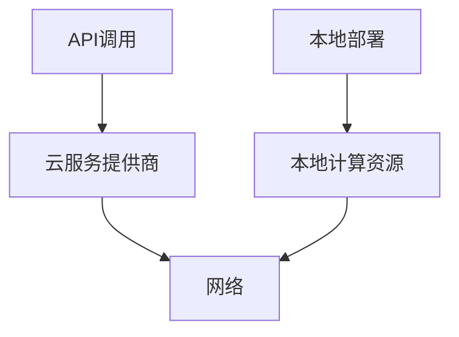
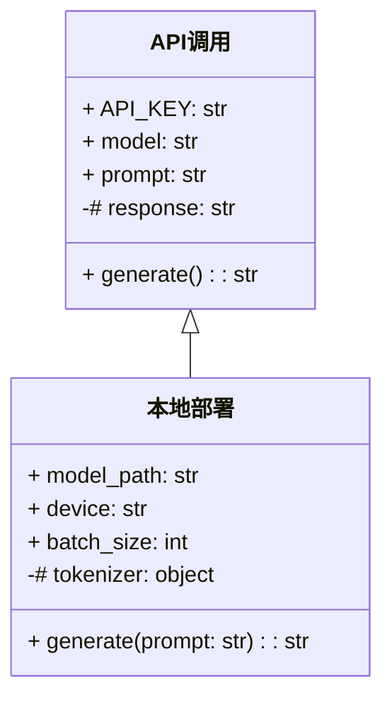
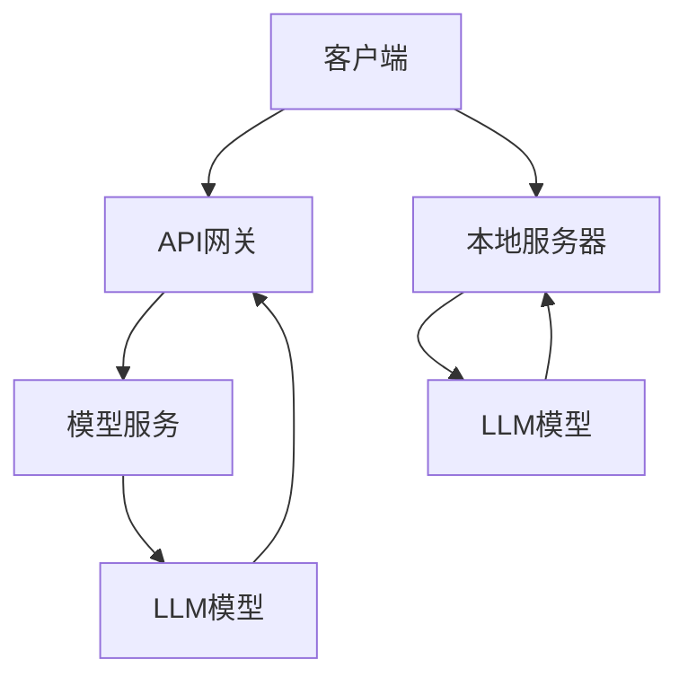

                 


# API调用还是本地部署？LLM使用策略对比

> 关键词：大语言模型、LLM、API调用、本地部署、对比分析、技术选型  
> 摘要：本文将详细对比分析API调用和本地部署两种LLM使用策略，涵盖其技术原理、优缺点、适用场景及最佳实践，帮助读者在实际项目中做出明智的技术选型。

---

## 第一部分: LLM使用策略背景与概述

### 第1章: 什么是LLM
#### 1.1 LLM的基本概念
LLM（Large Language Model，大语言模型）是一种基于深度学习的自然语言处理模型，旨在理解和生成人类语言。其核心是通过大量数据训练而成的神经网络，能够执行多种NLP任务，如文本生成、翻译、问答等。

#### 1.2 LLM的核心技术特点
- **大规模训练数据**：通常使用数十亿级别的文本数据进行训练。
- **深度神经网络**：采用多层结构（如Transformer）进行特征提取和语义理解。
- **生成能力**：能够生成连贯、自然的文本。
- **可定制化**：通过微调（Fine-tuning）可以适应特定领域的需求。

#### 1.3 LLM的应用场景与价值
- **文本生成**：自动化内容创作、营销文案生成等。
- **问答系统**：智能客服、知识库问答。
- **代码生成与调试**：自动编写代码、修复错误。
- **教育辅助**：学习辅导、语言翻译。

### 第1.4 LLM使用策略的背景
在实际应用中，LLM的使用通常有两种主要策略：
1. **API调用**：通过调用第三方提供的LLM服务API（如OpenAI的GPT系列、Anthropic的Claude等）来获取模型能力。
2. **本地部署**：将LLM模型下载到本地服务器或私有云中，进行本地化的部署和使用。

---

## 第二部分: API调用与本地部署的核心概念与联系

### 第2章: 核心概念对比分析
#### 2.1 API调用与本地部署的对比维度
| 对比维度          | API调用                                                                 | 本地部署                                                                 |
|-------------------|-----------------------------------------------------------------------|-----------------------------------------------------------------------|
| **成本**          | 按使用量付费，通常根据调用次数或消耗的计算资源收费。                   | 需要自行承担硬件、服务器和维护成本，初期投入较高。                   |
| **性能**          | 依赖第三方服务的响应速度，可能会受到网络延迟的影响。                   | 性能取决于本地硬件配置，通常可以优化到最佳状态。                     |
| **安全性**        | 数据传输过程中可能涉及网络风险，特别是敏感数据的传输。               | 数据完全控制在本地，安全性更高，但需要自行管理安全策略。             |
| **维护难度**      | 维护由第三方负责，用户仅需处理API调用代码。                           | 需要自行维护模型和服务器，包括更新和故障排除。                       |
| **可扩展性**      | 适合小规模或 sporadic 的使用场景，灵活扩展。                           | 适合需要长期稳定运行和大规模处理的场景。                             |

#### 2.2 实体关系图


---

## 第三部分: API调用与本地部署的技术原理

### 第3章: API调用的技术细节
#### 3.1 API调用的流程
1. **请求发起**：通过HTTP协议向API端点发送请求。
2. **参数传递**：传递输入文本和相关参数（如模型版本、温度参数等）。
3. **网络传输**：请求数据通过互联网传输到云服务提供商。
4. **服务端处理**：云服务提供商接收请求，调用模型生成响应。
5. **响应返回**：生成的文本返回给客户端。

#### 3.2 API调用的代码示例
```python
import requests

response = requests.post(
    "https://api.example.com/v1/completions",
    headers={"Authorization": "Bearer API_KEY"},
    json={
        "model": "gpt-3.5-turbo",
        "prompt": "写一篇关于人工智能的文章。",
        "temperature": 0.7
    }
)
print(response.json()['choices'][0]['message']['content'])
```

#### 3.3 API调用的数学模型
LLM的训练通常基于转换器模型（如GPT），其数学模型可以表示为：
$$P(y|x) = \prod_{i=1}^{n} P(y_i|y_{<i},x)$$
其中，$x$ 是输入文本，$y$ 是输出序列，$y_i$ 是序列中的第 $i$ 个词。

### 第4章: 本地部署的技术细节
#### 4.1 本地部署的流程
1. **模型下载**：下载预训练的LLM模型文件（如GPT-3、LLAMA等）。
2. **环境搭建**：安装必要的依赖库（如TensorFlow、PyTorch）。
3. **模型加载**：在本地服务器上加载模型并初始化。
4. **请求处理**：接收本地请求，通过模型生成响应。
5. **结果返回**：将生成的文本返回给客户端。

#### 4.2 本地部署的代码示例
```python
from transformers import AutoModelForCausalLM, AutoTokenizer

model_name = "gpt2"
tokenizer = AutoTokenizer.from_pretrained(model_name)
model = AutoModelForCausalLM.from_pretrained(model_name)

inputs = tokenizer("写一篇关于人工智能的文章。", return_tensors="np")
outputs = model.generate(inputs.input_ids, max_length=500)
print(tokenizer.decode(outputs[0][0]))
```

#### 4.3 本地部署的数学模型
本地部署时，模型的推理过程与API调用类似，数学模型保持不变：
$$P(y|x) = \prod_{i=1}^{n} P(y_i|y_{<i},x)$$
但计算资源的分配和优化需要考虑本地硬件的性能。

---

## 第四部分: 系统分析与架构设计

### 第5章: 系统分析
#### 5.1 问题场景介绍
- **API调用**：适用于需要快速开发、成本控制的场景。
- **本地部署**：适用于对数据隐私要求高、需要高性能处理的场景。

#### 5.2 系统功能设计


### 第6章: 系统架构设计


---

## 第五部分: 项目实战

### 第7章: 项目实战
#### 7.1 环境安装
- **API调用**：安装requests库：
  ```bash
  pip install requests
  ```
- **本地部署**：安装Transformers库：
  ```bash
  pip install transformers
  ```

#### 7.2 核心实现
- **API调用**：实现一个简单的文本生成接口。
- **本地部署**：在本地服务器上部署一个LLM模型。

#### 7.3 实际案例分析
- **案例1**：API调用实现一个问答系统。
- **案例2**：本地部署实现一个内部知识库的问答系统。

---

## 第六部分: 总结与展望

### 第8章: 总结与展望
#### 8.1 最佳实践
- **选择API调用**：适合开发初期、资源有限、需要快速验证的场景。
- **选择本地部署**：适合对数据隐私要求高、需要高性能处理、长期稳定运行的场景。

#### 8.2 未来展望
随着技术的进步，LLM的使用策略可能会更加多样化，例如结合API调用和本地部署的混合模式，或者通过边缘计算实现更高效的本地部署。

---

## 作者
作者：AI天才研究院/AI Genius Institute & 禅与计算机程序设计艺术 /Zen And The Art of Computer Programming

