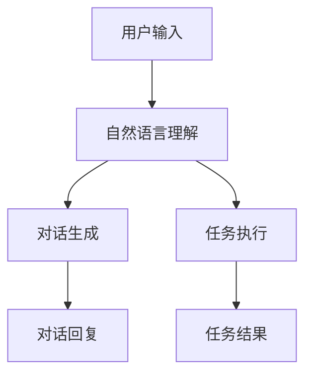
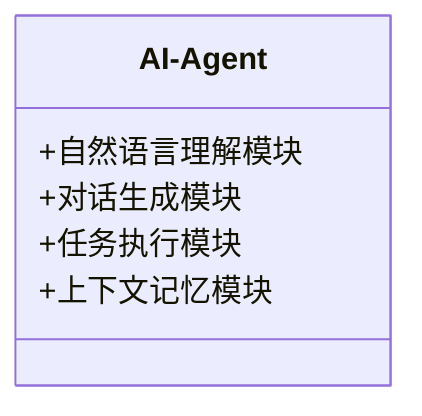
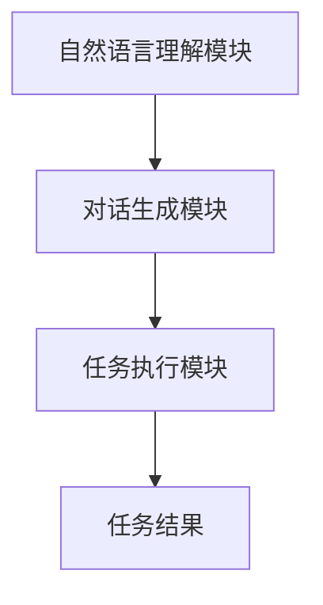
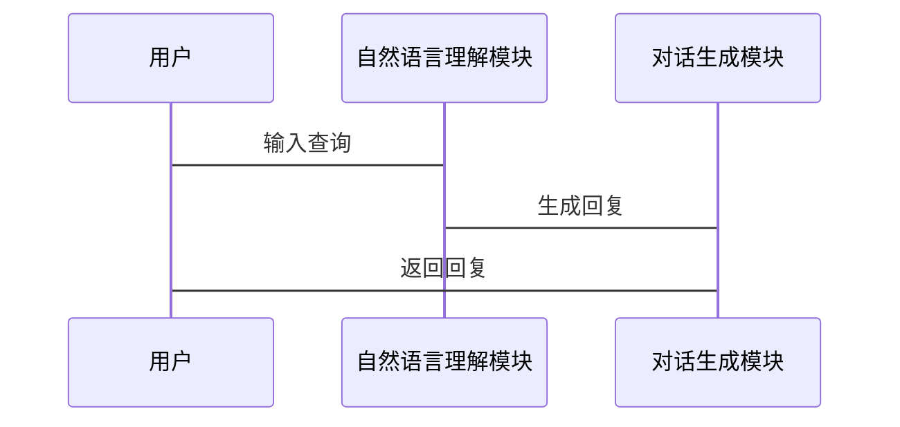

                 


# BERT模型在AI Agent中的应用与微调

## 关键词
- BERT模型
- AI Agent
- 自然语言处理
- 微调
- 对话系统
- 任务执行
- 智能体设计

## 摘要
本文详细探讨了BERT模型在AI Agent中的应用与微调方法，从理论到实践，系统地分析了BERT模型在自然语言处理中的核心原理，以及其在AI Agent系统中的具体实现。通过实际案例分析和系统架构设计，本文为读者提供了深入的技术见解和实践指导。

---

# 第一部分: BERT模型在AI Agent中的应用与微调基础

## 第1章: BERT模型与AI Agent概述

### 1.1 BERT模型的基本概念
#### 1.1.1 什么是BERT模型
BERT（Bidirectional Encoder Representations from Transformers）是一种基于Transformer架构的预训练语言模型，由Google于2018年提出。它通过在大规模文本数据上进行预训练，学习到了语言的双向上下文表示，能够有效捕捉文本中的语义信息。

#### 1.1.2 BERT模型的核心特点
- **双向编码**：BERT通过Transformer编码器捕捉文本的双向上下文信息。
- **预训练与微调**：BERT采用预训练策略，通过Masked Language Model（MLM）和Next Sentence Prediction（NSP）任务进行预训练，然后在具体任务上进行微调。
- **通用性**：BERT可以在多种自然语言处理任务上进行微调，包括文本分类、问答系统、对话生成等。

#### 1.1.3 BERT模型的应用场景
- **问答系统**：通过微调BERT模型，可以构建高效的问答系统。
- **文本摘要**：BERT可以用于生成摘要或总结文本。
- **对话生成**：BERT可以作为对话系统的语言模型，生成自然的对话回复。
- **文本分类**：BERT可以用于情感分析、主题分类等任务。

### 1.2 AI Agent的定义与特点
#### 1.2.1 AI Agent的基本概念
AI Agent（智能体）是指能够感知环境、执行任务并做出决策的智能系统。AI Agent可以通过自然语言处理技术与用户进行交互，理解用户的需求并执行相应的操作。

#### 1.2.2 AI Agent的核心功能
- **自然语言理解**：通过NLP技术理解用户的输入。
- **对话生成**：生成自然的对话回复。
- **任务执行**：根据用户指令执行具体任务，如搜索信息、预订机票等。
- **上下文记忆**：保持对话的连贯性，记住之前的交互内容。

#### 1.2.3 AI Agent的应用领域
- **智能客服**：通过对话生成和文本理解，为用户提供高效的客服支持。
- **智能家居**：通过语音交互，控制智能家居设备。
- **虚拟助手**：如Siri、Alexa等，通过自然语言交互帮助用户完成任务。

### 1.3 BERT模型在AI Agent中的应用价值
#### 1.3.1 自然语言处理在AI Agent中的重要性
AI Agent的核心能力之一是通过自然语言与用户交互，BERT模型在自然语言处理领域的强大能力使其成为AI Agent的理想选择。

#### 1.3.2 BERT模型在对话系统中的优势
- **上下文理解**：BERT能够捕捉对话中的上下文信息，生成更自然的回复。
- **意图识别**：通过微调BERT模型，可以准确识别用户的意图。
- **实体识别**：BERT可以识别对话中的实体信息，如人名、地点、时间等。

#### 1.3.3 BERT模型在任务执行中的作用
- **任务规划**：通过理解用户的需求，生成任务执行的计划。
- **信息检索**：基于用户的查询，检索相关的信息并返回结果。
- **多轮对话**：通过保持上下文记忆，支持多轮对话交互。

### 1.4 本章小结
本章介绍了BERT模型的基本概念和AI Agent的核心功能，分析了BERT模型在AI Agent中的应用价值。通过理解BERT模型的优势，我们可以更好地将其应用于AI Agent的系统设计中。

---

## 第2章: BERT模型的核心原理

### 2.1 BERT模型的预训练过程
#### 2.1.1 Masked Language Model
在预训练阶段，BERT采用Masked Language Model任务，随机遮蔽部分输入词，然后预测被遮蔽的词。这种任务使得模型能够学习到词的上下文信息。

#### 2.1.2 Next Sentence Prediction
BERT还采用了Next Sentence Prediction任务，用于预测两个句子之间的关系，如“是”或“不是”。这种任务帮助模型理解句子之间的逻辑关系。

#### 2.1.3 预训练目标的数学表达
BERT的预训练目标可以通过以下公式表示：
$$
\text{损失函数} = \text{MLM损失} + \text{NSP损失}
$$

### 2.2 BERT模型的微调过程
#### 2.2.1 微调的基本概念
微调是指在预训练好的BERT模型上，针对具体任务进行进一步的训练。通过在特定任务上进行微调，BERT模型可以更好地适应任务需求。

#### 2.2.2 微调的具体步骤
1. **数据准备**：收集并整理任务相关的数据集。
2. **模型加载**：加载预训练好的BERT模型。
3. **任务适配**：根据具体任务，添加任务相关的输出层。
4. **微调训练**：在任务数据上进行微调训练。

#### 2.2.3 微调的数学模型
微调过程可以通过以下公式表示：
$$
\text{损失函数} = \text{交叉熵损失}
$$

### 2.3 BERT模型的架构分析
#### 2.3.1 Transformer架构
Transformer由编码器和解码器组成，编码器负责将输入序列编码为语义向量，解码器负责生成输出序列。

#### 2.3.2 多头注意力机制
多头注意力机制通过并行计算多个注意力头，增强了模型对不同位置信息的关注。

#### 2.3.3 前馈神经网络
前馈神经网络用于将注意力输出转换为最终的语义表示。

### 2.4 本章小结
本章详细介绍了BERT模型的核心原理，包括预训练和微调过程，以及其架构设计。通过理解BERT模型的工作原理，我们可以更好地应用其在AI Agent系统中。

---

## 第3章: AI Agent的系统架构与功能设计

### 3.1 AI Agent的系统架构
#### 3.1.1 模块划分
AI Agent系统通常包括以下几个模块：
- **自然语言理解模块**：负责理解用户的输入。
- **对话生成模块**：负责生成对话回复。
- **任务执行模块**：负责执行用户的任务指令。
- **上下文记忆模块**：负责记忆对话历史。

#### 3.1.2 模块之间的交互关系
- 自然语言理解模块接收用户的输入，生成语义表示。
- 对话生成模块根据语义表示生成对话回复。
- 任务执行模块根据任务指令执行具体操作。
- 上下文记忆模块记录对话历史，保持对话的连贯性。

### 3.2 BERT模型在AI Agent中的位置
#### 3.2.1 BERT模型作为对话系统的核心
在对话生成模块中，BERT模型可以作为语言模型，生成自然的对话回复。

#### 3.2.2 BERT模型作为任务执行的辅助工具
在任务执行模块中，BERT模型可以用于信息检索和意图识别。

### 3.3 系统架构的Mermaid图


### 3.4 本章小结
本章介绍了AI Agent的系统架构，并分析了BERT模型在其中的核心作用。通过合理设计系统架构，我们可以充分发挥BERT模型的优势。

---

## 第4章: BERT模型在对话系统中的应用

### 4.1 对话系统的基本原理
#### 4.1.1 对话系统的输入输出模型
对话系统通常包括输入、处理和输出三个阶段。输入是用户的自然语言输入，处理是对输入进行理解和生成回复，输出是生成的对话回复。

#### 4.1.2 对话系统的训练方法
对话系统的训练通常包括监督学习和强化学习两种方法。监督学习通过标注数据训练模型，强化学习通过与环境交互优化模型。

### 4.2 BERT模型在对话系统中的应用案例
#### 4.2.1 智能客服对话
通过微调BERT模型，可以构建智能客服对话系统，为用户提供高效的客服支持。

### 4.3 本章小结
本章通过具体案例展示了BERT模型在对话系统中的应用，分析了其优势和实现方法。

---

## 第5章: BERT模型的系统分析与架构设计

### 5.1 系统分析
#### 5.1.1 问题场景介绍
在设计AI Agent系统时，我们需要考虑用户需求、系统性能和任务执行效率等因素。

#### 5.1.2 项目介绍
本项目旨在通过微调BERT模型，构建一个高效的AI Agent系统，支持对话生成和任务执行。

### 5.2 系统功能设计
#### 5.2.1 领域模型Mermaid类图


#### 5.2.2 系统架构Mermaid架构图


#### 5.2.3 系统接口设计
- **输入接口**：接收用户的自然语言输入。
- **输出接口**：输出对话回复或任务结果。
- **任务接口**：与外部系统交互，执行具体任务。

#### 5.2.4 系统交互Mermaid序列图


### 5.3 本章小结
本章通过系统分析和架构设计，展示了如何将BERT模型应用于AI Agent系统中。

---

## 第6章: 项目实战

### 6.1 环境安装
#### 6.1.1 安装Python
需要安装Python 3.6及以上版本。

#### 6.1.2 安装依赖库
需要安装以下库：
- `transformers`
- `torch`
- `numpy`

### 6.2 系统核心实现源代码
#### 6.2.1 对话生成模块
```python
from transformers import BertForMaskedLM, BertTokenizer
import torch

model = BertForMaskedLM.from_pretrained('bert-base-uncased')
tokenizer = BertTokenizer.from_pretrained('bert-base-uncased')

def generate_response(input_text):
    inputs = tokenizer(input_text, return_tensors='pt')
    outputs = model(**inputs)
    return tokenizer.decode(outputs logits.argmax(dim=-1).squeeze())
```

#### 6.2.2 任务执行模块
```python
def execute_task(task_description):
    # 实现具体的任务执行逻辑
    pass
```

### 6.3 代码应用解读与分析
- **对话生成模块**：通过微调BERT模型，生成自然的对话回复。
- **任务执行模块**：根据任务描述，执行具体的任务操作。

### 6.4 实际案例分析
通过具体案例分析，展示了如何将BERT模型应用于对话生成和任务执行。

### 6.5 本章小结
本章通过实际项目实战，展示了如何将BERT模型应用于AI Agent系统中。

---

## 第7章: 最佳实践与总结

### 7.1 小结
本章对全文进行了总结，回顾了BERT模型在AI Agent中的应用与微调方法。

### 7.2 注意事项
- **数据质量**：确保任务数据的质量，避免噪声干扰。
- **模型选择**：根据具体任务选择合适的BERT模型。
- **系统优化**：通过优化系统架构提高性能。

### 7.3 拓展阅读
- **BERT模型的其他应用**：探索BERT模型在其他领域的应用。
- **AI Agent的未来发展**：关注AI Agent技术的最新进展。

### 7.4 本章小结
本章提供了实用的建议和总结，帮助读者更好地理解和应用BERT模型。

---

## 作者信息

作者：AI天才研究院/AI Genius Institute & 禅与计算机程序设计艺术 /Zen And The Art of Computer Programming

---

以上是《BERT模型在AI Agent中的应用与微调》的完整目录大纲，涵盖了从基础概念到实际应用的各个方面，内容丰富且结构清晰。

