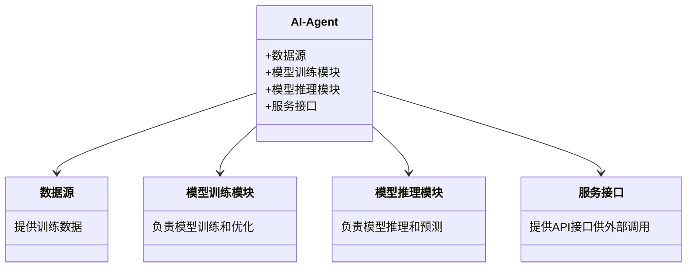
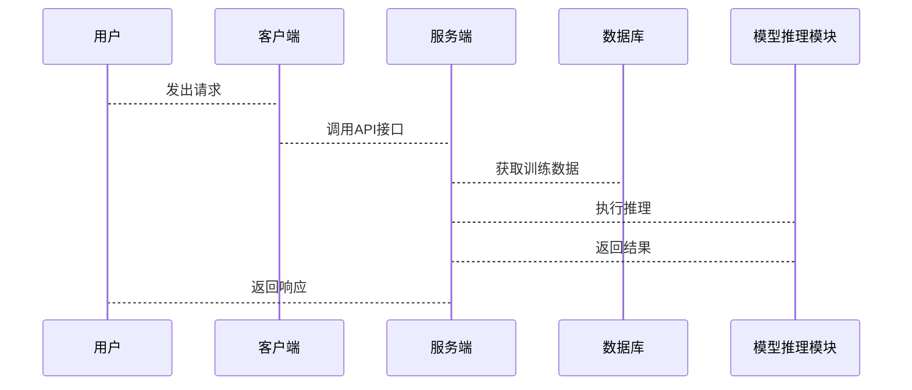

                 


# CI/CD流程：实现AI Agent的持续集成与部署

> 关键词：CI/CD，AI Agent，持续集成，持续部署，AI开发，系统架构

> 摘要：本文深入探讨了在AI Agent开发中应用CI/CD流程的重要性与实现方法。通过系统化的分析与设计，结合实际案例，详细讲解了AI Agent的系统架构、CI/CD流程的具体实现、系统优化与维护等内容，为读者提供了一套完整的CI/CD解决方案，帮助AI Agent实现高效、稳定的持续集成与部署。

---

## 第1章: CI/CD流程与AI Agent概述

### 1.1 CI/CD流程的背景与意义

#### 1.1.1 软件开发的演进与CI/CD的出现
在传统软件开发中，CI/CD（持续集成与持续部署）是一种革命性的理念，它通过自动化构建、测试和部署，极大地提高了开发效率和代码质量。随着敏捷开发和DevOps文化的兴起，CI/CD已经成为现代软件开发的标准流程。

#### 1.1.2 AI Agent在现代软件开发中的角色
AI Agent是一种能够感知环境、执行任务并做出决策的智能代理。它广泛应用于自动驾驶、智能助手、机器人控制等领域。AI Agent的开发具有高度复杂性，涉及算法优化、模型训练、系统集成等多个环节。

#### 1.1.3 CI/CD对AI Agent开发的重要性
AI Agent的开发需要频繁迭代模型和代码，CI/CD流程能够帮助团队快速验证功能、发现和修复问题，确保AI Agent的高效开发和稳定部署。

### 1.2 AI Agent的基本概念与特点

#### 1.2.1 AI Agent的定义与分类
AI Agent是一种能够感知环境、执行任务并做出决策的智能系统。根据功能和应用场景的不同，AI Agent可以分为基于规则的AI Agent、基于模型的AI Agent以及混合型AI Agent。

#### 1.2.2 AI Agent的核心特征与优势
- **自主性**：AI Agent能够在没有外部干预的情况下独立运行。
- **反应性**：能够实时感知环境变化并做出相应调整。
- **学习能力**：通过数据和反馈不断优化自身性能。
- **可扩展性**：能够适应不同规模和复杂度的任务。

#### 1.2.3 AI Agent与传统软件的区别
AI Agent的核心区别在于其智能性和自适应性。传统软件基于固定的逻辑运行，而AI Agent能够通过学习和推理动态调整行为。

### 1.3 CI/CD在AI Agent开发中的应用

#### 1.3.1 AI Agent的持续集成需求
AI Agent的开发需要频繁更新模型和代码，CI流程能够帮助团队快速集成新功能并进行全面测试。

#### 1.3.2 AI Agent的持续部署挑战
AI Agent的部署涉及到复杂的服务架构和动态的环境配置，CD流程需要确保每个版本都能稳定运行。

#### 1.3.3 CI/CD对AI Agent开发效率的提升
通过CI/CD流程，AI Agent团队可以实现快速迭代和部署，显著提高开发效率和代码质量。

---

## 第2章: CI/CD流程的核心概念与原理

### 2.1 CI/CD的核心流程

#### 2.1.1 持续集成（CI）的定义与实现
持续集成是指开发人员频繁地将代码提交到中央代码库，并通过自动化工具进行构建和测试。CI的主要目的是快速发现和修复集成问题。

#### 2.1.2 持续部署（CD）的定义与实现
持续部署是指在CI的基础上，将代码自动部署到生产环境或多个测试环境中。CD的目标是实现代码的快速交付和验证。

#### 2.1.3 CI/CD的结合与优化
CI和CD的结合能够实现代码的端到端自动化流程，从代码提交到生产部署，整个过程完全自动化，显著提高开发效率。

### 2.2 AI Agent开发中的CI/CD挑战

#### 2.2.1 模型训练的CI流程
AI Agent的模型训练需要频繁迭代和验证，CI流程需要支持大规模数据处理和模型评估。

#### 2.2.2 模型部署的CD流程
AI Agent的模型部署涉及到复杂的环境配置和依赖管理，CD流程需要确保每个版本都能稳定运行。

#### 2.2.3 模型迭代与版本管理
AI Agent的模型需要不断迭代优化，CI/CD流程需要支持多版本并行开发和部署。

### 2.3 CI/CD的关键工具与技术

#### 2.3.1 CI工具：Jenkins、GitHub Actions、CircleCI
- **Jenkins**：功能强大，支持多种插件扩展。
- **GitHub Actions**：集成在GitHub中，支持代码仓库的持续集成和部署。
- **CircleCI**：基于云的CI/CD工具，支持多种语言和框架。

#### 2.3.2 CD工具：Kubernetes、Docker、Istio
- **Kubernetes**：容器编排平台，支持AI Agent的弹性扩展。
- **Docker**：容器化技术，确保AI Agent在不同环境中的一致性。
- **Istio**：服务网格，支持AI Agent的流量管理和服务发现。

#### 2.3.3 AI相关工具：TensorFlow、PyTorch、Kubeflow
- **TensorFlow**：Google开发的深度学习框架。
- **PyTorch**：Facebook开发的深度学习框架。
- **Kubeflow**：支持在Kubernetes上运行机器学习管道。

---

## 第3章: AI Agent的系统架构与设计

### 3.1 AI Agent的系统架构

#### 3.1.1 分层架构设计
AI Agent的分层架构包括数据层、模型层、服务层和用户层，每一层都有明确的功能划分。

#### 3.1.2 微服务架构设计
AI Agent的微服务架构将功能模块化，每个服务独立运行，便于扩展和维护。

#### 3.1.3 混合架构设计
混合架构结合了分层和微服务的优势，适用于复杂场景下的AI Agent开发。

### 3.2 系统功能设计

#### 3.2.1 领域模型设计
使用Mermaid类图展示AI Agent的领域模型，包括数据源、模型训练、模型推理等核心模块。



#### 3.2.2 系统架构设计
使用Mermaid架构图展示AI Agent的系统架构，包括前端、后端、数据库和第三方服务。

```mermaid
container 客户端 {
    接收用户请求
}
container 服务端 {
    包含模型推理模块
    包含服务接口模块
}
container 数据库 {
    存储训练数据和模型
}
container 第三方服务 {
    包括API接口和其他依赖服务
}
客户端 --> 服务端
服务端 --> 数据库
服务端 --> 第三方服务
```

### 3.3 系统接口设计

#### 3.3.1 API接口设计
定义AI Agent的API接口，包括训练接口和推理接口。

#### 3.3.2 接口交互流程
使用Mermaid序列图展示AI Agent的接口交互流程。



---

## 第4章: CI/CD在AI Agent开发中的具体实现

### 4.1 AI Agent开发中的CI/CD流程

#### 4.1.1 代码提交与构建
使用Git进行代码提交，通过CI工具自动触发构建流程。

#### 4.1.2 测试与验证
执行单元测试、集成测试和性能测试，确保代码质量。

#### 4.1.3 模型训练与验证
在CI流程中集成模型训练任务，并进行自动化验证。

#### 4.1.4 代码集成与部署
通过CD工具将代码自动部署到测试环境和生产环境。

### 4.2 AI Agent的CI/CD代码实现

#### 4.2.1 环境安装
安装必要的工具和依赖项，例如：
```bash
pip install jenkins-client requests
```

#### 4.2.2 代码实现
使用Python编写一个简单的CI/CD流程示例：

```python
from jenkins import Jenkins

# 连接Jenkins服务器
jenkins = Jenkins('http://localhost:8080', username='admin', password='admin')

# 提交代码到版本控制系统
# 触发Jenkins构建
jenkins.build_job('AI-Agent-CI')

# 等待构建完成
while True:
    job = jenkins.get_job('AI-Agent-CI')
    if job.last_build().status == 'SUCCESS':
        break
    time.sleep(1)
```

#### 4.2.3 测试与验证
编写自动化测试用例，确保AI Agent的功能和性能符合要求。

### 4.3 实际案例分析

#### 4.3.1 项目介绍
以一个基于Transformer的AI Agent为例，展示其CI/CD流程的实现。

#### 4.3.2 代码解读与分析
详细解读项目中的关键代码，分析其设计和实现。

---

## 第5章: AI Agent系统的持续优化与维护

### 5.1 性能优化与调优

#### 5.1.1 模型优化
通过调整超参数和优化算法，提升AI Agent的性能。

#### 5.1.2 系统优化
优化系统架构，减少延迟和提高吞吐量。

### 5.2 模型迭代与版本管理

#### 5.2.1 模型迭代流程
制定模型迭代计划，定期更新模型并进行验证。

#### 5.2.2 版本管理策略
采用版本控制工具，管理不同版本的模型和代码。

### 5.3 异常处理与系统监控

#### 5.3.1 异常处理
建立完善的异常处理机制，确保系统的稳定运行。

#### 5.3.2 系统监控
使用监控工具实时监控系统状态，及时发现和解决问题。

---

## 第6章: 总结与展望

### 6.1 总结
本文详细探讨了在AI Agent开发中应用CI/CD流程的重要性与实现方法。通过系统化的分析与设计，结合实际案例，详细讲解了AI Agent的系统架构、CI/CD流程的具体实现、系统优化与维护等内容。

### 6.2 展望
随着AI技术的不断发展，AI Agent的开发和部署将更加复杂和多样化。未来，CI/CD流程将在AI Agent开发中发挥更加重要的作用，帮助团队实现更高效的开发和部署。

---

## 作者信息

作者：AI天才研究院/AI Genius Institute & 禅与计算机程序设计艺术 /Zen And The Art of Computer Programming

---

以上是《CI/CD流程：实现AI Agent的持续集成与部署》的完整大纲和内容。文章详细讲解了CI/CD在AI Agent开发中的应用，结合实际案例和工具，为读者提供了完整的解决方案。

