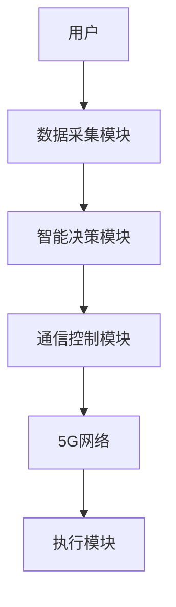

                 


# 5G+AI：探索高速网络下的AI Agent新应用

> 关键词：5G、AI Agent、高速网络、人工智能、通信网络、智能决策、实时计算

> 摘要：本文将探讨5G网络与AI Agent的结合，分析其在高速网络下的新应用场景，从背景介绍、核心概念、算法原理到系统架构设计，再到项目实战，全面解析5G+AI Agent的协同机制与未来发展方向。

---

## 第一部分: 5G与AI Agent的背景与概念

### 第1章: 5G与AI Agent概述

#### 1.1 5G网络的基本概念

##### 1.1.1 5G网络的定义与特点
5G（第五代移动通信技术）是继4G之后的新一代移动通信标准，具有高带宽、低延迟、大规模连接（Massive MIMO）和高可靠性等特点。5G的峰值速率可以达到10Gbps以上，时延可以低至1ms，能够支持超过100万个连接。

##### 1.1.2 5G网络的核心技术
- **大规模MIMO（Massive Multiple Input Multiple Output）**：通过使用大量天线，实现多用户同时通信，提高网络容量和频谱效率。
- **毫米波技术（Millimeter Wave Technology）**：使用高频段频谱，提供更大的带宽和更高的传输速率。
- **网络切片（Network Slicing）**：将物理网络划分为多个虚拟网络，以满足不同场景下的定制化需求。

##### 1.1.3 5G网络的应用场景
5G的应用场景包括增强型移动宽带（eMBB）、大规模机器类通信（mMTC）和超可靠低时延通信（uRLLC），分别对应于高清视频、物联网和自动驾驶等领域。

#### 1.2 AI Agent的基本概念

##### 1.2.1 AI Agent的定义
AI Agent（人工智能代理）是指能够感知环境、自主决策并执行任务的智能实体。它可以是一个软件程序、一个机器人，或者一个智能系统，具备感知、推理、规划和执行的能力。

##### 1.2.2 AI Agent的核心特征
- **智能性**：能够理解环境信息并做出合理决策。
- **自主性**：能够在没有外部干预的情况下自主运行。
- **反应性**：能够实时感知环境变化并做出响应。
- **学习能力**：通过经验或数据不断优化自身行为。

##### 1.2.3 AI Agent的分类与应用
AI Agent可以分为**反应式AI Agent**和**认知式AI Agent**。反应式AI Agent基于当前感知做出即时反应，适用于实时任务；认知式AI Agent具备复杂推理和规划能力，适用于需要长期决策的任务。

#### 1.3 5G与AI Agent的结合背景

##### 1.3.1 高速网络对AI Agent发展的推动作用
5G的高带宽和低延迟特性为AI Agent的数据传输和实时决策提供了基础支持，使其能够更高效地运行在分布式环境中。

##### 1.3.2 AI Agent在5G网络中的潜在应用场景
- **自动驾驶**：通过5G网络实时传输车辆传感器数据，AI Agent进行环境感知和路径规划。
- **智能城市**：利用5G网络连接城市中的各种设备，AI Agent进行交通管理、环境监测等任务。
- **远程医疗**：通过5G网络实现高清视频传输和远程手术操作，AI Agent辅助医生进行诊断和治疗。

##### 1.3.3 5G+AI Agent的协同机制
通过5G网络的高速传输能力，AI Agent可以实时获取大量数据，并快速做出决策。同时，AI Agent的智能性可以优化5G网络的资源分配和数据传输效率。

---

### 第2章: 5G+AI Agent的核心概念与联系

#### 2.1 5G网络的特性分析

##### 2.1.1 高速性
5G网络的高速性使得AI Agent能够快速接收和处理大量的数据，满足实时性要求。

##### 2.1.2 大带宽
5G的带宽可以支持高清视频、大文件传输等任务，为AI Agent提供了更大的数据处理空间。

##### 2.1.3 低延迟
5G的低延迟特性使得AI Agent在实时交互场景中能够快速响应，满足游戏、远程控制等场景的需求。

#### 2.2 AI Agent的原理与功能

##### 2.2.1 智能感知
AI Agent通过传感器或其他数据源获取环境信息，利用机器学习模型进行数据处理和特征提取。

##### 2.2.2 自动决策
基于感知到的信息，AI Agent通过推理和规划模块生成决策，并通过执行模块将决策转化为具体行动。

##### 2.2.3 人机交互
AI Agent需要与用户或其他系统进行交互，通过自然语言处理（NLP）或图形界面实现良好的人机交互体验。

#### 2.3 5G与AI Agent的协同机制

##### 2.3.1 数据传输的高效性
5G网络为AI Agent提供了快速、稳定的数据传输通道，确保数据在传输过程中的完整性和实时性。

##### 2.3.2 智能决策的实时性
通过5G网络的低延迟特性，AI Agent可以在极短时间内完成数据传输和决策，满足实时任务的需求。

##### 2.3.3 网络资源的动态分配
AI Agent可以根据任务需求动态调整5G网络的资源分配，例如带宽分配、信道选择等，提高网络利用效率。

---

### 第3章: 5G+AI Agent的数学模型与算法原理

#### 3.1 5G网络的数学模型

##### 3.1.1 网络流量模型
网络流量模型用于描述5G网络中的数据传输情况，可以通过马尔可夫链模型或泊松过程模型进行建模。

##### 3.1.2 网络资源分配模型
网络资源分配模型可以通过线性规划或非线性规划方法进行优化，例如最大化网络吞吐量或最小化网络时延。

##### 3.1.3 网络延迟优化模型
网络延迟优化模型可以通过队列理论或网络流模型进行建模，优化数据包的传输路径和调度策略。

#### 3.2 AI Agent的算法原理

##### 3.2.1 机器学习算法
- **监督学习**：通过训练数据集学习输入与输出之间的映射关系，例如线性回归、支持向量机（SVM）等。
- **无监督学习**：通过数据挖掘技术发现数据中的潜在模式或结构，例如聚类分析、主成分分析（PCA）等。
- **半监督学习**：结合少量标注数据和大量未标注数据进行学习，适用于数据标注成本较高的场景。

##### 3.2.2 强化学习算法
强化学习是一种通过试错机制学习策略的方法，适用于动态环境中的决策问题，例如Q-learning、Deep Q-Network（DQN）等。

##### 3.2.3 深度学习算法
深度学习通过多层神经网络模型学习数据的高层次特征，适用于图像识别、语音识别等任务，典型模型包括卷积神经网络（CNN）、循环神经网络（RNN）等。

#### 3.3 5G+AI Agent的协同算法

##### 3.3.1 联合优化算法
联合优化算法用于同时优化5G网络和AI Agent的性能，例如联合优化带宽分配和AI Agent的决策策略。

##### 3.3.2 分布式计算算法
分布式计算算法通过将任务分解到多个计算节点并行执行，提高计算效率，例如MapReduce、Spark等。

##### 3.3.3 实时反馈机制
实时反馈机制通过快速响应环境变化，调整AI Agent的行为策略，例如基于强化学习的实时反馈机制。

---

### 第4章: 5G+AI Agent的系统架构设计

#### 4.1 系统功能设计

##### 4.1.1 数据采集模块
数据采集模块负责从5G网络中获取实时数据，例如用户位置、网络负载等信息。

##### 4.1.2 智能决策模块
智能决策模块基于获取的数据，通过机器学习模型进行分析和推理，生成决策指令。

##### 4.1.3 通信控制模块
通信控制模块负责与5G网络进行交互，执行决策模块的指令，调整网络参数或发送数据。

#### 4.2 系统架构图



#### 4.3 接口设计与交互流程

##### 4.3.1 用户与AI Agent的交互流程
- 用户发起请求，数据采集模块获取相关信息。
- 智能决策模块根据数据生成决策。
- 通信控制模块将决策发送到5G网络，执行模块完成任务。

##### 4.3.2 5G网络与AI Agent的交互流程
- AI Agent通过5G网络获取数据。
- AI Agent向5G网络发送决策指令。
- 5G网络根据指令调整资源分配或反馈执行结果。

---

## 第五章: 5G+AI Agent的项目实战

### 5.1 项目背景与目标
本项目旨在开发一个基于5G网络的AI Agent系统，实现智能交通管理的应用场景。

### 5.2 系统核心实现

#### 5.2.1 环境安装
- 安装5G通信模块（例如5G模组）
- 安装AI框架（例如TensorFlow、PyTorch）
- 安装网络管理工具（例如Netgear、Wireshark）

#### 5.2.2 核心代码实现

##### 5.2.2.1 数据采集模块
```python
import requests
import json

def get_5g_data():
    # 模拟从5G网络获取数据
    response = requests.get("http://5g-api/api/v1/data")
    if response.status_code == 200:
        return json.loads(response.text)
    else:
        return None
```

##### 5.2.2.2 智能决策模块
```python
import tensorflow as tf
import numpy as np

model = tf.keras.models.load_model("ai_agent_model.h5")

def make_decision(data):
    prediction = model.predict(np.array([data]))
    return prediction[0]
```

##### 5.2.2.3 通信控制模块
```python
import serial

def send_command(command):
    ser = serial.Serial('COM3', 9600)
    ser.write(command.encode())
    ser.close()
```

### 5.3 实际案例分析
通过上述代码实现一个智能交通管理系统的AI Agent，能够实时感知交通流量，并根据预测结果调整信号灯的切换时间。

### 5.4 项目小结
本项目展示了5G网络与AI Agent协同工作的潜力，为未来的智能交通管理提供了参考。

---

## 第六章: 总结与展望

### 6.1 最佳实践 tips
- 在设计AI Agent时，需要充分考虑5G网络的特性和应用场景。
- 确保系统的实时性和稳定性，特别是在高延迟敏感的场景中。

### 6.2 小结
本文全面探讨了5G网络与AI Agent的结合，分析了其在高速网络下的新应用场景，从背景介绍到系统设计，再到项目实战，全面解析了5G+AI Agent的协同机制与未来发展方向。

### 6.3 注意事项
- 确保数据安全和隐私保护。
- 在实际应用中，需要考虑网络环境的复杂性和不确定性。

### 6.4 拓展阅读
建议读者进一步阅读以下内容：
- 《5G网络技术与应用》
- 《人工智能代理与智能系统》
- 《分布式计算与多智能体协同》

---

## 作者：AI天才研究院/AI Genius Institute & 禅与计算机程序设计艺术 /Zen And The Art of Computer Programming

