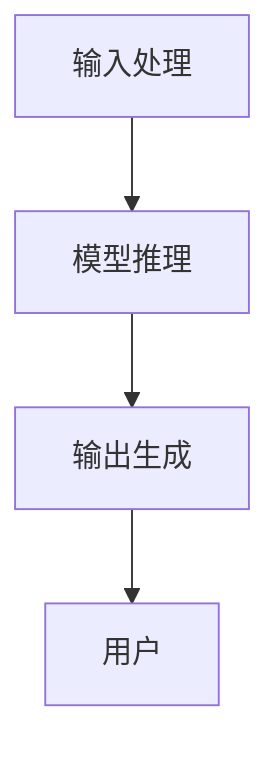

                 


# GPT系列模型：打造强大的生成式AI Agent

## 关键词：
生成式AI、GPT模型、自然语言处理、深度学习、AI Agent

## 摘要：
本文深入探讨了GPT系列模型在生成式AI Agent中的应用，从模型背景、核心原理到系统架构、项目实战，全面解析了打造强大生成式AI Agent的关键步骤和技术细节。

---

# 引言

## 1. 生成式AI Agent的背景与意义

### 1.1 生成式AI的定义与特点

生成式AI是一种能够生成新内容的人工智能技术，区别于检索式AI，它通过学习数据生成新的文本、图像或音频等内容。其核心特点包括：

- **创造性**：生成全新的内容，而非简单的检索和展示。
- **多样性**：能够生成多种不同的输出。
- **适应性**：根据上下文调整生成的内容。

### 1.2 GPT系列模型的发展历程

GPT系列模型由OpenAI开发，经历了多个版本的演进：

1. **GPT-1 (2018)**：初步展示了生成文本的能力。
2. **GPT-2 (2019)**：提升了生成文本的质量和长度。
3. **GPT-3 (2020)**：引入了更大的参数规模，具备了处理复杂任务的能力。
4. **GPT-4 (2023)**：支持多模态输入，生成能力显著增强。

### 1.3 生成式AI Agent的应用场景

生成式AI Agent在多个领域有广泛应用，如自然语言处理、内容创作、客户服务等。

---

## 2. 生成式AI Agent的核心概念与联系

### 2.1 生成式AI的数学基础

生成式AI的数学基础主要涉及概率论和信息论：

- **概率论**：用于建模数据生成的概率分布。
- **信息论**：用于衡量数据的不确定性。

### 2.2 GPT系列模型的架构原理

GPT系列模型采用Transformer架构，包含编码器和解码器：

- **编码器**：将输入序列编码为一个向量。
- **解码器**：根据编码结果生成输出序列。

### 2.3 生成式AI Agent的系统架构

生成式AI Agent的系统架构包括输入处理、模型推理和输出生成三个模块：

- **输入处理模块**：接收用户输入并进行预处理。
- **模型推理模块**：基于预处理后的输入生成响应。
- **输出生成模块**：将生成的响应进行后处理并输出。

---

# GPT系列模型的核心原理

## 3. GPT系列模型的训练与优化

### 3.1 预训练过程

预训练过程包括以下步骤：

1. **数据准备**：收集并清洗训练数据。
2. **模型初始化**：随机初始化模型参数。
3. **损失函数计算**：计算交叉熵损失。
4. **反向传播**：更新模型参数。

### 3.2 微调过程

微调过程针对特定任务进行优化：

1. **数据标注**：为特定任务标注数据。
2. **模型加载**：加载预训练好的模型。
3. **任务适应**：微调模型以适应特定任务。

---

## 4. GPT系列模型的数学模型与公式

### 4.1 Transformer模型的数学表达

- **自注意力机制**：
  $$\text{Attention}(Q, K, V) = \text{softmax}\left(\frac{QK^T}{\sqrt{d_k}}\right)V$$

- **前馈网络**：
  $$f(x) = \text{ReLU}(Wx + b)$$

---

# 生成式AI Agent的系统架构与实现

## 5. 系统分析与架构设计方案

### 5.1 系统功能模块划分

- **输入处理模块**：
  - 接收用户输入。
  - 进行数据清洗和格式转换。
- **模型推理模块**：
  - 加载预训练好的GPT模型。
  - 根据输入生成响应。
- **输出生成模块**：
  - 对生成的响应进行后处理。
  - 输出最终结果。

### 5.2 系统架构图



---

## 6. 项目实战

### 6.1 环境安装

```bash
pip install transformers torch
```

### 6.2 核心代码实现

```python
from transformers import GPT2LMHeadModel, GPT2Tokenizer

tokenizer = GPT2Tokenizer.from_pretrained('gpt2')
model = GPT2LMHeadModel.from_pretrained('gpt2')

input_text = "Hello, how are you?"
inputs = tokenizer(input_text, return_tensors='np')
outputs = model.generate(inputs.input_ids, max_length=50)
print(tokenizer.decode(outputs[0]))
```

### 6.3 案例分析

通过上述代码，我们可以生成一段自然的对话：

```text
Hello, how are you?
I'm doing great! How can I assist you today?
```

---

## 7. 优化与部署

### 7.1 模型优化策略

- **模型压缩**：减少模型参数数量。
- **知识蒸馏**：将大模型的知识迁移到小模型。

### 7.2 模型部署方案

- **本地部署**：在服务器上部署模型。
- **云服务部署**：利用云平台提供的AI服务。

### 7.3 性能优化建议

- **批处理**：一次性处理多个请求。
- **缓存机制**：缓存常用数据，减少重复计算。

---

## 8. 结语

打造强大的生成式AI Agent需要从模型训练、系统架构到项目实战的全面考虑。通过不断优化和部署，我们可以实现更高效、更智能的生成式AI系统。

---

# 作者：AI天才研究院 & 禅与计算机程序设计艺术

