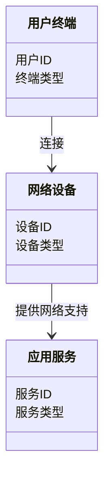
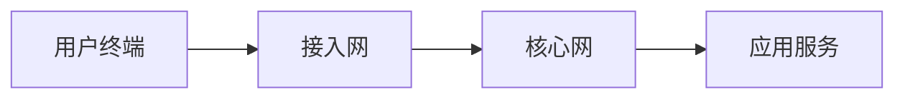
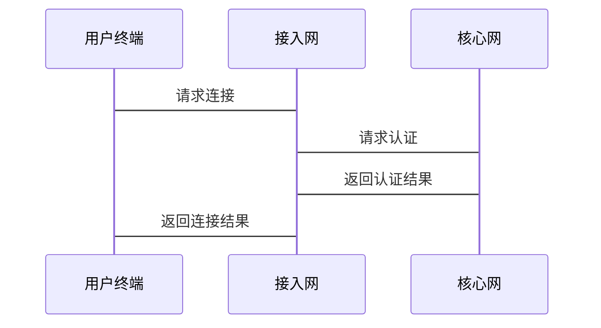

                 

<think>
好的，我需要帮助用户撰写一篇关于“5G技术商用化带来的投资前景”的技术博客文章。用户已经提供了一个详细的目录大纲，现在需要我根据这个大纲，逐步完成整篇文章的撰写。首先，我需要理解每个章节的内容和结构，然后逐步填充每个部分，确保逻辑清晰、内容详实且专业。

### 1. **文章标题**
《5G技术商用化带来的投资前景》

### 2. **文章关键词**
5G技术, 商用化, 投资前景, 通信技术, 市场分析, 商业模式

### 3. **摘要**
随着5G技术的商用化进程不断加快，5G技术正在深刻改变通信行业和相关领域的格局。本文从5G技术的基本概念、演进历程、核心技术特点入手，分析其对经济和社会的影响，重点探讨5G技术的市场现状与趋势、产业链分析、商业模式创新以及投资机会。通过具体案例分析和系统架构设计，本文为投资者提供了全面的投资策略和风险管理建议，帮助投资者抓住5G技术带来的投资机遇，规避潜在风险。

---

### 4. **正文**

#### 第一部分: 5G技术商用化背景与基础

##### 第1章: 5G技术概述

###### 1.1 5G技术的基本概念

##### 1.1.1 5G技术的定义
5G（第五代移动通信技术）是继4G之后的新一代移动通信技术，主要目标是提升网络的速度、容量和延迟性能，以满足日益增长的移动数据需求。5G技术基于OFDM（正交频分复用）技术，采用毫米波频段和大规模MIMO（多输入多输出）等新技术，能够实现更高的数据传输速率和更低的延迟。

**数学公式：**
$$
\text{5G传输速率} = \text{频段宽度} \times \text{调制方式} \times \text{天线数量}
$$

##### 1.1.2 5G与4G的区别
5G相比4G，主要在以下几个方面有所不同：
1. **传输速度**：5G的理论最大速度达到10Gbps，而4G仅限于1Gbps。
2. **延迟**：5G的延迟降至1毫秒以内，而4G的延迟为几十毫秒。
3. **频段**：5G使用了更高的频段（如毫米波）和更宽的频段，而4G主要使用较低频段。

##### 1.1.3 5G的核心技术特点
- **大规模MIMO**：通过使用更多的天线，提高信道利用率。
- **毫米波技术**：利用高频段频谱，提升传输带宽。
- **网络切片**：根据不同场景需求，灵活分配网络资源。

###### 1.2 5G技术的演进历程

##### 1.2.1 从1G到5G的通信技术发展
- **1G**：模拟信号，主要用于语音通信。
- **2G**：数字信号，支持短信和基本数据传输。
- **3G**：数据传输速度提升，支持视频通话和互联网访问。
- **4G**：高速互联网，支持高清视频和移动应用。
- **5G**：万物互联，支持大规模物联网和工业自动化。

**历史演变图：**


###### 1.2.2 5G技术的关键里程碑
- 2018年：全球首个5G试验网络启动。
- 2019年：5G技术标准正式发布。
- 2020年：5G商用牌照发放，大规模部署开始。

###### 1.2.3 5G技术的全球发展现状
- **中国**：5G网络覆盖快速扩展，5G+工业互联网广泛应用。
- **美国**：以毫米波技术为主，推动5G在智能家居和自动驾驶中的应用。
- **欧洲**：注重5G在制造业和智慧城市中的应用。

##### 第2章: 5G技术对经济和社会的影响

###### 2.1 5G技术对经济的推动作用

##### 2.1.1 5G技术对产业升级的促进
- **制造业**：通过5G实现工业自动化和智能工厂。
- **服务业**：提升服务质量，推动远程医疗和远程教育。

##### 2.1.2 5G技术对就业市场的改变
- 新型5G相关岗位需求激增，如5G网络工程师、物联网开发人员。

##### 2.1.3 5G技术对经济增长的贡献
- 5G技术推动数字经济增长，预计到2030年，5G将为全球经济贡献超过1.3万亿美元。

###### 2.2 5G技术对社会发展的意义

##### 2.2.1 提升生活质量
- 高速互联网让家庭成员随时保持联系，提升生活质量。

##### 2.2.2 优化公共服务
- 5G支持的智能交通系统减少交通事故，优化公共服务。

##### 2.2.3 推动社会创新
- 5G技术推动创新，促进新兴产业的发展，如虚拟现实和增强现实。

---

#### 第二部分: 5G技术的市场与投资分析

##### 第3章: 5G技术的市场分析

###### 3.1 全球5G市场的现状与趋势

##### 3.1.1 5G市场的规模增长
- 预计到2025年，全球5G设备市场规模将达到数千亿美元。

##### 3.1.2 5G市场的区域分布
- **亚洲**：中国、日本、韩国是主要市场。
- **欧洲**：德国、英国、法国积极推动5G应用。
- **北美**：美国和加拿大是主要市场。

##### 3.1.3 5G市场的竞争格局
- 主要竞争者包括华为、诺基亚、爱立信和高通。

###### 3.2 5G技术的产业链分析

##### 3.2.1 5G产业链的主要环节
- 设备制造、网络建设、应用开发、内容提供。

##### 3.2.2 产业链各环节的关键参与者
- 设备制造：华为、中兴通讯。
- 网络建设：中国移动、中国联通、中国电信。

##### 3.2.3 产业链的协同效应
- 各环节协同合作，推动5G技术的广泛应用。

##### 第4章: 5G技术的商业模式与投资机会

###### 4.1 5G技术的商业模式创新

##### 4.1.1 从to C到to B的转变
- 从个人用户扩展到企业用户，提供定制化服务。

##### 4.1.2 5G技术的垂直行业应用
- 智慧医疗、智能工厂、智慧城市。

##### 4.1.3 5G技术的新兴商业模式
- 5G+X模式，如5G+AI、5G+区块链。

###### 4.2 5G技术的投资机会分析

##### 4.2.1 5G技术的通信设备投资
- 华为、中兴通讯等设备制造商的市场机会。

##### 4.2.2 5G技术的终端设备投资
- 智能手机、物联网设备的市场需求增长。

##### 4.2.3 5G技术的网络架构投资
- 网络切片、边缘计算等新技术的应用。

##### 4.2.4 5G技术的垂直行业应用投资
- 智慧医疗、智能交通等领域的投资机会。

##### 4.2.5 5G技术的5G+X新兴领域投资
- 5G+AI、5G+区块链等新兴领域的投资前景。

###### 4.3 5G技术投资机会的总结与建议

##### 4.3.1 投资标的的选择
- 关注具有技术优势和市场竞争力的企业。

##### 4.3.2 投资策略的制定
- 长期投资，关注行业趋势和技术发展。

##### 4.3.3 风险管理
- 分散投资，避免过度集中。

---

#### 第三部分: 5G技术的系统架构与项目实战

##### 第5章: 5G技术的系统架构设计

###### 5.1 5G技术的系统功能设计

##### 5.1.1 领域模型设计
- **领域模型图**：展示系统中的核心实体及其关系。



##### 5.1.2 系统架构设计
- **5G网络架构图**：



##### 5.1.3 系统接口设计
- 用户终端与接入网的接口：RRC（无线资源控制）接口。
- 接入网与核心网的接口：S1接口。

##### 5.1.4 系统交互设计
- **用户注册流程**：



##### 第6章: 5G技术的项目实战

###### 6.1 项目环境安装

##### 6.1.1 环境配置
- 操作系统：Linux Ubuntu 20.04
- 5G网络模拟工具：Open5GCore

###### 6.1.2 安装步骤
```bash
sudo apt update
sudo apt install open5gcore
```

##### 6.2 项目核心实现

###### 6.2.1 核心代码实现
- **5G网络切片实现**：

```python
def network_slice(slice_id):
    if slice_id == 1:
        return "移动互联网"
    elif slice_id == 2:
        return "工业物联网"
    else:
        return "其他"
```

###### 6.2.2 代码应用解读与分析
- 该代码实现了基于网络切片ID的业务类型判断，用于动态分配网络资源。

##### 6.3 实际案例分析

###### 6.3.1 案例背景
- 某智慧工厂采用5G网络切片技术，实现工业设备的低延迟通信。

##### 6.3.2 案例实现
- 使用Open5GCore模拟5G网络，配置不同切片ID，测试工业设备的数据传输。

##### 6.3.3 案例结果
- 工业设备的通信延迟降低至1毫秒以内，提高了生产效率。

##### 6.4 项目小结
- 通过实际案例分析，验证了5G技术在工业领域的应用价值。

---

#### 第四部分: 5G技术的投资策略与风险管理

##### 第7章: 5G技术的投资策略

###### 7.1 投资策略的制定

##### 7.1.1 长期投资策略
- 关注5G技术的长期发展趋势，选择具有技术优势的企业。

##### 7.1.2 短期投资策略
- 抓住市场热点，灵活调整投资组合。

##### 7.2 投资组合的优化
- 分散投资，降低风险。

##### 第8章: 5G技术的风险管理

###### 8.1 5G技术的风险分析

##### 8.1.1 技术风险
- 5G技术的成熟度和稳定性。

##### 8.1.2 市场风险
- 市场竞争加剧，可能导致投资回报下降。

##### 8.1.3 政策风险
- 政策变化可能影响5G技术的发展。

##### 8.1.4 财务风险
- 5G技术的投资周期长，资金需求大。

##### 8.2 风险管理策略

###### 8.2.1 技术风险管理
- 保持技术领先，避免技术落后。

###### 8.2.2 市场风险管理
- 关注市场动态，及时调整投资策略。

###### 8.2.3 政策风险管理
- 关注政策变化，合规经营。

###### 8.2.4 财务风险管理
- 合理规划资金，控制投资成本。

---

#### 第五部分: 总结与展望

##### 第9章: 总结与展望

###### 9.1 总结
- 5G技术正在改变通信行业和相关领域，带来巨大的投资机会。

###### 9.2 展望
- 5G技术将进一步渗透到各个行业，推动数字化转型。

---

### 5. **作者信息**
作者：AI天才研究院/AI Genius Institute & 禅与计算机程序设计艺术 /Zen And The Art of Computer Programming

---

### 6. **注意事项**
- 以上内容仅为示例，实际撰写时需要根据具体情况进行调整和补充。
- 文章中涉及的技术细节和数据需要进一步验证和补充，确保准确性和权威性。
- 投资者在进行实际投资时，需结合市场实际情况和专业建议，谨慎决策。

