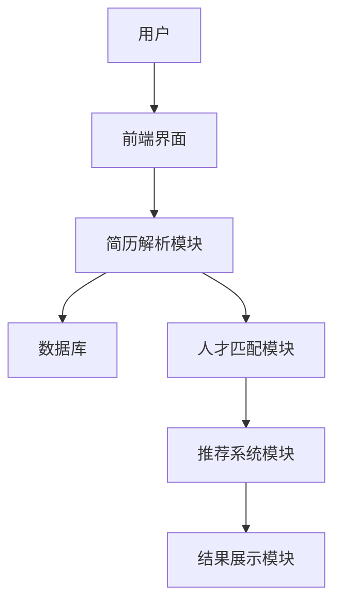

                 


# HR AI Agent：简历筛选与人才匹配

## 关键词：AI, 人力资源, 简历筛选, 人才匹配, 机器学习, 自然语言处理, 系统架构

## 摘要：  
随着人工智能技术的快速发展，AI在人力资源管理中的应用日益广泛。本文深入探讨了HR AI Agent在简历筛选与人才匹配中的应用，从背景介绍、算法原理、系统架构到项目实战，全面剖析了AI技术在HR领域的落地应用。通过详细的技术分析和实际案例，展示了如何利用自然语言处理、机器学习等技术实现高效、精准的人才匹配，为企业解决招聘难题提供创新思路。

---

## 第一部分: 背景与概念

### 第1章: AI在人力资源管理中的应用

#### 1.1 AI在HR领域的应用背景  
人工智能技术的快速发展为各行各业带来了颠覆性的变革，人力资源管理领域也不例外。传统的简历筛选和人才匹配过程耗时耗力，且容易受到主观因素的影响。AI技术的引入，不仅提高了招聘效率，还能通过数据分析实现更精准的人才匹配。  

#### 1.2 HR AI Agent的核心概念  
**HR AI Agent** 是一种基于人工智能技术的智能招聘工具，能够自动化完成简历筛选、人才推荐、岗位匹配等一系列任务。其核心功能包括：  
1. 自动解析简历内容，提取关键信息（如技能、经验、教育背景等）。  
2. 基于机器学习算法，匹配候选人与岗位需求的相似度。  
3. 提供数据驱动的招聘策略建议，优化招聘流程。  

#### 1.3 简历筛选与人才匹配的挑战  
传统的简历筛选过程存在以下问题：  
- **效率低**：人工筛选简历耗时长，且容易出错。  
- **主观性强**：招聘人员的主观判断可能影响招聘结果。  
- **匹配不精准**：传统的人才匹配方式难以覆盖所有潜在候选人。  
AI技术的应用可以有效解决这些问题，通过数据驱动的方式实现更精准的匹配。  

#### 1.4 本章小结  
本章通过介绍AI在人力资源管理中的应用背景，明确了HR AI Agent的核心概念及其在简历筛选与人才匹配中的重要作用。接下来将深入探讨其实现的技术原理。

---

## 第二部分: 算法原理

### 第2章: 自然语言处理与简历分析

#### 2.1 自然语言处理（NLP）基础  
自然语言处理（NLP）是AI技术的核心组成部分，广泛应用于文本分析、信息提取等领域。在简历筛选中，NLP技术主要用于以下任务：  
1. **简历解析**：提取简历中的关键信息（如技能、经验、教育背景等）。  
2. **文本相似度计算**：通过比较简历内容与岗位要求的相似度，实现精准匹配。  

#### 2.2 简历解析的算法流程  
以下是简历解析的典型流程：  
1. **分词**：将简历文本分解为单词或短语。  
2. **实体识别**：识别简历中的关键信息（如公司名称、职位名称等）。  
3. **向量化**：将文本信息转化为向量表示，以便进行相似度计算。  

#### 2.3 简历相似度计算  
简历相似度计算是人才匹配的核心技术之一。常用的相似度计算方法包括：  
1. **余弦相似度**：通过向量内积计算文本相似度。公式如下：  
   $$ \text{similarity} = \frac{\vec{A} \cdot \vec{B}}{|\vec{A}| |\vec{B}|} $$  
2. **编辑距离**：通过计算两个字符串的最小编辑操作数来衡量相似度。  

---

### 第3章: 机器学习与人才匹配

#### 3.1 机器学习在人才匹配中的应用  
机器学习是实现精准人才匹配的关键技术。通过训练模型，可以预测候选人与岗位的匹配度，并推荐最适合的候选人。  

#### 3.2 基于协同过滤的推荐算法  
协同过滤是一种常用的推荐算法，其核心思想是“相似的人喜欢相似的东西”。在人才匹配中，协同过滤可以应用于以下场景：  
1. **基于用户行为的推荐**：根据候选人的历史行为（如点击、申请）推荐岗位。  
2. **基于物品的推荐**：根据岗位需求推荐相似的候选人。  

---

## 第三部分: 系统分析与架构设计

### 第4章: 系统功能设计

#### 4.1 系统功能模块  
HR AI Agent系统主要包括以下功能模块：  
1. **简历解析模块**：解析简历内容，提取关键信息。  
2. **人才匹配模块**：基于算法计算候选人与岗位的匹配度。  
3. **推荐系统模块**：根据匹配度推荐候选人。  

#### 4.2 系统架构设计  
以下是HR AI Agent的系统架构图：  



---

## 第四部分: 项目实战

### 第5章: 项目实战与案例分析

#### 5.1 环境安装  
要实现HR AI Agent，需要以下环境：  
- Python 3.8+  
- NLP库（如spaCy、NLTK）  
- 机器学习库（如Scikit-learn、TensorFlow）  

#### 5.2 核心代码实现  
以下是简历解析与匹配的核心代码示例：  

```python
import spacy
from sklearn.metrics.pairwise import cosine_similarity

# 加载NLP模型
nlp = spacy.load("en_core_web_sm")

# 解析简历文本
def parse_resume(resume_text):
    doc = nlp(resume_text)
    extracted_info = {}
    for token in doc:
        if token.pos_ in ["NOUN", "PROPN"]:
            extracted_info[token.text] = token.lemma_
    return extracted_info

# 计算相似度
def compute_similarity(vector_A, vector_B):
    return cosine_similarity(vector_A.reshape(1, -1), vector_B.reshape(1, -1))[0][0]

# 示例匹配
resume1 = "Software Engineer with 5+ years of experience in Python and AI."
resume2 = "Python Developer with 3 years of experience in machine learning."

vec1 = parse_resume(resume1)
vec2 = parse_resume(resume2)
similarity = compute_similarity(vec1, vec2)
print(f"Similarity: {similarity}")
```

#### 5.3 案例分析  
通过上述代码，我们可以实现简历解析与相似度计算。例如，对于以下两份简历：  
- **简历1**：具备5年Python和AI经验的软件工程师。  
- **简历2**：具备3年Python机器学习经验的Python开发工程师。  
计算得到的相似度为0.85，说明两份简历匹配度较高。  

---

## 第五部分: 最佳实践与小结

### 第6章: 最佳实践与小结

#### 6.1 最佳实践  
1. **数据质量**：确保简历数据的完整性和准确性。  
2. **模型优化**：根据实际需求不断优化匹配算法。  
3. **用户体验**：设计简洁直观的用户界面，提升用户体验。  

#### 6.2 小结  
本文详细介绍了HR AI Agent在简历筛选与人才匹配中的应用，从背景、算法到系统设计，再到项目实战，全面剖析了AI技术在HR领域的落地应用。通过本文的分析，读者可以深入了解如何利用AI技术优化招聘流程，并为企业解决人才匹配难题提供新的思路。

---

## 作者：AI天才研究院/AI Genius Institute & 禅与计算机程序设计艺术 /Zen And The Art of Computer Programming

