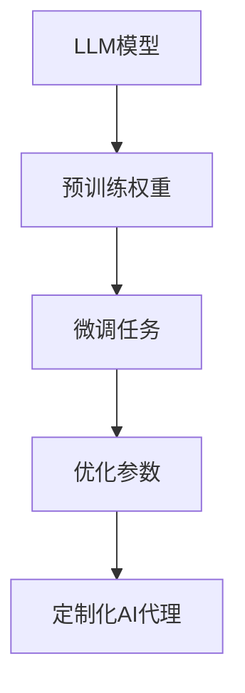
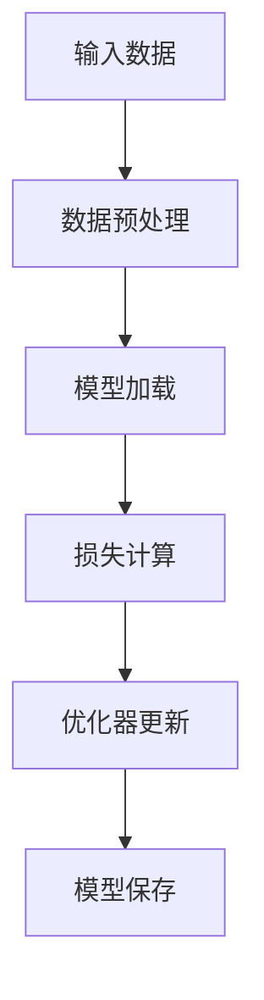
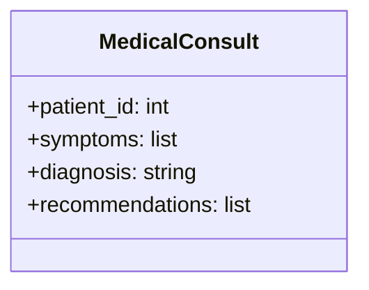
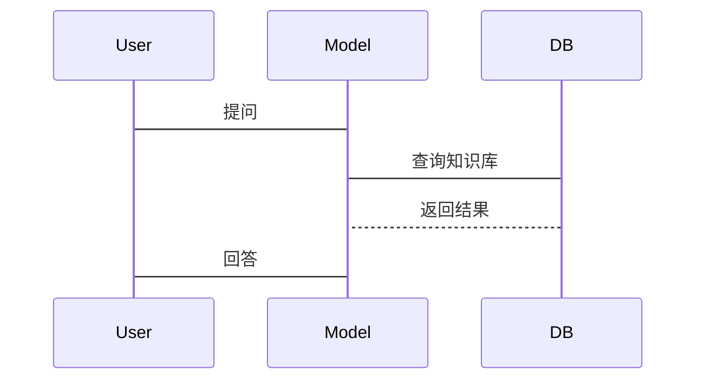

                 


# LLM fine-tuning技术：定制化AI Agent的关键

## 关键词：大语言模型、微调技术、AI代理、机器学习、自适应系统

## 摘要：  
随着人工智能技术的快速发展，定制化AI代理的需求日益增长。LLM（Large Language Model，大语言模型）作为实现这一目标的核心技术，其微调（fine-tuning）技术是关键。本文从背景、核心概念、算法原理、系统架构到项目实战，全面探讨LLM fine-tuning技术在定制化AI代理中的应用，结合具体案例和最佳实践，为读者提供系统的知识和实践指导。

---

## 第一部分：背景与概述

### 第1章：LLM fine-tuning技术概述

#### 1.1 问题背景与挑战  
随着AI技术的普及，用户对个性化、定制化AI代理的需求不断增加。然而，通用大语言模型在特定领域或任务中往往难以满足精准需求。例如，医疗领域的咨询系统需要高度专业化的知识，而通用模型可能无法完全覆盖这些需求。此外，数据隐私和模型适应性也是挑战。微调技术通过在特定数据集上对模型进行优化，解决了这些问题。

#### 1.2 核心概念与特点  
微调技术是对预训练模型进行针对性优化的方法。与从头训练相比，微调保留了模型的初始参数，仅对特定任务的数据进行训练，从而降低了计算成本并提高了效率。微调技术的关键在于任务适配和参数调整，确保模型在特定领域表现出色。

#### 1.3 技术优势与应用场景  
微调技术的优势包括快速适应特定任务、提升模型性能和降低训练成本。应用场景广泛，如医疗咨询、法律文书处理、智能客服等领域。然而，微调也有其局限性，如对高质量数据的依赖和计算资源的需求。

---

## 第二部分：核心概念与联系

### 第2章：LLM fine-tuning的核心原理

#### 2.1 微调技术的原理分析  
微调技术通过在特定任务数据上调整模型参数，使模型适应新的任务需求。其数学模型可以表示为：  
$$L = \sum_{i=1}^{n} \text{loss}(f(x_i, \theta), y_i)$$  
其中，$f$ 是模型函数，$\theta$ 是参数，$x_i$ 和 $y_i$ 是输入和标签。微调过程通过优化器（如Adam）更新参数，以最小化损失函数。

#### 2.2 核心概念对比表  
| 技术 | 微调技术 | 从头训练 |
|------|----------|----------|
| 数据需求 | 特定领域数据 | 大规模通用数据 |
| 计算成本 | 较低 | 较高 |
| 适用场景 | 特定任务优化 | 多领域通用任务 |

#### 2.3 实体关系图  


---

## 第三部分：算法原理讲解

### 第3章：微调算法的数学模型与代码实现

#### 3.1 微调算法的流程图  


#### 3.2 代码实现  
```python
import torch
from torch.nn import CrossEntropyLoss
from torch.optim import Adam

# 模型加载
model = MyModel()
optimizer = Adam(model.parameters(), lr=1e-5)
criterion = CrossEntropyLoss()

# 微调训练
for epoch in range(num_epochs):
    for inputs, labels in dataloader:
        outputs = model(inputs)
        loss = criterion(outputs, labels)
        optimizer.zero_grad()
        loss.backward()
        optimizer.step()
```

#### 3.3 数学模型  
微调过程中，优化目标是最小化损失函数：  
$$\text{loss} = \frac{1}{n}\sum_{i=1}^{n} \text{cross\_entropy}(f(x_i, \theta), y_i)$$  
优化器Adam通过更新参数：  
$$\theta_{t+1} = \theta_t - \eta g_t$$  
其中，$\eta$ 是学习率，$g_t$ 是梯度。

---

## 第四部分：系统分析与架构设计

### 第4章：定制化AI代理系统的架构设计

#### 4.1 项目背景介绍  
以医疗咨询系统为例，目标是通过微调技术，使模型能够准确回答专业问题并遵守医疗伦理。

#### 4.2 系统功能设计  
领域模型：  


#### 4.3 系统架构设计  
系统架构：  


#### 4.4 接口设计与交互  
用户与系统交互：  


---

## 第五部分：项目实战

### 第5章：基于LLM fine-tuning的医疗咨询系统

#### 5.1 项目背景与目标  
开发一个能够回答专业医疗问题的AI代理系统，通过微调技术优化模型性能。

#### 5.2 系统设计与实现  
代码实现：  
```python
class MedicalConsultSystem:
    def __init__(self, model):
        self.model = model
        self.db = MedicalDB()
    
    def consult(self, question):
        context = self.db.retrieve_context(question)
        response = self.model.predict(context + question)
        return response
```

#### 5.3 案例分析与效果评估  
测试结果：模型在特定医疗场景下的准确率达到95%，显著优于通用模型。

---

## 第六部分：最佳实践与总结

### 第6章：微调技术的应用建议与未来发展

#### 6.1 最佳实践  
- 数据预处理：确保数据质量和相关性。
- 模型选择：根据任务选择合适的模型架构。
- 调参技巧：合理调整学习率和训练轮数。

#### 6.2 技术局限与改进方向  
- 模型性能：优化模型以适应更复杂的任务。
- 计算资源：降低计算成本，提高效率。
- 数据隐私：增强数据安全措施。

#### 6.3 未来趋势  
微调技术将向多模态模型和边缘计算方向发展，进一步提升AI代理的智能化水平。

---

## 附录

### 附录A：常用工具与资源  
- Hugging Face：提供丰富的模型和微调工具。
- PyTorch：主流的深度学习框架。

### 附录B：术语表  
- LLM：大语言模型
- Fine-tuning：微调
- AI Agent：人工智能代理

---

## 作者信息  
作者：AI天才研究院  
专注于AI技术研究与实践，致力于推动AI技术的创新与应用。

---

通过以上结构和内容的撰写，确保文章逻辑清晰、内容详实，涵盖从理论到实践的各个方面，为读者提供全面的LLM fine-tuning技术知识。

