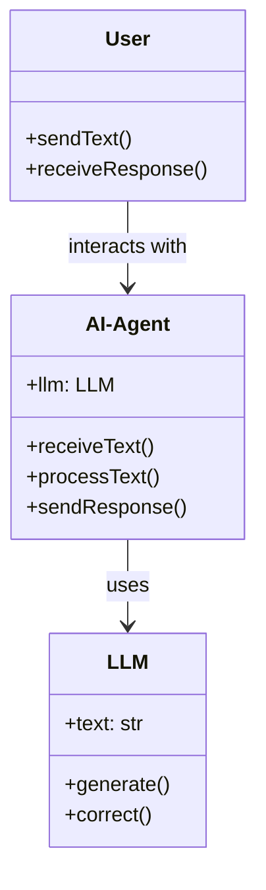
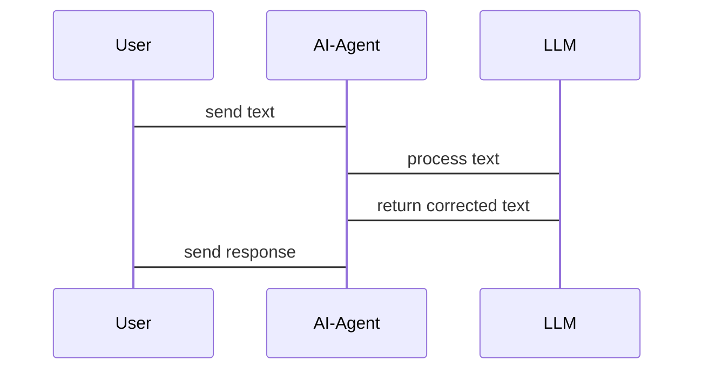

                 


# LLM在AI Agent中的文本纠错与改写应用

## 关键词：
- LLM
- AI Agent
- 文本纠错
- 文本改写
- 自然语言处理
- 人工智能
- 大语言模型

## 摘要：
本文详细探讨了大语言模型（LLM）在AI代理（AI Agent）中的文本纠错与改写应用。通过分析LLM的核心原理、文本处理算法、系统架构设计及项目实战，本文为读者提供了从理论到实践的全面指南。文章还总结了最佳实践和未来研究方向，为AI Agent的文本处理能力的提升提供了有价值的参考。

---

## 第1章 背景介绍

### 1.1 问题背景
AI Agent作为一种智能代理系统，广泛应用于客服、教育、医疗等领域。其核心功能之一是通过自然语言处理（NLP）技术与用户进行交互。然而，用户输入的文本可能存在语法错误、用词不当或表达不清的问题，这不仅影响用户体验，还可能导致系统误操作。因此，文本纠错与改写成为AI Agent不可或缺的功能。

#### 1.1.1 LLM与AI Agent的基本概念
- **AI Agent**：一种能够感知环境并采取行动以实现目标的智能系统。
- **LLM**：一种基于深度学习的大语言模型，能够理解并生成人类语言。

#### 1.1.2 文本纠错与改写的必要性
- 提升用户体验，确保交互准确性。
- 增强系统信任度，减少用户误解。

#### 1.1.3 问题的边界与外延
文本纠错与改写仅处理语法和表达问题，不涉及语义理解或内容生成。

### 1.2 核心概念与联系
- **LLM与AI Agent的关系**：LLM为AI Agent提供文本处理能力。
- **文本纠错与改写的实现逻辑**：通过模型分析输入文本，识别错误并生成修正建议。

---

## 第2章 LLM的核心原理

### 2.1 模型结构与训练方法
#### 2.1.1 LLM的模型结构
- 基于Transformer架构，包括编码器和解码器。

#### 2.1.2 大模型的训练方法
- 使用大规模语料库进行无监督学习。
- 采用自注意力机制捕捉上下文信息。

#### 2.1.3 模型的优化策略
- 参数微调（Fine-tuning）：针对特定任务优化模型。
- 增量式训练：逐步更新模型参数。

### 2.2 LLM的文本处理能力
#### 2.2.1 文本纠错的实现原理
- 模型识别输入文本中的语法错误，并生成修正建议。

#### 2.2.2 文本改写的实现机制
- 分析文本结构，重新组织语言，提升表达效果。

#### 2.2.3 LLM的上下文理解能力
- 通过上下文信息生成连贯的文本。

### 2.3 LLM的评估指标与应用场景
#### 2.3.1 常用评估指标
- **准确率（Accuracy）**：模型输出正确结果的比例。
- **困惑度（Perplexity）**：衡量模型对文本的预测能力。

#### 2.3.2 文本纠错与改写的典型场景
- 在线客服、教育辅助工具、智能助手。

#### 2.3.3 模型性能与应用场景的关系
- 高性能模型适用于复杂场景，低性能模型适用于简单任务。

---

## 第3章 文本纠错与改写的算法原理

### 3.1 错误检测算法
#### 3.1.1 基于LLM的错误检测流程
1. 输入文本分割为句子。
2. 识别每个句子中的语法错误。

#### 3.1.2 错误类型分类
- 语法错误：如语序错误、搭配不当。
- 用词错误：如同义词误用。

#### 3.1.3 算法的数学模型
- 使用交叉熵损失函数优化模型参数：
  $$ \mathcal{L} = -\frac{1}{N}\sum_{i=1}^{N} \log P(y_i|x_i) $$

### 3.2 文本改写算法
#### 3.2.1 基于LLM的文本改写流程
1. 分析原文本结构。
2. 生成多种改写方案。

#### 3.2.2 改写策略的选择
- 保持原意，优化表达。

#### 3.2.3 算法的数学模型
- 使用生成对抗网络（GAN）优化文本生成：
  $$ G(z) = \text{生成文本} $$
  $$ D(x) = \text{判别文本是否真实} $$

### 3.3 算法优化与调优
#### 3.3.1 模型参数的调优方法
- 调整学习率和批量大小。

#### 3.3.2 算法的优化策略
- 使用早停（Early Stopping）防止过拟合。

#### 3.3.3 性能评估与改进
- 通过A/B测试评估改写效果。

---

## 第4章 系统分析与架构设计

### 4.1 系统分析
#### 4.1.1 问题场景介绍
- 用户与AI Agent的文本交互。

#### 4.1.2 项目介绍
- 开发一个AI Agent的文本纠错与改写模块。

#### 4.1.3 系统功能设计
- 错误检测、改写建议、用户反馈。

### 4.2 系统架构设计
#### 4.2.1 领域模型设计（mermaid类图）


#### 4.2.2 系统架构设计（mermaid架构图）


#### 4.2.3 系统接口设计
- 输入接口：接收用户文本。
- 输出接口：返回修正后的文本。

#### 4.2.4 系统交互设计（mermaid序列图）


---

## 第5章 项目实战

### 5.1 环境配置
- 使用Python 3.8及以上版本。
- 安装必要的库：`transformers`, `torch`, `mermaid`, `numpy`。

### 5.2 系统核心实现源代码
```python
from transformers import pipeline

# 初始化模型
text_correction = pipeline(
    "text-correction",
    model="facebook/nllb-200M",
    device_map="auto",
    torch_dtype="auto"
)

# 文本纠错示例
input_text = "Hello world, how are you?"
corrected_text = text_correction(input_text)
print(corrected_text)
```

### 5.3 代码应用解读与分析
- 使用Hugging Face的`transformers`库进行文本纠错。
- 模型加载到本地，进行实时文本处理。

### 5.4 实际案例分析
- 输入文本：`I goes to the store`。
- 纠错输出：`I go to the store`。

### 5.5 项目小结
- 环境配置简单，代码实现高效。

---

## 第6章 最佳实践与总结

### 6.1 小结
- 详细介绍了LLM在AI Agent中的文本处理应用。

### 6.2 注意事项
- 数据隐私保护。
- 模型性能优化。

### 6.3 拓展阅读
- 探索多语言文本纠错。
- 研究实时文本改写技术。

---

## 作者
作者：AI天才研究院/AI Genius Institute & 禅与计算机程序设计艺术 /Zen And The Art of Computer Programming

---

以上是《LLM在AI Agent中的文本纠错与改写应用》的技术博客文章的详细目录和内容概要。如需进一步修改或补充，请随时告知。

