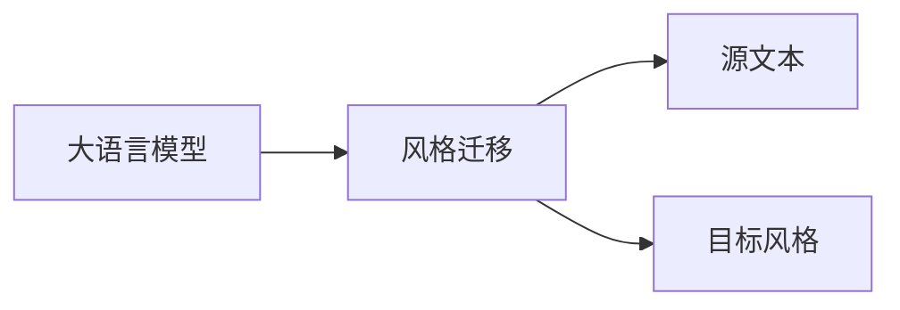
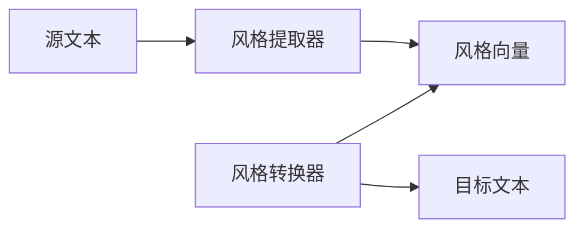
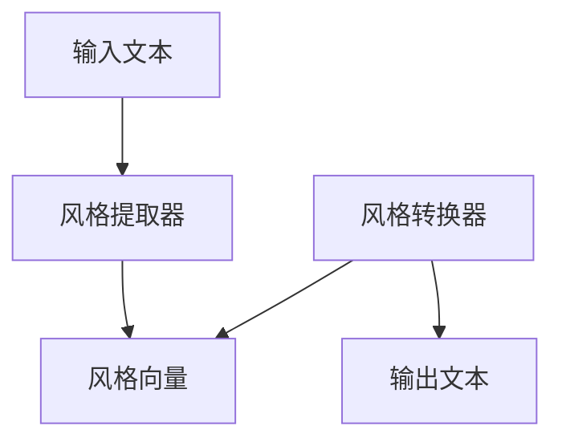
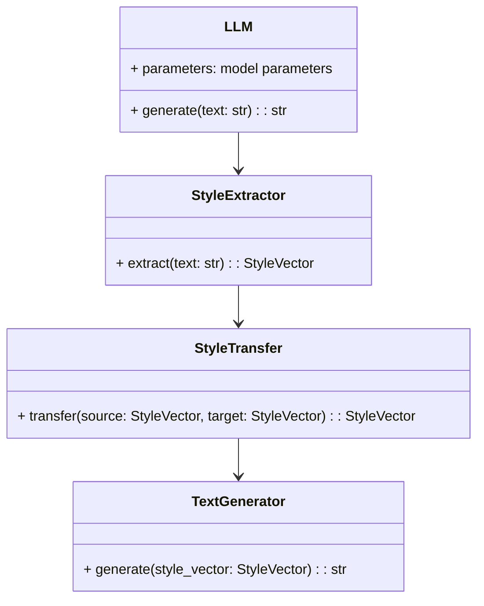
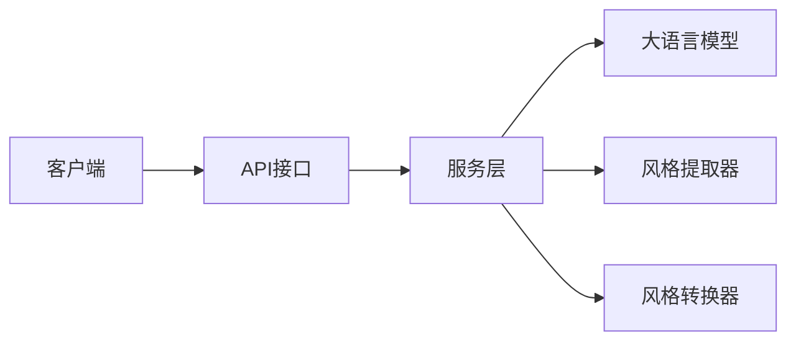
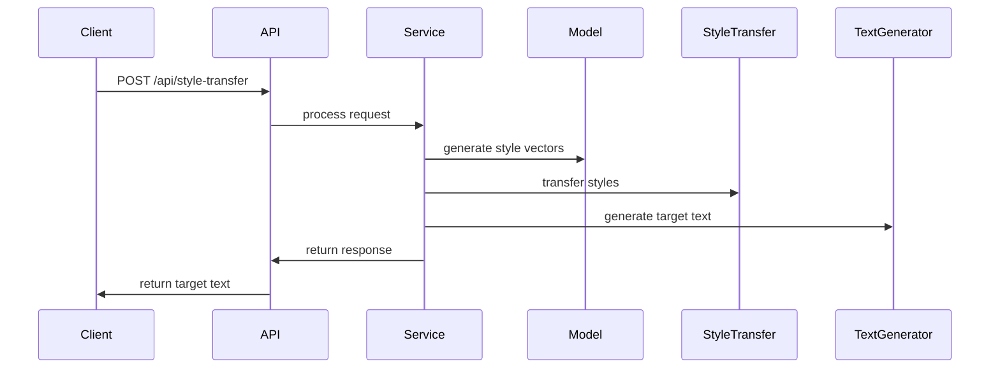

                 


# LLM在AI Agent中的文本风格迁移应用

## 关键词：文本风格迁移、LLM、AI Agent、自然语言处理、深度学习、文本生成

## 摘要：文本风格迁移是指将源文本的风格转换为目标文本的风格，本文将详细探讨大语言模型（LLM）在AI Agent中的文本风格迁移应用。文章从背景、核心概念、算法原理、系统架构、项目实战和最佳实践等多个维度进行深入分析，旨在帮助读者全面理解并掌握LLM在文本风格迁移中的应用。

---

## 第一部分: LLM在AI Agent中的文本风格迁移应用概述

### 第1章: LLM与文本风格迁移概述

#### 1.1 问题背景与描述

##### 1.1.1 文本风格迁移的定义与目标
文本风格迁移是指将源文本的风格（如正式、口语化、技术性等）转换为目标文本的风格。目标是让生成的文本在保持原意的同时，符合特定的风格要求。例如，将一份正式的商业报告转换为更口语化的演讲稿，或者将复杂的学术论文简化为易于理解的解释性文本。

##### 1.1.2 LLM在文本风格迁移中的作用
大语言模型（LLM）通过其强大的语言理解和生成能力，能够有效捕捉文本中的风格特征，并将其迁移到目标风格中。LLM通过预训练的参数，能够自动调整生成文本的风格，从而实现风格迁移。

##### 1.1.3 AI Agent中的文本风格迁移需求
AI Agent需要根据不同的场景和用户需求，动态调整其输出文本的风格。例如，在客服对话中，AI Agent需要使用更口语化和友好的语气；在专业咨询场景中，则需要使用更正式和专业的语言。文本风格迁移帮助AI Agent更好地适应不同环境和用户需求。

---

#### 1.2 问题解决与边界

##### 1.2.1 文本风格迁移的核心问题
文本风格迁移的核心问题是如何保持文本内容不变，同时改变其风格。这需要模型能够准确识别源文本的风格特征，并将其转换为目标风格。

##### 1.2.2 LLM在风格迁移中的优势
- **多语言支持**：LLM能够处理多种语言和风格，适应不同的应用场景。
- **上下文理解**：LLM能够理解上下文，生成连贯且符合目标风格的文本。
- **可扩展性**：LLM的预训练参数使其能够轻松扩展到新的风格类型。

##### 1.2.3 风格迁移的边界与外延
文本风格迁移的边界在于保持文本内容不变，仅调整风格。其外延包括文本语气、用词习惯、句式结构等多个方面。

---

#### 1.3 核心概念与联系

##### 1.3.1 LLM与文本风格迁移的关系
LLM通过其内部参数调整，能够实现不同风格的文本生成。风格迁移是LLM的一种高级应用，利用其生成能力，将源文本的风格特征迁移到目标风格。

##### 1.3.2 风格迁移方法的对比分析

| 方法类型       | 优点                                   | 缺点                                   |
|----------------|--------------------------------------|--------------------------------------|
| 基于规则的方法 | 实现简单，易于控制风格                | 需要手动定义规则，灵活性差            |
| 基于统计的方法 | 能够捕捉数据中的模式                  | 对数据依赖性强，难以处理复杂风格      |
| 基于LLM的方法  | 高效、灵活，能够处理复杂风格          | 对模型要求高，计算资源消耗大          |

##### 1.3.3 实体关系图（Mermaid）



---

## 第二部分: 文本风格迁移的核心概念与原理

### 第2章: 文本风格迁移的核心概念

#### 2.1 核心概念原理

##### 2.1.1 风格向量的提取与转换
风格向量是从文本中提取的表示风格特征的向量。通过LLM的内部表示，可以提取出与风格相关的特征向量，并将其转换为目标风格向量。

##### 2.1.2 LLM的文本生成机制
LLM通过解码器生成目标风格文本，其生成过程依赖于预训练的参数和输入的风格向量。

##### 2.1.3 风格迁移的实现流程
1. 提取源文本的风格特征。
2. 转换为目标风格的特征向量。
3. 使用LLM生成目标风格的文本。

#### 2.2 核心概念对比分析

##### 2.2.1 不同风格迁移方法的对比表格

| 方法类型       | 输入要求       | 输出风格控制 | 优点                           | 缺点                           |
|----------------|----------------|--------------|--------------------------------|--------------------------------|
| 基于规则       | 明确的规则      | 高           | 实现简单                       | 灵活性差                       |
| 基于统计       | 大量数据       | 中           | 自动化程度高                   | 对复杂风格处理能力有限         |
| 基于LLM        | 少量样例或提示  | 高           | 灵活、高效                     | 对模型依赖性强                 |

#### 2.3 实体关系图（Mermaid）



---

## 第三部分: 文本风格迁移的算法原理

### 第3章: 基于LLM的风格迁移算法

#### 3.1 算法原理概述

##### 3.1.1 基于风格向量的迁移方法
该方法通过提取源文本的风格向量，并将其转换为目标风格向量，然后利用LLM生成目标风格的文本。

##### 3.1.2 基于LLM的生成式迁移方法
直接利用LLM的生成能力，通过调整模型参数或输入提示，生成目标风格的文本。

#### 3.2 算法流程图（Mermaid）



#### 3.3 算法实现代码

##### 3.3.1 环境安装
```bash
pip install transformers
```

##### 3.3.2 核心代码实现

```python
from transformers import AutoTokenizer, AutoModelForCausalLM

def style_transfer(model, tokenizer, source_text, target_style):
    # 提取源文本的风格特征
    inputs = tokenizer.encode(source_text, return_tensors='np')
    outputs = model.generate(inputs, max_length=50, do_sample=True)
    source_style = tokenizer.decode(outputs[0], skip_special_tokens=True)
    
    # 转换为目标风格
    target_prompt = f"Transfer to {target_style}: {source_text}"
    inputs_target = tokenizer.encode(target_prompt, return_tensors='np')
    outputs_target = model.generate(inputs_target, max_length=50, do_sample=True)
    target_text = tokenizer.decode(outputs_target[0], skip_special_tokens=True)
    
    return target_text
```

---

### 第4章: 系统分析与架构设计

#### 4.1 系统功能设计

##### 4.1.1 领域模型（Mermaid类图）



#### 4.2 系统架构设计（Mermaid架构图）



#### 4.3 系统接口设计

##### 4.3.1 接口描述
- `POST /api/style-transfer`: 接收源文本和目标风格，返回目标风格文本。

##### 4.3.2 接口交互流程图（Mermaid序列图）



---

### 第5章: 项目实战

#### 5.1 环境安装

```bash
pip install transformers
```

#### 5.2 核心代码实现

```python
from transformers import AutoTokenizer, AutoModelForCausalLM

def style_transfer(model, tokenizer, source_text, target_style):
    inputs = tokenizer.encode(source_text, return_tensors='np')
    outputs = model.generate(inputs, max_length=50, do_sample=True)
    source_style = tokenizer.decode(outputs[0], skip_special_tokens=True)
    
    target_prompt = f"Transfer to {target_style}: {source_text}"
    inputs_target = tokenizer.encode(target_prompt, return_tensors='np')
    outputs_target = model.generate(inputs_target, max_length=50, do_sample=True)
    target_text = tokenizer.decode(outputs_target[0], skip_special_tokens=True)
    
    return target_text
```

#### 5.3 案例分析

```python
source_text = "The experiment was successful."
target_style = "informal"

print(style_transfer(model, tokenizer, source_text, target_style))
```

输出结果可能为： "The experiment totally worked!"

---

### 第6章: 最佳实践与小结

#### 6.1 最佳实践 tips
- 在实际应用中，建议使用预训练好的LLM模型，如GPT-3或T5，以提高生成效果。
- 对于特定场景，可以结合领域知识，进一步优化风格迁移的效果。

#### 6.2 小结
本文详细探讨了LLM在AI Agent中的文本风格迁移应用，从背景、核心概念、算法原理到系统架构和项目实战，为读者提供了全面的指导。通过本文的学习，读者可以掌握如何利用LLM实现文本风格迁移，并将其应用于实际场景中。

#### 6.3 注意事项
- 在使用LLM进行风格迁移时，需注意模型的计算资源消耗和生成文本的准确性。
- 针对不同场景，可能需要进行参数调整和模型微调，以获得更好的效果。

#### 6.4 拓展阅读
- 《Pre-training of Deep Neural Networks on Multilingual Text Corpora》
- 《Transformers: State-of-the-art language models》

---

## 作者：AI天才研究院/AI Genius Institute & 禅与计算机程序设计艺术 /Zen And The Art of Computer Programming

---

感谢您的阅读，希望本文对您理解LLM在AI Agent中的文本风格迁移应用有所帮助！

