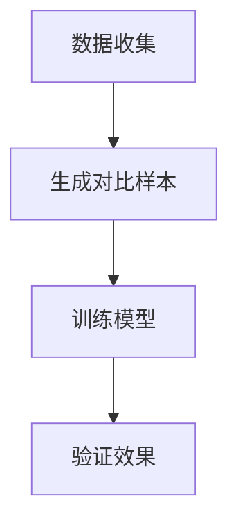
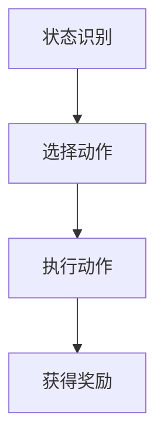
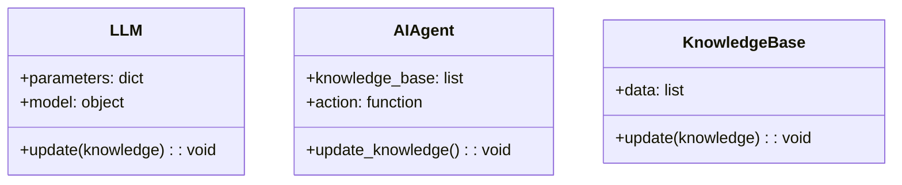
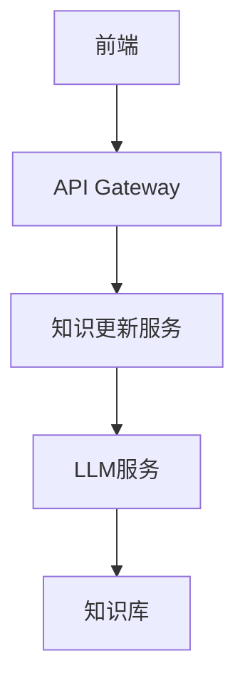
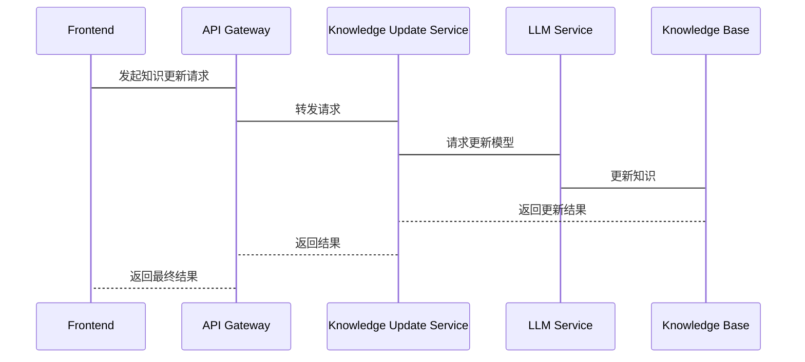

                 


# LLM在AI Agent知识更新中的应用

> 关键词：LLM, AI Agent, 知识更新, 对比学习, 强化学习, 系统架构

> 摘要：本文探讨了大语言模型（LLM）在AI代理知识更新中的应用。通过分析背景、核心概念、算法原理、系统架构、项目实战及最佳实践，详细阐述了如何利用LLM提升AI代理的知识更新效率与准确性。文章结合实际案例，提供代码实现和系统设计，为相关研究和应用提供了参考。

---

## 第一部分：背景介绍

### 第1章：LLM与AI Agent知识更新概述

#### 1.1 问题背景
- **AI Agent的基本概念**：AI Agent是一种智能体，能够感知环境并执行任务。知识更新是其持续改进的核心。
- **LLM在AI Agent中的作用**：LLM通过理解和生成语言，为AI Agent提供动态的知识支持。
- **知识更新的必要性**：实时更新知识以适应变化的环境，提升决策的准确性。

#### 1.2 问题描述
- **知识更新的定义**：动态调整AI Agent的知识库，使其反映最新信息。
- **知识更新的挑战**：数据量大、更新频率高、准确性要求高。
- **知识更新的目标**：保持知识的准确性和时效性。

#### 1.3 问题解决
- **知识更新的方法**：对比学习、强化学习。
- **知识更新的流程**：数据收集、处理、存储、检索。
- **知识更新的评估**：准确率、延迟、资源消耗。

#### 1.4 边界与外延
- **知识更新的边界**：仅限于语言相关的知识，不涉及其他类型的数据。
- **知识更新的外延**：结合多模态数据，提升知识的全面性。
- **与其他功能的关系**：与推理、规划等功能紧密相连。

#### 1.5 核心要素组成
- **数据来源**：文本、结构化数据、图像。
- **更新策略**：基于规则、基于模型。
- **知识表示**：符号表示、向量表示。

---

## 第二部分：核心概念与联系

### 第2章：LLM与AI Agent的知识更新机制

#### 2.1 核心概念原理
- **LLM的基本原理**：基于大规模数据的预训练，通过微调适应特定任务。
- **AI Agent的知识表示**：使用符号或向量表示知识，便于存储和检索。
- **知识更新的触发条件**：检测知识过时或不准确时触发更新。

#### 2.2 核心概念属性对比
| 特性          | LLM                  | AI Agent             | 知识更新             |
|---------------|----------------------|----------------------|----------------------|
| 功能          | 生成文本             | 执行任务             | 更新知识             |
| 输入          | 文本、查询           | 环境感知             | 新数据               |
| 输出          | 文本生成             | 行动                 | 更新后知识           |
| 学习方式      | 监督学习、无监督学习  | 强化学习、对比学习    | 对比学习、强化学习    |

#### 2.3 ER实体关系图
```mermaid
er
    entity(LLM) {
        id: int
        model_name: string
        parameter_size: int
    }
    entity(AI Agent) {
        id: int
        agent_name: string
        function: string
    }
    entity(Knowledge) {
        id: int
        content: string
        source: string
    }
    relationship(Updates) {
        from: LLM
        to: Knowledge
        via: update_task
    }
```

---

## 第三部分：算法原理讲解

### 第3章：LLM的知识更新算法

#### 3.1 对比学习算法
- **算法步骤**：
  1. 收集新数据。
  2. 生成对比样本。
  3. 训练模型更新知识。
  4. 验证更新效果。



- **Python代码实现**：
  ```python
  def contrastive_learning(old_knowledge, new_data):
      # 生成对比样本
      positive_pairs = match(old_knowledge, new_data)
      negative_pairs = mismatch(old_knowledge, new_data)
      
      # 训练模型
      model = train(positive_pairs, negative_pairs)
      
      return model
  ```

- **数学模型**：
  对比损失函数：
  $$ L = -\log\left(\frac{e^{sim(x,y)}}{e^{sim(x,y)} + e^{sim(x,z)}}\right) $$
  其中，$$ sim(x,y) $$ 表示x和y的相似度。

#### 3.2 强化学习算法
- **算法步骤**：
  1. 定义状态空间。
  2. 定义动作空间。
  3. 构建奖励函数。
  4. 训练策略网络。



- **Python代码实现**：
  ```python
  def reinforce_learning(state, action_space):
      # 构建奖励函数
      reward = get_reward(state, action)
      
      # 更新策略网络
      update_policy(reward)
      
      return action
  ```

- **数学模型**：
  值函数：
  $$ V(s) = V(s) + \alpha (r + \gamma V(s')) - V(s) $$
  其中，$$ \alpha $$ 是学习率，$$ \gamma $$ 是折扣因子。

---

## 第四部分：系统分析与架构设计

### 第4章：系统架构设计

#### 4.1 问题场景介绍
- **应用场景**：实时新闻更新、对话系统优化。

#### 4.2 系统功能设计


#### 4.3 系统架构设计


#### 4.4 接口设计与交互流程


---

## 第五部分：项目实战

### 第5章：项目实现与案例分析

#### 5.1 环境安装
- **安装依赖**：Python、TensorFlow、Hugging Face库。
  ```bash
  pip install tensorflow transformers
  ```

#### 5.2 核心功能实现
- **数据预处理**：
  ```python
  def preprocess_data(data):
      # 文本清洗
      cleaned_data = [clean(text) for text in data]
      
      # 分词处理
      tokenized_data = [tokenize(text) for text in cleaned_data]
      
      return tokenized_data
  ```

- **模型训练**：
  ```python
  def train_model(train_data, val_data):
      model = load_model()
      model.fit(train_data, val_data, epochs=10, batch_size=32)
      return model
  ```

#### 5.3 案例分析
- **案例1**：新闻更新系统。
  ```python
  # 示例代码
  news = "最新科技新闻"
  updated_knowledge = update_knowledge_base(llm, news)
  ```

- **案例2**：对话系统优化。
  ```python
  # 示例代码
  response = generate_response(llm, "天气如何")
  ```

#### 5.4 项目小结
- **代码实现总结**：通过对比学习和强化学习实现知识更新。
- **案例分析总结**：展示了LLM在实际应用中的有效性。

---

## 第六部分：最佳实践

### 第6章：小结与注意事项

#### 6.1 小结
- **核心内容总结**：LLM通过对比学习和强化学习实现知识更新，提升AI Agent的智能性。
- **关键点回顾**：数据质量、模型选择、更新频率。

#### 6.2 注意事项
- **数据多样性**：确保数据来源多样化，避免信息偏差。
- **模型调优**：根据具体任务调整模型参数。
- **性能优化**：减少知识更新的延迟，提升效率。

#### 6.3 拓展阅读
- **推荐书籍**：《深度学习》、《强化学习入门》。
- **推荐文章**：AI Agent与知识图谱的结合应用。

---

## 作者

作者：AI天才研究院/AI Genius Institute & 禅与计算机程序设计艺术 /Zen And The Art of Computer Programming

---

以上是《LLM在AI Agent知识更新中的应用》的完整大纲和文章内容。

