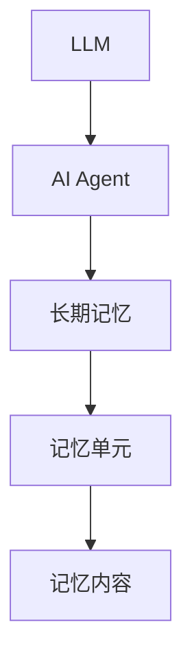
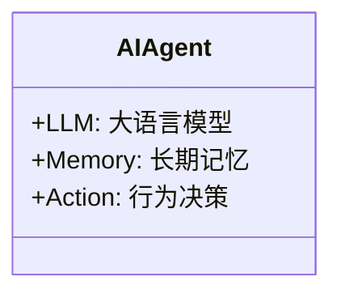
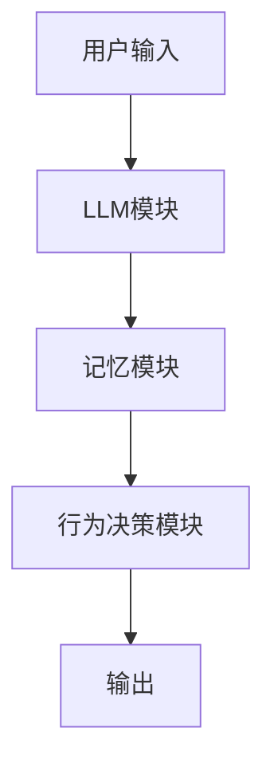
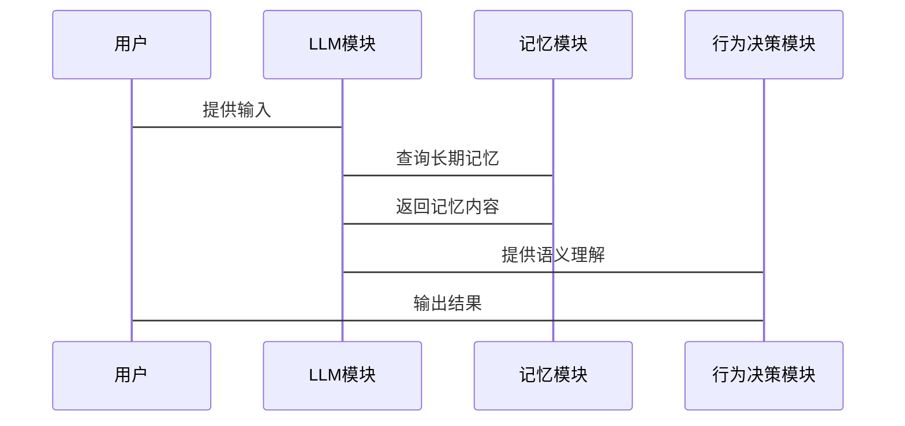

                 


# LLM在AI Agent长期记忆中的应用

> 关键词：大语言模型, AI Agent, 长期记忆, 记忆网络, Transformer模型, AI系统设计

> 摘要：本文深入探讨了大语言模型（LLM）在AI Agent长期记忆中的应用，从背景介绍、核心概念、算法原理、系统设计到项目实战，全面解析了如何利用LLM构建高效、智能的AI代理记忆系统。通过详细的技术分析和实际案例，本文为AI Agent的长期记忆问题提供了全新的解决方案和实现路径。

---

# 第一部分: 背景介绍

## 第1章: 问题背景与描述

### 1.1 AI Agent的基本概念
- AI Agent的定义与分类
- AI Agent的核心功能：感知、决策、行动
- AI Agent的记忆机制：短期记忆与长期记忆的对比

### 1.2 长期记忆的重要性
- 长期记忆在AI Agent中的作用
- 传统AI Agent记忆的局限性
- LLM如何解决记忆问题

### 1.3 LLM在AI Agent中的角色
- LLM作为记忆存储与检索的核心工具
- LLM与AI Agent记忆机制的结合方式
- LLM在复杂场景中的应用潜力

## 第2章: 问题解决与边界

### 2.1 当前AI Agent记忆的局限性
- 传统记忆机制的不足
- 知识遗忘与信息丢失的问题
- 复杂场景中的记忆不完整问题

### 2.2 LLM如何解决记忆问题
- LLM的语义理解能力
- LLM的知识关联能力
- LLM的记忆持久性和可扩展性

### 2.3 长期记忆的边界与外延
- 长期记忆的定义与范围
- 边界条件与实现限制
- 外延：记忆与其他功能的协同

## 第3章: 核心概念与结构

### 3.1 核心概念原理
- LLM的基本原理：如何处理文本和记忆
- AI Agent记忆机制的核心要素
- 长期记忆的存储与检索模型

### 3.2 核心概念对比
- LLM与传统NLP模型的对比
- AI Agent记忆与人类记忆的对比
- 不同记忆机制的优缺点分析

### 3.3 ER实体关系图


---

# 第二部分: 核心概念与联系

## 第4章: 核心概念的联系

### 4.1 LLM的工作机制
- Transformer模型的工作流程
- LLM的训练目标与损失函数
- LLM的记忆能力与上下文理解

### 4.2 AI Agent记忆机制
- 基于记忆网络的LLM实现
- 记忆网络的结构与功能
- 记忆单元的设计与优化

### 4.3 长期记忆的存储与检索
- 长期记忆的存储模型
- 基于LLM的记忆检索机制
- 记忆内容的组织与关联

## 第5章: 核心概念的对比分析

### 5.1 LLM与传统NLP模型的对比
- Transformer与RNN/LSTM的对比
- LLM的记忆能力优势
- 传统模型的局限性

### 5.2 AI Agent记忆与人类记忆的对比
- 人类记忆的层次结构
- AI Agent记忆的简化模型
- 两者的异同与启发

### 5.3 不同记忆机制的优缺点
- 基于记忆网络的优势
- 基于图结构记忆的优缺点
- 其他记忆机制的对比分析

---

# 第三部分: 算法原理讲解

## 第6章: LLM的算法原理

### 6.1 Transformer模型的工作流程
- 编码器与解码器的结构
- 自注意力机制的实现
- 段落级别的语义理解

### 6.2 LLM的记忆能力
- 上下文窗口的扩展
- 动态记忆更新机制
- 多任务学习能力

## 第7章: 记忆机制的算法实现

### 7.1 基于记忆网络的LLM
- 记忆网络的结构设计
- 记忆单元的更新规则
- 记忆内容的检索算法

### 7.2 基于图结构的记忆机制
- 图结构记忆的构建
- 图节点与边的关系
- 基于图的检索算法

### 7.3 记忆网络的数学模型
$$
m_t = \text{update}(m_{t-1}, x_t)
$$

---

# 第四部分: 系统分析与架构设计

## 第8章: 问题场景介绍

### 8.1 AI Agent的应用场景
- 智能客服
- 智能助手
- 自动驾驶

### 8.2 长期记忆在场景中的作用
- 语义理解和上下文关联
- 知识的持久性和可扩展性
- 复杂任务的协同处理

## 第9章: 系统功能设计

### 9.1 领域模型设计


### 9.2 系统架构设计


## 第10章: 系统接口设计

### 10.1 系统接口定义
- 输入接口：用户输入
- 输出接口：系统响应
- 内部接口：LLM与记忆模块的交互

### 10.2 系统交互流程


---

# 第五部分: 项目实战

## 第11章: 环境安装与配置

### 11.1 开发环境搭建
- 安装Python
- 安装深度学习框架（TensorFlow/PyTorch）
- 安装NLP处理库（Hugging Face Transformers）

### 11.2 依赖管理
- 使用pip安装依赖
- 配置GPU支持
- 下载预训练模型

## 第12章: 核心代码实现

### 12.1 记忆网络的实现
```python
class MemoryUnit:
    def __init__(self, input_size, hidden_size):
        self.input_size = input_size
        self.hidden_size = hidden_size
        self.weight = torch.randn(input_size, hidden_size)
    
    def update(self, input_vector):
        # 假设input_vector是输入向量
        output = torch.mm(input_vector, self.weight)
        return output
```

### 12.2 LLM的集成
```python
from transformers import AutoTokenizer, AutoModelForCausalLM

tokenizer = AutoTokenizer.from_pretrained("gpt2")
model = AutoModelForCausalLM.from_pretrained("gpt2")
```

### 12.3 系统交互实现
```python
def system_interaction(user_input):
    # 使用LLM处理输入
    inputs = tokenizer.encode(user_input, return_tensors="pt")
    outputs = model.generate(inputs, max_length=50)
    response = tokenizer.decode(outputs[0], skip_special_tokens=True)
    return response
```

## 第13章: 实际案例分析

### 13.1 案例背景
- 智能客服系统
- 需求：客户咨询与历史记录查询

### 13.2 系统实现
- 集成LLM处理客户咨询
- 使用记忆网络存储历史记录
- 系统交互实现客户信息的关联

### 13.3 案例分析
- 系统性能测试
- 用户反馈收集
- 系统优化建议

---

# 第六部分: 总结与展望

## 第14章: 总结

### 14.1 核心内容回顾
- LLM在AI Agent记忆中的应用
- 关键技术与实现方法
- 系统设计与实现要点

### 14.2 经验与教训
- LLM的优势与局限性
- 系统设计中的注意事项
- 开发中的常见问题与解决方法

## 第15章: 展望

### 15.1 未来发展方向
- 更高效的记忆机制
- 多模态记忆网络
- 自适应记忆更新

### 15.2 技术趋势
- 大模型的持续发展
- 记忆网络的优化
- AI Agent的智能化提升

---

# 作者：AI天才研究院 & 禅与计算机程序设计艺术

---

通过以上目录大纲，我们可以看到，本文从背景介绍、核心概念、算法原理、系统设计到项目实战，全面解析了LLM在AI Agent长期记忆中的应用。每部分内容都进行了详细的展开，确保读者能够逐步理解并掌握相关知识。

