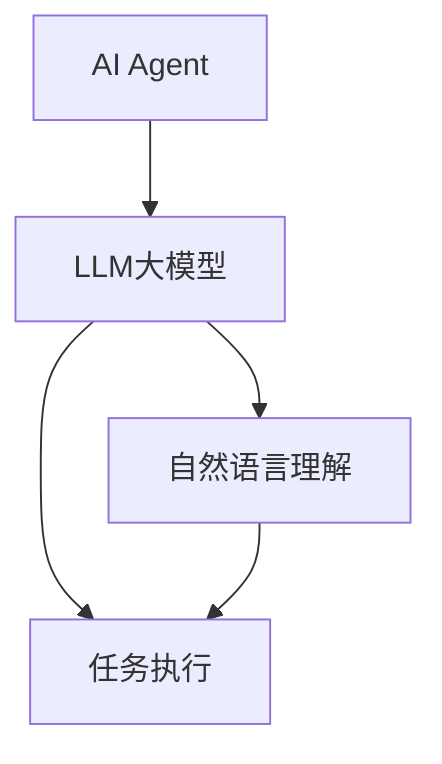
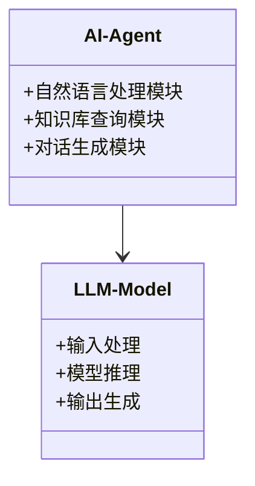

                 


# 《LLM大模型在AI Agent中的微调技巧》

## 关键词：LLM大模型、AI Agent、微调技巧、自然语言处理、机器学习、人工智能

## 摘要：  
本文系统地探讨了在AI Agent中应用LLM大模型时的微调技巧，涵盖从理论到实践的全过程。通过详细分析微调技术的核心概念、算法原理、系统架构以及实际案例，本文为读者提供了从基础理解到实战应用的全面指导。文章结合技术背景、核心概念对比、数学模型推导和系统设计图示，帮助读者深入理解LLM大模型在AI Agent中的微调方法，并通过具体项目实战和最佳实践，为读者提供了实用的技巧和经验总结。

---

## 第一章: AI Agent与LLM大模型的背景与概念

### 1.1 AI Agent的基本概念  
AI Agent（智能代理）是一种能够感知环境、自主决策并执行任务的智能系统。它广泛应用于推荐系统、智能客服、自动驾驶等领域。AI Agent的核心特点包括自主性、反应性、目标导向和学习能力。  

**表1-1: AI Agent与传统AI的对比**  
| 属性          | AI Agent                     | 传统AI                   |  
|---------------|------------------------------|--------------------------|  
| 自主性         | 高                           | 低或无                   |  
| 适应性         | 强                           | 较弱                     |  
| 交互能力       | 强                           | 较弱                     |  

### 1.2 LLM大模型的基本概念  
LLM（Large Language Model，大语言模型）是基于Transformer架构的深度学习模型，能够处理自然语言文本，具备强大的理解和生成能力。LLM的核心技术包括自注意力机制和前馈网络。  

**图1-1: LLM与AI Agent的关系**  


### 1.3 LLM在AI Agent中的应用背景  
LLM大模型为AI Agent提供了强大的语言理解和生成能力，使其能够更好地处理复杂任务。然而，直接使用通用LLM并不足以应对特定场景的需求，因此需要通过微调技术来优化模型性能。  

### 1.4 微调技术的必要性  
微调技术是将通用LLM适配特定任务的关键步骤。通过微调，可以提升模型在AI Agent中的任务相关性、准确性和效率。  

---

## 第二章: 微调技术的核心概念与原理  

### 2.1 微调技术的定义与特点  
微调技术是一种基于迁移学习的方法，通过在特定任务数据上优化模型参数，使模型更好地适应目标场景。  

**图2-1: 微调技术的流程**  


### 2.2 LLM微调的三种方法  
1. **全参数微调**：调整模型所有参数，适用于需要高度定制的任务。  
2. **嵌入层微调**：仅调整嵌入层参数，适用于任务相关性较高的场景。  
3. **任务适配微调**：针对特定任务设计微调策略，如问答系统或对话生成。  

### 2.3 微调的核心要素  
1. **数据预处理**：清洗、标注和增强数据，确保数据质量。  
2. **模型选择**：选择适合任务的模型架构和参数。  
3. **优化目标**：定义清晰的损失函数和优化目标。  

---

## 第三章: 微调技术的算法原理  

### 3.1 微调算法的流程  
1. 数据预处理：清洗数据，提取特征。  
2. 模型加载：加载预训练模型权重。  
3. 参数优化：通过反向传播优化模型参数。  

**图3-1: 微调算法的流程图**  


### 3.2 微调的数学模型  
1. **损失函数**：交叉熵损失函数  
$$ L = -\sum_{i=1}^{n} \log p(y_i|x_i) $$  
2. **优化目标**：最小化损失函数  
$$ \min_{\theta} L + \lambda \Omega(\theta) $$  
其中，$\Omega(\theta)$是正则化项，$\lambda$是正则化系数。  

---

## 第四章: 系统分析与架构设计  

### 4.1 项目场景介绍  
以智能客服系统为例，设计一个基于LLM的AI Agent，用于处理客户咨询和问题解决。  

### 4.2 系统功能设计  
**类图**  


### 4.3 系统架构设计  
**架构图**  


### 4.4 接口与交互设计  
**序列图**  
```mermaid
sequenceDiagram
用户->>+自然语言处理模块: 提交问题
自然语言处理模块->>LLM模型: 请求解释
LLM模型->>知识库查询模块: 获取相关信息
知识库查询模块->>对话生成模块: 返回结果
对话生成模块->>- 用户: 生成回复
```

---

## 第五章: 项目实战与案例分析  

### 5.1 环境与工具安装  
1. 安装Python和深度学习框架（如TensorFlow或PyTorch）。  
2. 下载预训练的LLM模型（如GPT-3或BERT）。  

### 5.2 核心代码实现  
```python
import torch
from torch import nn
from torch.utils.data import DataLoader

# 数据预处理
class Dataset(torch.utils.data.Dataset):
    def __init__(self, encodings):
        self.encodings = encodings
    def __getitem__(self, idx):
        return {
            'input_ids': self.encodings['input_ids'][idx],
            'attention_mask': self.encodings['attention_mask'][idx],
            'labels': self.encodings['labels'][idx]
        }
    def __len__(self):
        return len(self.encodings['input_ids'])

# 模型加载与微调
model = BertForSequenceClassification.from_pretrained('bert-base-uncased')
optimizer = torch.optim.AdamW(model.parameters(), lr=1e-5)
criterion = nn.CrossEntropyLoss()

# 训练循环
def train_loop(model, optimizer, criterion, dataloader):
    model.train()
    for batch in dataloader:
        inputs = { 'input_ids': batch['input_ids'], 'attention_mask': batch['attention_mask']}
        labels = batch['labels']
        outputs = model(**inputs)
        loss = criterion(outputs.logits, labels)
        loss.backward()
        optimizer.step()
        optimizer.zero_grad()
```

### 5.3 案例分析与优化  
通过实际案例分析，优化微调策略，提升模型性能。例如，在智能客服场景中，优化对话生成模块，提高回复的准确性和流畅性。  

---

## 第六章: 最佳实践与经验总结  

### 6.1 微调技术的注意事项  
1. 数据质量至关重要，需进行充分清洗和增强。  
2. 选择合适的微调方法，避免过度优化。  
3. 监控模型性能，及时调整参数。  

### 6.2 小结  
本文详细介绍了LLM大模型在AI Agent中的微调技巧，从理论到实践，为读者提供了全面的指导。  

### 6.3 拓展阅读  
推荐阅读《大型语言模型的优化与部署》和《智能系统架构设计》。  

---

## 作者：AI天才研究院 & 禅与计算机程序设计艺术

