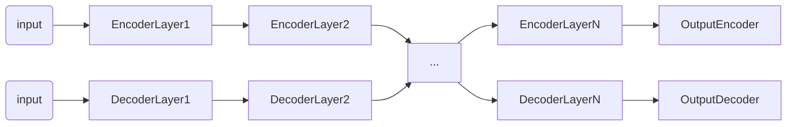
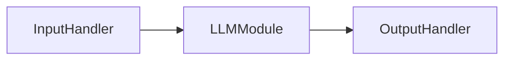

                 


# LLM大模型概述：AI Agent开发的基石

## 关键词：
- 大语言模型 (LLM)
- AI Agent
- 机器学习
- 深度学习
- 自然语言处理 (NLP)

## 摘要：
大语言模型（LLM）作为人工智能领域的重要技术，正逐渐成为AI Agent开发的核心基石。本文从LLM的基本概念出发，详细探讨其技术背景、核心原理、系统架构以及在AI Agent中的应用。通过分析转换器架构、注意力机制等关键算法，结合实际项目案例，为读者提供全面的视角，帮助理解如何构建高效的AI代理系统。

---

## 第1章: LLM大模型的背景与技术背景

### 1.1 什么是LLM大模型

#### 1.1.1 大语言模型的基本概念
大语言模型（Large Language Model，LLM）是指基于大量数据训练的深度学习模型，能够理解和生成人类语言。这些模型通常使用Transformer架构，通过自注意力机制捕捉上下文信息，从而在各种NLP任务中表现出色。

**转换器架构的核心组件包括编码器和解码器，分别处理输入和输出序列。** 以下是转换器架构的简要描述：



**编码器将输入序列转换为上下文向量，解码器根据这些向量生成输出序列。**

#### 1.1.2 LLM与传统NLP模型的区别
与传统NLP模型相比，LLM具有以下优势：

| 特性                | 传统NLP模型          | LLM大模型          |
|---------------------|----------------------|---------------------|
| 数据需求            | 较小，依赖规则        | 需要大量数据        |
| 模型复杂度          | 较低                 | 极高，参数量大       |
| 任务处理能力        | 单一任务             | 多任务              |
| 上下游任务支持       | 较弱                 | 强大                |

LLM能够处理多种任务，如文本生成、问答系统、机器翻译等，而传统NLP模型通常只能处理单一任务。

#### 1.1.3 LLM的核心技术背景
LLM的核心技术包括：

1. **自注意力机制**：允许模型在生成文本时考虑前面生成的词，从而实现更自然的对话。
2. **预训练与微调**：通过大量通用数据预训练模型，然后在特定任务上进行微调。
3. **并行计算**：利用GPU的并行计算能力加速模型训练。

---

### 1.2 LLM的演进历程

#### 1.2.1 从规则驱动到数据驱动的转变
早期的NLP系统依赖专家规则，而现代系统则通过数据驱动的方式进行训练。这种转变使得模型能够从大量数据中学习，而不是依赖人工设定的规则。

#### 1.2.2 大模型的训练与优化过程
训练LLM的过程包括：

1. **预训练**：使用大规模通用数据（如维基百科、书籍）进行无监督学习，目标是最小化生成句子的概率。
2. **微调**：在特定任务的数据上进行有监督微调，优化模型在特定领域的性能。

#### 1.2.3 LLM在AI代理中的应用
AI代理通常需要处理多种任务，如信息查询、对话生成等。LLM作为核心模块，能够为代理提供强大的自然语言处理能力。

---

## 第2章: LLM大模型的核心概念与原理

### 2.1 LLM的模型结构

#### 2.1.1 转换器架构的基本结构
转换器架构由编码器和解码器组成，每个部分包含多个层的自注意力机制和前馈网络。

**编码器的结构如下：**

```mermaid
graph LR
    InputToken Embedding --> Layer1Input
    Layer1Input --> SelfAttention --> Layer1Output
    Layer1Output --> FFN --> Layer1OutputFinal
    Layer1OutputFinal --> Layer2Input
    ...
```

**解码器的结构如下：**

```mermaid
graph LR
    InputToken Embedding --> Layer1Input
    Layer1Input --> SelfAttention --> Layer1Output
    Layer1Output --> FFN --> Layer1OutputFinal
    Layer1OutputFinal --> Layer2Input
    ...
```

### 2.1.2 多层神经网络的运作原理
每层的自注意力机制计算查询、键和值向量，然后通过加权求和生成输出向量。前馈网络对输出向量进行非线性变换。

**自注意力机制的公式：**

$$
\text{Attention}(Q, K, V) = \text{softmax}\left(\frac{QK^T}{\sqrt{d_k}}\right)V
$$

其中，$Q$、$K$、$V$分别为查询、键和值向量，$d_k$为键的维度。

### 2.1.3 注意力机制的实现方式
注意力机制通过计算输入序列中每个词的重要性，将这些重要性加权后生成最终的输出表示。

---

### 2.2 LLM的训练过程

#### 2.2.1 预训练的概念与方法
预训练目标是最小化生成句子的概率，通常使用交叉熵损失函数。

$$
\text{Loss} = -\sum_{i=1}^{n} \log p(x_i|x_{<i})
$$

#### 2.2.2 微调与迁移学习的区别
微调是在预训练的基础上，在特定任务上进行进一步训练，通常需要较小的数据集。

#### 2.2.3 参数量与模型性能的关系
模型参数量越大，通常能够捕捉更多的语言模式，但需要更多的计算资源和数据。

---

### 2.3 LLM的评估指标

#### 2.3.1 常见的评估指标与标准
常用的评估指标包括准确率（Accuracy）、BLEU、ROUGE等。

| 指标   | 定义                              |
|--------|-----------------------------------|
| Accuracy | 正确预测的样本数占总样本数的比例 |
| BLEU    | 基于n-gram的精确度和多样性评估   |

#### 2.3.2 不同模型的性能对比
通过对比不同模型在基准测试中的表现，可以评估模型的性能。

#### 2.3.3 模型的可解释性问题
可解释性是模型的重要特性，通常通过注意力权重可视化来分析模型决策过程。

---

## 第3章: LLM的系统架构与设计

### 3.1 AI代理的系统架构

#### 3.1.1 系统功能模块划分
AI代理系统通常包括以下功能模块：

1. **输入处理模块**：接收用户的输入并进行预处理。
2. **LLM推理模块**：调用LLM进行文本生成或问答。
3. **输出处理模块**：将生成的结果格式化并返回给用户。

**系统模块划分图：**



#### 3.1.2 各模块之间的交互流程
用户输入通过输入处理模块进行解析，然后传递给LLM模块进行处理，最后由输出处理模块生成最终结果。

#### 3.1.3 系统的扩展性设计
通过模块化设计，使得系统能够方便地扩展功能模块。

---

### 3.2 LLM的部署与集成

#### 3.2.1 模型的轻量化部署
通过模型剪枝、量化等技术减少模型大小，降低计算成本。

#### 3.2.2 API接口的设计与实现
提供RESTful API接口，方便其他系统调用。

#### 3.2.3 模型的在线更新机制
通过持续学习技术，定期更新模型以适应新的数据。

---

### 3.3 系统的性能优化

#### 3.3.1 并行计算优化
利用GPU并行计算加速模型推理。

#### 3.3.2 模型压缩技术
通过剪枝和量化技术减少模型大小。

#### 3.3.3 模型蒸馏
通过教师-学生框架，将大模型的知识迁移到小模型。

---

## 第4章: LLM的项目实战

### 4.1 环境安装

#### 4.1.1 安装依赖
安装Python、TensorFlow或PyTorch等框架。

```bash
pip install tensorflow
```

#### 4.1.2 下载模型
下载预训练好的模型权重。

```bash
wget https://example.com/model.h5
```

### 4.2 系统核心实现

#### 4.2.1 LLM模块实现
实现一个简单的LLM推理模块。

```python
class LLM:
    def __init__(self, model_path):
        self.model = load_model(model_path)

    def predict(self, input_text):
        return self.model.generate(input_text)
```

#### 4.2.2 输入处理模块实现
处理用户的输入并调用LLM模块。

```python
class InputHandler:
    def __init__(self, llm):
        self.llm = llm

    def handle_input(self, input_text):
        return self.llm.predict(input_text)
```

#### 4.2.3 输出处理模块实现
格式化生成的结果并返回。

```python
class OutputHandler:
    def format_output(self, generated_text):
        return f"Result: {generated_text}"
```

### 4.3 项目小结

#### 4.3.1 项目总结
通过本项目，我们了解了如何构建一个基于LLM的AI代理系统。

#### 4.3.2 实践中的注意事项
模型的选择、数据的预处理以及系统的优化都是需要注意的关键点。

---

## 第5章: 最佳实践与小结

### 5.1 最佳实践

#### 5.1.1 模型选择
根据任务需求选择合适的模型，如GPT、BERT等。

#### 5.1.2 数据处理
确保数据的多样性和质量，避免过拟合。

#### 5.1.3 系统优化
通过并行计算、模型压缩等技术优化系统的性能。

### 5.2 小结

---

## 作者

作者：AI天才研究院 & 禅与计算机程序设计艺术

---

通过以上内容，我们详细介绍了LLM大模型的基本概念、核心原理以及在AI代理中的应用。希望读者能够通过本文对LLM有更深入的理解，并能够将其应用到实际项目中。

