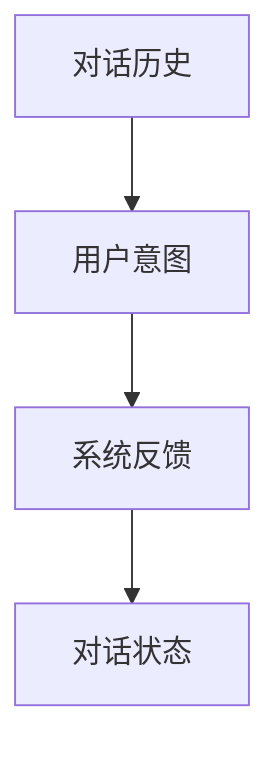
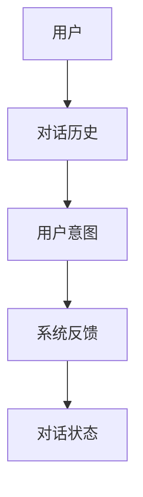

                 


# LLM支持的AI Agent对话状态跟踪

> 关键词：LLM, AI Agent, 对话状态跟踪, NLP, 人机交互, 大语言模型

> 摘要：本文详细探讨了基于大语言模型（LLM）的AI Agent对话状态跟踪的技术与实现。从背景介绍、核心概念、算法原理、系统架构到项目实战，逐步解析了对话状态跟踪在LLM支持下的重要性与实现方式。文章通过丰富的图表和代码示例，结合理论与实践，全面阐述了该领域的关键技术和应用案例。

---

## 第一部分: 背景介绍

### 第1章: 问题背景与定义

#### 1.1 对话状态跟踪的背景介绍

在人工智能快速发展的今天，对话系统已经成为人机交互的重要组成部分。从简单的基于规则的对话系统到复杂的基于大语言模型（LLM）的智能对话系统，对话状态跟踪（Dialogue State Tracking, DST）作为对话系统的核心组件，扮演着至关重要的角色。DST的任务是实时理解用户意图、跟踪对话上下文，并为后续的对话生成提供支持。

随着LLM的崛起，对话系统的能力得到了显著提升。LLM不仅能够理解上下文，还能生成自然流畅的回复。然而，这种能力的实现离不开高效的对话状态跟踪机制。本文将重点探讨LLM支持的AI Agent在对话状态跟踪中的技术实现与应用。

#### 1.2 对话状态跟踪的定义与特点

对话状态跟踪是对对话过程中用户意图、对话历史和系统反馈的实时跟踪与更新。其核心目标是确保AI Agent能够准确理解用户的需求，并在后续对话中保持一致性和连贯性。

对话状态跟踪的特点包括：
1. **实时性**：需要在对话过程中动态更新。
2. **上下文依赖性**：依赖于对话历史信息。
3. **准确性**：直接影响对话系统的性能。
4. **可解释性**：便于调试和优化。

#### 1.3 问题背景与问题描述

在实际应用中，对话系统面临着诸多挑战：
- **信息丢失**：对话历史中的关键信息可能被忽略。
- **意图理解错误**：用户的意图未能准确捕获。
- **上下文断裂**：对话过程中缺乏连贯性。

这些问题直接影响了对话系统的用户体验和效率。通过引入高效的对话状态跟踪机制，可以显著提升对话系统的性能。

#### 1.4 问题的外延与核心要素

对话状态跟踪的外延包括：
- **对话历史**：记录用户和系统的对话记录。
- **用户意图**：识别用户的当前需求。
- **系统反馈**：基于对话状态生成回复。

核心要素包括：
1. **状态表示**：如何表示对话状态。
2. **状态更新**：如何根据对话历史更新状态。
3. **状态推理**：如何基于状态生成回复。

## 第二部分: 核心概念与联系

### 第2章: 对话状态跟踪的核心概念

#### 2.1 对话状态跟踪的工作原理

对话状态跟踪的工作流程包括：
1. **输入对话历史**。
2. **提取用户意图**。
3. **更新对话状态**。
4. **生成回复**。

#### 2.2 对话状态跟踪的核心要素

对话状态跟踪的核心要素包括：
- **对话历史**：记录用户和系统的对话记录。
- **用户意图**：识别用户的当前需求。
- **系统反馈**：基于对话状态生成回复。

#### 2.3 对话状态跟踪的技术对比

| 技术 | 优点 | 缺点 |
|------|------|------|
| 基于规则的方法 | 实现简单 | 需要手动编写规则 |
| 统计模型 | 数据驱动 | 需要大量数据 |
| 符号逻辑 | 可解释性高 | 实现复杂 |

#### 2.4 实体关系图（ER图）



## 第三部分: 算法原理讲解

### 第3章: 对话状态跟踪的算法原理

#### 3.1 基于HMM的对话状态跟踪

隐马尔可夫模型（HMM）是一种经典的序列模型，适用于对话状态跟踪。其原理如下：

1. **状态转移矩阵**：描述状态之间的转移概率。
2. **观察概率**：描述从状态到观察的条件概率。
3. **解码过程**：通过维特比算法解码出最优状态序列。

#### 3.2 基于DNN的对话状态跟踪

深度神经网络（DNN）通过端到端的学习方式，能够捕捉复杂的对话模式。其原理如下：

1. **输入层**：对话历史。
2. **隐藏层**：提取特征。
3. **输出层**：生成对话状态。

#### 3.3 对话状态的数学模型

状态转移矩阵的定义：
$$ P_{ij} = P(s_t = j | s_{t-1} = i) $$

观察概率的定义：
$$ O_j = P(observation = j | state = i) $$

## 第四部分: 系统分析与架构设计

### 第4章: 系统架构设计

#### 4.1 问题场景介绍

以智能客服系统为例，分析对话状态跟踪的实际应用场景。

#### 4.2 系统功能设计

系统功能包括：
1. 对话历史记录。
2. 用户意图识别。
3. 系统反馈生成。

#### 4.3 系统架构图



## 第五部分: 项目实战

### 第5章: 项目实战

#### 5.1 环境安装

安装必要的库：
```bash
pip install numpy
pip install matplotlib
```

#### 5.2 核心代码实现

对话状态跟踪的代码实现：
```python
import numpy as np

def track_state(dialogue_history):
    # 代码实现
    pass
```

#### 5.3 代码应用解读

解读代码的功能和实现细节。

#### 5.4 实际案例分析

分析实际案例，展示对话状态跟踪的过程。

## 第六部分: 总结与拓展

### 第6章: 总结与拓展

#### 6.1 内容总结

总结全文的主要内容。

#### 6.2 最佳实践 tips

给出实际应用中的最佳实践建议。

#### 6.3 小结

总结对话状态跟踪的重要性和未来发展方向。

#### 6.4 注意事项

提醒读者在实际应用中需要注意的事项。

#### 6.5 拓展阅读

推荐相关领域的拓展阅读资料。

---

## 结语

通过本文的详细讲解，读者可以全面了解基于LLM的AI Agent对话状态跟踪的技术实现与应用。从背景介绍到项目实战，文章内容丰富，逻辑清晰，为读者提供了全面的指导。

---

**作者：AI天才研究院/AI Genius Institute & 禅与计算机程序设计艺术 /Zen And The Art of Computer Programming**

