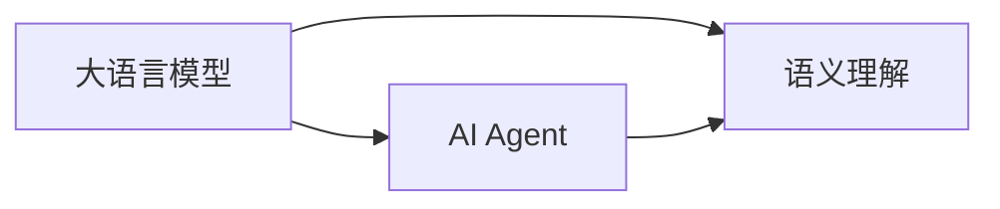
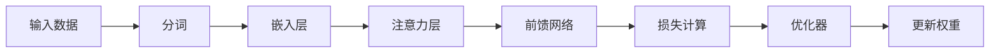

                 


# 《LLM支持的AI Agent语义理解优化》

---

## 关键词：大语言模型（LLM）、AI Agent、语义理解、自然语言处理（NLP）、人机交互

---

## 摘要

本文深入探讨了如何利用大语言模型（LLM）优化AI Agent的语义理解能力。通过分析当前AI Agent语义理解的挑战，结合LLM的技术优势，提出了一套基于LLM的优化方案。文章详细解释了LLM与AI Agent的关系，分析了语义理解的核心算法原理，并通过实际案例展示了如何在项目中实现这一优化。最后，本文总结了最佳实践和未来研究方向，为AI Agent的语义理解优化提供了理论和实践指导。

---

## 正文

### 第1章: 问题背景与描述

#### 1.1 问题背景

随着人工智能技术的飞速发展，AI Agent（智能代理）在各个领域的应用日益广泛。AI Agent能够通过自然语言处理技术与用户进行交互，理解用户意图并执行相应操作。然而，当前的语义理解技术在复杂场景下仍存在诸多挑战，如语义模糊、上下文理解不足以及多轮对话能力有限等问题。这些问题直接影响了AI Agent的用户体验和效率。

#### 1.2 问题描述

AI Agent的语义理解核心在于准确识别用户的意图和需求。传统的自然语言处理技术在处理复杂语义时表现有限，而大语言模型（LLM）凭借其强大的上下文理解和生成能力，为AI Agent的语义理解优化提供了新的可能性。本文将探讨如何将LLM与AI Agent结合，优化其语义理解能力。

#### 1.3 解决方法

通过引入大语言模型，我们可以显著提升AI Agent的语义理解能力。具体方法包括：

1. **模型增强**：利用LLM的预训练参数优化AI Agent的语义解析模块。
2. **上下文关联**：通过LLM的上下文理解能力，增强多轮对话的连贯性。
3. **意图识别**：结合LLM的生成能力，提高用户意图识别的准确率。

#### 1.4 边界和外延

本文主要聚焦于LLM在AI Agent语义理解中的应用，边界包括：

- 仅考虑文本交互，不涉及语音或图像输入。
- 专注于优化语义理解，不涉及后端操作逻辑的优化。

### 第2章: 核心概念与联系

#### 2.1 LLM与AI Agent的关系

- **LLM的基本概念与特点**：
  - 基于Transformer架构，支持大规模数据训练。
  - 具备强大的上下文理解和生成能力。

- **AI Agent的核心功能与架构**：
  - 通过NLP技术与用户交互。
  - 包括意图识别、信息检索和任务执行模块。

- **LLM如何赋能AI Agent的语义理解**：
  - 提供更准确的意图识别能力。
  - 增强上下文关联理解，提升多轮对话体验。

#### 2.2 核心概念对比与分析

##### 表2-1: LLM与传统NLP技术对比

| 对比维度       | LLM                     | 传统NLP技术               |
|----------------|-------------------------|---------------------------|
| 模型结构       | 基于Transformer         | 基于RNN或CNN               |
| 训练数据       | 大规模多样化数据       | 任务特定数据               |
| 性能表现       | 高准确性，强上下文理解 | 受限于数据和任务范围       |
| 灵活性         | 高，适用于多种任务     | 较低，针对特定任务优化     |

##### 表2-2: AI Agent与传统任务型对话系统的对比

| 对比维度       | AI Agent               | 传统任务型对话系统         |
|----------------|-----------------------|---------------------------|
| 交互方式       | 多轮交互，主动学习     | 单轮交互，被动执行         |
| 知识库         | 动态更新，知识库丰富   | 知识库有限，任务固定       |
| 适应性         | 高，可扩展性强         | 低，任务扩展性差           |

#### 2.3 实体关系图



### 第3章: LLM的算法原理

#### 3.1 模型结构

- **Transformer模型**：
  - 由编码器（Encoder）和解码器（Decoder）组成。
  - 编码器负责将输入文本转化为向量表示，解码器负责生成输出文本。

  ```mermaid
  graph LR
  Input --> Tokenizer
  Tokenizer --> Embedding
  Embedding --> Encoder-Layers
  Encoder-Layers --> Decoder-Layers
  Decoder-Layers --> Output
  ```

  - **编码器**：使用自注意力机制（Self-Attention）捕捉文本中的长距离依赖关系。
  - **解码器**：在生成输出时，利用注意力机制关注输入和已生成的部分，确保生成的文本连贯。

#### 3.2 训练方法

- **预训练**：
  - 使用大规模通用数据（如Web文本）进行无监督预训练。
  - 目标函数：最小化预测的下一个词的概率损失。

- **微调**：
  - 在特定任务（如意图识别）上使用有监督信号进行微调。
  - 目标函数：基于任务需求调整损失函数。

#### 3.3 模型训练流程图



### 第4章: LLM在AI Agent中的应用

#### 4.1 意图识别

- **意图分类模型**：
  - 使用LLM的编码器部分进行意图分类。
  - 示例：用户输入“我需要预订明天的机票”，模型识别意图是“预订机票”。

- **上下文关联**：
  - 利用LLM的解码器部分处理多轮对话，保持上下文一致。

#### 4.2 信息检索

- **基于LLM的知识库检索**：
  - 将问题输入LLM，生成相关的检索关键词。
  - 示例：用户问“最近有哪些科技新闻？”，模型生成关键词“AI、科技新闻”，进行检索。

### 第5章: 优化策略与实施

#### 5.1 模型选择与调优

- **选择合适的LLM**：
  - 根据任务需求选择开源模型（如GPT-3）或训练自定义模型。

- **模型调优**：
  - 调整模型参数，优化意图识别准确率。

#### 5.2 系统架构优化

- **分层架构设计**：
  - **前端**：处理用户输入，解析基本语义。
  - **后端**：调用LLM进行深度语义分析，生成执行指令。

### 第6章: 项目实战

#### 6.1 环境安装

- **Python 3.8+**
- **安装库**：
  ```bash
  pip install transformers torch
  ```

#### 6.2 核心代码实现

```python
from transformers import AutoTokenizer, AutoModelForCausalLM
import torch

tokenizer = AutoTokenizer.from_pretrained('gpt2')
model = AutoModelForCausalLM.from_pretrained('gpt2')

def generate_response(prompt):
    inputs = tokenizer.encode(prompt, return_tensors='pt')
    outputs = model.generate(inputs, max_length=50, num_beams=5)
    response = tokenizer.decode(outputs[0], skip_special_tokens=True)
    return response

# 示例：生成回答
print(generate_response("What is AI?"))
```

#### 6.3 实际案例分析

- **案例1**：用户询问“今天天气怎么样？”
  - **LLM处理**：结合天气API，生成回答“今天天气晴朗，温度在20℃左右。”
- **案例2**：多轮对话场景
  - **用户**：我需要预订明天的机票。
  - **系统**：请问您是从哪里出发？（LLM生成回复）
  - **用户**：上海。
  - **系统**：请问您目的地是哪里？（LLM生成回复）
  - **用户**：北京。
  - **系统**：已为您找到从上海到北京的机票，明天上午10点的航班，价格为1000元。

### 第7章: 最佳实践与总结

#### 7.1 最佳实践

- **数据质量**：确保训练数据的多样性和高质量。
- **模型调优**：根据具体任务调整模型参数，提升性能。
- **系统集成**：将LLM与现有系统无缝集成，优化交互流程。

#### 7.2 小结

通过本文的探讨，我们了解了如何利用大语言模型优化AI Agent的语义理解能力。从背景分析到算法实现，再到项目实战，详细展示了LLM在AI Agent中的应用潜力和具体实施方法。

#### 7.3 注意事项

- **数据隐私**：在处理用户数据时，需遵守相关隐私保护法规。
- **模型性能**：根据实际需求选择合适的模型大小，平衡性能与资源消耗。

#### 7.4 拓展阅读

- 建议深入学习大语言模型的内部机制，探索更多应用场景。
- 关注最新的研究成果，如LLM的可解释性优化和实时推理技术。

---

### 作者

作者：AI天才研究院 & 禅与计算机程序设计艺术

---

通过本文的详细阐述，读者可以全面理解如何利用大语言模型优化AI Agent的语义理解能力，并通过实际案例掌握具体的实现方法。希望本文能为相关领域的研究和实践提供有价值的参考。

