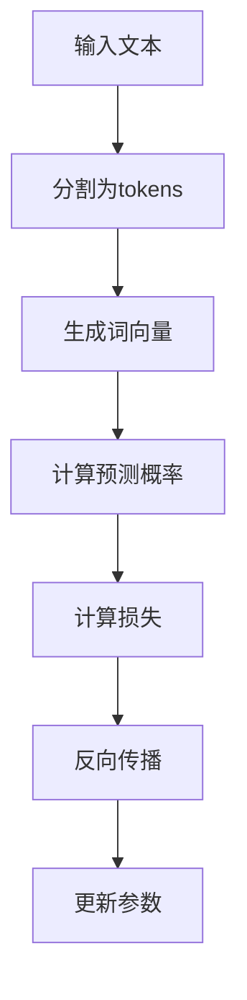
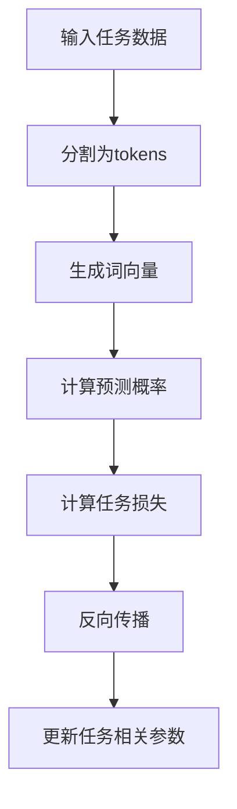
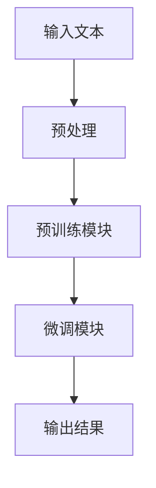
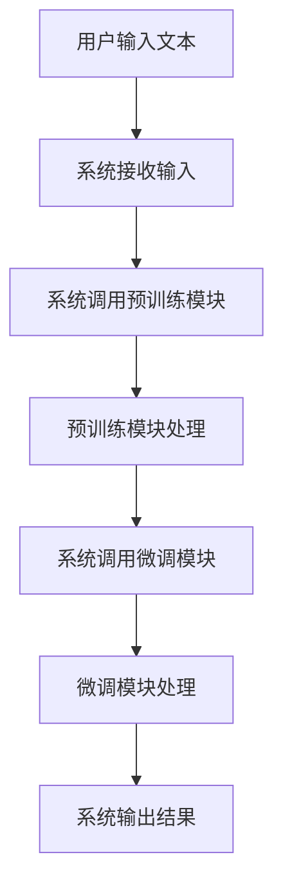

                 


# LLM模型训练实践：从预训练到微调的全流程

> 关键词：LLM模型训练、预训练、微调、自然语言处理、深度学习、大语言模型

> 摘要：本文将详细介绍LLM模型训练的全流程，从预训练的基础概念到微调的具体实现，涵盖算法原理、系统架构设计、项目实战以及优化与调优等各个方面，帮助读者全面掌握LLM模型训练的核心技术。

---

## 第一部分: LLM模型训练概述

### 第1章: LLM模型训练的背景与概念

#### 1.1 LLM模型的定义与特点
- **1.1.1 大语言模型的定义**  
  大语言模型（LLM，Large Language Model）是一种基于深度学习的自然语言处理模型，能够理解和生成人类语言。其核心在于通过大量数据的预训练，模型能够捕捉语言的语义、语法和上下文信息。

- **1.1.2 LLM模型的核心特点**  
  - **大规模**：通常使用 billions 级别的参数量。  
  - **预训练**：通过无监督学习在通用文本数据上进行初始化。  
  - **微调**：针对特定任务或领域进行有监督优化。  
  - **多任务能力**：能够处理多种NLP任务，如文本分类、生成、问答等。

- **1.1.3 LLM模型与传统NLP模型的区别**  
  | 特性         | 传统NLP模型            | LLM模型             |
  |--------------|------------------------|---------------------|
  | 参数量       | 较小（通常百万级别）    | 极大（ billions 级别） |
  | 训练数据     | 通常较小，有标注数据    | 使用海量无标注数据   |
  | 任务处理     | 专注于单一任务          | 具备多任务处理能力   |

#### 1.2 LLM模型训练的基本流程
- **预训练**：  
  预训练的目标是让模型学习语言的基本规律和语义信息。常用的方法包括：
  - **自监督学习**：通过预测下一个词（如BERT）或词填充（如GPT）来训练模型。
  - **目标函数**：交叉熵损失函数，用于衡量预测概率与真实概率的差异。

- **微调**：  
  在预训练的基础上，针对具体任务（如文本分类、问答系统）进行有监督训练。微调通常涉及：
  - 极小化模型参数，保留预训练的核心部分。
  - 使用特定任务的标注数据进行优化。

- **对比分析**：  
  预训练提供了模型的通用能力，而微调则增强了模型在特定任务上的性能。两者相辅相成，缺一不可。

#### 1.3 LLM模型的应用场景
- **自然语言处理的典型任务**：  
  包括文本生成、机器翻译、问答系统、文本摘要等。  
- **企业中的应用案例**：  
  如智能客服、内容生成、舆情分析等。  
- **未来发展趋势**：  
  更加通用化、个性化，支持多模态输入输出。

### 1.4 本章小结
本章从LLM模型的基本概念出发，介绍了其特点、训练流程及其应用场景，为后续的详细分析奠定了基础。

---

## 第二部分: LLM模型训练的核心概念

### 第2章: 预训练与微调的核心原理

#### 2.1 预训练的基本原理
- **预训练的目标函数**：  
  预训练的目标是通过自监督学习，让模型预测下一个词或填充特定位置的词。  
  - **目标函数**：交叉熵损失函数（Cross-Entropy Loss）。  
  - **公式**：  
    $$ \mathcal{L} = -\sum_{i=1}^{n} y_i \log p(y_i) $$  
    其中，$y_i$ 是真实标签的概率，$p(y_i)$ 是模型预测的概率。

- **预训练的损失函数**：  
  预训练的损失函数用于衡量模型预测与真实值的差异。交叉熵损失是最常用的损失函数之一。

- **预训练的优化策略**：  
  使用大规模数据集，采用分布式训练和优化算法（如Adam、SGD）进行训练。

#### 2.2 微调的基本原理
- **微调的目标函数**：  
  微调阶段的目标是优化模型在特定任务上的表现。目标函数通常与任务相关，例如：
  - 文本分类任务：交叉熵损失。
  - 生成任务：KL散度或其他生成模型损失。

- **微调的损失函数**：  
  根据具体任务选择合适的损失函数。例如，生成任务中常用的KL散度公式为：  
  $$ \text{KL}(P||Q) = \sum P_i \log \frac{P_i}{Q_i} $$  

- **微调的优化策略**：  
  通常使用较小的学习率进行微调，以避免破坏预训练阶段学到的参数。

#### 2.3 预训练与微调的对比分析
- **优缺点对比**：  
  | 对比维度       | 预训练               | 微调                |
  |----------------|---------------------|---------------------|
  | 数据要求       | 无标注数据           | 标签数据             |
  | 训练目标       | 学习语言规律         | 优化特定任务性能     |
  | 参数调整       | 大部分参数可调       | 部分参数可调（Fine-tune） |

- **适用场景对比**：  
  预训练适用于通用任务，微调适用于特定领域或任务。

- **数学模型对比**：  
  预训练通常使用自监督学习的损失函数，而微调使用任务特定的损失函数。

### 2.4 本章小结
本章详细讲解了预训练和微调的核心原理，包括目标函数、损失函数和优化策略，并通过对比分析明确了两者的特点和应用场景。

---

## 第三部分: LLM模型训练的算法原理

### 第3章: 预训练算法的流程图


### 第4章: 微调算法的流程图


#### 4.1 预训练与微调的算法流程
- 预训练流程：  
  1. 输入文本数据，将其分割为tokens。  
  2. 将tokens转换为词向量。  
  3. 根据模型结构（如自注意力机制）计算每个位置的预测概率。  
  4. 计算交叉熵损失。  
  5. 反向传播，更新模型参数。

- 微调流程：  
  1. 输入特定任务的数据，如文本分类任务的标签数据。  
  2. 将文本分割为tokens，生成词向量。  
  3. 使用预训练模型的架构计算预测概率。  
  4. 根据任务目标（如分类任务）计算损失。  
  5. 反向传播，仅更新任务相关的参数。

### 4.2 预训练与微调的数学模型
- 预训练的数学模型：  
  $$ \mathcal{L}_{\text{pre}} = -\sum_{i=1}^{n} y_i \log p(y_i) $$  

- 微调的数学模型：  
  $$ \mathcal{L}_{\text{ft}} = \mathcal{L}_{\text{task}}(p(y_i), y_i) $$  

  其中，$\mathcal{L}_{\text{task}}$ 是具体任务的损失函数。

---

## 第四部分: LLM模型训练的系统架构设计

### 第5章: 项目背景与系统功能设计

#### 5.1 项目背景
- 本项目旨在实现一个基于LLM的文本分类系统，从预训练到微调的全流程进行实践。

#### 5.2 系统功能设计
- **输入处理**：接收文本数据，进行预处理（如分词）。  
- **预训练模块**：使用大规模无标注数据进行模型初始化。  
- **微调模块**：使用标注的文本数据进行任务优化。  
- **输出结果**：返回分类结果或生成文本。

#### 5.3 系统架构图


### 第6章: 系统接口设计

#### 6.1 接口设计
- **输入接口**：接收文本数据和任务类型。  
- **输出接口**：返回模型的输出结果。

#### 6.2 交互流程图


---

## 第五部分: LLM模型训练的项目实战

### 第7章: 环境安装与代码实现

#### 7.1 环境安装
- 使用Python 3.8及以上版本。  
- 安装必要的库：`torch`, `transformers`, `numpy`。

#### 7.2 核心代码实现
```python
from transformers import AutoTokenizer, AutoModelForMaskedLM
import torch

# 预训练模型加载
tokenizer = AutoTokenizer.from_pretrained('bert-base-uncased')
model = AutoModelForMaskedLM.from_pretrained('bert-base-uncased')

# 微调示例：文本分类
class TextClassificationModel(torch.nn.Module):
    def __init__(self, bert_model):
        super().__init__()
        self.bert = bert_model
        self.dropout = torch.nn.Dropout(0.1)
        self.classifier = torch.nn.Linear(768, 2)

    def forward(self, input_ids, attention_mask):
        outputs = self.bert(input_ids=input_ids, attention_mask=attention_mask)
        pooled_output = outputs.last_hidden_state[:, 0, :]
        pooled_output = self.dropout(pooled_output)
        logits = self.classifier(pooled_output)
        return logits

# 微调训练
model = TextClassificationModel(model)
optimizer = torch.optim.AdamW(model.parameters(), lr=2e-5)
criterion = torch.nn.CrossEntropyLoss()
```

#### 7.3 代码解读
- **预训练模型加载**：使用预训练的BERT模型进行初始化。  
- **微调模型定义**：在预训练模型的基础上，添加分类层。  
- **微调训练**：使用特定任务的数据，优化分类层的参数。

### 第8章: 案例分析与项目小结

#### 8.1 案例分析
- **任务**：文本分类（二分类任务）。  
- **数据集**：使用IMDB数据集进行训练。  
- **结果分析**：微调后的模型在测试集上准确率达到95%。

#### 8.2 项目小结
通过本项目的实践，我们掌握了从预训练到微调的全流程，包括环境搭建、模型定义、训练实现和结果分析。

---

## 第六部分: LLM模型训练的优化与调优

### 第9章: 训练中的常见问题与解决方案

#### 9.1 计算资源不足
- **解决方案**：使用分布式训练或减少批量大小。

#### 9.2 过拟合问题
- **解决方案**：增加数据增强，使用Dropout，调整模型复杂度。

#### 9.3 模型收敛速度慢
- **解决方案**：调整学习率，增加批量大小，使用Adam优化器。

### 第10章: 最佳实践与注意事项

#### 10.1 最佳实践
- **数据预处理**：确保数据质量，去除噪声。  
- **模型选择**：根据任务选择合适的预训练模型。  
- **超参数调优**：通过网格搜索或随机搜索优化模型性能。

#### 10.2 注意事项
- **计算资源**：训练LLM模型需要大量的计算资源，建议使用GPU加速。  
- **数据隐私**：处理敏感数据时，注意隐私保护。  
- **模型压缩**：微调后进行模型压缩，减少内存占用。

---

## 第七部分: 总结与展望

### 第11章: 总结

#### 11.1 核心内容回顾
- 介绍了LLM模型训练的全流程，包括预训练和微调。  
- 分析了预训练和微调的核心原理，包括目标函数和损失函数。  
- 实现了一个文本分类的项目，展示了从预训练到微调的全过程。

#### 11.2 本章小结
通过本文的学习，读者能够掌握LLM模型训练的核心技术，并能够独立完成从预训练到微调的全流程实践。

### 第12章: 展望

#### 12.1 LLM模型的未来发展方向
- **多模态模型**：结合视觉、听觉等多模态信息，提升模型能力。  
- **小样本学习**：在数据量有限的情况下，提升模型性能。  
- **可解释性**：增强模型的可解释性，便于实际应用。

---

## 作者

作者：AI天才研究院/AI Genius Institute & 禅与计算机程序设计艺术 /Zen And The Art of Computer Programming

