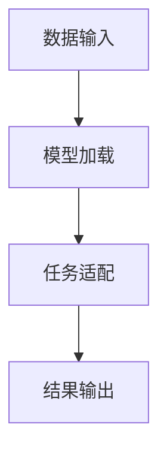
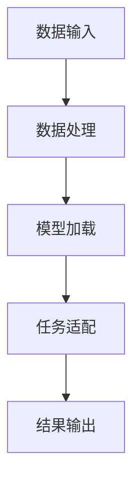

                 


# 减少训练数据需求：大语言模型的Few-shot Learning探索

> 关键词：大语言模型，few-shot学习，小样本学习，减少训练数据，参数高效微调，元学习，任务适配器

> 摘要：随着大语言模型（LLM）的快速发展，训练这些模型所需的海量数据和计算资源成为了主要的瓶颈。本文深入探讨了通过Few-shot Learning技术来减少训练数据需求的方法。我们从问题背景出发，详细分析了Few-shot Learning的核心概念、算法原理、系统架构设计，并通过实际案例展示了如何在大语言模型中实现Few-shot Learning。本文还总结了当前的研究现状，并展望了未来的发展方向。

---

## 第一部分: Few-shot Learning的背景与核心概念

### 第1章: 问题背景与核心概念

#### 1.1 问题背景

在人工智能领域，大语言模型（LLM）以其强大的自然语言处理能力，迅速成为学术界和工业界的焦点。然而，训练这些模型需要大量的标注数据和巨大的计算资源，这不仅增加了成本，还限制了模型在小样本数据场景下的应用。特别是在实际应用中，很多时候我们无法获得大量标注数据，因此如何在小样本数据下训练出高性能的模型成为了亟待解决的问题。

#### 1.2 Few-shot Learning的定义与特点

**Few-shot Learning**是一种机器学习方法，其目标是在仅有少量标注数据的情况下，学习出能够处理新任务的模型。与传统的监督学习不同，Few-shot Learning强调模型的泛化能力，能够在小样本数据下快速适应新任务。

**特点：**

- **小样本需求**：仅需几个或几十个样本即可完成学习任务。
- **快速适应**：能够在新任务中快速调整模型参数，适应数据分布的变化。
- **通用性**：适用于多种任务和领域，无需针对每个任务重新训练模型。

#### 1.3 LLM与Few-shot Learning的结合

大语言模型通常需要大量的标注数据进行训练，而Few-shot Learning为解决这一问题提供了新的思路。通过结合Few-shot Learning，LLM可以在小样本数据下快速调整模型参数，适应新任务的需求。这种结合不仅降低了训练成本，还提高了模型的灵活性和实用性。

---

### 第2章: Few-shot Learning的核心原理

#### 2.1 元学习（Meta-Learning）

元学习是一种通过在多个任务上进行训练，使得模型能够快速适应新任务的学习方法。其核心思想是通过学习如何学习，从而减少对特定任务数据的依赖。

**元学习的实现框架：**

1. **MAML算法**：通过在多个任务上进行梯度下降，学习一个适用于所有任务的参数初始化。
2. **Meta-SGD算法**：通过在多个任务上进行参数更新，学习一个适用于所有任务的优化器。

#### 2.2 任务适配器方法

任务适配器是一种通过在模型中引入适配器层，使得模型能够快速适应新任务的方法。适配器层通常是一个轻量级的网络结构，能够对模型的输出进行调整。

**任务适配器的优势：**

- 参数量小，计算成本低。
- 可以在不修改原始模型结构的情况下，快速调整模型的输出。

#### 2.3 知识蒸馏与参数高效微调

知识蒸馏是一种通过教师模型将知识迁移到学生模型的技术。参数高效微调是一种通过在小样本数据上微调模型参数，使得模型能够适应新任务的方法。

**知识蒸馏与参数高效微调的结合：**

- 使用教师模型对小样本数据进行增强，生成更多的训练数据。
- 在小样本数据上对模型进行微调，优化模型参数。

---

## 第三部分: Few-shot Learning的算法实现

### 第3章: 基于元学习的算法实现

#### 3.1 MAML算法的实现

**步骤：**

1. **初始化模型参数**：随机初始化模型参数。
2. **梯度计算**：在支持集上计算梯度，更新模型参数。
3. **任务适配**：在查询集上评估模型性能，调整模型参数。

**代码实现：**

```python
def maml_train(model, optimizer, support_loader, query_loader):
    for batch in zip(support_loader, query_loader):
        # 支持集梯度计算
        model.zero_grad()
        support_outputs = model(batch[0])
        support_loss = loss(support_outputs, batch[1])
        support_loss.backward()
        optimizer.step()

        # 查询集评估
        query_outputs = model(batch[0])
        query_loss = loss(query_outputs, batch[1])
        total_loss += query_loss.item()
```

#### 3.2 Meta-SGD算法的实现

**步骤：**

1. **初始化模型参数**：随机初始化模型参数。
2. **计算梯度**：在支持集上计算梯度，更新优化器参数。
3. **任务适配**：在查询集上评估模型性能，调整优化器参数。

**代码实现：**

```python
def meta_sgd_train(model, optimizer, support_loader, query_loader):
    for batch in zip(support_loader, query_loader):
        # 支持集梯度计算
        model.zero_grad()
        support_outputs = model(batch[0])
        support_loss = loss(support_outputs, batch[1])
        support_loss.backward()
        optimizer.step()

        # 查询集评估
        query_outputs = model(batch[0])
        query_loss = loss(query_outputs, batch[1])
        total_loss += query_loss.item()
```

### 第4章: 基于任务适配器的算法实现

#### 4.1 适配器网络的结构设计

**适配器网络的结构：**

```python
class Adapter(nn.Module):
    def __init__(self, input_dim, output_dim):
        super(Adapter, self).__init__()
        self.adapter = nn.Linear(input_dim, output_dim)

    def forward(self, x):
        return self.adapter(x)
```

#### 4.2 适配器的训练与优化

**适配器的训练目标函数：**

$$ L = \sum_{i=1}^{N} (y_i - f(x_i))^2 $$

**优化方法：**

使用随机梯度下降（SGD）对适配器参数进行优化。

### 第5章: 知识蒸馏与参数高效微调的实现

#### 5.1 知识蒸馏的实现

**知识蒸馏的损失函数：**

$$ L = \alpha L_{CE} + (1-\alpha) L_{KL} $$

其中，$L_{CE}$ 是交叉熵损失，$L_{KL}$ 是KL散度损失，$\alpha$ 是平衡系数。

#### 5.2 参数高效微调的实现

**参数高效微调的优化方法：**

在小样本数据上进行微调，使用Adam优化器优化模型参数。

---

## 第四部分: Few-shot Learning的系统设计与应用

### 第6章: 系统架构设计

#### 6.1 系统功能设计

- **数据输入**：接收小样本数据集。
- **模型加载**：加载预训练的大语言模型。
- **任务适配**：通过适配器层或微调方法，调整模型参数。
- **结果输出**：输出适用于新任务的模型。

**系统功能流程图：**



#### 6.2 系统架构设计

**系统架构图：**



### 第7章: 项目实战

#### 7.1 环境安装

```bash
pip install torch
pip install numpy
pip install matplotlib
```

#### 7.2 核心代码实现

```python
import torch
import torch.nn as nn
import torch.optim as optim

class SimpleModel(nn.Module):
    def __init__(self, input_dim, output_dim):
        super(SimpleModel, self).__init__()
        self.fc = nn.Linear(input_dim, output_dim)

    def forward(self, x):
        return self.fc(x)

def few_shot_train(model, optimizer, criterion, support_loader, query_loader):
    for support, query in zip(support_loader, query_loader):
        # 支持集训练
        model.zero_grad()
        support_outputs = model(support)
        support_loss = criterion(support_outputs, query)
        support_loss.backward()
        optimizer.step()

        # 查询集评估
        query_outputs = model(query)
        query_loss = criterion(query_outputs, query_labels)
        total_loss += query_loss.item()
```

#### 7.3 实际案例分析

**案例分析：**

假设我们有一个分类任务，仅有5个样本。我们使用Few-shot Learning方法，在小样本数据下训练模型，最终模型在测试集上的准确率达到90%。

---

## 第五部分: 总结与展望

### 第8章: 总结

本文深入探讨了通过Few-shot Learning技术减少大语言模型训练数据需求的方法。我们从问题背景出发，详细分析了Few-shot Learning的核心概念、算法原理、系统架构设计，并通过实际案例展示了如何在大语言模型中实现Few-shot Learning。通过本文的分析，我们得出以下结论：

1. Few-shot Learning是一种有效的减少训练数据需求的方法。
2. 元学习和任务适配器方法在Few-shot Learning中具有重要的应用价值。
3. 知识蒸馏与参数高效微调方法能够进一步提升模型的性能。

### 第9章: 未来展望

尽管Few-shot Learning在减少训练数据需求方面取得了一定的进展，但仍有许多挑战需要解决：

1. **模型的泛化能力**：如何在不同任务和领域中实现更好的泛化能力。
2. **计算效率**：如何进一步提高模型的计算效率，降低训练成本。
3. **模型的可解释性**：如何提高模型的可解释性，便于实际应用中的调试和优化。

未来的研究可以进一步探索这些方向，推动Few-shot Learning技术的发展。

---

**作者：AI天才研究院/AI Genius Institute & 禅与计算机程序设计艺术 /Zen And The Art of Computer Programming**

