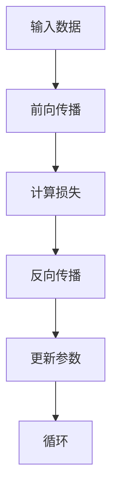
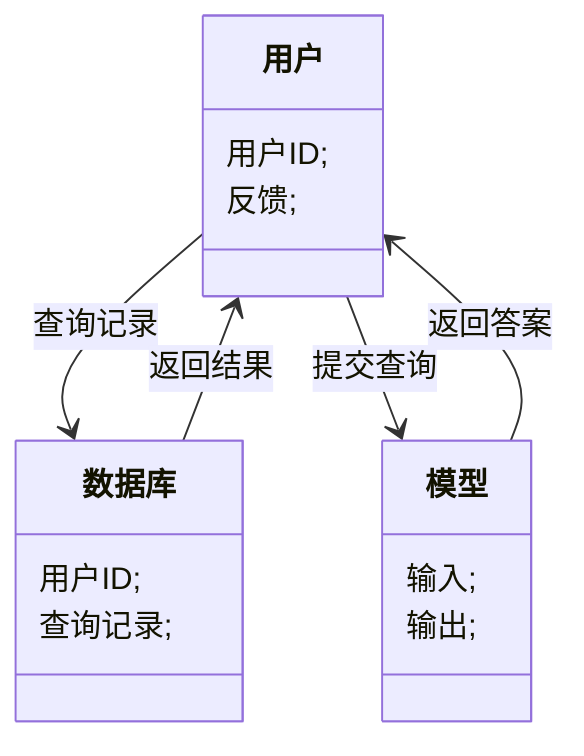
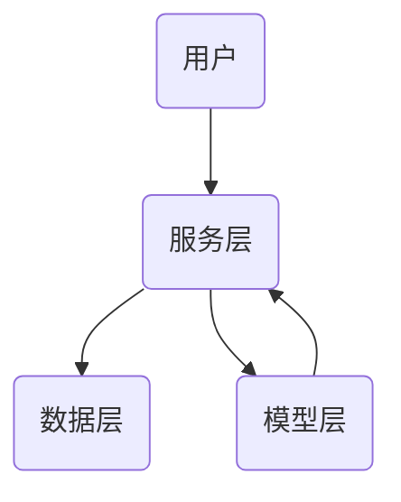

                 


# LLM的微调与适应：针对特定用户群优化

---

## 关键词：
- 大语言模型（LLM）
- 微调（Fine-tuning）
- 用户需求适应
- 基于反馈的优化
- 领域特定模型

---

## 摘要：
本文详细探讨了大语言模型（LLM）在不同用户群体中的微调与适应方法。通过分析用户需求的多样性，提出了一种基于反馈的微调策略，并结合具体案例展示了如何优化模型以满足特定用户群的需求。文章从理论到实践，结合数学公式、算法流程图和代码实现，为读者提供了全面的技术指导。

---

## 第1章: 大语言模型（LLM）概述

### 1.1 什么是大语言模型
大语言模型（LLM）是一种基于深度学习的自然语言处理模型，通过大量数据训练，能够理解和生成人类语言。其核心特点包括：
- **大规模训练**：通常使用海量文本数据进行预训练。
- **多任务能力**：能够处理多种自然语言处理任务，如文本生成、问答系统、翻译等。
- **上下文理解**：能够捕捉上下文信息，生成连贯的文本。

### 1.2 微调与适应的必要性
随着LLM的应用场景越来越广泛，不同用户群体对模型的需求也存在显著差异。例如：
- **医疗领域**：需要准确理解专业术语和医疗场景。
- **金融领域**：需要处理复杂的金融数据和风险评估。
- **普通用户**：注重生成内容的通俗易懂和创意性。

因此，微调和适应是必要的，以确保模型在特定领域或用户群体中表现出色。

---

## 第2章: 微调与适应的核心概念

### 2.1 微调（Fine-tuning）的原理与方法
微调是指在预训练好的模型基础上，使用特定领域的数据进行进一步训练。其核心思想是通过调整模型参数，使模型适应特定任务或领域。

#### 2.1.1 参数微调
- **定义**：调整模型的权重参数，使模型更擅长处理特定任务。
- **方法**：通过反向传播算法，最小化损失函数，优化模型参数。
- **公式**：损失函数通常采用交叉熵损失：
  $$ \text{Loss} = -\sum_{i=1}^{n} y_i \log(p_i) + (1-y_i)\log(1-p_i) $$
  其中，\( y_i \) 是真实标签，\( p_i \) 是模型预测的概率。

#### 2.1.2 非参数微调
- **定义**：不调整模型权重，而是通过预处理或后处理的方式调整模型行为。
- **方法**：例如，对输入数据进行特定领域词替换，或对输出结果进行关键词过滤。

### 2.2 适应特定用户群的需求
适应用户需求的关键在于理解用户的使用场景和反馈。例如：
- **用户反馈**：通过用户对模型输出的反馈，调整模型生成策略。
- **领域特定优化**：针对特定领域，设计专门的训练数据和评估指标。

---

## 第3章: LLM微调与适应的算法原理

### 3.1 微调算法的数学模型与公式
微调的核心是通过优化损失函数，调整模型参数。以下是一个典型的微调过程的流程图：



数学模型方面，假设我们有一个简单的二分类任务，损失函数为：
$$ \text{Loss} = \frac{1}{n}\sum_{i=1}^{n} \text{CrossEntropy}(y_i, p_i) $$

其中，\( y_i \) 是真实标签，\( p_i \) 是模型预测的概率。

### 3.2 基于反馈的优化
用户反馈是优化模型的重要来源。例如，用户对模型输出的满意度评分可以用来调整生成策略。反馈机制可以通过强化学习来实现：

1. **输入数据**：用户查询。
2. **模型生成**：生成多个候选答案。
3. **用户反馈**：用户选择最佳答案。
4. **奖励机制**：根据用户反馈调整生成策略。

---

## 第4章: 系统分析与架构设计方案

### 4.1 项目介绍
以医疗咨询系统为例，设计一个基于LLM的医疗问答系统。系统需要满足医生和患者的不同需求。

### 4.2 系统功能设计
以下是系统的功能模块：


### 4.3 系统架构设计
以下是系统架构图：


---

## 第5章: 项目实战

### 5.1 环境安装
- **Python**：3.8+
- **TensorFlow**或**PyTorch**：2.5+

### 5.2 核心实现
以下是一个简单的微调代码示例：

```python
import torch
import torch.nn as nn

class SimpleModel(nn.Module):
    def __init__(self, input_dim, output_dim):
        super(SimpleModel, self).__init__()
        self.fc = nn.Linear(input_dim, output_dim)
    
    def forward(self, x):
        return self.fc(x)

# 初始化模型
input_dim = 100
output_dim = 2
model = SimpleModel(input_dim, output_dim)

# 定义损失函数和优化器
criterion = nn.CrossEntropyLoss()
optimizer = torch.optim.Adam(model.parameters(), lr=0.001)

# 微调过程
for epoch in range(num_epochs):
    for inputs, labels in dataloader:
        outputs = model(inputs)
        loss = criterion(outputs, labels)
        loss.backward()
        optimizer.step()
```

### 5.3 案例分析
以医疗咨询系统为例，假设我们有一个包含1000条医疗咨询记录的数据集。我们需要将数据集分为训练集和测试集，分别用于微调和评估。

---

## 第6章: 最佳实践与注意事项

### 6.1 小结
- **微调**：调整模型参数以适应特定任务。
- **适应**：根据用户反馈优化模型行为。

### 6.2 注意事项
- **数据质量**：确保微调数据的质量和相关性。
- **计算资源**：微调需要大量计算资源，建议使用GPU加速。
- **模型评估**：在微调后，通过测试集评估模型性能。

### 6.3 拓展阅读
- 建议阅读《Deep Learning》（Ian Goodfellow等著）了解更多深度学习知识。
- 关注最新的微调方法，如Adapter-based Fine-tuning。

---

## 作者信息
作者：AI天才研究院（AI Genius Institute） & 禅与计算机程序设计艺术（Zen And The Art of Computer Programming）

---

通过以上内容，我们详细探讨了LLM的微调与适应方法，从理论到实践，为读者提供了全面的技术指导。希望本文能为相关领域的研究和应用提供有价值的参考。

