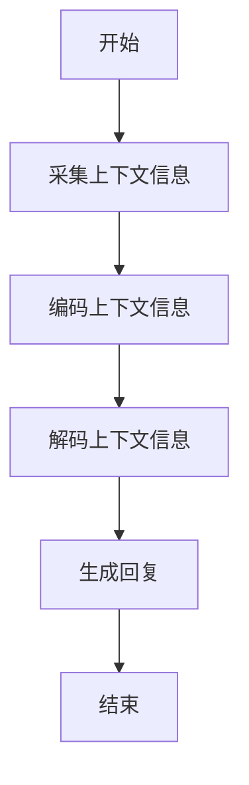
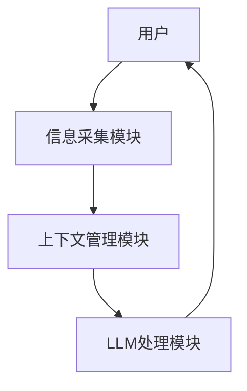
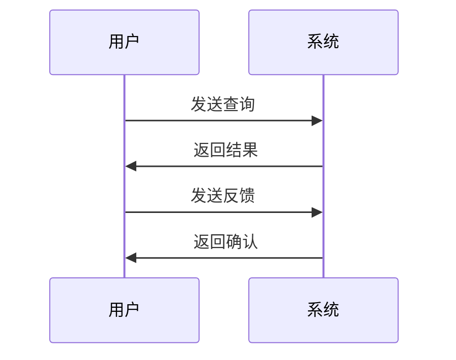

                 


```markdown
# LLM驱动的AI Agent上下文管理技术

> 关键词：LLM、AI Agent、上下文管理、自然语言处理、人工智能、智能体

> 摘要：本文深入探讨了大语言模型（LLM）驱动的AI Agent上下文管理技术。首先介绍了LLM和AI Agent的基本概念，接着详细分析了上下文管理的核心概念与实现原理。然后，从算法、数学模型、系统架构等多个角度详细阐述了LLM驱动的上下文管理技术，并通过实际案例展示了如何在项目中应用这些技术。最后，总结了当前技术的优缺点，并展望了未来的发展方向，为读者提供了全面的技术参考。

---

## 第一部分: LLM与AI Agent概述

### 第1章: LLM的基本概念

#### 1.1 大语言模型的定义
大语言模型（LLM）是指经过大量数据训练的深度学习模型，能够理解和生成自然语言文本。例如，GPT-3、BERT等模型都属于大语言模型。

#### 1.2 LLM的核心特点
- **大规模训练**：基于海量数据训练，具有强大的语义理解能力。
- **自注意力机制**：通过自注意力机制捕捉文本中的长距离依赖关系。
- **多任务适应性**：可以适应多种不同的自然语言处理任务。

#### 1.3 LLM的应用场景
- **文本生成**：用于内容创作、对话生成等。
- **问答系统**：用于智能问答、知识检索等。
- **文本理解**：用于信息提取、情感分析等。

### 第2章: AI Agent的基本概念

#### 2.1 AI Agent的定义
AI Agent是一种智能实体，能够感知环境并执行任务，以实现特定目标。AI Agent可以是软件程序，也可以是物理机器人。

#### 2.2 AI Agent的分类
- **简单反射型**：基于预定义规则执行任务。
- **基于模型的反应型**：基于环境模型做出决策。
- **基于目标的**：根据目标和环境信息自主决策。
- **基于效用的**：通过效用函数优化决策。

#### 2.3 AI Agent的应用领域
- **智能家居**：控制家电，提供生活便利。
- **智能助手**：如Siri、Alexa等。
- **自动驾驶**：通过感知和决策实现自动驾驶。

### 第3章: LLM驱动的AI Agent上下文管理技术

#### 3.1 技术背景
随着AI Agent的应用越来越广泛，如何有效管理上下文信息成为关键。LLM的引入为上下文管理提供了强大的自然语言处理能力。

#### 3.2 技术目标
- 提供连贯的对话体验。
- 实现高效的上下文信息处理。
- 支持多轮对话的上下文记忆。

#### 3.3 技术实现
通过LLM处理上下文信息，结合AI Agent的执行能力，实现动态的上下文管理。

---

## 第二部分: 上下文管理的核心概念

### 第4章: 上下文管理的实现原理

#### 4.1 上下文信息的采集
- **用户输入**：收集用户的自然语言输入。
- **系统反馈**：记录系统对用户的响应。
- **环境数据**：获取环境中的相关信息。

#### 4.2 上下文信息的存储
- **内存存储**：使用数据结构存储当前上下文。
- **持久化存储**：将上下文信息持久化，支持断点续传。

#### 4.3 上下文信息的处理
- **信息提取**：从上下文中提取关键信息。
- **信息关联**：建立信息之间的关联关系。
- **信息更新**：根据新信息更新上下文内容。

### 第5章: LLM与上下文管理的结合

#### 5.1 LLM在上下文管理中的作用
- **语义理解**：通过LLM理解用户的意图。
- **上下文关联**：利用LLM处理上下文信息的关联性。
- **动态更新**：根据上下文信息动态调整模型输出。

#### 5.2 上下文管理对LLM的优化
- **上下文-aware**：增强模型对上下文的感知能力。
- **动态调整**：根据上下文信息动态调整模型参数。
- **多轮对话支持**：支持多轮对话中的上下文记忆。

---

## 第三部分: 算法原理与数学模型

### 第6章: 上下文管理的算法实现

#### 6.1 上下文编码与解码
- **编码过程**：将上下文信息编码为模型可理解的形式。
- **解码过程**：从编码后的信息生成自然语言回复。

#### 6.2 算法流程


#### 6.3 数学模型
- **编码函数**：\( f_{encode}(x) = xW_e \)
- **解码函数**：\( f_{decode}(y) = yW_d \)
- **损失函数**：\( L = \sum_{i=1}^{n} (y_i - \hat{y}_i)^2 \)

### 第7章: 数学模型与公式

#### 7.1 编码与解码的数学表示
- 编码矩阵：
$$ W_e = \begin{bmatrix}
1 & 0 \\
0 & 1 \\
\end{bmatrix} $$
- 解码矩阵：
$$ W_d = \begin{bmatrix}
0 & 1 \\
1 & 0 \\
\end{bmatrix} $$

#### 7.2 损失函数的优化
- 梯度下降：
$$ \theta_{new} = \theta - \eta \cdot \nabla L $$

---

## 第四部分: 系统设计与架构

### 第8章: 系统架构设计

#### 8.1 系统功能设计
- **信息采集模块**：采集用户输入和系统反馈。
- **上下文管理模块**：处理和存储上下文信息。
- **LLM处理模块**：利用LLM生成回复。

#### 8.2 系统架构图


#### 8.3 接口设计
- **输入接口**：接收用户输入和系统反馈。
- **输出接口**：输出生成的回复和上下文信息。

#### 8.4 交互设计


---

## 第五部分: 项目实战

### 第9章: 项目实战

#### 9.1 环境安装
- 安装Python和必要的库：
  ```bash
  pip install python-transformers
  pip install torch
  ```

#### 9.2 核心代码实现
```python
import torch
from transformers import AutoTokenizer, AutoModelForCausalLM

class ContextManager:
    def __init__(self):
        self.tokenizer = AutoTokenizer.from_pretrained('gpt2')
        self.model = AutoModelForCausalLM.from_pretrained('gpt2')
    
    def encode_context(self, context):
        inputs = self.tokenizer(context, return_tensors='pt')
        return inputs
    
    def decode_context(self, encoded_context):
        outputs = self.model.generate(encoded_context.input_ids, max_length=10)
        return self.tokenizer.decode(outputs[0])
```

#### 9.3 代码解读与分析
- **编码模块**：将上下文信息编码为模型可理解的形式。
- **解码模块**：根据编码后的信息生成回复。

#### 9.4 实际案例分析
- **案例1**：用户查询天气情况。
  - 上下文：用户询问天气。
  - 回复：今天天气晴朗，适合外出。

---

## 第六部分: 总结与展望

### 第10章: 总结

#### 10.1 核心技术总结
- **上下文管理**：确保对话的连贯性。
- **LLM处理**：利用大语言模型的强大能力。
- **系统架构**：合理设计系统结构，确保高效运行。

### 第11章: 未来展望

#### 11.1 技术优化方向
- **模型优化**：提升模型的上下文处理能力。
- **多模态支持**：结合图像、语音等多模态信息。
- **实时性提升**：优化上下文管理的实时性。

#### 11.2 注意事项
- **数据隐私**：注意上下文信息的安全性。
- **系统稳定性**：确保系统的稳定运行。
- **用户体验**：优化用户体验，提升用户满意度。

---

## 作者：AI天才研究院/AI Genius Institute & 禅与计算机程序设计艺术 /Zen And The Art of Computer Programming
```

