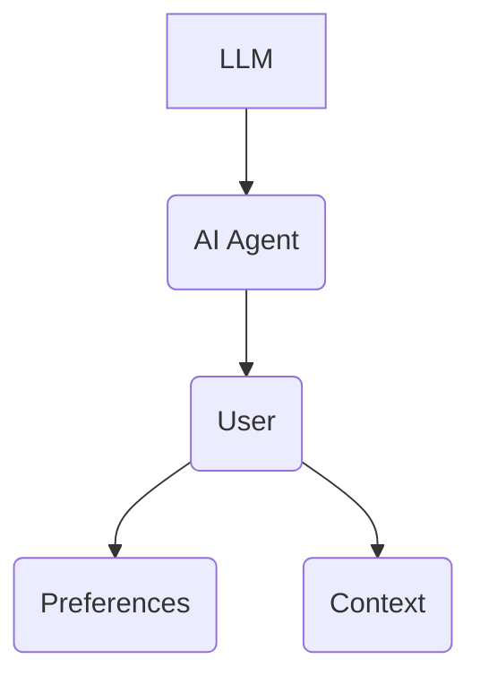
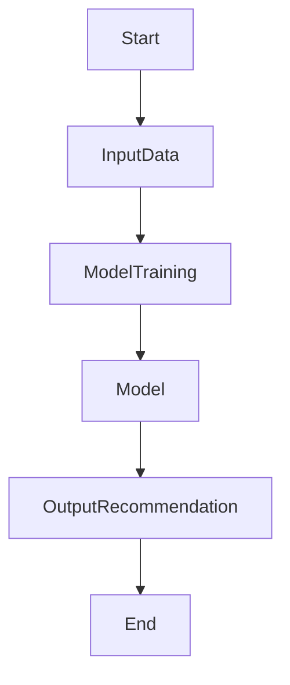
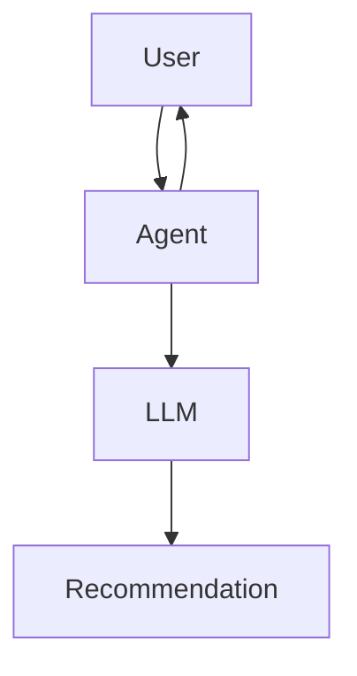

                 


# LLM驱动的AI Agent个性化：适应用户偏好

## 关键词：
- LLM（大语言模型）
- AI Agent（人工智能代理）
- 个性化推荐
- 用户偏好
- 自然语言处理
- 机器学习

## 摘要：
本文探讨如何利用大语言模型（LLM）构建个性化的AI代理，以适应用户的个性化需求。文章从背景介绍、核心概念、算法原理、系统架构到项目实战，详细分析LLM驱动AI代理的技术实现，并总结最佳实践。通过本文，读者将了解如何利用LLM构建高效、智能的个性化AI代理，满足不同用户的偏好和需求。

---

## 第一部分：背景介绍

### 第1章：LLM驱动的AI Agent概述

#### 1.1 问题背景
- **1.1.1 当前AI Agent的发展现状**
  - AI Agent的概念与应用领域
  - 当前AI Agent的技术瓶颈
  - 用户需求多样化带来的挑战

- **1.1.2 LLM在AI Agent中的作用**
  - LLM的优势与适用场景
  - LLM如何提升AI Agent的交互能力
  - LLM在个性化推荐中的应用

- **1.1.3 用户个性化需求的兴起**
  - 用户偏好的多样性
  - 个性化服务的需求增长
  - 个性化体验对用户满意度的影响

#### 1.2 问题描述
- **1.2.1 AI Agent的核心功能与挑战**
  - AI Agent的基本功能：信息检索、决策支持、任务执行
  - 个性化适配的核心问题
  - 用户偏好识别的复杂性

- **1.2.2 用户偏好的多样性与复杂性**
  - 不同用户的偏好差异
  - 用户偏好的动态变化
  - 如何准确捕捉用户偏好

- **1.2.3 LLM在个性化适配中的优势**
  - LLM的自然语言处理能力
  - LLM的上下文理解能力
  - LLM的可扩展性与灵活性

#### 1.3 问题解决
- **1.3.1 LLM驱动AI Agent的实现路径**
  - LLM与AI Agent的集成方法
  - 个性化适配的实现策略
  - 系统架构的设计思路

- **1.3.2 个性化推荐算法的应用**
  - 基于LLM的推荐模型
  - 推荐系统的评估指标
  - 推荐系统的优化方向

- **1.3.3 解决方案的可行性分析**
  - 技术可行性
  - 经济可行性
  - 社会可行性

#### 1.4 边界与外延
- **1.4.1 LLM驱动AI Agent的适用场景**
  - 适合的应用领域
  - 不适合的应用领域
  - 边界条件的定义

- **1.4.2 个性化适配的边界条件**
  - 用户偏好的明确性
  - 系统性能的限制
  - 数据隐私的问题

- **1.4.3 相关技术的对比与选择**
  - LLM与其他机器学习模型的对比
  - AI Agent与传统推荐系统的对比
  - 个性化适配技术的选择标准

#### 1.5 核心概念与要素
- **1.5.1 LLM的基本概念**
  - 大语言模型的定义
  - LLM的训练目标
  - LLM的输出形式

- **1.5.2 AI Agent的核心功能**
  - 用户需求分析
  - 个性化推荐
  - 自然语言交互

- **1.5.3 用户偏好的关键要素**
  - 用户的历史行为数据
  - 用户的偏好特征
  - 用户的实时需求

---

## 第二部分：核心概念与联系

### 第2章：LLM与AI Agent的核心原理

#### 2.1 LLM的基本原理
- **2.1.1 大语言模型的训练机制**
  - 预训练的概念与目标
  - Transformer架构的核心作用
  - 模型参数的规模与性能的关系

- **2.1.2 模型的输入输出机制**
  - 输入数据的格式与处理
  - 输出结果的生成过程
  - 输出结果的可解释性

- **2.1.3 模型的可解释性与局限性**
  - 模型的黑箱特性
  - 模型对训练数据的依赖
  - 模型的计算资源需求

#### 2.2 AI Agent的功能模块
- **2.2.1 用户需求分析模块**
  - 需求识别的实现方法
  - 需求分析的准确性评估
  - 需求分析的优化方向

- **2.2.2 个性化推荐模块**
  - 推荐算法的选择与实现
  - 推荐结果的评估指标
  - 推荐系统的优化策略

- **2.2.3 自然语言交互模块**
  - 人机交互的实现方式
  - 交互过程中的上下文管理
  - 交互系统的用户体验优化

#### 2.3 核心概念对比表
| 概念       | LLM特点                | AI Agent特点             |
|------------|-----------------------|--------------------------|
| 输入输出    | 文本交互               | 多模态数据处理           |
| 个性化      | 基于用户历史数据       | 基于实时需求             |
| 可扩展性    | 预训练模型可扩展       | 功能模块化设计可扩展 |

#### 2.4 实体关系图


---

## 第三部分：算法原理讲解

### 第3章：LLM驱动的个性化推荐算法

#### 3.1 LLM的训练过程
- **3.1.1 预训练目标函数**
  - 损失函数的定义
  - 模型参数的优化目标
  - 训练数据的处理方法

- **3.1.2 微调过程**
  - 微调数据的选择
  - 微调目标函数的设计
  - 微调对模型性能的影响

- **3.1.3 模型评估指标**
  - 准确率、召回率、F1值的计算
  - 模型的泛化能力评估
  - 模型的训练效率评估

#### 3.2 个性化推荐算法的实现
- **3.2.1 基于LLM的推荐模型**
  - 模型的输入与输出
  - 模型的训练与推理过程
  - 模型的优化策略

- **3.2.2 推荐算法的数学模型**
  - 推荐系统的数学表达
  - 推荐算法的公式推导
  - 推荐结果的计算步骤

- **3.2.3 推荐算法的代码实现**
  - Python代码示例
  - 代码的功能与实现细节
  - 代码的运行环境与依赖

#### 3.3 推荐系统的实现流程


---

## 第四部分：系统分析与架构设计

### 第4章：系统架构与设计

#### 4.1 项目背景
- 项目目标
- 项目范围
- 项目需求

#### 4.2 系统功能设计
- **4.2.1 领域模型设计**
  - 领域模型的类图
  - 类之间的关系
  - 类的属性与方法

- **4.2.2 功能模块划分**
  - 用户模块
  - 数据模块
  - 推荐模块

#### 4.3 系统架构设计
- **4.3.1 架构风格选择**
  - 分层架构
  - 微服务架构
  - 其他架构风格

- **4.3.2 架构组件设计**
  - 输入层
  - 处理层
  - 输出层

#### 4.4 接口设计
- **4.4.1 API接口定义**
  - RESTful API
  - gRPC
  - 其他接口类型

- **4.4.2 接口的交互流程**
  - 请求处理流程
  - 响应返回流程

#### 4.5 交互流程设计


---

## 第五部分：项目实战

### 第5章：实战与实现

#### 5.1 环境安装
- 开发环境的选择
- 依赖库的安装
- 环境配置步骤

#### 5.2 核心代码实现
- **5.2.1 代码示例**
  ```python
  def personalized_recommendation(user_input):
      # 处理用户输入
      # 调用LLM模型
      # 返回推荐结果
      return recommendations
  ```

- **5.2.2 代码解读**
  - 代码的功能分析
  - 代码的实现细节
  - 代码的优化建议

#### 5.3 案例分析
- **5.3.1 案例背景**
  - 案例的目标
  - 案例的数据集
  - 案例的实现过程

- **5.3.2 案例的实现步骤**
  - 数据预处理
  - 模型训练
  - 模型推理

- **5.3.3 案例的评估结果**
  - 模型的性能评估
  - 模型的效果对比
  - 模型的改进方向

#### 5.4 项目总结
- 项目实现的关键点
- 项目实施的经验与教训
- 项目的未来优化方向

---

## 第六部分：最佳实践与小结

### 第6章：总结与展望

#### 6.1 总结
- 全文的核心内容回顾
- 关键技术的总结
- 实践中的重要经验

#### 6.2 最佳实践
- 技术实现的注意事项
- 开发过程中的常见问题及解决方案
- 系统优化的实用建议

#### 6.3 未来展望
- 技术发展的趋势
- 应用领域的扩展
- 挑战与机遇

#### 6.4 小结
- 对读者的建议
- 对未来研究的展望
- 对技术社区的呼吁

---

## 作者：AI天才研究院/AI Genius Institute & 禅与计算机程序设计艺术 /Zen And The Art of Computer Programming

---

通过以上思考，我逐步构建了这篇文章的目录和内容框架，确保每个部分都详尽且符合逻辑。接下来，我将根据这一结构，撰写完整的文章内容。

