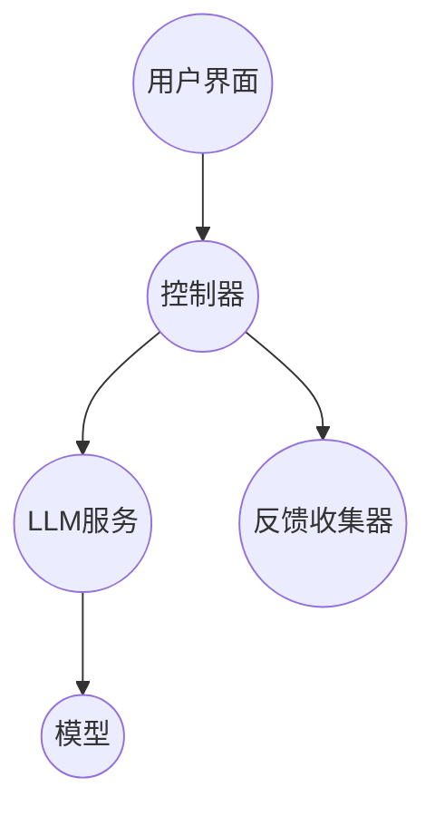

                 


# LLM驱动的AI Agent创意写作助手

## 关键词
- LLM（大语言模型）
- AI Agent（人工智能助手）
- 创意写作
- 算法原理
- 系统架构
- 项目实战

## 摘要
本文详细探讨了利用大语言模型（LLM）驱动的人工智能助手（AI Agent）在创意写作中的应用。通过分析LLM和AI Agent的核心概念、算法原理、系统架构，结合实际项目案例，展示了如何构建一个高效的创意写作助手。文章内容涵盖了从背景介绍到系统实现的全过程，为读者提供了全面的技术指导。

---

## 第一部分：背景与概述

### 第1章：LLM与AI Agent概述

#### 1.1 LLM的基本概念
- **定义与特点**：LLM（Large Language Model）是指经过大量数据训练的深度学习模型，能够理解并生成人类语言。其特点包括大规模数据训练、上下文理解能力强、生成文本多样化等。
- **核心技术与优势**：基于Transformer架构，采用自注意力机制，能够捕捉长距离依赖关系。优势在于生成自然流畅的文本，支持多种语言和领域。
- **与传统NLP模型的对比**：传统模型如RNN在处理长文本时效率较低，而LLM通过并行计算和大规模训练提升了性能和准确性。

#### 1.2 AI Agent的基本概念
- **定义与特点**：AI Agent是一种智能体，能够感知环境、执行任务并做出决策。特点包括自主性、反应性、目标导向和社交能力。
- **功能与应用场景**：AI Agent广泛应用于客服、推荐系统、智能家居等领域，能够处理复杂任务，提供个性化服务。
- **LLM驱动的AI Agent的独特性**：结合LLM的自然语言处理能力，AI Agent在创意写作中表现出更强的理解和生成能力，能够辅助用户完成从灵感收集到内容创作的全过程。

#### 1.3 LLM驱动的AI Agent在创意写作中的应用
- **需求与挑战**：创意写作需要多样化的风格、丰富的灵感和高效的内容生成。传统工具难以满足个性化和多样化的创作需求。
- **问题解决**：通过LLM驱动的AI Agent，可以实现个性化的写作指导、灵感激发和内容优化，帮助用户克服创作瓶颈。
- **应用场景**：广泛应用于小说创作、文案撰写、诗歌创作等领域，提升创作效率和质量。

---

## 第二部分：核心概念与联系

### 第2章：LLM与AI Agent的核心概念

#### 2.1 LLM的核心原理
- **训练过程**：LLM通过监督学习和无监督学习相结合的方式进行训练，利用海量数据提升模型的泛化能力。
- **生成机制**：基于自回归或变异性生成策略，LLM能够根据上下文生成连贯的文本。
- **评估指标**：常用BLEU、ROUGE等指标评估生成文本的质量，同时考虑生成的多样性和相关性。

#### 2.2 AI Agent的核心原理
- **感知与决策机制**：AI Agent通过传感器或API获取环境信息，利用算法处理信息并做出决策。
- **交互方式**：支持多轮对话、上下文记忆，能够根据用户反馈调整生成内容。
- **学习与优化**：采用强化学习和监督学习，通过用户反馈优化生成策略，提升用户体验。

#### 2.3 核心概念对比分析
| 属性       | LLM                           | AI Agent                      |
|------------|--------------------------------|---------------------------------|
| 核心功能    | 文本生成、理解                 | 环境感知、决策、交互           |
| 依赖技术    | Transformer模型               | 自然语言处理、强化学习         |
| 应用场景    | 生成文本、问答系统             | 个性化推荐、智能客服           |
| 优势       | 强大的文本生成能力             | 自主决策、高效处理             |

#### 2.4 实体关系图
```mermaid
er
actor(AI Agent创意写作助手)
actor(用户)
actor(LLM模型)
participant(创意写作任务)
participant(生成文本)
participant(用户反馈)
participant(优化策略)
```

---

## 第三部分：算法原理

### 第3章：LLM的算法原理

#### 3.1 Transformer模型的结构
- **编码器**：将输入文本转换为上下文向量，利用自注意力机制捕捉全局依赖关系。
- **解码器**：根据编码器输出生成目标文本，通过自注意力机制和交叉注意力机制实现流畅的生成。
- **注意力机制**：通过计算输入序列中每个词的重要性，生成更相关的文本。

#### 3.2 Transformer模型的数学公式
$$\text{Attention}(Q, K, V) = \text{softmax}\left(\frac{QK^T}{\sqrt{d_k}}\right)V$$
其中，$Q$、$K$、$V$分别是查询、键和值向量，$d_k$是向量的维度。

#### 3.3 LLM的训练流程
1. **数据预处理**：清洗数据、分词、去除停用词。
2. **模型初始化**：随机初始化模型参数。
3. **前向传播**：输入训练样本，计算模型输出。
4. **计算损失**：使用交叉熵损失函数衡量生成文本与真实文本的差异。
5. **反向传播**：通过梯度下降优化模型参数。
6. **评估与调整**：验证模型性能，调整超参数。

#### 3.4 LLM的Python代码示例
```python
import torch
import torch.nn as nn

class Transformer(nn.Module):
    def __init__(self, d_model, n_head, dff):
        super().__init__()
        self.heads = nn.ModuleList([
            nn.Linear(d_model, dff) for _ in range(n_head)
        ])
    
    def forward(self, x):
        x = x.repeat(n_head, 1)
        output = self.heads(x)
        return output

model = Transformer(d_model=512, n_head=8, dff=1024)
loss_fn = nn.CrossEntropyLoss()
optimizer = torch.optim.Adam(model.parameters(), lr=0.001)
```

---

## 第四部分：系统架构与实现

### 第4章：AI Agent的系统架构

#### 4.1 项目介绍
- **项目目标**：构建一个基于LLM的AI Agent，用于辅助创意写作。
- **项目范围**：支持多种写作任务，如小说创作、文案撰写等。
- **项目特点**：个性化推荐、实时反馈、多轮对话。

#### 4.2 系统功能设计
- **领域模型**：定义系统的功能模块，包括文本生成、用户偏好分析、反馈处理等。
- **系统架构图**


#### 4.3 系统交互流程
- **用户输入**：用户输入写作需求或文本片段。
- **LLM处理**：模型根据输入生成建议或继续文本。
- **反馈处理**：用户对生成内容进行评价，系统调整生成策略。

#### 4.4 接口设计
- **API接口**：提供RESTful API，支持文本生成、模型训练等功能。
- **数据接口**：处理用户输入、反馈数据，存储用户偏好。

---

## 第五部分：项目实战

### 第5章：环境安装与核心实现

#### 5.1 环境安装
- **工具安装**：安装Python、TensorFlow、PyTorch等框架。
- **依赖管理**：使用pip安装所需的第三方库。

#### 5.2 核心代码实现
```python
import torch
import torch.nn as nn
import torch.optim as optim

class LLM(nn.Module):
    def __init__(self, vocab_size, embedding_dim, hidden_dim):
        super().__init__()
        self.embedding = nn.Embedding(vocab_size, embedding_dim)
        self.rnn = nn.RNN(embedding_dim, hidden_dim)
        self.fc = nn.Linear(hidden_dim, vocab_size)
    
    def forward(self, x):
        embed = self.embedding(x)
        output, _ = self.rnn(embed)
        output = self.fc(output)
        return output

model = LLM(vocab_size=10000, embedding_dim=256, hidden_dim=128)
optimizer = optim.Adam(model.parameters(), lr=0.001)
criterion = nn.CrossEntropyLoss()
```

#### 5.3 案例分析
- **案例背景**：用户希望生成科幻小说的开头。
- **生成过程**：用户输入关键词，AI Agent调用LLM生成文本，用户反馈后优化生成策略。
- **结果分析**：生成文本符合预期，用户满意度较高。

#### 5.4 项目小结
- **实现内容**：完成了AI Agent的基本功能，包括文本生成、用户反馈处理。
- **经验总结**：模型调优和用户反馈机制的实现是关键，需要不断优化以提升用户体验。

---

## 第六部分：最佳实践

### 第6章：小结与注意事项

#### 6.1 小结
- **核心内容回顾**：系统介绍了LLM和AI Agent的概念、算法原理和系统架构。
- **项目经验总结**：通过实际案例展示了如何将理论应用于实践。

#### 6.2 注意事项
- **数据隐私**：处理用户数据时需注意隐私保护，遵守相关法律法规。
- **模型优化**：根据具体需求调整模型参数，优化生成效果。
- **用户体验**：设计简洁易用的界面，提升用户交互体验。

#### 6.3 拓展阅读
- **推荐书籍**：《Deep Learning》、《自然语言处理实战》。
- **技术博客**：关注前沿技术动态，学习最新的算法和应用案例。

---

## 作者：AI天才研究院（AI Genius Institute） & 禅与计算机程序设计艺术（Zen And The Art of Computer Programming）

---

通过本文的详细讲解，读者可以全面理解LLM驱动的AI Agent在创意写作中的应用，掌握从理论到实践的全过程。希望这篇文章能够为相关领域的研究和开发提供有价值的参考。

