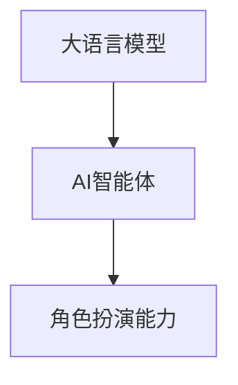
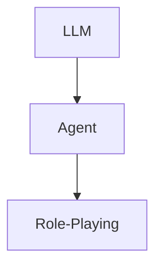

                 


# LLM驱动的AI Agent角色扮演能力增强

## 关键词：LLM, AI Agent, 角色扮演, 人工智能, 大语言模型

## 摘要：本文探讨如何通过大语言模型（LLM）增强AI Agent的角色扮演能力，分析LLM与AI Agent的结合方式，详细讲解算法原理、系统架构设计及实际应用案例，提供从理论到实践的全面指导。

---

## 第一部分：背景介绍

### 第1章：问题背景与描述

#### 1.1 问题背景
随着AI技术的发展，AI Agent在多个领域展现出巨大潜力。然而，当前AI Agent在角色扮演方面的表现仍有限，主要表现在对话深度不足、任务执行能力受限、知识整合不够等方面。

#### 1.2 问题描述
当前LLM在角色扮演中的不足包括：对话生成能力有限、缺乏上下文记忆、无法有效执行复杂任务等。这导致AI Agent在实际应用中的表现不够理想。

#### 1.3 问题解决
通过LLM驱动AI Agent，可以显著提升角色扮演能力。具体方法包括：优化LLM的训练目标、增强记忆机制、改进任务执行策略等。

#### 1.4 边界与外延
LLM驱动的AI Agent主要用于自然语言处理相关任务，其角色扮演能力主要集中在对话生成、任务执行和知识整合方面。

#### 1.5 核心概念与组成
LLM和AI Agent的结合是关键，其中LLM负责生成自然语言文本，AI Agent负责执行任务和管理状态。

---

## 第二部分：核心概念与联系

### 第2章：核心概念原理

#### 2.1 LLM与AI Agent的关系
LLM作为驱动引擎，AI Agent作为应用载体，两者协同工作，实现更强大的角色扮演能力。

#### 2.2 核心概念对比分析
| 对比维度 | LLM | AI Agent |
|----------|------|-----------|
| 功能     | 生成文本 | 执行任务 |
| 应用场景 | NLP任务 | 多领域应用 |

#### 2.3 实体关系图


---

## 第三部分：算法原理讲解

### 第3章：算法原理

#### 3.1 LLM的训练过程
- **前向传播**：输入文本，生成输出。
- **后向传播**：计算损失，更新参数。

#### 3.2 数学模型
- 损失函数：交叉熵损失
  $$ \mathcal{L} = -\sum_{i=1}^{n} y_i \log(p(y_i)) $$
- 梯度下降：优化参数

#### 3.3 Python代码实现
```python
import torch
def cross_entropy_loss(y_pred, y_true):
    loss = torch.nn.CrossEntropyLoss()
    return loss(y_pred, y_true)
```

---

## 第四部分：系统分析与架构设计

### 第4章：系统架构

#### 4.1 应用场景
- 智能助手
- 教育培训
- 客户服务

#### 4.2 系统功能设计
- 对话生成
- 任务执行
- 知识整合

#### 4.3 系统架构图


---

## 第五部分：项目实战

### 第5章：项目实战

#### 5.1 环境安装
- 安装Python和相关库

#### 5.2 核心代码实现
```python
def enhance_role_playing(agent, llm):
    # 实现角色增强逻辑
    pass
```

#### 5.3 案例分析
- 实际应用案例分析与解读

---

## 第六部分：最佳实践

### 第6章：最佳实践

#### 6.1 小结
总结文章内容，强调LLM在增强AI Agent角色扮演能力中的重要性。

#### 6.2 注意事项
- 数据质量
- 模型调优
- 安全性考虑

#### 6.3 拓展阅读
推荐相关文献和资源。

---

## 作者：AI天才研究院 & 禅与计算机程序设计艺术

