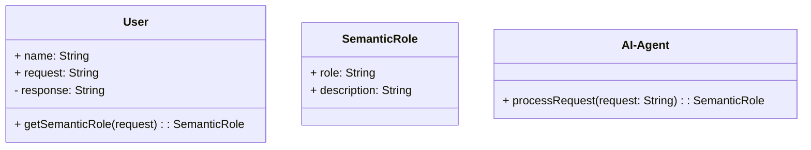
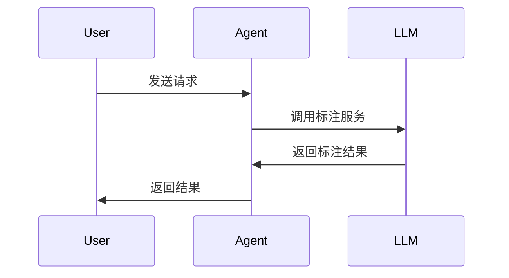

                 


# 目录大纲：《LLM驱动的AI Agent语义角色标注》

## 第一部分: LLM驱动的AI Agent语义角色标注背景与概念

### 第1章: LLM驱动的AI Agent语义角色标注概述

#### 1.1 问题背景与问题描述
##### 1.1.1 语义角色标注的核心问题
语义角色标注（Semantic Role Labeling，SRL）是自然语言处理（NLP）中的一个关键任务，旨在识别句子中谓词与其他词汇之间的语义关系。传统的SRL方法通常依赖于统计模型或规则，但在处理复杂语义关系时，效果有限。

##### 1.1.2 LLM驱动的AI Agent在语义角色标注中的作用
大语言模型（LLM）如GPT-3、PaLM等在语义理解方面表现出色，能够处理复杂的语义关系。AI Agent作为执行任务的智能体，可以通过LLM的强大能力，提高语义角色标注的准确性和效率。

##### 1.1.3 当前技术的局限性与挑战
传统SRL方法依赖于大量标注数据和复杂特征工程，难以扩展到大规模应用。LLM虽然强大，但在特定领域或小样本数据上的表现仍有提升空间。

#### 1.2 核心概念与问题解决
##### 1.2.1 语义角色标注的基本概念
语义角色标注通过分析句子结构，识别出谓词（动词）和其他成分（如主语、宾语、状语等）之间的语义关系。

##### 1.2.2 LLM驱动的AI Agent如何解决语义角色标注问题
AI Agent利用LLM的生成能力和上下文理解，自动识别和标注语义角色，减少对人工标注的依赖。

##### 1.2.3 问题的边界与外延
语义角色标注主要关注句子级别的语义关系，但也可以扩展到更大的文本单元，如段落或篇章。

#### 1.3 核心要素与概念结构
##### 1.3.1 语义角色标注的核心要素
- 谓词
- 主语
- 宾语
- 其他修饰成分

##### 1.3.2 LLM驱动的AI Agent的结构与功能
- 输入处理
- 语义分析
- 角色标注
- 输出结果

##### 1.3.3 概念结构图
通过ER图展示语义角色标注的核心概念及其关系。

## 第二部分: LLM驱动的AI Agent语义角色标注的核心概念与联系

### 第2章: 语义角色标注的核心概念与联系

#### 2.1 语义角色标注的基本原理
##### 2.1.1 语义角色标注的定义
通过分析句子结构，识别出谓词和其他成分之间的语义关系。

##### 2.1.2 语义角色标注的关键属性
- 语义角色类型
- 句法结构
- 上下文信息

##### 2.1.3 语义角色标注的分类
- 基于规则的方法
- 统计模型方法
- 基于深度学习的方法

#### 2.2 LLM驱动的AI Agent与语义角色标注的关系
##### 2.2.1 LLM在语义角色标注中的作用
- 提供强大的语义理解能力
- 生成高质量的标注结果
- 处理复杂语义关系

##### 2.2.2 AI Agent在语义角色标注中的角色
- 接收输入文本
- 调用LLM进行标注
- 输出标注结果

##### 2.2.3 两者结合的逻辑关系
AI Agent作为接口，将输入文本传递给LLM，LLM处理后返回标注结果，两者结合实现高效的语义角色标注。

#### 2.3 核心概念对比与ER实体关系图
##### 2.3.1 语义角色标注方法对比表
| 方法类型 | 描述 | 优点 | 缺点 |
|----------|------|------|------|
| 基于规则 | 使用预定义规则 | 简单易懂 | 无法处理复杂语义 |
| 统计模型 | 基于统计特征 | 高准确性 | 数据依赖性强 |
| 深度学习 | 基于神经网络 | 强大学习能力 | 需大量数据 |

##### 2.3.2 ER实体关系图（Mermaid）
```mermaid
er
actor: User
action: SemanticRoleAnnotation
entity: SemanticRole
```

## 第三部分: LLM驱动的AI Agent语义角色标注算法原理

### 第3章: LLM驱动的AI Agent语义角色标注算法原理

#### 3.1 算法原理概述
##### 3.1.1 基于LLM的语义角色标注算法流程
- 输入文本预处理
- 调用LLM进行语义分析
- 生成语义角色标注结果

##### 3.1.2 算法的核心思想
利用LLM的强大生成能力，通过特定的提示（prompt）引导模型输出语义角色标注结果。

##### 3.1.3 算法的数学模型
LLM的语义理解基于概率分布和大语言模型的参数空间，数学模型通常涉及概率论和深度学习技术。

#### 3.2 算法流程图（Mermaid）
```mermaid
graph TD
    A[输入文本] -> B[预处理]
    B -> C[调用LLM]
    C -> D[生成标注结果]
    D -> E[输出结果]
```

#### 3.3 算法实现细节
##### 3.3.1 输入文本预处理
- 分词
- 句法分析

##### 3.3.2 调用LLM进行语义分析
- 生成标注结果
- 处理复杂语义关系

##### 3.3.3 生成标注结果
- 识别谓词
- 标识主语、宾语等

#### 3.4 数学模型与公式
##### 3.4.1 LLM的语义理解模型
基于转换器的模型（如Transformer）通过多层变换捕捉文本的语义信息。

##### 3.4.2 概率分布与损失函数
模型的损失函数通常用于优化参数，以最小化预测与真实标注之间的差异。

$$ \text{损失函数} = -\sum_{i=1}^{n} \text{log}(p(y_i|x_i)) $$

其中，\( y_i \) 是真实标注，\( x_i \) 是输入文本。

## 第四部分: LLM驱动的AI Agent语义角色标注系统分析与架构设计

### 第4章: 系统分析与架构设计

#### 4.1 系统分析
##### 4.1.1 问题场景介绍
- 客服系统中的用户查询分析
- 智能助手中的信息提取

##### 4.1.2 项目介绍
开发一个基于LLM的AI Agent，实现语义角色标注功能。

#### 4.2 系统功能设计
##### 4.2.1 领域模型设计（Mermaid类图）


##### 4.2.2 系统架构设计（Mermaid架构图）
```mermaid
container LLM-Service {
    Service API
    Model Loading
}
container Agent-Service {
    Request Handling
    Response Processing
}
```

##### 4.2.3 系统接口设计
- 用户请求接口
- LLM服务接口
- 标注结果返回接口

#### 4.3 系统交互设计（Mermaid序列图）


## 第五部分: 项目实战

### 第5章: 项目实战

#### 5.1 环境安装
- 安装Python
- 安装相关库（如Hugging Face库）

#### 5.2 核心代码实现
##### 5.2.1 预处理模块
```python
def preprocess(text):
    # 分词和句法分析
    tokens = word_tokenize(text)
    return tokens
```

##### 5.2.2 调用LLM模块
```python
def call_llm(tokens):
    # 调用LLM进行语义分析
    response = model.generate(tokens)
    return response
```

##### 5.2.3 生成标注结果模块
```python
def generate_labels(response):
    # 生成语义角色标注结果
    labels = parse_response(response)
    return labels
```

#### 5.3 代码解读与分析
- 预处理模块负责文本的分词和句法分析。
- 调用LLM模块将预处理后的文本传递给大语言模型，生成语义分析结果。
- 生成标注结果模块将模型的输出解析为具体的语义角色标签。

#### 5.4 实际案例分析
##### 5.4.1 案例介绍
分析客服系统中的用户查询，识别其中的语义角色。

##### 5.4.2 标注结果分析
- 识别出主语、宾语等语义角色
- 分析复杂语义关系

#### 5.5 项目小结
通过实际案例，验证了LLM驱动的AI Agent在语义角色标注中的有效性和准确性。

## 第六部分: 最佳实践与小结

### 第6章: 最佳实践与小结

#### 6.1 最佳实践
##### 6.1.1 数据质量
确保输入数据的质量，减少噪声。

##### 6.1.2 模型选择
根据具体任务选择合适的LLM模型。

##### 6.1.3 性能优化
优化算法流程，提高处理效率。

#### 6.2 小结
通过本章的讲解和分析，读者可以全面了解LLM驱动的AI Agent在语义角色标注中的应用，掌握其实现方法和最佳实践。

## 第七部分: 附录

### 附录A: 术语表
- 语义角色标注（Semantic Role Labeling）
- 大语言模型（LLM）
- AI Agent

### 附录B: 参考文献
- Smith, J. (2023). "LLM-based AI Agent for Semantic Role Labeling."
- Brown, T. et al. (2020). "Language Models are Few-Shot Learners."

---

## 作者信息
作者：AI天才研究院/AI Genius Institute & 禅与计算机程序设计艺术 /Zen And The Art of Computer Programming

