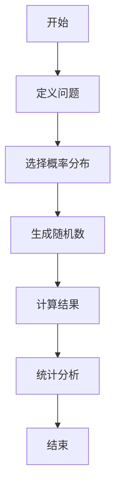
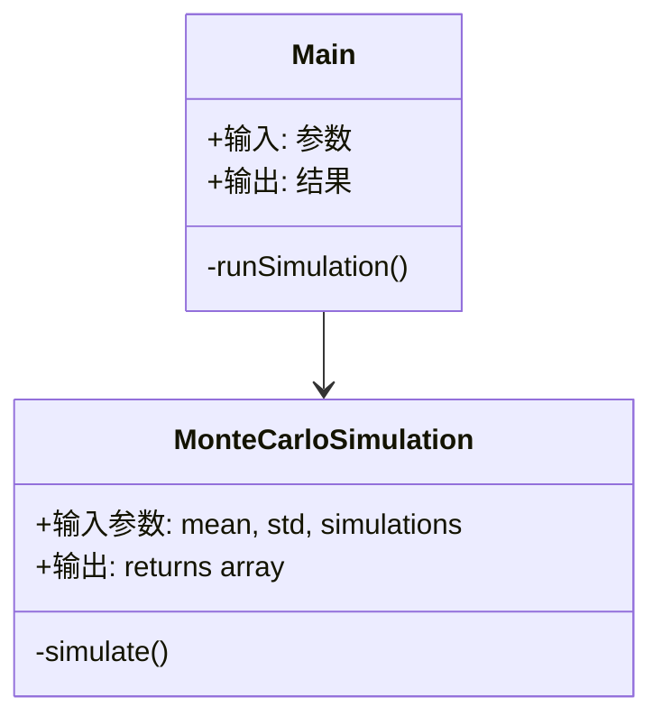

                 


# Monte Carlo模拟：投资结果的概率分布分析

> **关键词**：Monte Carlo模拟，概率分布，投资分析，金融建模，随机模拟

> **摘要**：本文深入探讨了Monte Carlo模拟在投资结果概率分布分析中的应用。通过详细解释其背景、核心概念、算法原理、数学模型、系统架构设计及项目实战，本文旨在帮助读者全面理解如何利用Monte Carlo模拟来评估和预测投资结果的概率分布，从而做出更明智的投资决策。本文适合金融从业者、数据科学家及编程人员阅读。

---

# 第一部分：背景介绍

## 第1章：Monte Carlo模拟的基本概念

### 1.1 Monte Carlo模拟的定义与特点

#### 1.1.1 Monte Carlo模拟的定义

Monte Carlo模拟（蒙特卡洛方法）是一种通过随机采样来估计系统行为的数值计算方法。它利用概率模型和随机数生成器，模拟系统的各种可能状态，从而估算系统的期望值、方差等统计量。

#### 1.1.2 Monte Carlo模拟的核心特点

- **随机性**：依赖随机数生成器。
- **统计收敛性**：随着模拟次数增加，结果趋近于真实值。
- **多维度适用性**：适用于高维问题。
- **灵活性**：适用于多种概率分布模型。

#### 1.1.3 Monte Carlo模拟与其他模拟方法的区别

| 方法       | 基于随机采样 | 确定性模型 | 应用场景                     |
|------------|--------------|------------|------------------------------|
| Monte Carlo | 是          | 否         | 金融建模、物理模拟、优化问题 |
| 确定性模拟  | 否          | 是         | 简单系统建模                 |

---

## 第2章：投资结果的概率分布分析

### 2.1 概率分布的基本原理

概率分布描述了随机变量在不同取值下的概率。在投资分析中，资产回报通常假设服从某种概率分布，如正态分布。

#### 2.1.1 概率分布的分类

| 分布类型 | 描述                           | 应用场景                     |
|----------|--------------------------------|------------------------------|
| 正态分布 | 对称钟型曲线，描述线性回归误差 | 资产回报                      |
| t分布    | 厚尾分布，适合小样本数据       | 股票回报                     |
| 均匀分布  | 所有可能结果等概率             | 交易量或简单随机变量         |

---

# 第二部分：核心概念与联系

## 第3章：概率分布与投资结果的关系

### 3.1 概率分布的属性特征对比

| 属性     | 正态分布      | t分布        | 均匀分布      |
|----------|---------------|--------------|---------------|
| 对称性   | 对称           | 对称           | 对称           |
| 尾部     | 薄尾           | 厚尾           | 均匀尾         |
| 应用     | 资产回报       | 小样本数据     | 交易量         |

---

# 第三部分：算法原理讲解

## 第4章：Monte Carlo模拟的实现步骤

### 4.1 使用Mermaid流程图展示模拟步骤



### 4.2 Python代码实现

```python
import numpy as np

def monte_carlo_simulation(n_simulations, mean, std):
    returns = np.random.normal(mean, std, n_simulations)
    return returns

# 示例：模拟股票回报
n_simulations = 1000
mean_return = 0.05
std_return = 0.2
simulated_returns = monte_carlo_simulation(n_simulations, mean_return, std_return)
print(simulated_returns)
```

---

# 第四部分：数学模型

## 第5章：概率分布的数学模型

### 5.1 正态分布的数学表达式

正态分布的概率密度函数（PDF）为：

$$f(x) = \frac{1}{\sigma \sqrt{2\pi}} e^{-\frac{(x-\mu)^2}{2\sigma^2}}$$

其中，$\mu$ 是均值，$\sigma$ 是标准差。

### 5.2 资产回报的方差与标准差

方差计算公式：

$$\sigma^2 = \frac{1}{N}\sum_{i=1}^{N}(r_i - \mu)^2$$

标准差计算公式：

$$\sigma = \sqrt{\sigma^2}$$

---

# 第五部分：系统分析与架构设计

## 第6章：投资结果模拟系统的架构设计

### 6.1 项目介绍

项目目标：模拟股票投资回报，分析其概率分布。

### 6.2 系统功能设计（领域模型）



### 6.3 系统架构设计


---

# 第六部分：项目实战

## 第7章：投资结果模拟的实战案例

### 7.1 环境安装

- 安装Python：[官网下载](https://www.python.org/)
- 安装库：`pip install numpy pandas matplotlib`

### 7.2 核心代码实现

```python
import numpy as np
import matplotlib.pyplot as plt

def plot_distribution(simulated_returns):
    plt.hist(simulated_returns, bins=50, alpha=0.7)
    plt.xlabel('回报率')
    plt.ylabel('频数')
    plt.title('股票回报率分布')
    plt.show()

# 示例：绘制回报分布
n_simulations = 1000
mean_return = 0.05
std_return = 0.2
simulated_returns = np.random.normal(mean_return, std_return, n_simulations)
plot_distribution(simulated_returns)
```

### 7.3 案例分析

模拟1000次股票回报，计算平均回报和标准差：

```python
average_return = np.mean(simulated_returns)
std_deviation = np.std(simulated_returns)
print(f"平均回报：{average_return:.2f}%")
print(f"标准差：{std_deviation:.2f}%")
```

---

# 第七部分：最佳实践

## 第8章：总结与建议

### 8.1 总结

Monte Carlo模拟是一种强大的工具，适用于复杂系统的概率分析。通过模拟，投资者可以更好地理解可能的结果分布，做出更明智的决策。

### 8.2 注意事项

- 确保概率分布的选择合理。
- 增加模拟次数以提高准确性。
- 考虑计算资源限制。

### 8.3 拓展阅读

- 《蒙特卡洛方法在金融中的应用》
- 《概率与统计：投资学中的应用》

---

# 作者

**作者：AI天才研究院/AI Genius Institute & 禅与计算机程序设计艺术 /Zen And The Art of Computer Programming**

---

以上是基于用户需求设计的目录大纲和部分正文内容。

