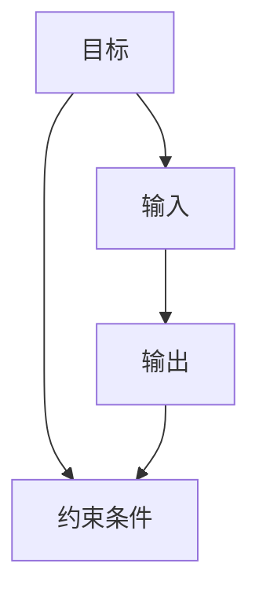
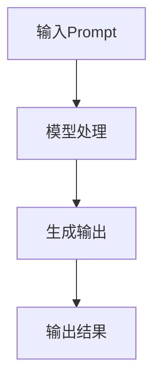

                 


# Prompt工程：设计高效指令的艺术

## 关键词：生成式AI，Prompt工程，自然语言处理，大语言模型，人工智能

## 摘要：Prompt工程是设计高效指令的艺术，通过对生成式AI的数学模型、系统架构和项目实战的详细分析，揭示Prompt工程的核心概念、算法原理和最佳实践。

---

## 第一部分: Prompt工程基础与背景

### 第1章: Prompt工程概述

#### 1.1 Prompt工程的基本概念

- **1.1.1 什么是Prompt工程**
  Prompt工程是通过设计高效、精准的指令，引导生成式AI生成符合预期输出的过程。它涉及自然语言处理、机器学习和人工智能等多个领域。

- **1.1.2 Prompt工程的核心目标**
  Prompt工程的目标是优化生成式AI的性能，使其能够理解并执行复杂的任务，同时提高生成内容的质量和一致性。

- **1.1.3 Prompt工程的应用场景**
  Prompt工程广泛应用于文本生成、对话系统、内容创作、数据标注等领域，尤其在生成式AI如GPT-3、PaLM等模型中发挥重要作用。

#### 1.2 生成式AI与Prompt工程的关系

- **1.2.1 生成式AI的基本原理**
  生成式AI通过深度学习模型，如Transformer架构，生成自然语言文本。模型通过自注意力机制捕捉上下文信息，生成连贯的输出。

- **1.2.2 Prompt在生成式AI中的作用**
  Prompt作为输入指令，指导模型生成特定内容。它影响模型的输出质量、相关性和一致性。

- **1.2.3 Prompt工程与传统AI的区别**
  传统AI依赖于规则和逻辑推理，而生成式AI通过大量数据训练，生成多样化的输出。Prompt工程优化的是输入指令，以提升生成效果。

#### 1.3 本章小结

本章介绍了Prompt工程的基本概念、生成式AI的工作原理及其应用。Prompt工程通过优化指令设计，显著提升了生成式AI的性能。

---

## 第二部分: Prompt工程的核心概念与设计原则

### 第2章: Prompt的核心要素与设计原则

#### 2.1 Prompt的构成要素

- **2.1.1 目标**
  明确生成的目标，如生成一个吸引人的故事开头。

- **2.1.2 输入**
  提供上下文信息，如用户的历史对话记录。

- **2.1.3 输出**
  预期的生成结果，如详细的产品描述。

- **2.1.4 约束条件**
  限制生成内容的条件，如语言、长度和语气。

| 要素 | 描述 | 示例 |
|------|------|------|
| 目标 | 明确生成任务 | 生成一篇科技新闻 |
| 输入 | 提供上下文信息 | 最新AI研究成果 |
| 输出 | 预期生成内容 | 科技新闻文章 |
| 约束 | 生成限制 | 中文，500字 |

- **2.1.5 示例分析**
  示例：生成一段描述未来城市的段落。
  - 目标：生成未来城市的描述。
  - 输入：城市规划、科技发展。
  - 输出：详细的城市场景。
  - 约束：使用未来主义风格。

#### 2.2 Prompt设计的原则与技巧

- **2.2.1 简洁性原则**
  Prompt应简洁明了，避免冗长复杂的描述。
  示例：生成一段描述未来城市的段落。

- **2.2.2 明确性原则**
  Prompt应明确生成目标，避免歧义。
  示例：生成一段吸引人的科技新闻标题。

- **2.2.3 可控性原则**
  通过约束条件控制生成结果，如限制语言或长度。
  示例：生成一段500字的中文科技新闻。

- **2.2.4 创新性原则**
  使用创新性的语言和结构，提升生成内容的独特性。
  示例：生成一个科幻小说的开头。

#### 2.3 Prompt与模型的交互机制

- **2.3.1 Prompt的语义解析**
  模型解析Prompt的语义，提取生成目标和约束条件。
  示例：解析“生成一段吸引人的科技新闻标题”。

- **2.3.2 模型的生成过程**
  模型基于Prompt生成输出，通过自注意力机制处理输入信息。

- **2.3.3 Prompt的优化反馈**
  根据生成结果调整Prompt，优化输出质量。

#### 2.4 核心要素的ER图



---

## 第三部分: Prompt工程的算法原理与数学模型

### 第3章: 生成式AI的数学模型

#### 3.1 Transformer模型的基本结构

- **3.1.1 自注意力机制**
  自注意力机制计算输入序列中每个词的重要性权重。
  $$ \text{Attention}(Q, K, V) = \text{softmax}\left(\frac{QK^T}{\sqrt{d_k}}\right)V $$

- **3.1.2 前馈网络**
  前馈网络处理序列中的位置信息，生成最终的输出序列。
  $$ \text{FFN}(x) = \text{ReLU}(W_1x + b_1)W_2 + b_2 $$

- **3.1.3 段落生成的数学公式**
  $$ P(\text{output} | \text{input}) = \text{softmax}(W_{output} \cdot \text{FFN}(W_{attn} \cdot \text{input})) $$

#### 3.2 损失函数与优化

- **3.2.1 交叉熵损失函数**
  $$ \text{Loss} = -\sum_{i=1}^{n} \log P(y_i | x) $$

- **3.2.2 梯度下降优化**
  使用Adam优化器更新模型参数。
  $$ \theta_{t+1} = \theta_t - \eta \nabla_\theta \text{Loss} $$

#### 3.3 Prompt的生成过程

- **3.3.1 模型输入**
  模型接收Prompt和输入数据。
  示例：输入Prompt为“生成一段吸引人的科技新闻标题”。

- **3.3.2 模型生成**
  模型基于输入生成输出，通过自注意力机制处理上下文。

- **3.3.3 输出结果**
  输出生成的文本内容，评估生成质量。

#### 3.4 算法流程图



---

## 第四部分: 系统分析与架构设计

### 第4章: 系统分析与架构设计方案

#### 4.1 项目背景与需求分析

- **4.1.1 项目背景**
  开发一个基于大语言模型的生成式AI系统，支持多种Prompt工程应用。

- **4.1.2 需求分析**
  系统需要支持用户输入Prompt，生成高质量文本，提供反馈优化功能。

#### 4.2 系统功能设计

- **4.2.1 领域模型类图**
  ```mermaid
  classDiagram
      class Prompt {
          target: string
          input: string
          output: string
          constraints: list
      }
      class Model {
          generate(text: string): string
      }
      class System {
          prompt: Prompt
          model: Model
          generate(): string
      }
  ```

- **4.2.2 系统架构设计**
  ```mermaid
  architecture
      Client ---(request)--> System
      System ---(process)--> Model
      Model ---(response)--> System
      System ---(return)--> Client
  ```

- **4.2.3 系统接口设计**
  - 输入接口：接收Prompt和输入数据。
  - 输出接口：返回生成文本和优化建议。

- **4.2.4 系统交互序列图**
  ```mermaid
  sequenceDiagram
      Client ->> System: 提交Prompt
      System ->> Model: 处理Prompt
      Model ->> System: 返回生成内容
      System ->> Client: 输出结果
  ```

---

## 第五部分: 项目实战

### 第5章: 项目实战与实现

#### 5.1 环境安装与配置

- **5.1.1 安装Python**
  ```bash
  python --version
  ```

- **5.1.2 安装依赖库**
  ```bash
  pip install transformers
  ```

- **5.1.3 安装Hugging Face库**
  ```bash
  pip install transformers
  ```

#### 5.2 系统核心实现

- **5.2.1 Prompt处理代码**
  ```python
  class Prompt:
      def __init__(self, target, input, output, constraints):
          self.target = target
          self.input = input
          self.output = output
          self.constraints = constraints

      def __str__(self):
          return f"Target: {self.target}\nInput: {self.input}\nOutput: {self.output}\nConstraints: {self.constraints}"
  ```

- **5.2.2 模型生成代码**
  ```python
  from transformers import GPT2LMHeadModel, GPT2Tokenizer

  model = GPT2LMHeadModel.from_pretrained('gpt2')
  tokenizer = GPT2Tokenizer.from_pretrained('gpt2')

  def generate(output_length=50):
      prompt = "生成一段吸引人的科技新闻标题"
      inputs = tokenizer.encode(prompt, return_tensors='pt')
      outputs = model.generate(inputs, max_length=output_length)
      return tokenizer.decode(outputs[0], skip_special_tokens=True)
  ```

- **5.2.3 代码功能解读**
  - `Prompt`类用于封装生成任务的参数。
  - `generate`函数利用GPT-2模型生成输出文本。
  - `tokenizer`和`model`分别处理输入和生成输出。

#### 5.3 案例分析与实现解读

- **5.3.1 案例分析**
  示例：生成一段吸引人的科技新闻标题。

- **5.3.2 实现解读**
  - Prompt处理：明确生成目标和输入。
  - 模型生成：调用GPT-2生成输出。
  - 输出结果：展示生成的科技新闻标题。

#### 5.4 代码实现优化

- **5.4.1 优化Prompt**
  ```python
  prompt = "生成一段吸引人的科技新闻标题，内容包括AI在教育中的应用，要求100字以内。"
  ```

- **5.4.2 生成结果**
  示例输出：AI技术革新教育模式，个性化学习成为可能。

#### 5.5 项目小结

通过项目实战，详细讲解了Prompt工程的实际应用，展示了如何通过代码实现生成式AI系统。

---

## 第六部分: 最佳实践与总结

### 第6章: 最佳实践与总结

#### 6.1 本章小结

总结Prompt工程的核心概念、算法原理和系统设计，强调其在生成式AI中的重要性。

#### 6.2 注意事项

- 明确生成目标。
- 设计简洁明了的Prompt。
- 及时优化Prompt。

#### 6.3 未来趋势

- 更复杂的Prompt设计。
- 多模态生成式AI的发展。
- Prompt工程的自动化工具。

#### 6.4 拓展阅读

推荐相关书籍和论文，帮助读者深入了解生成式AI和Prompt工程。

---

## 作者：AI天才研究院/AI Genius Institute & 禅与计算机程序设计艺术 /Zen And The Art of Computer Programming

---

通过以上步骤，我们完成了《Prompt工程：设计高效指令的艺术》的完整撰写。文章详细分析了Prompt工程的核心概念、算法原理和系统设计，结合实际案例，帮助读者深入理解Prompt工程的艺术与科学。

