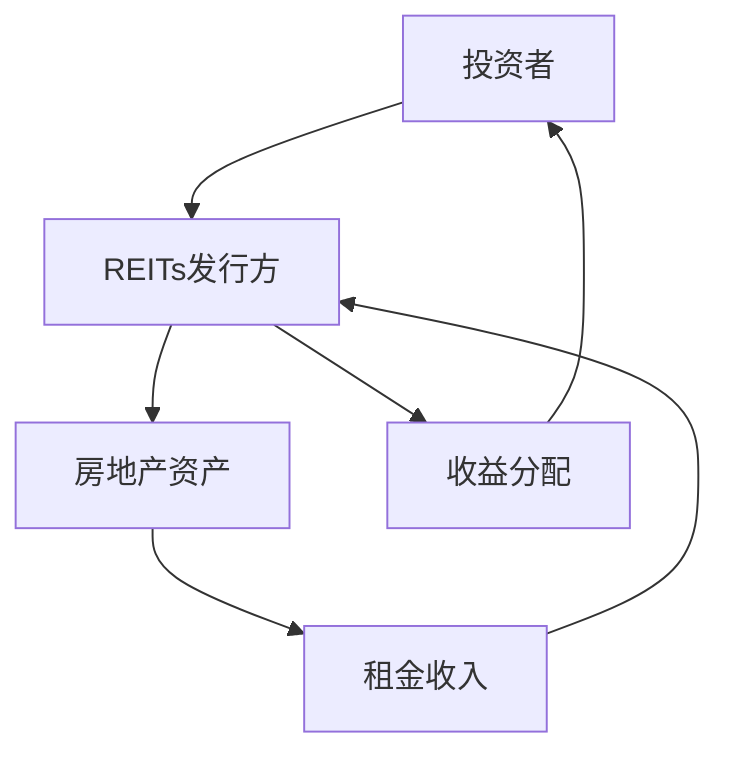
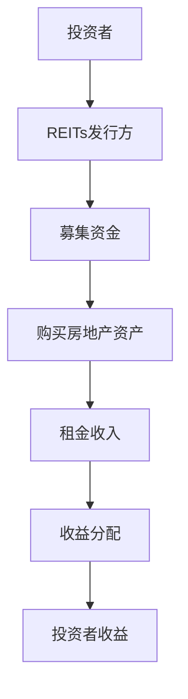

                 


# REITs投资：房地产市场的流动性解决方案

## 关键词：REITs, 房地产市场, 流动性, 投资工具, 资产证券化

## 摘要：REITs（房地产投资信托基金）作为连接资本市场与房地产市场的桥梁，通过资产证券化方式提升了房地产市场的流动性。本文从REITs的基本概念、运作机制、定价模型、系统架构、项目实战等多方面进行深入分析，探讨其在房地产市场中的应用价值和投资策略。

---

## 第一部分：REITs投资概述

### 第1章：REITs的基本概念

#### 1.1 REITs的定义与特点
- **1.1.1 REITs的定义**
  REITs（Real Estate Investment Trusts）是通过发行股票或债券募集资金，用于投资房地产及相关资产的金融工具。投资者通过购买REITs的份额，间接持有房地产资产。

- **1.1.2 REITs的主要特点**
  - **流动性高**：投资者可以像买卖股票一样买卖REITs。
  - **收益稳定**：REITs通常通过租金收入和资本增值获得收益。
  - **门槛低**：投资者无需大量资金即可参与房地产投资。

- **1.1.3 REITs的分类**
  - 按资产类型：住宅、商业、工业等。
  - 按地域：本地、区域或全球。
  - 按结构： equity REITs（股权型）和 mortgage REITs（抵押型）。

#### 1.2 REITs的历史发展
- **1.2.1 REITs的起源**
  REITs起源于20世纪60年代的美国，旨在让更多投资者能够参与房地产投资。

- **1.2.2 REITs的发展历程**
  - 20世纪60年代：美国推出REITs，允许公司通过IPO上市。
  - 20世纪90年代：全球范围内的REITs市场开始快速发展。
  - 21世纪：REITs成为主流的投资工具，市场规模迅速增长。

- **1.2.3 REITs的现状**
  全球REITs市场规模庞大，涵盖住宅、商业、工业等多种房地产类型，成为房地产投资的重要渠道。

---

## 第二部分：REITs与房地产市场的流动性

### 第2章：房地产市场的流动性问题

#### 2.1 流动性不足的表现
- **交易周期长**：房地产买卖过程复杂，交易周期较长。
- **资金门槛高**：直接投资房地产需要大量资金。
- **市场分割**：房地产市场区域分割明显，信息不对称。

#### 2.2 REITs如何提高流动性
- **降低投资门槛**：投资者可以通过少量资金参与房地产投资。
- **提高资产流动性**：REITs可以在二级市场上随时买卖，提升资产流动性。
- **促进资本流动**：通过REITs将长期资本引入房地产市场，优化资源配置。

---

## 第三部分：REITs的运作机制与核心原理

### 第3章：REITs的金融原理

#### 3.1 投资者与REITs的关系
- 投资者购买REITs份额，成为REITs的股东，按份额比例获得收益。

#### 3.2 REITs的收益来源
- **租金收入**：通过出租房地产获得稳定的现金流。
- **资本增值**：房地产升值带来的资本收益。
- **股息分配**：REITs将部分收益以股息形式分配给投资者。

#### 3.3 REITs的运作流程
- **资金募集**：通过IPO、增发或私募等方式募集资金。
- **资产投资**：将募集到的资金用于购买房地产资产。
- **运营管理**：负责房地产的维护、租赁和日常管理。
- **收益分配**：定期向投资者分配收益。

---

## 第四部分：REITs的投资分析与定价模型

### 第4章：REITs的定价与估值

#### 4.1 常用的定价模型
- **股息率法**：通过比较REITs的股息率和市场利率，评估其投资价值。
- **现金流折现法**：通过DCF模型评估REITs的内在价值。
- **资本化率法**：通过租金收入和资本化率计算房地产价值。

#### 4.2 如何评估REITs的价值
- **股息率计算公式**：$$股息率 = \frac{年股息}{股价}$$
- **资本化率计算公式**：$$资本化率 = \frac{净收益}{价值}$$

#### 4.3 REITs的市场定价因素
- **市场利率**：影响REITs的股息吸引力。
- **房地产市场状况**：影响REITs的租金收入和资产价值。
- **投资者情绪**：影响REITs的市场交易价格。

---

## 第五部分：REITs的风险管理与投资策略

### 第5章：REITs的风险分析

#### 5.1 常见风险类型
- **市场风险**：房地产市场波动影响REITs价值。
- **利率风险**：利率上升导致REITs价格下跌。
- **流动性风险**：REITs可能在某些情况下难以变现。

#### 5.2 风险管理策略
- **分散投资**：通过投资不同类型的REITs降低风险。
- **长期持有**：避免短期市场波动的影响。
- **关注管理质量**：选择管理能力强的REITs。

---

## 第六部分：REITs的系统架构与实现

### 第6章：REITs的系统设计

#### 6.1 系统架构图


#### 6.2 系统流程图


---

## 第七部分：项目实战

### 第7章：REITs投资模拟项目

#### 7.1 项目环境搭建
- **工具**：Python、Pandas、Matplotlib。
- **数据源**：历史房地产价格数据、利率数据、REITs市场数据。

#### 7.2 核心代码实现
```python
import pandas as pd
import matplotlib.pyplot as plt

# 示例：计算REITs的预期收益
data = {'价格': [100, 105, 110, 115, 120], '租金': [5, 6, 7, 8, 9]}
df = pd.DataFrame(data)
df['收益'] = df['租金'] / df['价格'] * 100
print(df)
```

#### 7.3 项目总结
- 通过模拟项目，投资者可以更好地理解REITs的投资价值和风险。

---

## 第八部分：最佳实践与总结

### 第8章：投资策略与注意事项

#### 8.1 最佳实践
- **长期投资**：避免短期波动影响投资决策。
- **分散投资**：降低市场风险。
- **关注管理质量**：选择管理能力强的REITs。

#### 8.2 总结与展望
REITs作为房地产市场的流动性解决方案，为投资者提供了便捷的投资渠道。未来，随着技术进步和市场发展，REITs将发挥更大的作用。

---

## 作者：AI天才研究院 & 禅与计算机程序设计艺术

