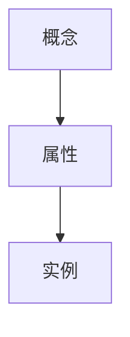
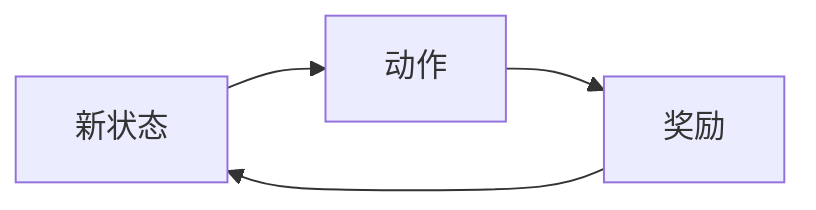
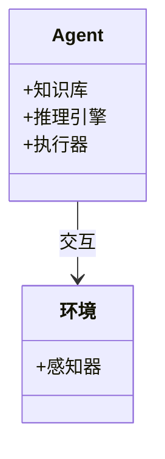
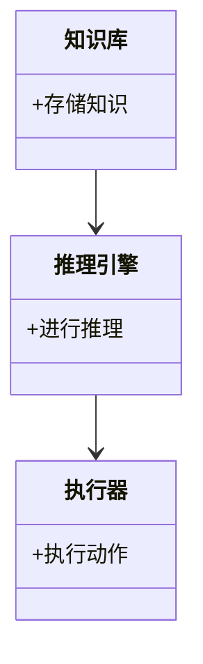

                 


# Web集成：将AI Agent嵌入到网页应用中

**关键词**：AI Agent、Web集成、人工智能、网页应用、系统架构、算法原理

**摘要**：本文详细探讨了如何将AI Agent嵌入到网页应用中，从AI Agent的基本概念到其在Web集成中的应用，再到其实现的算法原理和系统架构设计。通过具体项目案例分析，展示了AI Agent在实际应用中的潜力和优势。

---

## 第1章：AI Agent与Web集成概述

### 1.1 AI Agent的基本概念

#### 1.1.1 AI Agent的定义与特点

AI Agent（人工智能代理）是一种能够感知环境并采取行动以实现目标的智能实体。它具有以下特点：

- **自主性**：能够在没有外部干预的情况下运行。
- **反应性**：能够实时感知环境并做出反应。
- **社会性**：能够与其他实体（包括其他AI Agent和用户）进行交互。

#### 1.1.2 AI Agent的核心要素与组成

AI Agent由以下核心要素组成：

1. **感知器**：负责获取环境中的信息。
2. **知识库**：存储用于推理和决策的知识。
3. **推理引擎**：根据知识库中的信息进行推理。
4. **行为执行器**：根据推理结果执行相应的行动。

#### 1.1.3 AI Agent在Web集成中的作用

在Web应用中，AI Agent可以用于智能搜索、个性化推荐、自动化任务处理等场景，极大地提升了用户体验和应用效率。

---

## 第2章：AI Agent的核心概念与技术原理

### 2.1 AI Agent的核心概念

#### 2.1.1 智能体的基本结构

AI Agent的基本结构包括感知模块、知识库、推理模块和执行模块。

#### 2.1.2 AI Agent的感知与决策机制

AI Agent通过感知模块获取环境信息，利用推理模块进行分析，最后通过执行模块采取行动。

#### 2.1.3 AI Agent的自主性与社会性

AI Agent的自主性使其能够在没有外部干预的情况下运行，而其社会性则允许其与多个实体进行交互。

### 2.2 AI Agent的技术原理

#### 2.2.1 知识表示与推理

知识表示是将知识以计算机可处理的形式存储的过程。常见的知识表示方法包括语义网络和逻辑表示。

#### 2.2.2 行为规划与决策

行为规划是根据当前状态和目标，制定行动方案的过程。决策则是基于当前状态和知识库中的信息，选择最优行动。

#### 2.2.3 人机交互与反馈机制

人机交互模块负责与用户进行互动，反馈机制则用于根据用户的反馈调整AI Agent的行为。

---

## 第3章：AI Agent的算法原理与数学模型

### 3.1 AI Agent的算法原理

#### 3.1.1 知识表示算法

知识表示可以使用图结构，如图1所示：



#### 3.1.2 行为规划算法

行为规划可以采用马尔可夫决策过程（MDP）模型，如图2所示：



#### 3.1.3 人机交互算法

人机交互算法通常采用基于规则的推理方法，如：

$$
\text{用户意图} = \argmax_{i} p(i | \text{输入})
$$

### 3.2 AI Agent的数学模型

#### 3.2.1 知识表示的数学模型

知识表示可以使用向量空间模型，如：

$$
\text{向量} = [w_1, w_2, \dots, w_n]
$$

#### 3.2.2 行为规划的数学模型

行为规划可以使用Q-学习算法，其数学模型为：

$$
Q(s, a) = r + \gamma \max_{a'} Q(s', a')
$$

其中，$s$是当前状态，$a$是当前动作，$r$是奖励，$\gamma$是折扣因子，$s'$是新状态。

---

## 第4章：AI Agent的系统架构与设计

### 4.1 系统架构概述

#### 4.1.1 分层架构设计

AI Agent的系统架构通常采用分层设计，如图3所示：



#### 4.1.2 组件化设计

系统可以划分为知识库组件、推理组件和执行组件，如图4所示：



### 4.2 系统功能设计

#### 4.2.1 知识库模块

知识库模块负责存储和管理AI Agent所需的知识，支持查询和更新操作。

#### 4.2.2 行为规划模块

行为规划模块基于当前状态和目标，制定行动方案。

#### 4.2.3 交互模块

交互模块负责与用户或其他系统进行互动，接收输入并输出结果。

---

## 第5章：AI Agent的项目实战与应用

### 5.1 项目实战：AI Agent在Web应用中的实现

#### 5.1.1 环境安装

需要安装以下工具和库：

- Python 3.x
- Flask框架
- scikit-learn库

#### 5.1.2 核心代码实现

以下是一个简单的AI Agent实现示例：

```python
class AIAssistant:
    def __init__(self, knowledge_base):
        self.knowledge_base = knowledge_base

    def perceive(self, input):
        # 根据输入从知识库中检索相关信息
        return self.knowledge_base.get_info(input)

    def reason(self, info):
        # 根据检索到的信息进行推理
        return self._calculate_response(info)

    def act(self, output):
        # 根据推理结果执行相应的动作
        return output

    def _calculate_response(self, info):
        # 简单的推理逻辑
        if info == "error":
            return "抱歉，我无法回答您的问题。"
        else:
            return info

# 初始化知识库
knowledge_base = {
    "error": "无法识别错误信息。",
    "help": "我可以帮助您解决问题。"
}

# 初始化AI Agent
agent = AIAssistant(knowledge_base)

# 与用户交互
while True:
    user_input = input("请输入您的问题：")
    response = agent.act(agent.reason(agent.perceive(user_input)))
    print(response)
```

#### 5.1.3 案例分析

通过上述代码实现的AI Agent可以在Web应用中提供基本的问答服务。用户输入问题后，AI Agent会根据知识库中的信息进行推理并返回答案。

---

## 总结

将AI Agent嵌入到Web应用中需要综合考虑其核心概念、算法原理和系统架构设计。通过具体的项目实战，我们可以更好地理解和应用这一技术，为Web应用带来更多的智能化功能。

---

**作者：AI天才研究院/AI Genius Institute & 禅与计算机程序设计艺术 /Zen And The Art of Computer Programming**

