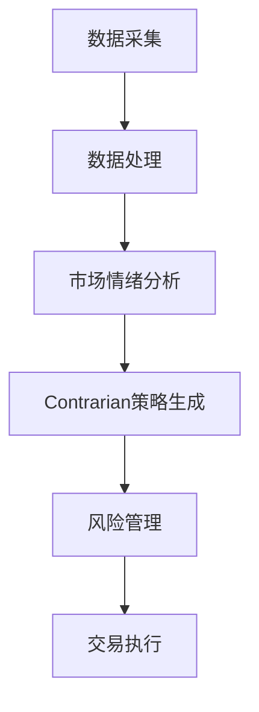

                 

# Contrarian投资：逆向思维创造超额收益

> 关键词：Contrarian投资，逆向思维，超额收益，市场情绪，套利机会，风险管理，系统架构

> 摘要：本文详细探讨了Contrarian投资策略的核心思想、数学模型、算法实现以及系统架构。通过逆向思维，投资者可以在市场无效性中发现套利机会，利用均值回归和动量策略实现超额收益。文章还结合Python代码示例，讲解了Contrarian策略的实现步骤，包括数据获取、信号生成、回测分析和风险管理，为投资者提供了一套完整的实战指南。

---

## 第1章: Contrarian投资的定义与背景

### 1.1 Contrarian投资的核心概念

#### 1.1.1 什么是Contrarian投资

Contrarian投资是一种基于逆向思维的投资策略，其核心思想是“买别人卖的，卖别人买的”。与传统的顺势投资不同，Contrarian策略关注市场中的非理性行为，寻找价格与价值的偏差，通过逆向操作来实现超额收益。这种策略尤其适用于市场无效性较高的情况，能够在市场恐慌时买入低估资产，或在市场狂热时卖出高估资产。

#### 1.1.2 Contrarian投资的历史与发展

Contrarian投资的起源可以追溯到20世纪初，但在20世纪80年代，随着行为金融学的发展，Contrarian策略逐渐成为学术界和投资界关注的焦点。近年来，随着大数据和算法交易的兴起，Contrarian投资策略在量化交易中的应用越来越广泛，尤其是在高频交易和套利策略中展现出强大的优势。

#### 1.1.3 Contrarian投资与传统投资的区别

传统投资策略通常遵循“顺势而为”的原则，即根据市场趋势进行买卖决策。而Contrarian策略则反其道而行之，强调在市场极端情绪化时进行逆向操作。传统策略注重趋势跟踪，而Contrarian策略注重价格与价值的背离，通过寻找市场错误定价的机会来获利。

### 1.2 逆向思维在投资中的重要性

#### 1.2.1 逆向思维的定义与特征

逆向思维是指在面对问题时，采取与大多数人相反的思考方式。在投资领域，逆向思维的核心在于识别市场情绪的极端化，并在此时进行反向操作。逆向思维的特征包括独立性、前瞻性和反直觉性。

#### 1.2.2 逆向思维在投资决策中的应用

Contrarian策略通过分析市场情绪和资产价格的关系，识别市场的超买或超卖信号。当市场情绪达到极端乐观时，Contrarian投资者会选择卖出；当市场情绪极度悲观时，Contrarian投资者会选择买入。

#### 1.2.3 逆向思维与市场情绪的关系

市场情绪的波动性是Contrarian策略的核心驱动力。当市场情绪过度乐观时，资产价格会被高估；当市场情绪过度悲观时，资产价格会被低估。Contrarian策略通过分析市场情绪的周期性，寻找价格与价值的偏离点，从而实现超额收益。

### 1.3 Contrarian投资的目标与策略

#### 1.3.1 超额收益的定义与衡量

超额收益是指投资组合的实际收益与无风险收益率之间的差额。在Contrarian策略中，超额收益主要通过寻找市场错误定价的机会来实现。

#### 1.3.2 Contrarian策略的核心目标

Contrarian策略的核心目标是通过逆向思维，捕捉市场情绪的极端化带来的价格波动机会，实现超额收益。

#### 1.3.3 Contrarian策略的实施路径

1. 分析市场情绪，识别价格与价值的偏离。
2. 利用均值回归和动量策略进行投资决策。
3. 通过套利机制捕捉市场无效性带来的收益。

---

## 第2章: 行为金融学与市场情绪分析

### 2.1 行为金融学的基本原理

#### 2.1.1 理性人假设与有限理性

传统金融学假设投资者是理性的，能够根据信息做出最优决策。然而，行为金融学研究表明，投资者往往受到心理偏差的影响，做出非理性决策。

#### 2.1.2 行为偏差与市场决策

行为偏差包括过度自信、从众心理、损失厌恶等，这些偏差会导致市场情绪的波动，为Contrarian策略提供了机会。

#### 2.1.3 行为金融学对Contrarian策略的启示

行为金融学揭示了市场非理性行为的规律，为Contrarian策略提供了理论基础。Contrarian投资者可以通过分析行为偏差，识别市场情绪的极端化，从而进行逆向操作。

### 2.2 市场情绪与资产价格的关系

#### 2.2.1 市场情绪的定义与测量

市场情绪是指投资者整体的心理状态，通常通过市场参与度、交易量、波动率等指标来衡量。

#### 2.2.2 市场情绪与资产价格波动

市场情绪的波动性是资产价格波动的重要驱动因素。当市场情绪乐观时，资产价格可能被高估；当市场情绪悲观时，资产价格可能被低估。

#### 2.2.3 市场情绪的周期性与非理性

市场情绪具有周期性，通常表现为乐观→狂热→恐慌→悲观→乐观的循环。Contrarian策略通过识别市场情绪的极端化，捕捉价格与价值的偏离点。

### 2.3 逆向思维与市场情绪的反向关系

#### 2.3.1 市场情绪的极端化与反转机会

当市场情绪达到极端乐观或悲观时，资产价格往往偏离其真实价值，为Contrarian投资者提供了反转机会。

#### 2.3.2 逆向思维在市场情绪周期中的应用

Contrarian策略通过分析市场情绪的周期性，识别价格与价值的偏离点，进行逆向操作。

#### 2.3.3 市场情绪分析的数学模型

市场情绪分析可以通过多种数学模型实现，例如：

1. **均值回归模型**：假设资产价格会回归其历史均值。
2. **动量模型**：假设资产价格会延续其趋势。

---

## 第3章: Contrarian策略的数学模型与算法

### 3.1 市场无效性与套利机会

#### 3.1.1 市场无效性的定义与表现

市场无效性是指资产价格与真实价值的偏离，通常由于市场参与者的行为偏差或信息不对称导致。

#### 3.1.2 市场无效性与套利机会的关系

市场无效性为套利者提供了机会，通过利用价格与价值的偏离，进行无风险或低风险的套利交易。

#### 3.1.3 套利的基本原理与分类

套利的基本原理是利用不同市场或资产之间的价格差异，通过同时买入低估资产和卖出高估资产，获取无风险收益。

套利可以分为跨市场套利、跨期套利和统计套利等类型。

### 3.2 Contrarian策略的套利模型

#### 3.2.1 套利模型的数学公式

套利收益可以通过以下公式计算：

$$ \text{套利收益} = \text{预期价格} - \text{当前价格} $$

#### 3.2.2 套利模型的实现步骤

1. 识别市场无效性，找到低估或高估的资产。
2. 进行逆向操作，买入低估资产，卖出高估资产。
3. 在价格回归合理区间后，平仓获利。

#### 3.2.3 套利模型的风险与挑战

套利模型面临的主要风险包括市场波动、交易成本和模型失效等。

### 3.3 市场无效性与Contrarian策略的结合

#### 3.3.1 市场无效性对Contrarian策略的影响

市场无效性为Contrarian策略提供了机会，通过识别价格与价值的偏离，进行逆向操作。

#### 3.3.2 Contrarian策略在套利中的应用

Contrarian策略通过分析市场情绪和价格波动，识别套利机会，进行逆向操作。

#### 3.3.3 套利模型的优化与改进

套利模型可以通过引入机器学习算法，提高预测精度和交易效率。

---

## 第4章: Contrarian策略的系统架构与实现

### 4.1 系统架构设计

#### 4.1.1 系统功能设计

Contrarian投资系统的功能模块包括：

- 数据采集与处理
- 市场情绪分析
- Contrarian策略生成
- 风险管理与控制
- 交易执行与监控

#### 4.1.2 系统架构图

### 4.2 系统实现步骤

#### 4.2.1 数据获取与预处理

使用Python的pandas库获取历史数据，并进行清洗和标准化。

#### 4.2.2 市场情绪分析

通过计算波动率、交易量等指标，分析市场情绪。

#### 4.2.3 Contrarian策略生成

基于市场情绪分析结果，生成Contrarian投资信号。

#### 4.2.4 交易执行与监控

通过交易API执行交易，并实时监控交易表现。

### 4.3 项目实战

#### 4.3.1 环境配置

安装必要的Python库，包括pandas、numpy、matplotlib等。

#### 4.3.2 数据获取与处理

使用Yahoo Finance API获取股票数据，并进行清洗和预处理。

#### 4.3.3 Contrarian策略实现

编写Python代码，实现Contrarian策略的信号生成和交易决策。

#### 4.3.4 回测分析与风险控制

通过回测分析策略的收益和风险，并优化风险管理参数。

---

## 第5章: Contrarian投资策略的最佳实践

### 5.1 策略优化与改进

通过机器学习算法优化Contrarian策略的预测精度和交易效率。

### 5.2 数据源选择与模型调优

选择高质量的数据源，并根据市场变化不断优化模型参数。

### 5.3 小结与注意事项

Contrarian策略的成功依赖于对市场情绪的准确判断和风险的有效控制。投资者需要具备逆向思维的能力，并在实践中不断优化策略。

### 5.4 拓展阅读

建议进一步阅读行为金融学的相关书籍，深入了解市场情绪与投资者行为的关系。

---

## 作者：AI天才研究院/AI Genius Institute & 禅与计算机程序设计艺术 /Zen And The Art of Computer Programming

---

通过本文的详细讲解，读者可以全面理解Contrarian投资策略的核心思想和实现方法。从理论到实践，从数学模型到系统架构，本文为投资者提供了一套完整的实战指南，帮助他们在复杂多变的市场中，通过逆向思维创造超额收益。

