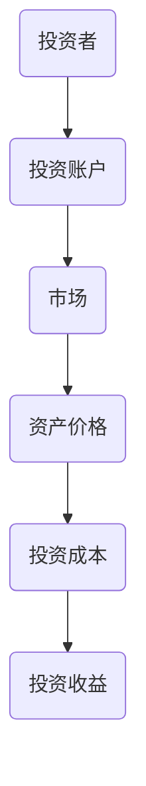

                 


# Dollar-Cost Averaging: 在波动市场中的优势

## 关键词：Dollar-Cost Averaging, 投资策略, 市场波动, 长期复利, 风险管理

## 摘要：
Dollar-Cost Averaging（DCA）是一种通过定期投资固定金额来分散投资成本的投资策略。在市场波动较大的情况下，DCA能够有效降低投资成本，优化投资组合的表现。本文将从DCA的基本原理、数学模型、系统设计和实际应用等多个角度深入分析其在波动市场中的优势，帮助投资者更好地理解和应用这一策略。

---

## 第1章: Dollar-Cost Averaging 的基本概念与背景

### 1.1 美元成本平均法的定义与起源

#### 1.1.1 投资术语基础
- **投资**：将资金投入某个资产或项目，期望在未来获得收益。
- **投资策略**：为实现投资目标而采取的系统化方法。
- **Dollar-Cost Averaging (DCA)**：定期投入固定金额，逐步建立投资组合的策略。

#### 1.1.2 美元成本平均法的定义
Dollar-Cost Averaging 是一种投资策略，通过在固定的时间间隔内投入固定金额，逐步购买资产，从而在市场波动中降低平均投资成本。

#### 1.1.3 投资策略的历史演变
- **起源**：20世纪初，DCA作为一种分散投资风险的策略逐渐被采用。
- **发展**：随着金融市场的波动加剧，DCA在机构投资和个人投资中逐渐普及。
- **现代应用**：广泛应用于股票、基金、加密货币等资产的投资中。

### 1.2 美元成本平均法的核心原理

#### 1.2.1 定投策略的基本机制
- **定期定额投资**：每月或每季度投入固定金额，无论市场涨跌。
- **平均成本法**：通过多次购买，逐步降低整体投资成本。

#### 1.2.2 市场波动对投资成本的影响
- **市场上涨**：高价时购买的份额较少，低价时购买的份额较多。
- **市场下跌**：在市场低谷时增加份额，摊低成本。

#### 1.2.3 等额本金与等额本息的对比分析
- **等额本金**：每次投入固定金额，适合波动市场。
- **等额本息**：每次支付固定利息和本金，适合稳定市场。

### 1.3 美元成本平均法的核心优势

#### 1.3.1 分散投资风险
- **时间分散**：通过定期投资，避免一次性投入的高风险。
- **价格分散**：在不同价格水平购买资产，降低市场波动的影响。

#### 1.3.2 平均投资成本
- **降低平均成本**：通过多次购买，摊薄整体投资成本。
- **应对市场波动**：在市场下跌时增加份额，提高投资效率。

#### 1.3.3 长期复利效应
- **复利效应**：长期投资中，收益的复利效应显著。
- **持续投资**：定期投资确保资金持续投入市场，抓住长期增长机会。

### 1.4 美元成本平均法的适用场景

#### 1.4.1 波动性市场的优势
- **震荡市场**：在市场波动较大时，DCA能够有效摊低成本。
- **熊市**：在市场下跌时，定期投资可以增加份额，降低平均成本。

#### 1.4.2 不同市场周期的表现
- **牛市**：DCA可能错过部分上涨机会，但长期来看收益稳定。
- **熊市**：DCA能够在市场底部积累更多份额，为后续反弹做好准备。

#### 1.4.3 个人投资者的适用性
- **适合风险承受能力较低的投资者**：通过定期投资分散风险。
- **适合长期投资者**：DCA强调长期投资，适合有耐心的投资者。

---

## 第2章: 美元成本平均法的核心概念与联系

### 2.1 核心概念原理

#### 2.1.1 投资成本的计算公式
$$
\text{平均成本} = \frac{\text{总投入金额}}{\text{总购买份额}}
$$

#### 2.1.2 定投金额与投资周期的关系
- **定投金额**：每次投入的固定金额，例如每月投入1000美元。
- **投资周期**：定投的时间间隔，例如每月一次。

#### 2.1.3 市场价格波动对投资收益的影响
- **高价时**：投入固定金额购买的份额较少。
- **低价时**：投入固定金额购买的份额较多。

### 2.2 核心概念属性对比表

| 比较维度       | 等额本金投资       | 等额本息投资       |
|----------------|------------------|------------------|
| 投资金额       | 固定金额         | 固定金额         |
| 投资周期       | 定期             | 定期             |
| 投资成本       | 平均成本         | 利息加本金        |
| 投资风险       | 较低             | 较高             |

### 2.3 实体关系图



---

## 第3章: 美元成本平均法的数学模型与公式

### 3.1 数学模型概述

#### 3.1.1 等额本金与等额本息的数学公式

- 等额本金公式：
$$
\text{每月还款额} = \frac{P}{n} + \frac{P \cdot r}{1 - (1 + r)^{-n}}
$$

- 等额本息公式：
$$
\text{每月还款额} = P \cdot \frac{r(1 + r)^n}{(1 + r)^n - 1}
$$

其中：
- \( P \)：贷款本金
- \( r \)：月利率
- \( n \)：还款月数

#### 3.1.2 投资成本与市场价格的关系

$$
\text{总投入金额} = \sum_{i=1}^{n} \text{固定金额}
$$

$$
\text{平均成本} = \frac{\text{总投入金额}}{\sum_{i=1}^{n} \frac{\text{固定金额}}{P_i}}
$$

其中：
- \( P_i \)：第 \( i \) 次购买时的资产价格

### 3.2 实际案例分析

#### 3.2.1 案例1：等额本金投资的收益计算

假设每月投入1000美元，投资期限为2年，年化收益率为5%。

$$
\text{总投入金额} = 1000 \times 24 = 24,000 \text{美元}
$$

$$
\text{总收益} = 24,000 \times (1 + 0.05)^{24} - 24,000
$$

#### 3.2.2 案例2：等额本息投资的收益计算

假设贷款本金为10,000美元，年利率为5%，还款期限为5年。

$$
\text{每月还款额} = 10,000 \times \frac{0.05(1 + 0.05)^{60}}{(1 + 0.05)^{60} - 1} \approx 180.98 \text{美元}
$$

---

## 第4章: 美元成本平均法的系统分析与架构设计

### 4.1 系统设计与优化策略

#### 4.1.1 投资组合优化
- **目标**：通过优化投资组合，降低波动性。
- **方法**：使用现代投资组合理论（MPT）进行优化。

#### 4.1.2 风险管理策略
- **止损机制**：设定止损点，避免重大损失。
- **动态调整**：根据市场变化调整投资组合。

#### 4.1.3 动态定投策略
- **调整频率**：根据市场波动调整定投时间。
- **调整金额**：根据市场情况调整每次定投的金额。

### 4.2 项目实战

#### 4.2.1 环境安装
- **工具**：Python、Pandas、Matplotlib
- **库的安装**：
  ```bash
  pip install numpy pandas matplotlib
  ```

#### 4.2.2 核心实现源代码

```python
import numpy as np
import matplotlib.pyplot as plt

def dollar_cost_averaging(price_series, investment_amount, period):
    total_investment = 0
    total_shares = 0
    for price in price_series:
        shares = investment_amount / price
        total_shares += shares
        total_investment += investment_amount
    average_cost = total_investment / total_shares
    return average_cost

# 示例价格数据
prices = np.random.normal(100, 10, 60)
prices = np.sort(prices)

# 定投金额
investment = 1000

# 计算平均成本
average_cost = dollar_cost_averaging(prices, investment, 60)
print(f"Average Cost: {average_cost:.2f}")
```

#### 4.2.3 代码应用解读与分析
- **代码功能**：计算定期定额投资的平均成本。
- **实现步骤**：
  1. 生成模拟价格数据。
  2. 计算每次定投的份额。
  3. 计算总投入和平均成本。

### 4.3 实际案例分析

#### 4.3.1 案例分析
假设某资产在60个交易日中的价格如下（简化数据）：

| 交易日 | 价格 |
|-------|------|
| 1     | 90   |
| 2     | 95   |
| 3     | 100  |
| ...    | ...   |

每次投入1000美元，计算平均成本。

#### 4.3.2 案例小结
- **结果**：平均成本低于市价的平均值。
- **原因**：在低价时购买更多份额，摊低成本。

### 4.4 小结与注意事项

#### 4.4.1 小结
- DCA的优势在于通过时间分散和价格分散降低投资成本。
- 在波动市场中，DCA能够有效应对价格波动，优化投资组合表现。

#### 4.4.2 注意事项
- **市场预测**：如果能够准确预测市场，可能需要调整投资策略。
- **费用与税收**：考虑交易费用和税务影响。
- **心理因素**：定期投资需要长期坚持，避免受市场情绪影响。

---

## 第5章: 美元成本平均法的实际应用与风险管理

### 5.1 风险管理与策略优化

#### 5.1.1 风险控制
- **止损机制**：设定止损点，避免重大损失。
- **仓位控制**：根据市场波动调整投资比例。

#### 5.1.2 动态调整策略
- **市场分析**：根据市场趋势调整定投频率。
- **估值指标**：结合市盈率、市净率等指标优化投资决策。

### 5.2 实际投资中的注意事项

#### 5.2.1 税务与费用
- **税务影响**：了解税务政策，优化投资结构。
- **交易费用**：考虑定投的交易成本。

#### 5.2.2 投资者心理
- **避免从众心理**：坚持长期投资，避免追涨杀跌。
- **保持耐心**：市场波动是暂时的，长期趋势更重要。

### 5.3 案例分析与最佳实践

#### 5.3.1 案例分析
- **投资目标**：每年投入12,000美元，投资期限为10年。
- **市场表现**：年化收益率为7%。

#### 5.3.2 最佳实践
- **定期复盘**：每年审视投资组合，调整策略。
- **持续学习**：关注市场动态，优化投资策略。

---

## 第6章: 总结与展望

### 6.1 总结
- DCA通过定期定额投资，有效降低了市场波动对投资成本的影响。
- 在波动市场中，DCA的优势在于分散风险和优化长期收益。

### 6.2 展望
- **技术进步**：利用大数据和人工智能优化投资策略。
- **市场发展**：随着市场的波动加剧，DCA的应用将更加广泛。

---

## 作者：AI天才研究院/AI Genius Institute & 禅与计算机程序设计艺术 /Zen And The Art of Computer Programming

