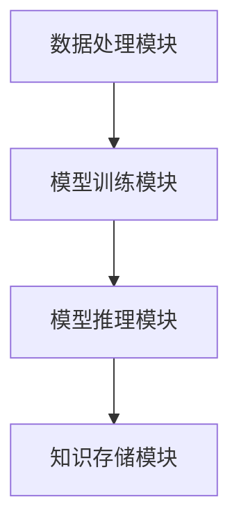

                 


# few-shot学习：减少AI Agent的训练数据需求

## 关键词：few-shot学习，AI Agent，训练数据，小样本学习，对比学习，元学习，记忆增强

## 摘要：在AI开发过程中，数据需求通常是巨大的，但few-shot学习通过优化算法，能够在小样本数据下实现高效的模型训练。本文将从few-shot学习的基本概念出发，深入探讨其核心算法原理、系统架构设计以及项目实战，帮助读者理解并掌握如何减少AI Agent的训练数据需求。

---

# 第1章: few-shot学习概述

## 1.1 few-shot学习的背景与意义
### 1.1.1 AI训练数据需求的现状
传统的深度学习模型通常需要大量的标注数据进行训练，数据获取成本高，尤其是在特定领域或小样本场景中，数据获取难度更大。

### 1.1.2 数据不足对AI模型的限制
数据不足会导致模型的训练效果差，泛化能力弱，特别是在处理复杂任务时，模型性能严重受限。

### 1.1.3 few-shot学习的核心价值
通过优化算法，few-shot学习能够在小样本数据下实现高效的模型训练，降低数据获取成本，扩展AI应用的场景。

## 1.2 few-shot学习的定义与特点
### 1.2.1 few-shot学习的定义
few-shot学习是一种机器学习方法，旨在通过少量的训练样本（例如几个或几十个）实现高效的模型训练和预测。

### 1.2.2 few-shot学习的核心特点
- **小样本数据**：能够在极少量的训练样本下完成模型训练。
- **高泛化能力**：通过算法优化，提升模型在小样本情况下的泛化能力。
- **任务多样性**：能够处理多种不同的任务，适用于多种应用场景。

## 1.3 few-shot学习的应用场景
### 1.3.1 小样本数据的处理需求
在医疗、法律、金融等领域，高质量的标注数据获取成本极高，few-shot学习能够有效解决这一问题。

### 1.3.2 few-shot学习在AI Agent中的应用
AI Agent需要在复杂环境中快速学习和适应，few-shot学习能够帮助其在有限数据下快速做出决策。

### 1.3.3 典型应用案例分析
通过具体案例分析，展示few-shot学习在实际应用中的优势和效果。

## 1.4 few-shot学习的挑战与解决方案
### 1.4.1 数据量小带来的挑战
小样本数据可能导致模型过拟合，训练不稳定。

### 1.4.2 模型泛化的难点
如何在小样本情况下提升模型的泛化能力是few-shot学习的核心挑战。

### 1.4.3 few-shot学习的优化方向
通过对比学习、元学习等方法，优化模型的泛化能力，提升学习效率。

## 1.5 本章小结

---

# 第2章: few-shot学习的核心概念与原理

## 2.1 few-shot学习的关键要素
### 2.1.1 小样本数据的处理
通过数据增强、数据预处理等方法，提升小样本数据的质量和多样性。

### 2.1.2 模型的泛化能力
通过算法优化，提升模型在小样本情况下的泛化能力。

### 2.1.3 任务的多样性
能够处理多种不同的任务，适用于多种应用场景。

## 2.2 few-shot学习的分类与对比
### 2.2.1 基于对比学习的few-shot方法
通过对比不同样本之间的特征差异，提升模型的区分能力。

### 2.2.2 基于元学习的few-shot方法
通过元学习，快速适应不同任务，提升模型的泛化能力。

### 2.2.3 基于记忆增强的few-shot方法
通过记忆机制，存储和复用已有的知识，提升模型的推理能力。

## 2.3 few-shot学习的核心原理
### 2.3.1 对比学习的原理
通过最大化正样本之间的相似性和最小化负样本之间的相似性，提升模型的区分能力。

### 2.3.2 元学习的原理
通过学习如何快速适应新任务，提升模型的泛化能力。

### 2.3.3 记忆增强机制的原理
通过存储和复用已有的知识，提升模型的推理能力。

## 2.4 few-shot学习的数学模型
### 2.4.1 对比学习的损失函数
$$ L = \frac{1}{N}\sum_{i=1}^{N} \log\left(\frac{e^{sim(x_i, x_j)}}{e^{sim(x_i, x_k)}}\right) $$

### 2.4.2 元学习的优化目标
$$ \min_{\theta} \mathbb{E}_{\task} \mathbb{E}_{\data} L(\theta; \task, \data) + \lambda \mathbb{E}_{\task} \mathbb{E}_{\data'} L(\theta'; \task, \data') $$

### 2.4.3 记忆增强的数学表达
$$ f(x) = g(x, m) $$

## 2.5 本章小结

---

# 第3章: few-shot学习的算法原理

## 3.1 对比学习算法原理
### 3.1.1 对比学习的核心思想
通过对比正样本和负样本之间的相似性，提升模型的区分能力。

### 3.1.2 对比学习的实现步骤
1. 数据预处理：增强数据多样性。
2. 特征提取：提取样本的特征表示。
3. 对比损失计算：计算正样本和负样本之间的相似性。

### 3.1.3 对比学习的数学公式
$$ L = \log\left(\frac{e^{sim(x_i, x_j)}}{e^{sim(x_i, x_k)}}\right) $$

## 3.2 元学习算法原理
### 3.2.1 元学习的核心思想
通过学习如何快速适应新任务，提升模型的泛化能力。

### 3.2.2 元学习的实现步骤
1. 元任务定义：定义多个不同任务。
2. 任务适应：通过元学习器快速适应新任务。
3. 模型优化：优化元学习器的参数，提升整体性能。

### 3.2.3 元学习的数学公式
$$ \min_{\theta} \mathbb{E}_{\task} \mathbb{E}_{\data} L(\theta; \task, \data) $$

## 3.3 记忆增强算法原理
### 3.3.1 记忆增强的核心思想
通过存储和复用已有的知识，提升模型的推理能力。

### 3.3.2 记忆增强的实现步骤
1. 知识存储：将已有的知识存储在记忆库中。
2. 知识复用：在推理时，结合当前输入和记忆库中的知识，进行推理。

### 3.3.3 记忆增强的数学公式
$$ f(x) = g(x, m) $$

## 3.4 本章小结

---

# 第4章: few-shot学习的系统架构设计

## 4.1 系统功能设计
### 4.1.1 数据处理模块
- 数据预处理：增强数据多样性。
- 数据增强：提升数据质量。

### 4.1.2 模型训练模块
- 特征提取：提取样本的特征表示。
- 对比学习：计算正样本和负样本之间的相似性。

### 4.1.3 模型推理模块
- 知识存储：将已有的知识存储在记忆库中。
- 知识复用：在推理时，结合当前输入和记忆库中的知识，进行推理。

## 4.2 系统架构设计
### 4.2.1 系统架构图


### 4.2.2 系统接口设计
- 数据接口：提供数据输入和输出接口。
- 模型接口：提供模型训练和推理接口。

## 4.3 本章小结

---

# 第5章: few-shot学习的项目实战

## 5.1 项目介绍
### 5.1.1 项目背景
介绍项目的研究背景和目标。

### 5.1.2 项目需求
详细描述项目的具体需求和目标。

## 5.2 环境安装
### 5.2.1 安装依赖
- Python 3.8+
- PyTorch 1.9+
- transformers库

### 5.2.2 环境配置
提供环境配置的具体步骤和命令。

## 5.3 核心代码实现
### 5.3.1 数据处理代码
```python
def preprocess_data(data):
    # 数据预处理代码
    pass
```

### 5.3.2 模型训练代码
```python
def train_model(model, optimizer, criterion, data_loader):
    # 模型训练代码
    pass
```

### 5.3.3 模型推理代码
```python
def inference_model(model, data):
    # 模型推理代码
    pass
```

## 5.4 案例分析
### 5.4.1 数据分析
分析数据的特征和分布。

### 5.4.2 模型性能分析
评估模型在小样本情况下的性能表现。

## 5.5 项目小结
总结项目的实现过程和成果。

---

# 第6章: few-shot学习的最佳实践

## 6.1 小结
总结few-shot学习的核心思想和实现方法。

## 6.2 注意事项
### 6.2.1 数据质量的重要性
强调数据质量对模型性能的影响。

### 6.2.2 模型选择的注意事项
在选择模型时，需要考虑模型的复杂度和泛化能力。

## 6.3 拓展阅读
推荐相关的技术论文和书籍，供读者深入学习。

---

# 作者：AI天才研究院/AI Genius Institute & 禅与计算机程序设计艺术 /Zen And The Art of Computer Programming

