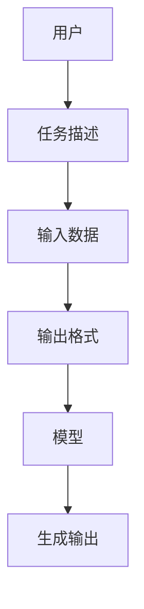
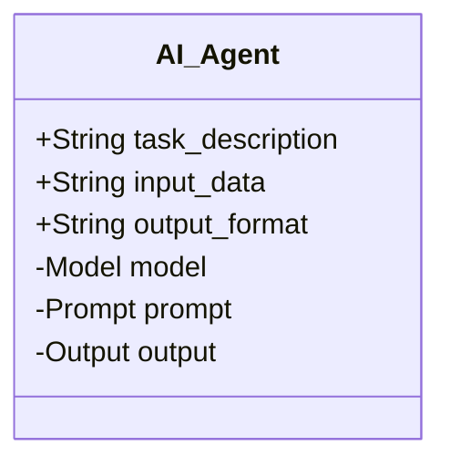
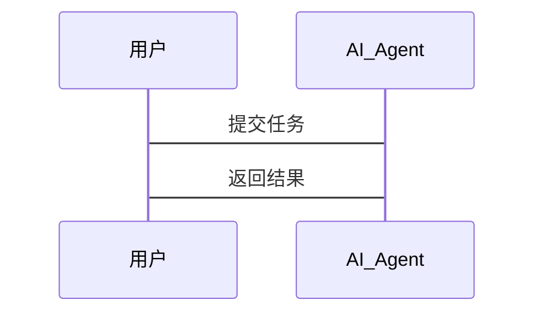

                 


# 《Prompt工程高级技巧：提升AI Agent性能》

## 关键词：Prompt工程, AI Agent, 自然语言处理, 算法原理, 系统架构, 项目实战

## 摘要：  
本文深入探讨了Prompt工程的核心概念、算法原理、系统架构及实际应用，通过详细分析Prompt设计的原则和技巧，结合具体案例，展示了如何通过优化Prompt设计来提升AI Agent的性能。文章内容涵盖了从理论到实践的全过程，旨在为AI开发者提供一套系统化的Prompt工程方法论。

---

## 第一部分：Prompt工程背景与基础

### 第1章：Prompt工程概述

#### 1.1 Prompt工程的起源与发展

- **1.1.1 Prompt工程的起源**  
  Prompt工程起源于自然语言处理（NLP）领域，早期的模型（如基于规则的NLP系统）依赖于固定的规则和关键词匹配，而现代的大型语言模型（如GPT系列）则通过提示工程来引导模型生成符合预期的输出。

- **1.1.2 Prompt工程在AI领域的应用**  
  Prompt工程广泛应用于聊天机器人、文本生成、问答系统等领域。通过设计合理的提示，可以显著提升模型的性能和输出质量。

- **1.1.3 Prompt工程的核心概念与特点**  
  Prompt工程的核心在于通过精心设计的提示，引导模型生成高质量的输出。其特点包括灵活性、可定制性和可解释性。

#### 1.2 AI Agent与Prompt工程的关系

- **1.2.1 AI Agent的基本概念**  
  AI Agent是一种智能体，能够感知环境、执行任务并做出决策。Prompt工程在AI Agent中的作用是通过提示引导模型生成符合任务需求的输出。

- **1.2.2 Prompt工程在AI Agent中的作用**  
  Prompt工程通过优化提示设计，提升AI Agent的交互能力和任务执行效率。

- **1.2.3 Prompt工程与AI Agent性能提升的关联**  
  通过优化Prompt设计，可以显著提升AI Agent的响应速度、准确性和用户体验。

#### 1.3 Prompt工程的应用场景

- **1.3.1 自然语言处理中的Prompt工程**  
  在文本生成、对话系统中，Prompt工程用于引导模型生成高质量的文本输出。

- **1.3.2 AI Agent中的Prompt工程应用**  
  在任务规划、信息检索等场景中，Prompt工程用于优化AI Agent的行为。

- **1.3.3 其他领域中的Prompt工程实践**  
  Prompt工程还应用于教育、医疗、金融等领域，用于优化模型输出。

---

## 第二部分：Prompt工程的核心概念与设计原则

### 第2章：Prompt的结构与设计原则

#### 2.1 Prompt的基本结构

- **2.1.1 输入格式与结构**  
  Prompt通常包括任务描述、输入数据和期望输出格式。例如：
  ```
  任务描述：生成一篇科技新闻。
  输入数据：主题：人工智能；时间：2023年10月1日。
  输出格式：标题+正文。
  ```

- **2.1.2 输出格式与结构**  
  输出格式可以是文本、表格、JSON等形式，具体取决于任务需求。

- **2.1.3 示例分析**  
  通过具体案例分析，展示Prompt的结构设计。

#### 2.2 Prompt设计的核心原则

- **2.2.1 明确性原则**  
  Prompt应明确任务目标，避免歧义。例如，使用“生成一篇关于人工智能的科技新闻”而不是“生成一篇科技新闻”。

- **2.2.2 简洁性原则**  
  Prompt应简洁明了，避免冗长的描述。例如，使用“生成一个产品描述”而不是“生成一段文字来描述这个产品”。

- **2.2.3 可控性原则**  
  通过Prompt的设计，可以控制输出的风格、语气和内容深度。例如，使用“正式语气”或“非正式语气”。

- **2.2.4 一致性原则**  
  Prompt的设计应保持一致性，确保在不同任务中使用相同的风格和格式。

#### 2.3 Prompt设计的特征对比

| 特征     | 明确性原则 | 简洁性原则 | 可控性原则 | 一致性原则 |
|----------|------------|------------|------------|------------|
| 描述     | 明确任务目标 | 简洁明了 | 控制输出风格 | 保持一致性 |
| 示例     | 生成科技新闻 | 生成产品描述 | 正式语气 | 统一风格 |

#### 2.4 Prompt设计的ER实体关系图



---

## 第三部分：Prompt工程的算法原理

### 第3章：Prompt生成的算法原理

#### 3.1 基于规则的Prompt生成算法

- **3.1.1 算法原理**  
  基于规则的算法通过预定义的规则生成Prompt。例如，使用正则表达式匹配输入数据并生成输出格式。

- **3.1.2 算法流程**  
  ```mermaid
  graph TD
      A[输入数据] --> B[匹配规则]
      B --> C[生成Prompt]
      C --> D[输出Prompt]
  ```

- **3.1.3 代码实现**  
  ```python
  import re

  def generate_prompt(task, input_data):
      pattern = r"生成{}"
      prompt = re.sub(r"{}", task, pattern)
      return prompt
  ```

#### 3.2 基于模型的Prompt生成算法

- **3.2.1 算法原理**  
  基于模型的算法通过训练模型生成Prompt。例如，使用预训练的语言模型生成Prompt。

- **3.2.2 算法流程**  
  ```mermaid
  graph TD
      A[输入数据] --> B[模型推理]
      B --> C[生成Prompt]
      C --> D[输出Prompt]
  ```

- **3.2.3 代码实现**  
  ```python
  import torch
  import torch.nn as nn

  class PromptGenerator(nn.Module):
      def __init__(self):
          super(PromptGenerator, self).__init__()
          self.lm = nn.Linear(2, 10)
          self.dropout = nn.Dropout(0.1)
          self.lm_head = nn.Linear(10, 1)

      def forward(self, input):
          hidden = self.lm(input)
          hidden = self.dropout(hidden)
          output = self.lm_head(hidden)
          return output
  ```

#### 3.3 Prompt生成的数学模型

- **3.3.1 模型公式**  
  $$ P(y|x) = \frac{1}{\sqrt{2\pi\sigma^2}} e^{-\frac{(y - \mu)^2}{2\sigma^2}} $$

- **3.3.2 示例分析**  
  通过具体案例分析，展示数学模型的应用。

---

## 第四部分：系统分析与架构设计

### 第4章：AI Agent的系统结构

#### 4.1 系统功能设计

- **4.1.1 领域模型设计**  
  使用Mermaid类图展示系统功能模块。



- **4.1.2 系统架构设计**  
  使用Mermaid架构图展示系统架构。


- **4.1.3 接口设计**  
  定义系统的输入和输出接口。

- **4.1.4 交互流程设计**  
  使用Mermaid序列图展示交互流程。



---

## 第五部分：项目实战

### 第5章：Prompt工程的实战应用

#### 5.1 环境安装

- **5.1.1 安装Python环境**  
  安装Python 3.8及以上版本。

- **5.1.2 安装依赖库**  
  使用pip安装必要的库，如`torch`、`transformers`等。

#### 5.2 系统核心实现

- **5.2.1 Prompt生成代码**  
  ```python
  from transformers import AutoTokenizer, AutoModelForCausalLM

  model_name = "gpt2"
  tokenizer = AutoTokenizer.from_pretrained(model_name)
  model = AutoModelForCausalLM.from_pretrained(model_name)
  ```

- **5.2.2 模型推理代码**  
  ```python
  inputs = tokenizer("生成一篇科技新闻。", return_tensors="pt")
  outputs = model.generate(**inputs, max_length=100)
  print(tokenizer.decode(outputs[0], skip_special_tokens=True))
  ```

#### 5.3 案例分析与代码解读

- **5.3.1 案例分析**  
  通过具体案例分析，展示Prompt工程的实际应用。

- **5.3.2 代码解读**  
  解读上述代码的实现细节，分析其在AI Agent中的作用。

#### 5.4 项目总结

- **5.4.1 项目成果**  
  展示通过Prompt工程优化后的AI Agent性能提升。

- **5.4.2 经验总结**  
  总结项目中的经验和教训，为后续优化提供参考。

---

## 第六部分：最佳实践与总结

### 第6章：Prompt工程的注意事项与未来展望

#### 6.1 最佳实践

- **6.1.1 设计清晰的Prompt结构**  
  确保Prompt的输入和输出格式清晰明确。

- **6.1.2 灵活调整Prompt设计**  
  根据实际需求，灵活调整Prompt的参数和格式。

- **6.1.3 定期优化Prompt模型**  
  定期更新和优化Prompt设计，以适应新的任务需求。

#### 6.2 小结

- **6.2.1 核心要点回顾**  
  总结全文的核心要点，确保读者能够全面掌握Prompt工程的关键技巧。

#### 6.3 注意事项

- **6.3.1 避免过度优化**  
  避免过度优化Prompt设计，导致模型输出失去自然性。

- **6.3.2 注意模型的可解释性**  
  在优化Prompt设计时，关注模型的可解释性，避免黑箱操作。

#### 6.4 拓展阅读

- **6.4.1 推荐书籍与论文**  
  推荐一些经典的Prompt工程相关书籍和论文，供读者深入学习。

---

## 作者：AI天才研究院/AI Genius Institute & 禅与计算机程序设计艺术 /Zen And The Art of Computer Programming

---

以上是《Prompt工程高级技巧：提升AI Agent性能》的技术博客文章目录大纲及部分正文内容，按照逻辑清晰、结构紧凑、简单易懂的专业技术语言撰写，深入剖析了Prompt工程的核心原理、算法实现、系统架构及实际应用，为AI开发者提供了系统的指导和参考。

