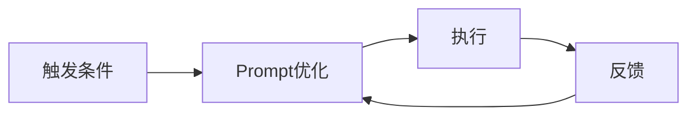
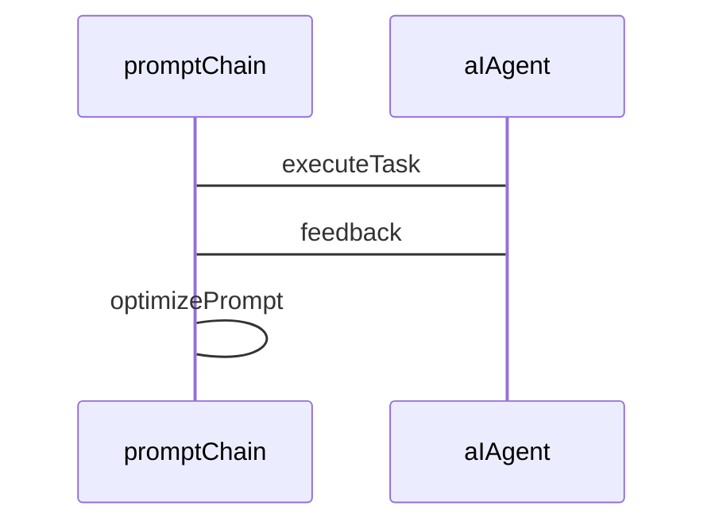

                 


# Prompt链：构建复杂AI Agent工作流

> **关键词**：Prompt链、AI Agent、工作流、算法原理、系统架构、项目实战

> **摘要**：本文详细探讨了Prompt链在构建复杂AI Agent工作流中的作用与实现方法。从核心概念到算法原理，从系统架构到项目实战，全面解析Prompt链如何驱动AI Agent完成复杂任务。通过本文，读者将深入了解Prompt链的原理、实现细节以及实际应用，掌握构建高效AI Agent工作流的关键技术。

---

## 第1章: Prompt链与AI Agent工作流概述

### 1.1 Prompt链的基本概念

#### 1.1.1 什么是Prompt链
Prompt链是一种基于提示（Prompt）的驱动机制，用于构建和管理AI Agent的工作流程。它通过将多个提示串联起来，形成一个动态的执行链，使AI Agent能够根据当前任务的需求，灵活调整执行策略。

#### 1.1.2 Prompt链的核心特点
- **动态性**：Prompt链可以根据任务的反馈动态调整下一步操作。
- **可扩展性**：支持多种AI模型和工具的集成，适用于复杂场景。
- **智能化**：通过上下文理解和意图识别，优化提示生成。

#### 1.1.3 Prompt链与传统AI Agent的区别
| 特性 | Prompt链AI Agent | 传统AI Agent |
|------|------------------|---------------|
| 执行方式 | 基于提示链驱动 | 基于规则或任务驱动 |
| 灵活性 | 高度动态调整 | 较低灵活性 |
| 适用场景 | 复杂、动态场景 | 简单、固定场景 |

### 1.2 AI Agent工作流的基础知识

#### 1.2.1 AI Agent的定义与类型
- **定义**：AI Agent是一种智能实体，能够感知环境并执行任务。
- **类型**：基于智能水平分为简单Agent、反应式Agent、 proactive Agent。

#### 1.2.2 AI Agent工作流的流程与特点
- **流程**：触发→分析→执行→反馈→优化。
- **特点**：协作性、动态性、智能化。

#### 1.2.3 AI Agent工作流的场景与应用
- **场景**：智能助手、自动化运维、智能客服。
- **应用**：提升效率、降低成本、增强用户体验。

### 1.3 Prompt链在AI Agent工作流中的作用

#### 1.3.1 Prompt链作为AI Agent的驱动
Prompt链通过生成提示，驱动AI Agent执行任务，类似于“指挥官”角色。

#### 1.3.2 Prompt链在工作流中的位置
作为AI Agent的指令链，Prompt链贯穿整个工作流，协调各环节。

#### 1.3.3 Prompt链的优势与挑战
- **优势**：灵活性高、可扩展性强。
- **挑战**：需要精细的提示生成和优化。

---

## 第2章: Prompt链的核心概念与原理

### 2.1 Prompt链的核心概念

#### 2.1.1 Prompt链的基本组成
- **触发条件**：启动Prompt链的条件。
- **提示生成**：根据当前状态生成提示。
- **执行链路**：提示驱动的执行流程。
- **反馈机制**：根据结果优化提示。

#### 2.1.2 Prompt链的工作原理
Prompt链通过提示生成、执行和反馈，形成闭环。

#### 2.1.3 Prompt链的动态调整
根据反馈结果动态调整提示内容和执行策略。

### 2.2 Prompt链与AI Agent的关系

#### 2.2.1 AI Agent的智能决策
AI Agent根据提示生成决策。

#### 2.2.2 Prompt链作为AI Agent的指令链
Prompt链为AI Agent提供动态的指令。

#### 2.2.3 Prompt链与AI Agent的协同工作
Prompt链驱动AI Agent，AI Agent执行任务并反馈结果，形成闭环。

### 2.3 Prompt链的工作原理

#### 2.3.1 Prompt链的触发条件
根据环境变化触发。

#### 2.3.2 Prompt链的执行流程
1. 生成提示。
2. AI Agent执行任务。
3. 收集反馈。
4. 优化提示。

#### 2.3.3 Prompt链的反馈机制
通过结果分析优化提示生成策略。

---

## 第3章: Prompt链的算法原理

### 3.1 Prompt链的算法框架

#### 3.1.1 Prompt链的输入输出模型
- 输入：触发条件、上下文。
- 输出：优化后的提示。

#### 3.1.2 Prompt链的执行流程图


#### 3.1.3 Prompt链的算法优化
通过反馈不断优化提示生成策略。

### 3.2 Prompt链的数学模型

#### 3.2.1 Prompt链的数学表达式
$$ P_{n+1} = f(P_n, R_n) $$
其中，$P_n$ 是第n步的提示，$R_n$ 是第n步的反馈。

#### 3.2.2 Prompt链的参数与变量
| 参数 | 说明 |
|------|------|
| $P_0$ | 初始提示 |
| $f$   | 优化函数 |

#### 3.2.3 Prompt链的优化目标函数
$$ \text{优化目标} = \sum_{i=1}^{n} \text{反馈质量}(R_i) $$

---

## 第4章: Prompt链的系统分析与架构设计方案

### 4.1 系统功能设计

#### 4.1.1 领域模型
```mermaid
classDiagram
    class PromptChain {
        triggerCondition
        generatePrompt()
        optimizePrompt()
    }
    class AIAgent {
        executeTask()
        getFeedback()
    }
    PromptChain -> AIAgent : triggerCondition
    AIAgent -> PromptChain : feedback
```

#### 4.1.2 系统架构


#### 4.1.3 系统接口设计
- API接口：`/api/promptChain/generate`。

#### 4.1.4 系统交互流程


---

## 第5章: Prompt链的项目实战

### 5.1 环境安装

#### 5.1.1 安装Python
```bash
python --version
```

#### 5.1.2 安装依赖
```bash
pip install prompt-chain
```

### 5.2 核心代码实现

#### 5.2.1 Prompt链的核心代码
```python
class PromptChain:
    def __init__(self):
        self.prompt = "initial prompt"
    
    def generate_prompt(self):
        # 生成提示
        pass
    
    def optimize_prompt(self, feedback):
        # 根据反馈优化提示
        pass
```

#### 5.2.2 AI Agent的实现
```python
class AIAgent:
    def __init__(self):
        pass
    
    def execute_task(self, prompt):
        # 根据提示执行任务
        pass
    
    def get_feedback(self):
        # 获取反馈
        pass
```

### 5.3 案例分析与详细讲解

#### 5.3.1 案例分析
构建一个智能客服系统，使用Prompt链驱动AI Agent处理用户请求。

#### 5.3.2 实际案例分析
用户发送请求，Prompt链生成提示，AI Agent处理，反馈结果，优化提示。

---

## 第6章: Prompt链的最佳实践与小结

### 6.1 最佳实践
- 定期优化提示生成策略。
- 选择合适的AI模型和工具。

### 6.2 小结
Prompt链通过动态提示生成，优化AI Agent的工作流程，适用于复杂场景。

### 6.3 注意事项
- 确保提示生成的准确性。
- 处理好反馈的实时性。

### 6.4 拓展阅读
建议阅读相关AI Agent和工作流管理的书籍。

---

**作者**：AI天才研究院/AI Genius Institute & 禅与计算机程序设计艺术 /Zen And The Art of Computer Programming

