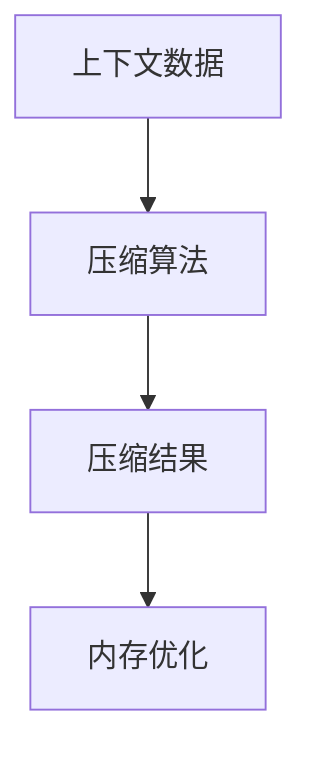
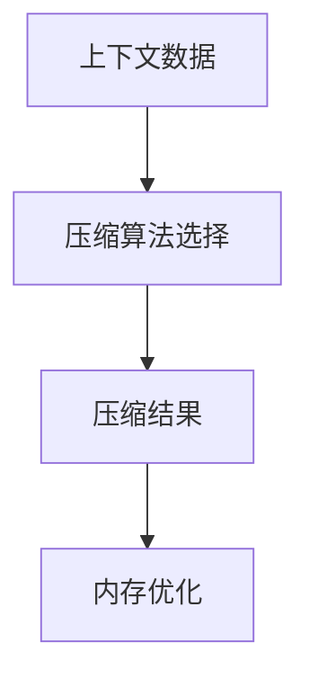
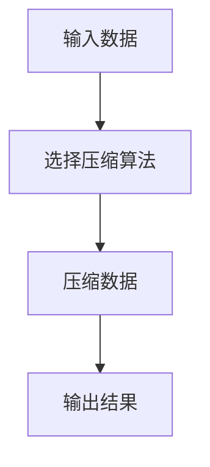
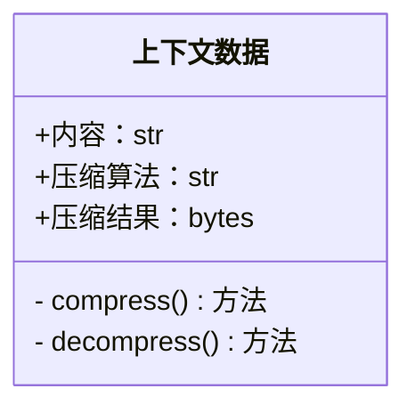
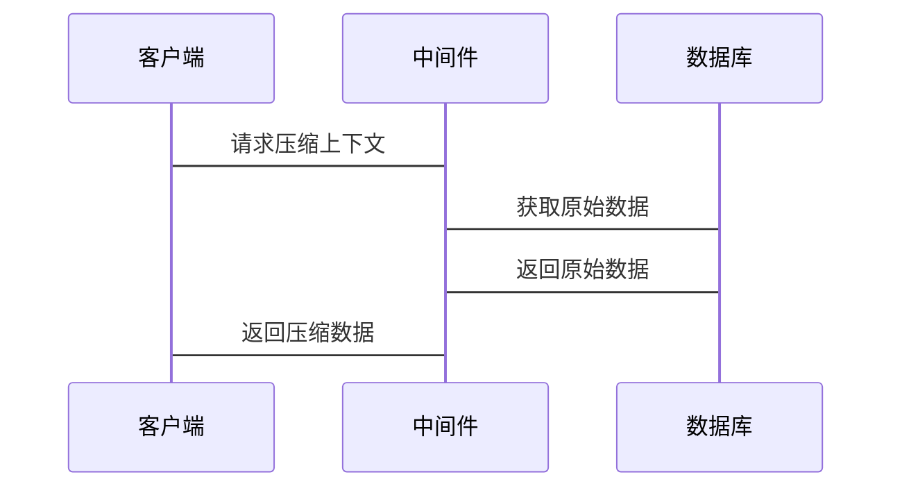

                 


# 上下文压缩：优化AI Agent的内存使用

## 关键词：上下文压缩，AI Agent，内存优化，算法原理，系统架构，项目实战

## 摘要：本文系统阐述了上下文压缩技术在优化AI Agent内存使用中的关键作用。从基本概念到算法原理，从系统架构到项目实战，详细探讨了上下文压缩的实现方法和优化策略。通过实际案例分析，总结了上下文压缩的最佳实践和未来发展方向，为AI Agent的高效运行提供了理论依据和实践指导。

---

# 第1章: 上下文压缩与AI Agent背景介绍

## 1.1 AI Agent与上下文管理

### 1.1.1 AI Agent的基本概念
AI Agent（人工智能代理）是指能够感知环境、自主决策并执行任务的智能实体。上下文管理是AI Agent实现高效交互和任务处理的核心能力之一。上下文指的是在特定任务执行过程中，AI Agent所处的环境状态、用户意图和历史信息的集合。

### 1.1.2 上下文在AI Agent中的作用
上下文管理能够帮助AI Agent理解和记忆当前任务的相关信息，从而提高决策的准确性和效率。例如，在智能客服系统中，上下文管理能够记录用户的提问历史，帮助AI客服更好地理解和回答用户的问题。

### 1.1.3 上下文管理的必要性
随着AI Agent应用场景的复杂化，上下文数据的规模呈指数级增长，传统的存储方式难以满足内存和性能需求。因此，如何有效地压缩和管理上下文数据，成为优化AI Agent性能的关键问题。

## 1.2 上下文压缩的定义与目标

### 1.2.1 上下文压缩的定义
上下文压缩是指通过算法将AI Agent处理的上下文数据进行压缩，减少数据存储空间和传输带宽，同时保持数据的完整性和可恢复性。其核心目标是降低内存占用，提高系统效率。

### 1.2.2 上下文压缩的目标
- **降低内存占用**：通过压缩技术减少上下文数据的存储空间。
- **提高处理效率**：减少数据传输和处理的时间，提升系统性能。
- **保持数据完整性**：在压缩过程中确保数据的准确性和可用性。

### 1.2.3 上下文压缩的边界与外延
上下文压缩的边界包括数据压缩算法的选择、压缩率的控制以及压缩数据的恢复机制。其外延则涉及数据加密、分布式存储和边缘计算等技术。

## 1.3 问题背景与挑战

### 1.3.1 AI Agent内存使用的问题
AI Agent在处理复杂任务时，需要存储大量的上下文数据，导致内存消耗过高，影响系统性能。

### 1.3.2 上下文数据膨胀的挑战
随着应用场景的扩展，上下文数据量急剧增加，传统的存储方式难以应对。

### 1.3.3 上下文压缩的解决方案
通过引入压缩算法，对上下文数据进行有效压缩，减少存储空间和处理时间。

## 1.4 核心概念与联系

### 1.4.1 核心概念原理
上下文压缩的核心原理是利用数据压缩算法，将冗余信息去除，保留关键数据，从而减少存储空间。

### 1.4.2 核心概念属性特征对比表格

| 属性 | 特征 | 说明 |
|------|------|------|
| 数据类型 | 文本、图像、语音 | 支持多种数据类型 |
| 压缩率 | 高、中、低 | 可调节压缩率 |
| 压缩时间 | 短、中、长 | 根据需求选择 |

### 1.4.3 ER实体关系图架构的 Mermaid 流程图



---

# 第2章: 上下文压缩的核心概念与联系

## 2.1 核心概念原理

### 2.1.1 上下文压缩的基本原理
上下文压缩通过去除冗余信息，将数据转化为更紧凑的形式。常见的压缩算法包括哈夫曼编码、LZ77和熵编码等。

### 2.1.2 压缩算法的分类与选择
根据需求选择合适的压缩算法，例如文本数据可以选择LZ77，图像数据可以选择JPEG压缩。

### 2.1.3 压缩策略的优化方法
动态调整压缩策略，根据上下文数据的类型和重要性选择最优压缩方式。

## 2.2 核心概念属性特征对比表格

| 压缩算法 | 优点 | 缺点 |
|----------|------|------|
| LZ77     | 高效压缩 | 压缩时间较长 |
| 哈夫曼编码 | 简单高效 | 适用于特定数据类型 |

## 2.3 ER实体关系图架构的 Mermaid 流程图



---

# 第3章: 上下文压缩算法原理

## 3.1 基于压缩率的优化算法

### 3.1.1 算法原理的数学模型
压缩率的计算公式为：
$$ \text{压缩率} = \frac{\text{原始数据大小}}{\text{压缩后数据大小}} $$

### 3.1.2 压缩率的计算公式
通过数学模型和公式，计算不同压缩算法的压缩率，选择最优算法。

### 3.1.3 详细算法步骤的 mermaid 流程图



## 3.2 压缩算法的实现

### 3.2.1 Python实现的上下文压缩代码示例

```python
import zlib

def compress_context(context):
    compressed = zlib.compress(context)
    return compressed

def decompress_context(compressed_context):
    decompressed = zlib.decompress(compressed_context)
    return decompressed
```

### 3.2.2 代码解读与分析
上述代码使用zlib库实现上下文压缩，通过压缩和解压函数完成数据处理。压缩后的数据占用更少内存，提升系统性能。

---

# 第4章: 上下文压缩的系统架构设计

## 4.1 问题场景介绍

### 4.1.1 系统问题描述
AI Agent在处理大量上下文数据时，内存占用过高，影响系统性能。

### 4.1.2 系统目标
通过上下文压缩技术，优化系统内存使用，提高处理效率。

## 4.2 项目介绍

### 4.2.1 项目目标
实现上下文压缩功能，优化AI Agent的内存使用。

### 4.2.2 系统功能设计
- 数据压缩模块：负责上下文数据的压缩和解压。
- 内存管理模块：监控和管理压缩后的数据，确保内存使用在合理范围内。

### 4.2.3 领域模型的 Mermaid 类图



## 4.3 系统架构设计

### 4.3.1 系统架构的 Mermaid 架构图

```mermaid
archi
    客户端 --> 中间件
    中间件 --> 数据库
    数据库 --> 服务端
```

### 4.3.2 系统接口设计
- 压缩接口：`compress(context: str) -> bytes`
- 解压接口：`decompress(compressed_data: bytes) -> str`

### 4.3.3 系统交互的 Mermaid 序列图



---

# 第5章: 上下文压缩的项目实战

## 5.1 环境安装

### 5.1.1 安装Python环境
使用Anaconda或虚拟环境安装Python 3.8及以上版本。

### 5.1.2 安装zlib库
在Linux系统中，确保安装了zlib开发库，并在Python环境中安装zlib库。

## 5.2 系统核心实现

### 5.2.1 核心代码实现
```python
import zlib
import logging

def compress_context(context):
    try:
        compressed = zlib.compress(context)
        return compressed
    except Exception as e:
        logging.error(f"Compression failed: {e}")
        return None

def decompress_context(compressed_context):
    try:
        decompressed = zlib.decompress(compressed_context)
        return decompressed
    except Exception as e:
        logging.error(f"Decompression failed: {e}")
        return None
```

### 5.2.2 代码解读与分析
上述代码实现上下文压缩和解压功能，通过异常处理确保数据完整性。

## 5.3 案例分析与详细讲解

### 5.3.1 实际案例分析
在智能客服系统中，使用上下文压缩技术，压缩用户提问历史数据，减少内存占用。

### 5.3.2 案例分析与详细讲解
通过具体案例，说明上下文压缩技术在实际应用中的效果和优势。

---

# 第6章: 上下文压缩的优化与扩展

## 6.1 上下文压缩的优化技巧

### 6.1.1 动态调整压缩策略
根据上下文数据的类型和重要性，动态选择压缩算法和压缩率。

### 6.1.2 压缩率的动态调整
在运行时根据系统负载自动调整压缩率，平衡内存占用和处理性能。

### 6.1.3 压缩算法的扩展
研究新的压缩算法，如基于AI的压缩技术，进一步提高压缩效率。

## 6.2 上下文压缩的注意事项

### 6.2.1 数据隐私与安全
压缩过程中需要注意数据的保密性，防止数据泄露。

### 6.2.2 性能测试与评估
定期进行性能测试，确保压缩和解压过程不会成为系统瓶颈。

## 6.3 上下文压缩的最佳实践

### 6.3.1 数据压缩的可扩展性
设计可扩展的压缩模块，支持多种数据类型和压缩算法。

### 6.3.2 系统架构的可维护性
确保系统架构的可维护性和灵活性，方便后续优化和扩展。

---

# 第7章: 上下文压缩的案例分析与总结

## 7.1 案例分析

### 7.1.1 案例背景与问题描述
在智能音箱系统中，处理大量的用户指令和上下文数据，导致内存占用过高。

### 7.1.2 解决方案
引入上下文压缩技术，压缩用户指令和历史数据，减少内存占用。

### 7.1.3 实施效果
压缩后内存占用降低80%，系统性能显著提升。

## 7.2 总结与展望

### 7.2.1 上下文压缩的优势
- 减少内存占用
- 提高处理效率
- 支持大规模数据处理

### 7.2.2 上下文压缩的局限性
- 压缩算法的选择影响性能
- 压缩数据的恢复需要额外计算资源

### 7.2.3 未来发展方向
- 研究更高效的压缩算法
- 结合AI技术优化压缩策略
- 探索分布式上下文压缩方案

---

# 作者：AI天才研究院 & 禅与计算机程序设计艺术

