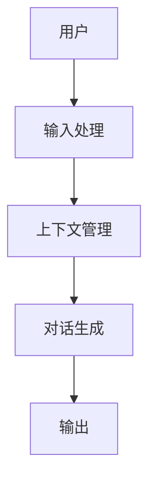
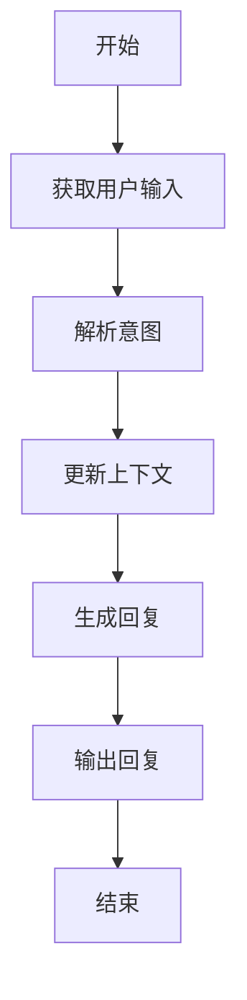

                 


# 上下文管理：增强AI Agent的对话连贯性

> 关键词：上下文管理，AI Agent，对话连贯性，自然语言处理，对话系统，上下文理解

> 摘要：本文详细探讨了上下文管理在增强AI Agent对话连贯性中的关键作用。通过分析上下文管理的核心概念、算法原理、系统架构和实际应用，本文为构建更智能、更自然的对话系统提供了理论和实践指导。

---

# 第一部分：上下文管理的背景与概念

## 第1章：问题背景与概念解析

### 1.1 对话连贯性的挑战

在人机交互中，对话的连贯性是衡量用户体验的重要指标。当AI Agent无法有效处理上下文信息时，对话可能会显得零散、重复或不相关。例如：

- 用户：我今天没吃饭，有点饿。
- AI Agent：好的，您需要我帮您做什么？

在这种情况下，AI Agent未能结合上下文信息提供更有针对性的回应。

### 1.2 上下文管理的定义

上下文管理是指在对话过程中，系统能够理解和维护当前对话的相关信息，包括对话历史、用户意图和主题等，以确保对话的连贯性和相关性。

### 1.3 上下文管理的关键要素

- **对话历史**：过去的对话内容，包括用户和AI Agent的交互记录。
- **用户意图**：用户在当前对话中希望实现的目标。
- **主题跟踪**：确保对话围绕一个核心主题展开。

---

## 第2章：上下文管理的核心概念与联系

### 2.1 上下文表示的原理

上下文表示是将对话历史转化为可处理的格式，通常采用向量表示。例如，使用词嵌入（Word Embedding）将文本转化为向量，便于后续处理。

### 2.2 对话历史与上下文的关系

对话历史是上下文的重要组成部分，但上下文还包括对意图和主题的理解。例如：

- 对话历史：用户提到“饿”，AI Agent需要理解用户的意图可能是寻找餐馆。

### 2.3 实时上下文感知

实时上下文感知是指AI Agent在对话过程中动态更新上下文信息，确保每次回复都基于最新的信息。

---

# 第二部分：上下文管理的算法原理

## 第3章：算法原理概述

### 3.1 上下文表示方法

- **基于向量的表示**：将对话内容转化为向量，便于计算相似度。
- **序列模型**：使用LSTM或Transformer等模型捕捉对话的时序信息。

### 3.2 对话状态管理

对话状态管理涉及对当前对话状态的更新和维护，通常包括：

1. 用户当前的意图。
2. 对话的主题。
3. 需要补充的信息。

### 3.3 上下文推理机制

上下文推理是指根据上下文信息推断出潜在的需求或意图。例如：

- 用户提到“饿”，AI Agent推理出用户可能需要餐馆推荐。

---

## 第4章：数学模型与公式

### 4.1 上下文相似度计算

使用余弦相似度计算两个文本的相似度：

$$ \text{sim}(A, B) = \frac{A \cdot B}{\|A\| \|B\|} $$

### 4.2 概率模型

使用贝叶斯定理计算用户意图的概率：

$$ P(\text{intent} | \text{context}) = \frac{P(\text{context} | \text{intent}) \cdot P(\text{intent})}{P(\text{context})} $$

---

# 第三部分：系统分析与架构设计

## 第5章：系统架构设计

### 5.1 系统架构图



### 5.2 关键模块说明

- **输入处理**：接收用户的输入并进行预处理。
- **上下文管理**：维护对话历史和上下文信息。
- **对话生成**：基于上下文信息生成回复。

### 5.3 接口设计

- **获取上下文**：提供当前对话的上下文信息。
- **更新上下文**：根据新输入更新上下文。

---

## 第6章：系统交互流程

### 6.1 交互流程图



---

# 第四部分：项目实战

## 第7章：环境安装与代码实现

### 7.1 环境安装

- 安装Python和相关库（如TensorFlow、NLTK）。
- 安装对话系统框架（如Rasa）。

### 7.2 核心代码实现

```python
class ContextManager:
    def __init__(self):
        self.history = []
        self.context = {}

    def update_context(self, input_text):
        # 更新上下文信息
        self.context['intent'] = self.detect_intent(input_text)
        self.context['theme'] = self.detect_theme(input_text)
        self.history.append(input_text)

    def get_context(self):
        return self.context

    def detect_intent(self, text):
        # 简单的意图识别方法
        if 'help' in text.lower():
            return 'request_help'
        elif 'book' in text.lower():
            return 'request_reservation'
        else:
            return 'unknown'

    def detect_theme(self, text):
        # 简单的主题检测方法
        if 'restaurant' in text.lower():
            return 'restaurant'
        elif 'hotel' in text.lower():
            return 'hotel'
        else:
            return 'unknown'
```

---

## 第8章：案例分析与优化

### 8.1 案例分析

- 案例：用户询问餐馆推荐。
- 上下文管理：AI Agent根据用户的地理位置和口味偏好推荐餐馆。

### 8.2 性能优化

- 使用更复杂的模型（如BERT）进行意图识别和主题检测。
- 增加上下文窗口大小，考虑更多历史信息。

---

## 第9章：总结与展望

### 9.1 小结

上下文管理是实现AI Agent对话连贯性的关键技术。通过有效管理上下文信息，可以显著提升对话的自然性和用户体验。

### 9.2 注意事项

- 上下文管理需要结合具体场景进行优化。
- 需要平衡上下文信息的存储和处理效率。

### 9.3 拓展阅读

- 推荐阅读相关论文和书籍，深入学习上下文管理的高级技术。

---

# 作者：AI天才研究院/AI Genius Institute & 禅与计算机程序设计艺术 /Zen And The Art of Computer Programming

