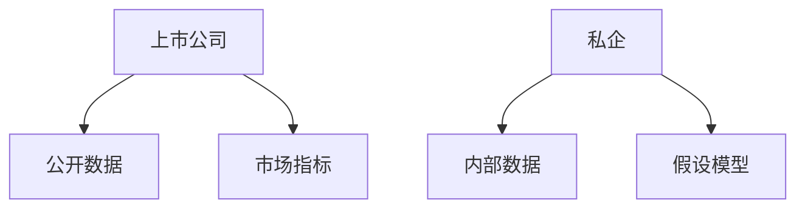
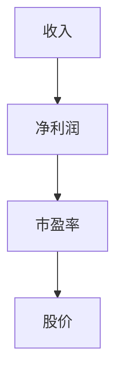
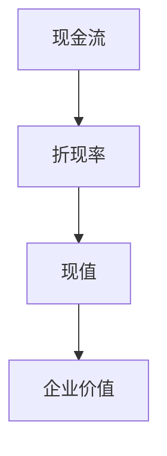
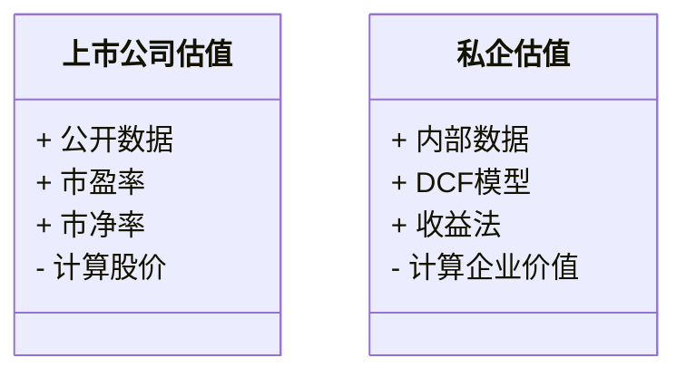
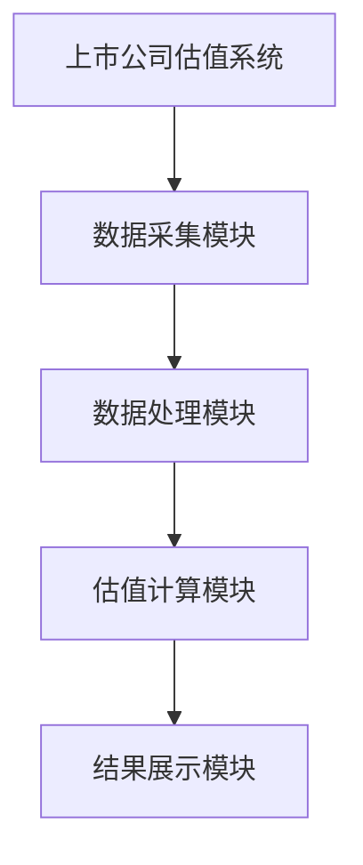

                 


# 上市公司估值方法与私企估值的区别

## 关键词：
- 上市公司估值方法
- 私企估值方法
- 估值区别
- 市盈率
- DCF模型

## 摘要：
本文详细分析了上市公司与私企在估值方法上的主要区别。通过背景介绍、核心概念对比、算法原理、系统架构设计和项目实战等多方面展开，深入探讨了两种估值方法的特点、适用场景和实际操作中的差异。文章结合数学模型、Mermaid图和Python代码，为读者提供了全面而深入的理解。

---

## 第一部分：背景介绍

### 第1章：核心概念与问题背景

#### 1.1 问题背景
- **上市公司**：公开透明的财务数据，易于获取市场信息，通常使用市盈率（P/E）、市净率（P/B）等指标进行估值。
- **私企**：财务数据不公开，估值需要更多假设和模型，常用DCF模型、收益法、资产基础法等。

#### 1.2 问题描述
- 上市公司估值基于公开数据，受市场波动影响较大。
- 私企估值依赖内部数据和假设，风险较高但灵活性更强。
- 两者估值方法的核心差异在于数据来源和适用场景。

#### 1.3 概念的结构与组成
- 估值方法的核心要素：数据来源、模型假设、计算方式。
- 上市公司估值：公开数据、市场指标。
- 私企估值：内部数据、假设驱动。

---

## 第二部分：核心概念与联系

### 第2章：核心概念原理

#### 2.1 上市公司估值方法
- **市盈率（P/E）**：股价与每股收益的比率。
  $$市盈率 = \frac{股价}{每股收益}$$
- **市净率（P/B）**：股价与每股净资产的比率。
  $$市净率 = \frac{股价}{每股净资产}$$
- **股权自由现金流模型（FCFE）**：基于未来现金流的折现。

#### 2.2 私企估值方法
- **DCF模型**：基于未来现金流的现值。
  $$DCF = \sum_{t=1}^{n} \frac{CF_t}{(1+r)^t} + \frac{TV}{(1+r)^n}$$
- **收益法**：基于可比企业或资产的市场价值。
- **资产基础法**：基于资产负债表进行调整。

### 第3章：概念属性对比

| 估值方法 | 上市公司 | 私企 |
|----------|----------|------|
| 市盈率   | 公开数据 | 私有数据 |
| DCF模型  | 较少使用 | 广泛使用 |
| 资产基础法 | 适用性低 | 适用性高 |

### 第4章：ER实体关系图



---

## 第三部分：算法原理讲解

### 第5章：上市公司估值算法



#### Python代码示例
```python
def calculate_pe_ratio(stock_price, eps):
    return stock_price / eps

# 示例
stock_price = 100
eps = 10
pe_ratio = calculate_pe_ratio(stock_price, eps)
print(f"市盈率为：{pe_ratio}")
```

### 第6章：私企估值算法



#### Python代码示例
```python
def calculate_dcf(cash_flows, discount_rate):
    present_value = sum(cash_flow / (1 + discount_rate) ** t for t, cash_flow in enumerate(cash_flows))
    return present_value

# 示例
cash_flows = [100, 150, 200]
discount_rate = 0.1
dcf_value = calculate_dcf(cash_flows, discount_rate)
print(f"DCF现值为：{dcf_value}")
```

---

## 第四部分：系统分析与架构设计

### 第7章：系统功能设计

#### 领域模型类图



### 第8章：系统架构设计

#### 系统架构图



---

## 第五部分：项目实战

### 第9章：环境安装与代码实现

#### 环境安装
- Python 3.8+
- Mermaid工具
- 必要的Python库（如numpy、pandas）

#### 核心代码实现
```python
import numpy as np

def calculate_market_cap(revenue, net_profit_margin, pe_ratio):
    net_profit = revenue * net_profit_margin
    market_cap = pe_ratio * (revenue / net_profit_margin) * net_profit
    return market_cap

# 示例
revenue = 1000
net_profit_margin = 0.1
pe_ratio = 15
market_cap = calculate_market_cap(revenue, net_profit_margin, pe_ratio)
print(f"市场资本化为：{market_cap}")
```

### 第10章：案例分析

#### 案例1：上市公司估值
- 数据：收入=1000，净利润=100，市盈率=15。
- 计算：股价=市盈率 × 净利润 = 15 × 100 = 1500。

#### 案例2：私企估值
- 数据：现金流=100，折现率=10%。
- 计算：DCF现值=100/(1+0.1) = 90.91。

### 第11章：项目小结

- 通过案例分析，展示了上市公司和私企估值方法的实际应用。
- 强调了数据来源和模型假设的重要性。

---

## 第六部分：总结

### 第12章：最佳实践 tips

1. 选择合适的估值方法，根据数据来源和场景决定。
2. 对于上市公司，市盈率和市净率是快速估值的工具。
3. 对于私企，DCF模型和收益法是主要方法。
4. 注意模型的假设和数据的准确性。

### 第13章：小结

- 上市公司估值基于公开数据，方法简单但受市场影响大。
- 私企估值依赖内部数据和假设，方法灵活但风险高。
- 两者估值方法的选择取决于具体场景和数据可用性。

### 第14章：注意事项

- 上市公司估值需关注市场波动和行业趋势。
- 私企估值需谨慎处理假设和数据偏差。

### 第15章：拓展阅读

- 建议阅读《企业价值评估》和《投资学》相关书籍。

---

## 作者：AI天才研究院

感谢您的阅读！如需进一步探讨，请联系AI天才研究院。

