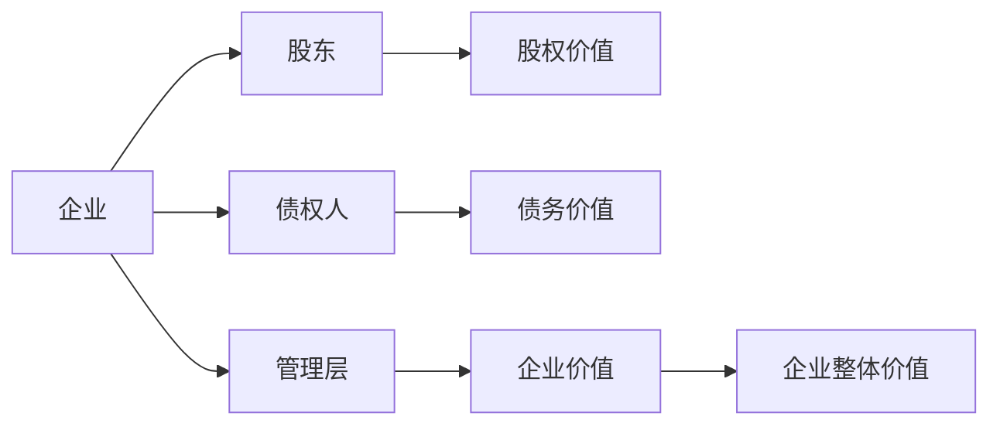
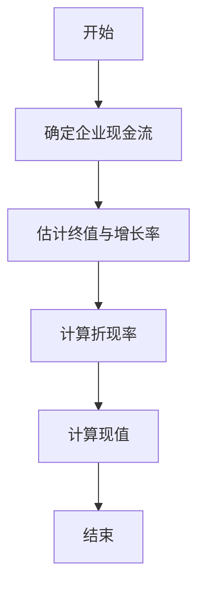
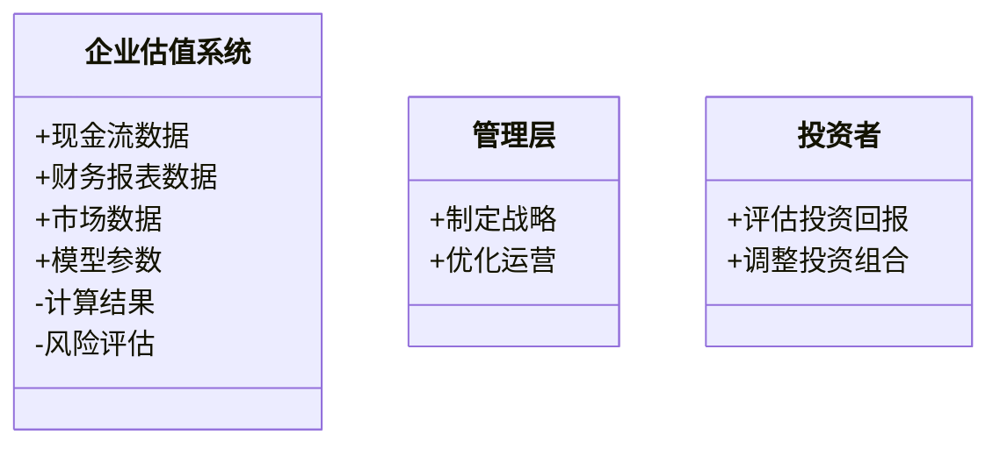
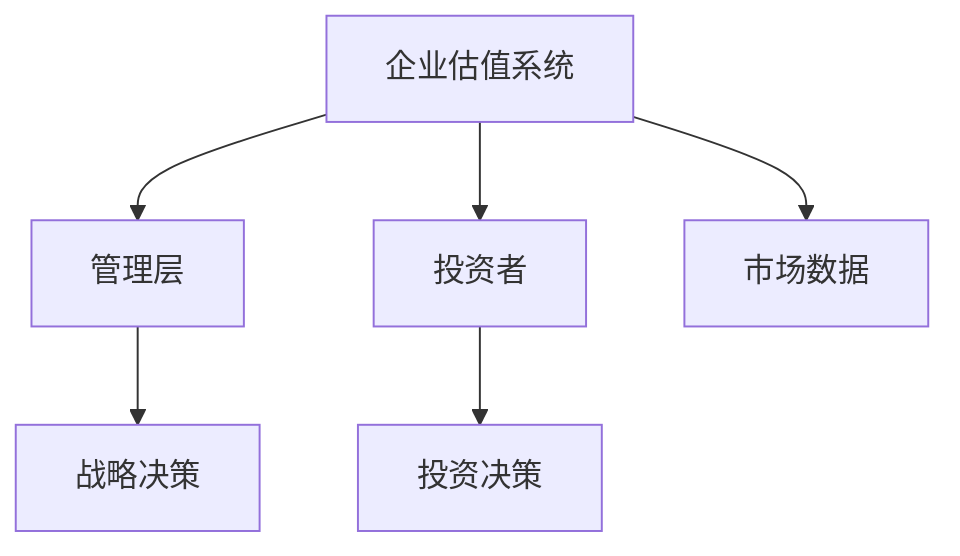
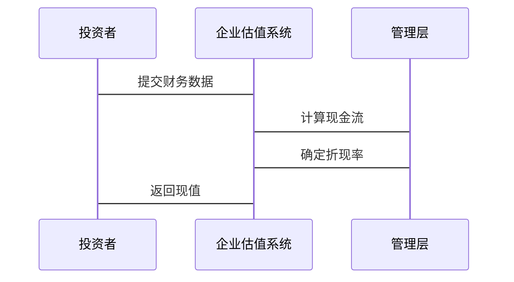

                 


# 不同发展阶段企业的估值策略

> 关键词：企业估值，现金流折现法，相对估值法，DCF模型，企业生命周期，财务指标，非财务指标

> 摘要：本文系统地探讨了不同发展阶段企业的估值策略，从初创期到衰退期，分析了各阶段的财务与非财务特征，对比了主要的估值方法如DCF模型和相对估值法，并通过实际案例展示了如何在不同阶段选择合适的估值策略。文章结合理论与实践，提供了清晰的指导和实用的建议。

---

## 第1章 企业估值的背景与核心概念

### 1.1 企业估值的背景与意义

#### 1.1.1 企业估值的核心问题
企业估值是将企业价值量化的过程，核心问题是确定企业在特定时间点的合理价值。这不仅帮助投资者评估投资回报，也帮助企业制定融资、并购等战略决策。

#### 1.1.2 企业估值的定义与目标
企业估值是通过分析企业的财务状况、市场地位、发展潜力等因素，计算其市场价值或内在价值。其目标是为投资决策提供依据，帮助识别高价值企业或评估交易价格的合理性。

#### 1.1.3 企业估值的边界与外延
企业估值的边界包括企业的资产范围、经营期限和市场环境。外延则涉及企业内部管理、行业竞争、政策法规等多方面因素。

### 1.2 不同发展阶段企业的特点

#### 1.2.1 初创期企业的特点与估值难点
初创期企业通常规模小、收入不稳定，财务数据有限，难以直接用历史财务指标估值。估值更多依赖于未来增长潜力和团队能力。

#### 1.2.2 成长期企业的特点与估值方法
成长期企业收入和利润快速增长，现金流逐渐稳定。常用DCF模型和EV/EBITDA倍数等相对估值法。

#### 1.2.3 成熟期企业的特点与估值策略
成熟期企业增长放缓，现金流稳定。DCF模型和股息率是主要估值工具。

#### 1.2.4 衰退期企业的特点与估值调整
衰退期企业收入下降，利润减少，估值可能基于资产变现能力和清算价值。

### 1.3 企业估值的核心要素

#### 1.3.1 财务指标的核心作用
收入、利润、现金流、资产负债率等财务指标是估值的基础。

#### 1.3.2 非财务指标的辅助作用
市场地位、竞争优势、管理团队等非财务因素同样影响估值。

#### 1.3.3 行业环境与政策影响
行业竞争、政策法规等因素通过影响企业未来现金流和风险，间接影响估值。

#### 1.3.4 管理团队与企业战略
优秀团队和清晰战略能提升企业价值，降低估值风险。

### 1.4 本章小结
企业估值是多因素综合考量的过程，不同阶段企业特点不同，需灵活调整估值策略。

---

## 第2章 企业估值的核心概念原理

### 2.1 企业估值的主要方法

#### 2.1.1 现金流折现法（DCF模型）
DCF模型基于未来现金流的现值计算企业价值。公式为：
$$
\text{企业价值} = \sum_{t=1}^{n} \frac{\text{现金流}}{(1 + r)^t}
$$
其中，$r$为折现率，$n$为永续期。

#### 2.1.2 相对估值法（可比公司法）
通过与可比公司的EV/EBITDA、EV/收入等倍数对比，估算目标企业价值。

#### 2.1.3 股权自由现金流模型
专门用于股权估值的方法，考虑股权现金流和加权平均资本成本。

#### 2.1.4 重置成本法与清算价值法
重置成本法基于重建企业所需成本，清算价值法基于资产变现价值。

### 2.2 企业估值方法的对比分析

#### 2.2.1 各种估值方法的优缺点对比
| 方法         | 优点                           | 缺点                           |
|--------------|--------------------------------|--------------------------------|
| DCF模型      | 精确，考虑未来现金流           | 预测难度大，依赖假设           |
| 相对估值法    | 简单，数据容易获取             | 受市场波动影响大               |
| 股权现金流模型| 突出股权价值                   | 复杂，适用范围有限             |
| 重置成本法    | 客观，适用于特定情况           | 高于企业实际价值               |
| 清算价值法    | 保守，适用于衰退期企业         | 忽略企业经营价值               |

#### 2.2.2 不同发展阶段企业的适用方法
初创期适用相对估值法，成长期适用DCF模型，成熟期适用股息率法，衰退期适用清算价值法。

#### 2.2.3 行业特性对估值方法的影响
高增长行业适合DCF模型，成熟行业适合相对估值法。

### 2.3 企业估值的实体关系图



### 2.4 本章小结
不同方法适用于不同阶段企业，需结合实际情况选择最优组合。

---

## 第3章 现金流折现法（DCF模型）原理

### 3.1 DCF模型的基本原理

#### 3.1.1 现金流的定义与分类
现金流包括经营现金流、投资现金流和筹资现金流，重点在经营现金流。

#### 3.1.2 折现率的计算与选择
折现率通常基于WACC（加权平均资本成本）：
$$
\text{WACC} = w_d \times r_d \times (1 - t) + w_e \times r_e
$$
其中，$w_d$为债务权重，$r_d$为债务成本，$t$为税率，$w_e$为股权权重，$r_e$为股权成本。

#### 3.1.3 终值与现值的计算公式
终值公式：
$$
FV = CF_n \times (1 + g)^{-n}
$$
现值公式：
$$
PV = \sum_{t=1}^{n} \frac{CF_t}{(1 + r)^t}
$$

### 3.2 DCF模型的实现步骤

#### 3.2.1 确定企业的自由现金流
计算企业产生的现金流，考虑税后净利润和非现金支出。

#### 3.2.2 估计终值与永续增长率
终值基于永续期的稳定现金流，常用永续增长率（假设为零或稳定增长率）。

#### 3.2.3 计算加权平均资本成本（WACC）
结合企业资本结构和市场利率，计算合适的折现率。

### 3.3 DCF模型的流程图



### 3.4 DCF模型的Python实现

```python
def discounted_cash_flow(cash_flows, discount_rate):
    present_value = 0
    for i, cash_flow in enumerate(cash_flows):
        present_value += cash_flow / (1 + discount_rate)**i
    return present_value
```

### 3.5 本章小结
DCF模型是核心估值工具，适用于有稳定现金流预测的成长期和成熟期企业。

---

## 第4章 企业估值的系统分析与架构设计

### 4.1 项目背景介绍
本章以一家处于成长期的科技公司为例，探讨DCF模型的应用。

### 4.2 系统功能设计（领域模型）



### 4.3 系统架构设计



### 4.4 系统接口设计
系统提供API接口，供管理层和投资者调用估值结果。

### 4.5 系统交互设计



### 4.6 本章小结
系统化的企业估值架构有助于高效、准确地进行估值，支持企业决策。

---

## 第5章 项目实战：DCF模型在成长期企业的应用

### 5.1 环境配置
安装Python和相关库（如numpy、pandas）。

### 5.2 核心代码实现

```python
import numpy as np

def calculate_wacc(asset_beta, market_beta, risk_free_rate, equity_ratio, tax_rate):
    return (risk_free_rate + equity_ratio * (asset_beta**2 * (market_beta**2 - risk_free_rate**2) + 2 * asset_beta * market_beta * (1 - tax_rate)))

def discounted_cash_flow_model(free_cash_flows, wacc, terminal_value, horizon):
    pv_flows = []
    for year in range(horizon):
        pv = free_cash_flows[year] / (1 + wacc)**year
        pv_flows.append(pv)
    terminal_value_present = terminal_value / (1 + wacc)**horizon
    total_value = sum(pv_flows) + terminal_value_present
    return total_value

# 示例数据
free_cash_flows = [100, 150, 200]
wacc = 0.10
terminal_value = 1000
horizon = 3

enterprise_value = discounted_cash_flow_model(free_cash_flows, wacc, terminal_value, horizon)
print(f"企业价值为：{enterprise_value}")
```

### 5.3 代码应用解读
代码实现DCF模型，计算企业价值。首先计算WACC，然后预测现金流，最后计算终值和现值总和。

### 5.4 实际案例分析
以一家科技公司为例，假设其现金流和WACC分别为特定值，计算企业价值。

### 5.5 本章小结
通过实战案例，展示了DCF模型的具体应用，帮助读者掌握实际操作。

---

## 第6章 最佳实践与注意事项

### 6.1 小结
企业估值是复杂的过程，需结合多因素和实际情况选择合适方法。

### 6.2 注意事项
1. 估值假设要合理，避免过度乐观或悲观。
2. 数据来源要可靠，避免偏差。
3. 结合行业和市场环境，灵活调整方法。

### 6.3 拓展阅读
推荐学习高级估值方法，如LBO模型和并购估值。

---

## 作者：AI天才研究院 & 禅与计算机程序设计艺术

---

通过以上结构，文章系统地探讨了企业估值的核心概念、不同阶段的适用方法，以及DCF模型的详细应用。希望对读者在实际估值过程中提供有价值的指导。

