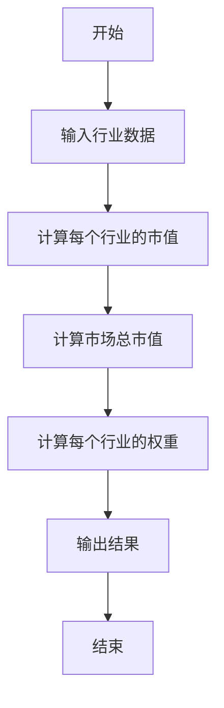
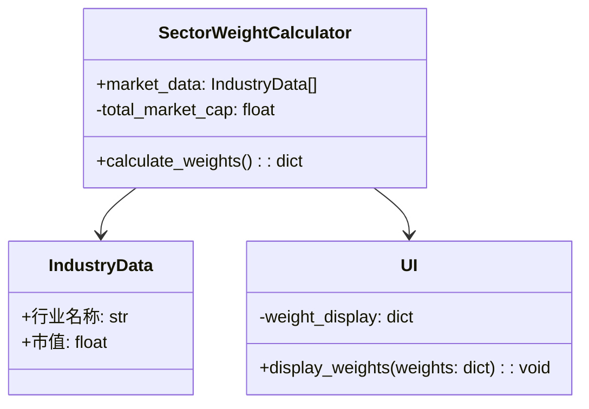
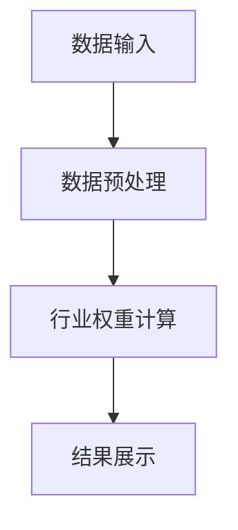

                 


# 不同行业在全球股市估值中的权重分析

> 关键词：全球股市，行业权重，投资策略，市场分析，股票估值

> 摘要：本文通过分析不同行业在全球股市中的权重分布，探讨权重对市场估值和投资决策的影响。结合数学模型和实际案例，详细讲解行业权重的计算方法、分析模型以及在实际投资中的应用。

---

# 第一部分：引言

## 第1章：背景介绍

### 1.1 全球股市估值的背景与意义

#### 1.1.1 全球股市的基本概念与特点

全球股市是全球经济的重要组成部分，反映了不同国家和地区的经济状况。股票市场的表现与行业分布密切相关，不同行业在市场中的权重差异显著。以下是全球股市的几个关键特点：

- **多样性**：全球股市包括多个市场，如纽约证券交易所（NYSE）、纳斯达克（NASDAQ）、伦敦金融时报指数（FTSE 100）等，每个市场的行业分布和权重都有所不同。
- **行业差异**：不同行业在股市中的权重受多种因素影响，包括行业规模、盈利能力、市场热度等。
- **动态变化**：行业权重会随着经济环境、政策变化和市场趋势不断调整。

#### 1.1.2 不同行业的特点与权重分析的重要性

行业权重是指某个行业在股票市场指数中的占比。例如，在标普500指数中，科技行业通常占据较高权重，因为其公司市值较大。行业权重的分析对投资者和市场参与者至关重要，原因如下：

- **影响市场走势**：行业权重高的行业对市场指数的影响更大。例如，科技行业的权重变化可能对纳斯达克指数产生显著影响。
- **投资策略优化**：通过分析行业权重，投资者可以更好地分配投资组合，降低风险并提高收益。

#### 1.1.3 本书的研究意义与目标

本书旨在通过分析不同行业在全球股市中的权重分布，揭示权重对市场估值和投资决策的影响。我们希望通过以下方式实现目标：

- 提供行业权重的数学模型和计算方法。
- 分析不同行业的权重特征及其对市场的潜在影响。
- 提供基于权重分析的投资策略和实战案例。

---

## 第2章：行业权重分析的核心概念

### 2.1 行业权重的定义与计算方法

#### 2.1.1 行业权重的定义

行业权重是指某个行业在股票市场指数中的市值占比。计算公式为：

$$
\text{行业权重} = \frac{\text{行业总市值}}{\text{市场总市值}}
$$

行业权重反映了该行业对市场整体表现的影响力。权重越高的行业，对市场指数的影响越大。

#### 2.1.2 行业权重的分类与特点

行业可以按多种标准分类，如行业类型（科技、金融、消费等）和市场区域（美国、欧洲、亚洲）。以下是不同行业的特点对比：

| 行业类型   | 特点                          | 权重特征                     |
|------------|-------------------------------|------------------------------|
| 科技       | 市值高，增长快                 | 权重通常较高                 |
| 金融       | 市值稳定，收益依赖利息收入     | 权重较高，尤其是在发达市场   |
| 消费       | 与日常生活密切相关             | 权重较为分散，波动较小       |
| 能源       | 受能源价格影响较大             | 权重波动较大，周期性明显     |

---

## 第3章：行业权重分析的数学模型与算法

### 3.1 行业权重分析的数学模型

#### 3.1.1 行业权重的加权平均模型

行业权重的计算基于加权平均数模型。假设市场中有 $n$ 个行业，每个行业的市值为 $S_i$，市场总市值为 $S_{\text{total}}$，则行业权重 $w_i$ 为：

$$
w_i = \frac{S_i}{S_{\text{total}}}
$$

#### 3.1.2 行业权重的动态调整模型

考虑到市场波动，行业权重需要动态调整。动态调整模型如下：

$$
w_i(t+1) = w_i(t) \times (1 + \alpha \times \Delta S_i)
$$

其中，$\alpha$ 是调整系数，$\Delta S_i$ 是行业市值的变化率。

### 3.2 行业权重分析的算法实现

#### 3.2.1 行业权重计算的算法流程

以下是行业权重计算的算法流程图：



#### 3.2.2 行业权重分析的Python代码实现

以下是基于上述算法的Python代码实现：

```python
import pandas as pd

# 假设df为行业数据，包含行业名称和市值
def calculate_sector_weights(df):
    total_market_cap = df['市值'].sum()
    sector_weights = {}
    for sector in df['行业名称'].unique():
        sector_cap = df[df['行业名称'] == sector]['市值'].sum()
        sector_weights[sector] = sector_cap / total_market_cap
    return sector_weights

# 示例数据
data = {
    '行业名称': ['科技', '金融', '消费', '能源'],
    '市值': [500, 300, 200, 100]
}
df = pd.DataFrame(data)

# 计算权重
weights = calculate_sector_weights(df)
print(weights)
```

---

## 第4章：系统分析与架构设计

### 4.1 问题场景介绍

我们需要构建一个行业权重分析系统，用于实时计算和分析不同行业在全球股市中的权重分布。

### 4.2 系统功能设计

以下是系统功能的类图：



### 4.3 系统架构设计

以下是系统的架构图：



---

## 第5章：项目实战

### 5.1 实战案例：科技行业的权重分析

#### 5.1.1 环境安装

需要安装以下Python库：

```bash
pip install pandas numpy matplotlib
```

#### 5.1.2 核心代码实现

以下是科技行业权重分析的代码：

```python
import pandas as pd
import matplotlib.pyplot as plt

# 示例数据
data = {
    '行业名称': ['科技', '金融', '消费', '能源'],
    '市值': [500, 300, 200, 100]
}
df = pd.DataFrame(data)

# 计算权重
def calculate_sector_weights(df):
    total_market_cap = df['市值'].sum()
    sector_weights = {}
    for sector in df['行业名称'].unique():
        sector_cap = df[df['行业名称'] == sector]['市值'].sum()
        sector_weights[sector] = sector_cap / total_market_cap
    return sector_weights

weights = calculate_sector_weights(df)

# 可视化
sectors = list(weights.keys())
values = [weights[sector] for sector in sectors]

plt.bar(sectors, values)
plt.title('行业权重分布')
plt.ylabel('权重')
plt.show()
```

---

## 第6章：小结与展望

### 6.1 本章小结

通过本章的分析，我们了解了行业权重在全球股市中的重要性，并掌握了行业权重的计算方法和实际应用。行业权重分析不仅可以帮助投资者优化投资组合，还可以为市场研究提供重要参考。

### 6.2 投资建议

- **分散投资**：根据行业权重分布，合理分配投资组合，降低风险。
- **关注高权重行业**：高权重行业对市场影响较大，值得重点关注。

### 6.3 注意事项

- **数据准确性**：行业权重的计算依赖于准确的市值数据。
- **动态调整**：行业权重会随市场变化而调整，需定期更新。

### 6.4 拓展阅读

- 《投资学基础》
- 《股票技术分析实战》
- 《行业分析与投资策略》

---

作者：AI天才研究院/AI Genius Institute & 禅与计算机程序设计艺术/Zen And The Art of Computer Programming

