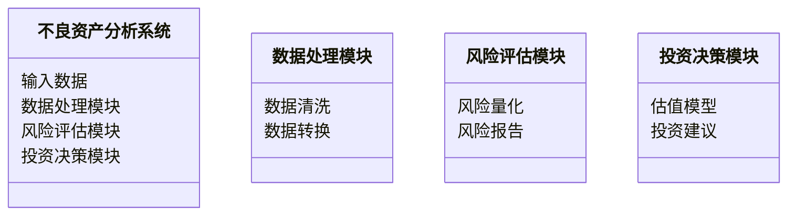
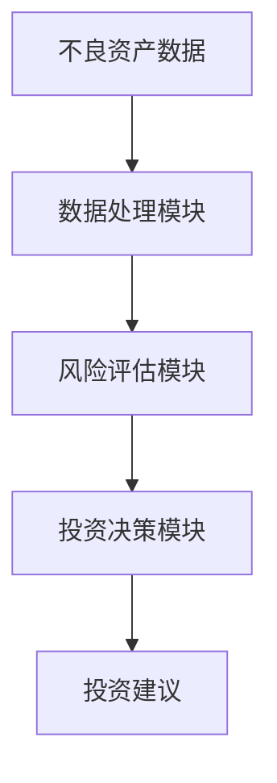
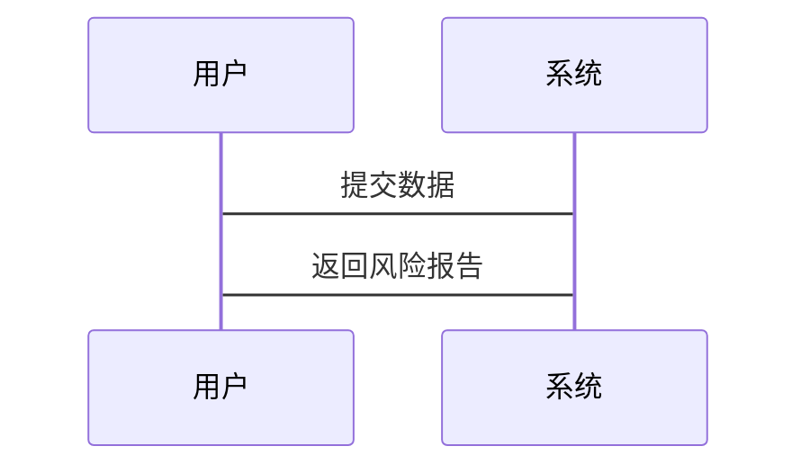

                 

# 不良资产投资：高风险高回报的特殊机会

> 关键词：不良资产投资, 高风险高回报, 特殊机会, 投资策略, 风险管理, 资产估值

> 摘要：本文深入探讨不良资产投资的背景、概念、分析方法、风险管理、案例分析、系统架构及实战技巧，帮助投资者理解其高风险高回报的本质，并掌握有效的投资策略。

---

# 第一部分: 不良资产投资的背景与概念

## 第1章: 不良资产投资的定义与背景

### 1.1 不良资产的定义与分类

#### 1.1.1 不良资产的定义
不良资产是指由于债务人无法偿还债务，或者资产的价值显著低于其账面价值，导致其难以通过正常市场交易变现的资产。这些资产通常具有较高的风险和不确定性，但同时也可能蕴含较高的回报潜力。

#### 1.1.2 不良资产的分类
不良资产可以分为以下几类：
- **流动性不良资产**：如难以变现的房地产、股权等。
- **信用不良资产**：如逾期未偿还的贷款。
- **法律纠纷不良资产**：涉及复杂法律问题的资产。
- **行业特殊不良资产**：如受经济周期影响较大的行业资产。

#### 1.1.3 不良资产的形成原因
不良资产的形成通常与经济周期、市场波动、企业经营不善或外部环境变化密切相关。例如，在经济衰退期间，企业可能因收入下降而无法偿还贷款，导致不良资产的增加。

### 1.2 不良资产投资的背景

#### 1.2.1 经济周期与不良资产的产生
在经济周期的衰退或萧条阶段，不良资产的产生显著增加。此时，许多企业和个人面临还款压力，导致银行和其他金融机构的不良贷款率上升。

#### 1.2.2 金融市场中的特殊机会
不良资产投资在金融市场中被视为一种特殊机会。投资者通过收购不良资产，利用其潜在的增值空间和折扣价格，寻求高额回报。

#### 1.2.3 不良资产投资的市场现状
近年来，全球不良资产市场的规模持续增长，尤其是在经济不景气时期。投资者包括私募基金、资产管理公司和高净值个人。

### 1.3 高风险高回报的特性

#### 1.3.1 不良资产投资的风险来源
- **市场风险**：资产价值可能因市场波动而大幅下降。
- **信用风险**：债务人可能无法偿还债务。
- **法律风险**：涉及复杂的法律纠纷和诉讼。

#### 1.3.2 高回报的驱动因素
- **折扣收购**：不良资产的收购价格通常低于市场价值。
- **重组增值**：通过资产重组和债务重组，资产价值可能大幅上升。
- **市场周期**：在经济复苏期间，不良资产的价值可能迅速回升。

#### 1.3.3 风险与回报的平衡
投资者需要在高风险和高回报之间找到平衡点，通过合理的风险管理和投资策略，最大化回报并最小化损失。

## 第2章: 不良资产投资的市场分析

### 2.1 不良资产市场的规模与结构

#### 2.1.1 全球不良资产市场的规模
根据最新数据，全球不良资产市场规模已超过数万亿美元，且在经济不景气时期呈现增长趋势。

#### 2.1.2 不良资产市场的参与者
- **金融机构**：如银行、保险公司。
- **资产管理公司**：专注于不良资产投资。
- **私人投资者**：高净值个人和家族办公室。

#### 2.1.3 不良资产市场的周期性
不良资产市场的周期性与经济周期密切相关。在经济衰退期间，不良资产增加；在复苏期间，不良资产的价值可能回升。

### 2.2 不良资产投资的驱动因素

#### 2.2.1 经济环境的影响
- 经济衰退导致不良资产增加。
- 通货膨胀和利率变化影响资产价值。

#### 2.2.2 政策环境的影响
- 政府政策（如货币宽松）可能增加不良资产的产生。
- 监管政策变化影响不良资产的投资和处置。

#### 2.2.3 市场参与者的动机
- 投资者寻求高回报。
- 金融机构需要清理不良资产，改善资产负债表。

### 2.3 不良资产投资的边界与外延

#### 2.3.1 不良资产投资的边界
- 不良资产的定义和分类边界。
- 投资的法律和道德边界。

#### 2.3.2 不良资产投资的外延
- 不良资产与其他类型资产的对比。
- 不良资产投资与其他投资方式的差异。

#### 2.3.3 不良资产投资与其他投资方式的对比
- 风险和回报的对比。
- 投资策略和操作的差异。

---

# 第三部分: 不良资产投资的分析方法

## 第3章: 不良资产投资的定量分析

### 3.1 不良资产的估值模型

#### 3.1.1 净现值法（NPV）
净现值法用于评估不良资产的未来现金流的现值，与当前收购价格进行比较。

**公式**：
$$ NPV = \sum_{t=1}^{n} \frac{CF_t}{(1+r)^t} - Initial\_Investment $$

其中，\( CF_t \) 是第 \( t \) 年的现金流，\( r \) 是折现率。

#### 3.1.2 内部收益率法（IRR）
内部收益率法用于衡量投资的回报率，适用于单个资产的评估。

**公式**：
$$ IRR 是使 NPV 等于零的折现率 $$

#### 3.1.3 债务重组收益分析
债务重组是不良资产处置的重要方式，需分析重组后的现金流和价值。

### 3.2 不良资产的风险量化

#### 3.2.1 风险价值（VaR）
风险价值用于衡量在一定置信水平下，资产可能遭受的最大损失。

**公式**：
$$ VaR = \text{损失的第 p 分位数} $$

#### 3.2.2 信用违约风险模型
使用信用评分和违约概率模型评估不良资产的风险。

---

# 第四部分: 不良资产投资的风险管理

## 第4章: 不良资产投资的风险管理与控制

### 4.1 不良资产的风险类型

#### 4.1.1 市场风险
资产价值因市场波动而下降的风险。

#### 4.1.2 信用风险
债务人无法偿还债务的风险。

#### 4.1.3 法律风险
涉及法律纠纷和诉讼的风险。

### 4.2 不良资产的风险量化与分散

#### 4.2.1 风险量化方法
- 使用 VaR 和 CVaR 等方法量化风险。
- 建立风险敞口矩阵，分析不同资产的风险分布。

#### 4.2.2 风险分散策略
- 投资组合多样化，降低特定资产的风险。
- 使用衍生工具对冲市场风险。

### 4.3 不良资产的法律合规

#### 4.3.1 法律合规要求
- 遵守相关法律法规，确保投资行为的合法性。
- 管理法律纠纷，降低法律风险。

#### 4.3.2 风险控制措施
- 建立风险管理框架，明确责任分工。
- 定期进行风险评估和压力测试。

---

# 第五部分: 不良资产投资的案例分析

## 第5章: 不良资产投资的经典案例

### 5.1 案例背景
选取一个典型不良资产投资案例，分析其投资策略、风险管理和收益情况。

### 5.2 投资策略分析
- 资产估值与收购价格的对比。
- 投资后的重组和处置策略。

### 5.3 风险管理措施
- 如何应对市场波动和法律纠纷。
- 投资后的监控和调整策略。

---

# 第六部分: 不良资产投资的系统架构与解决方案

## 第6章: 不良资产投资的系统架构设计

### 6.1 系统功能设计

#### 6.1.1 领域模型设计
使用 Mermaid 类图展示不良资产分析系统的功能模块。

### 6.2 系统架构设计

#### 6.2.1 系统架构图
使用 Mermaid 绘制系统架构图，展示各个模块之间的关系。

### 6.3 系统接口设计

#### 6.3.1 接口描述
- 数据接口：与外部数据源对接。
- 报告接口：生成风险评估报告。

### 6.4 系统交互设计

#### 6.4.1 交互流程图
使用 Mermaid 序列图展示用户与系统的交互流程。

---

# 第七部分: 不良资产投资的实战技巧

## 第7章: 不良资产投资的实战技巧与经验分享

### 7.1 投资策略选择

#### 7.1.1 策略类型
- 价值投资：寻找被低估的资产。
- 事件驱动投资：利用特定事件（如并购重组）进行投资。

### 7.2 案例分析与经验总结

#### 7.2.1 成功案例分析
分析一个成功的不良资产投资项目，总结其成功经验。

#### 7.2.2 失败案例分析
分析一个失败的不良资产投资项目，总结教训。

### 7.3 投资中的注意事项

#### 7.3.1 风险管理的重要性
- 定期评估和调整投资组合。
- 建立应急储备，应对突发风险。

#### 7.3.2 市场周期的把握
- 在经济衰退时寻找机会，在复苏时及时退出。

---

# 结语

不良资产投资是一种高风险高回报的特殊机会，需要投资者具备专业的知识和经验。通过合理的风险管理和投资策略，投资者可以在不良资产市场中获取超额收益。然而，投资者也需时刻警惕市场波动和法律风险，保持谨慎和耐心。

---

# 作者：AI天才研究院/AI Genius Institute & 禅与计算机程序设计艺术 /Zen And The Art of Computer Programming

