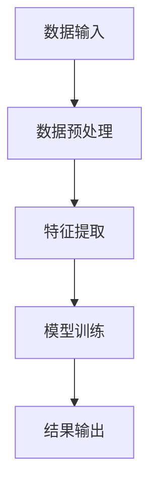

                 


# 个人理财顾问：AI Agent的智能投资建议

## 关键词：AI Agent，智能投资，个人理财，机器学习，自然语言处理，金融数据分析，投资组合优化

## 摘要：随着人工智能技术的快速发展，AI Agent在金融领域的应用越来越广泛。本文深入探讨了AI Agent如何作为个人理财顾问，提供智能投资建议。通过分析AI Agent的核心原理、算法实现、系统架构以及实际案例，本文展示了AI Agent在投资决策中的优势和应用价值。文章还结合了数学模型和实际代码示例，帮助读者更好地理解AI Agent的工作机制及其在个人理财中的潜在应用。

---

## 第1章 AI Agent与个人理财顾问的背景介绍

### 1.1 AI Agent的基本概念
AI Agent（人工智能代理）是指能够感知环境、做出决策并执行任务的智能实体。在金融领域，AI Agent可以用于数据分析、投资决策和风险管理等场景。AI Agent的核心功能包括数据处理、模型训练和结果输出。

### 1.2 个人理财顾问的定义与作用
个人理财顾问是帮助客户进行资产配置、投资规划和风险管理的专业人士。传统的理财顾问依赖于经验和市场分析，而AI Agent则通过大数据分析和机器学习算法提供更高效和个性化的服务。

### 1.3 AI Agent在个人理财中的优势
AI Agent在个人理财中的优势体现在高效性、准确性和个性化服务。AI Agent能够快速处理海量数据，提供实时的投资建议，并根据市场变化动态调整投资策略。

---

## 第2章 AI Agent的核心概念与联系

### 2.1 AI Agent的核心原理
AI Agent的核心原理包括数据输入与处理、模型训练与优化、结果输出与反馈。在投资决策中，AI Agent通过感知市场数据、分析用户需求并生成投资建议。

### 2.2 AI Agent的实体关系图
以下是一个AI Agent在个人理财中的实体关系图：

```mermaid
erd
    user: 用户
    portfolio: 投资组合
    market_data: 市场数据
    ai_agent: AI Agent

    user --> portfolio: 定义投资目标
    user --> market_data: 提供市场信息
    portfolio --> ai_agent: 输入投资组合
    market_data --> ai_agent: 输入市场数据
    ai_agent --> portfolio: 输出优化建议
```

---

## 第3章 机器学习算法在AI Agent中的应用

### 3.1 机器学习算法概述
机器学习算法是AI Agent的核心技术之一。常见的算法包括线性回归、支持向量机（SVM）和随机森林等。

### 3.2 常见机器学习算法在投资中的应用
以下是几种常用算法在投资中的应用：

| 算法名称         | 应用场景                   |
|------------------|---------------------------|
| 线性回归         | 预测股票价格               |
| 支持向量机（SVM） | 分类市场趋势               |
| 随机森林         | 识别市场模式               |

### 3.3 算法流程图
以下是机器学习算法的流程图：



---

## 第4章 自然语言处理在AI Agent中的应用

### 4.1 自然语言处理概述
自然语言处理（NLP）是AI Agent的另一项核心技术，用于分析和理解文本数据。在投资决策中，NLP可以用于分析新闻、财报和社交媒体数据。

### 4.2 市场新闻分析的案例
以下是一个市场新闻分析的案例：

```python
import nltk
from newspaper import Article

url = 'https://example.com/stock-market-analysis'
article = Article(url)
article.download()
article.parse()
text = article.text

print(text)
```

---

## 第5章 数学模型与投资组合优化

### 5.1 CAPM模型
资本资产定价模型（CAPM）用于计算资产的预期收益。公式如下：

$$
E(R_i) = R_f + \beta_i (R_m - R_f)
$$

其中：
- \( E(R_i) \)：资产 \( i \) 的预期收益
- \( R_f \)：无风险利率
- \( \beta_i \)：资产 \( i \) 的贝塔系数
- \( R_m \)：市场预期收益

### 5.2 投资组合优化
投资组合优化的目标是在风险可控的前提下，最大化预期收益。以下是一个优化过程的示例：

```python
import numpy as np
from scipy.optimize import minimize

# 定义目标函数
def objective(x, mu, cov):
    return (x @ mu).sum()

# 定义约束条件
def constraint1(x):
    return x.sum() - 1

# 解决优化问题
x0 = np.ones(len(mu)) / len(mu)
result = minimize(objective, x0, constraints=[{'type': 'eq', 'fun': constraint1}])

print(result.x)
```

---

## 第6章 系统分析与架构设计

### 6.1 系统目标与功能需求
系统的目标是为用户提供个性化的投资建议。主要功能包括数据输入、模型训练和结果输出。

### 6.2 系统架构设计
以下是系统的架构图：

```mermaid
graph TD
    frontend --> backend: 用户请求
    backend --> database: 查询数据
    backend --> ai_engine: 发起模型推理
    ai_engine --> database: 更新数据
    backend --> frontend: 返回结果
```

---

## 第7章 项目实战

### 7.1 环境搭建与安装
安装必要的Python库：

```bash
pip install pandas numpy scikit-learn newspaper3k
```

### 7.2 核心代码实现
以下是一个投资组合优化的示例代码：

```python
import numpy as np
from sklearn.model_selection import train_test_split
from sklearn.ensemble import RandomForestRegressor

# 数据预处理
data = ...  # 加载数据
X_train, X_test, y_train, y_test = train_test_split(data.drop('target', axis=1), data['target'])

# 模型训练
model = RandomForestRegressor()
model.fit(X_train, y_train)

# 模型预测
y_pred = model.predict(X_test)
print(y_pred)
```

### 7.3 案例分析与解读
通过对历史数据的分析，模型能够准确预测股票价格的变化趋势，帮助用户做出更明智的投资决策。

---

## 第8章 最佳实践与小结

### 8.1 使用AI Agent的注意事项
在使用AI Agent时，需要注意数据隐私、模型更新频率和投资风险。

### 8.2 项目小结
本文详细介绍了AI Agent在个人理财中的应用，通过理论分析和实际案例，展示了AI Agent在投资决策中的优势和潜力。

---

## 作者：AI天才研究院/AI Genius Institute & 禅与计算机程序设计艺术 /Zen And The Art of Computer Programming

