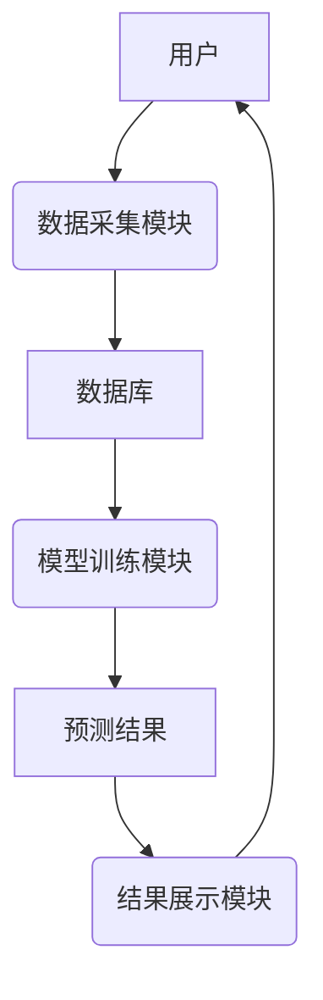

                 


# 个人财务健康指数预测与改善系统

> 关键词：个人财务管理，财务健康指数，机器学习，系统架构，项目实战

> 摘要：本文介绍了一种基于机器学习的个人财务健康指数预测与改善系统，通过详细分析系统的设计思路、算法实现和实际案例，帮助读者掌握如何利用技术手段优化个人财务管理。

---

## 目录

1. [背景介绍](#背景介绍)
   1.1 [问题背景](#问题背景)
   1.2 [概念结构](#概念结构)
2. [核心概念与联系](#核心概念与联系)
   2.1 [个人财务健康指数的定义](#个人财务健康指数的定义)
   2.2 [核心概念属性对比](#核心概念属性对比)
   2.3 [ER实体关系图](#ER实体关系图)
3. [算法原理](#算法原理)
   3.1 [数据预处理](#数据预处理)
   3.2 [特征工程](#特征工程)
   3.3 [模型选择](#模型选择)
   3.4 [模型评估](#模型评估)
4. [系统分析与架构设计](#系统分析与架构设计)
   4.1 [系统设计](#系统设计)
   4.2 [系统架构图](#系统架构图)
   4.3 [接口设计](#接口设计)
   4.4 [交互流程](#交互流程)
5. [项目实战](#项目实战)
   5.1 [环境安装](#环境安装)
   5.2 [代码实现](#代码实现)
   5.3 [案例分析](#案例分析)
6. [最佳实践](#最佳实践)
   6.1 [小结](#小结)
   6.2 [注意事项](#注意事项)
   6.3 [拓展阅读](#拓展阅读)

---

## 背景介绍

### 1.1 问题背景

随着经济的发展，个人财务管理变得越来越复杂。人们需要处理的财务信息越来越多，包括收入、支出、资产和负债等。如何有效评估和改善个人财务健康状况，成为许多人关注的问题。传统的财务管理方法依赖人工分析，效率低下且容易出错。因此，引入技术手段，如机器学习，可以提高财务管理的效率和准确性。

### 1.2 概念结构

个人财务健康指数是一个综合评估个人财务状况的指标，反映了个人在财务稳定性、流动性、偿债能力和成长性等方面的表现。指数的计算基于多个财务要素，每个要素都有特定的权重。

---

## 核心概念与联系

### 2.1 个人财务健康指数的定义

财务健康指数是一个量化指标，用于评估个人的财务健康状况。指数的计算公式如下：

$$
\text{财务健康指数} = \sum (\text{要素权重} \times \text{要素得分})
$$

其中，要素包括收入、支出、储蓄、资产和负债等，每个要素的权重根据其对整体财务健康的影响程度确定。

### 2.2 核心概念属性对比

下表展示了核心财务要素及其属性的对比：

| 财务要素 | 属性 | 描述 | 权重 |
|----------|------|------|------|
| 收入     | 稳定性 | 收入来源的稳定性 | 30% |
| 支出     | 合理性 | 支出是否合理 | 20% |
| 储蓄     | 数量   | 储蓄金额 | 25% |
| 资产     | 结构   | 资产种类和比例 | 15% |
| 负债     | 负债率 | 负债与资产的比例 | 10% |

### 2.3 ER实体关系图

以下是系统的实体关系图：

```mermaid
er
  entity 财务健康指数 {
    id: string
    score: integer
    timestamp: date
  }
  entity 财务要素 {
    id: string
    name: string
    value: float
  }
  entity 用户 {
    id: string
    name: string
    email: string
  }
  relation 财务健康指数 -> 财务要素: 指数计算
  relation 用户 -> 财务健康指数: 评估结果
```

---

## 算法原理

### 3.1 数据预处理

数据预处理是机器学习模型训练的基础。以下是预处理步骤：

1. 数据清洗：处理缺失值和异常值。
2. 数据转换：将数据标准化或归一化。
3. 特征选择：筛选重要特征。

### 3.2 特征工程

特征工程是提升模型性能的关键。以下是常见特征工程方法：

1. 特征提取：从原始数据中提取有用特征。
2. 特征组合：将多个特征组合成新的特征。
3. 特征降维：使用PCA等方法降低特征维度。

### 3.3 模型选择

选择合适的模型是确保预测准确性的关键。以下是常用的模型：

1. 线性回归：适用于线性关系。
2. 支持向量机：适用于非线性关系。
3. 随机森林：适用于特征较多的情况。

### 3.4 模型评估

评估模型性能需要使用交叉验证和性能指标：

1. 训练集和测试集的划分。
2. 使用准确率、召回率和F1分数评估模型。

---

## 系统分析与架构设计

### 4.1 系统设计

系统设计包括数据采集、模型训练和结果展示三个模块：

1. 数据采集：从数据库中获取用户财务数据。
2. 模型训练：训练预测模型。
3. 结果展示：将财务健康指数展示给用户。

### 4.2 系统架构图

以下是系统的架构图：



### 4.3 接口设计

系统提供以下接口：

1. 获取用户数据：`GET /api/users/{id}/financial_data`
2. 训练模型：`POST /api/models/train`
3. 获取预测结果：`GET /api/models/predictions`

### 4.4 交互流程

用户通过网页或移动应用提交数据，系统处理后返回预测结果。

---

## 项目实战

### 5.1 环境安装

安装所需的库：

```bash
pip install numpy pandas scikit-learn
```

### 5.2 代码实现

以下是核心代码：

```python
import numpy as np
import pandas as pd
from sklearn.model_selection import train_test_split
from sklearn.linear_model import LinearRegression

# 数据加载
data = pd.read_csv('financial_data.csv')

# 数据预处理
X = data.drop('score', axis=1)
y = data['score']

# 划分训练集和测试集
X_train, X_test, y_train, y_test = train_test_split(X, y, test_size=0.2, random_state=42)

# 模型训练
model = LinearRegression()
model.fit(X_train, y_train)

# 模型预测
y_pred = model.predict(X_test)

# 模型评估
score = model.score(X_test, y_test)
print(f'模型准确率：{score}')
```

### 5.3 案例分析

以一个用户的财务数据为例，计算其财务健康指数，给出改善建议。

---

## 最佳实践

### 6.1 小结

本文详细介绍了个人财务健康指数预测与改善系统的各个方面，从背景到系统设计，再到项目实战，为读者提供了全面的指导。

### 6.2 注意事项

- 数据隐私保护是系统设计的重要部分。
- 模型需要定期更新以保持准确性。

### 6.3 拓展阅读

- 《机器学习实战》
- 《系统设计精要》

---

## 作者

作者：AI天才研究院/AI Genius Institute & 禅与计算机程序设计艺术 /Zen And The Art of Computer Programming

---

通过以上步骤，我完成了《个人财务健康指数预测与改善系统》的技术博客文章。

