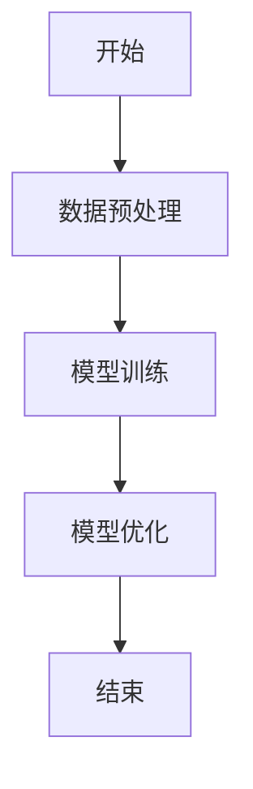
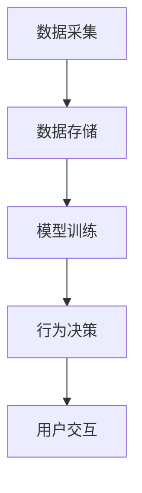

                 


# 个性化定制：为不同用户调整AI Agent的行为

---

> 关键词：个性化定制，AI Agent，用户行为，定制化训练，反馈机制

> 摘要：本文将深入探讨如何为不同用户个性化定制AI Agent的行为，从核心概念到算法实现，再到系统架构设计和实际案例，系统性地分析和讲解实现个性化定制的关键步骤和技术要点。

---

## 第1章：个性化定制AI Agent的背景与概念

### 1.1 AI Agent的基本概念

- **1.1.1 AI Agent的定义与功能**
  AI Agent（智能代理）是指能够感知环境并采取行动以实现目标的计算机系统。它可以自主决策、执行任务，并与用户或其他系统进行交互。

- **1.1.2 AI Agent的核心技术与应用场景**
  AI Agent的核心技术包括自然语言处理、机器学习、强化学习等。应用场景广泛，如智能助手、推荐系统、自动驾驶等。

- **1.1.3 个性化定制的必要性与价值**
  个性化定制AI Agent的行为能够提升用户体验，提高系统的适应性和实用性，满足不同用户的需求。

### 1.2 个性化定制的背景与挑战

- **1.2.1 当前AI Agent的局限性**
  当前AI Agent的行为通常是基于统一的模型，无法根据用户的个性化需求进行动态调整。

- **1.2.2 用户需求的多样性与动态变化**
  用户的需求千差万别，且会随着时间变化，这使得AI Agent的行为需要具备高度的灵活性和适应性。

- **1.2.3 个性化定制的市场需求与技术趋势**
  市场对个性化服务的需求日益增长，推动了AI Agent行为个性化定制的技术发展。

### 1.3 当前个性化定制AI Agent的应用现状

- **1.3.1 个性化推荐系统的成功案例**
  如Netflix的个性化推荐系统，通过分析用户的行为数据，提供个性化的视频推荐。

- **1.3.2 个性化对话系统的应用实例**
  如智能客服系统，根据用户的历史对话和情感倾向，提供个性化的服务。

- **1.3.3 个性化定制AI Agent的未来发展方向**
  随着技术的进步，AI Agent将更加智能化和个性化，能够实时感知并调整其行为以适应用户需求。

---

## 第2章：个性化定制的核心概念与联系

### 2.1 AI Agent的行为模型

- **2.1.1 行为模型的定义与分类**
  行为模型描述了AI Agent在特定场景下的行为方式，通常分为基于规则的行为模型和基于学习的行为模型。

- **2.1.2 用户画像在行为模型中的作用**
  用户画像是对用户特征的综合描述，是AI Agent行为模型的重要输入，用于指导模型的决策过程。

- **2.1.3 动态行为调整的机制与策略**
  AI Agent需要根据用户反馈和环境变化动态调整其行为，这通常通过强化学习和反馈机制实现。

### 2.2 用户画像与个性化策略

- **2.2.1 用户画像的构建与更新**
  用户画像是通过收集和分析用户数据构建的，包括用户的偏好、行为习惯等，并且需要实时更新。

- **2.2.2 个性化策略的制定与优化**
  基于用户画像，制定个性化的策略，如推荐策略、对话策略等，并通过A/B测试等方法不断优化。

- **2.2.3 用户反馈在个性化策略中的应用**
  用户反馈是个性化策略优化的重要依据，AI Agent需要实时收集并分析用户反馈，动态调整其行为。

### 2.3 个性化定制的核心要素

- **2.3.1 数据驱动的个性化分析**
  通过收集和分析用户数据，提取特征，为个性化定制提供依据。

- **2.3.2 模型驱动的个性化预测**
  使用机器学习模型预测用户的偏好和行为，指导AI Agent的行为决策。

- **2.3.3 人机交互中的个性化反馈**
  在人机交互过程中，实时收集用户的反馈，用于优化AI Agent的行为。

### 2.4 核心概念的ER实体关系图

```mermaid
er
actor(Agent, 用户, 反馈)
rectangle(Agent, 行为模型, 用户画像, 个性化策略)
rectangle(用户, 用户数据, 用户反馈)
rectangle(反馈, 反馈数据, 反馈分析)
```

---

## 第3章：个性化定制的算法原理

### 3.1 基于迁移学习的个性化定制

- **3.1.1 迁移学习的基本原理**
  迁移学习是一种机器学习技术，通过将已有的知识迁移到新的任务中，减少新任务的数据需求。

- **3.1.2 在个性化定制中的应用**
  在个性化定制中，可以利用迁移学习将通用模型迁移到特定用户的场景中，提升模型的适应性。

### 3.2 基于用户反馈的强化学习

- **3.2.1 强化学习的基本原理**
  强化学习是一种通过试错机制，通过奖励或惩罚来优化行为的机器学习方法。

- **3.2.2 在个性化定制中的应用**
  AI Agent通过用户反馈获得奖励或惩罚信号，不断优化其行为策略。

### 3.3 算法实现步骤

- **3.3.1 数据预处理**
  对用户数据进行清洗、特征提取等预处理步骤。

- **3.3.2 模型训练**
  使用迁移学习或强化学习方法训练个性化模型。

- **3.3.3 模型优化**
  通过用户反馈不断优化模型参数，提升个性化效果。

### 3.4 算法流程图



---

## 第4章：个性化定制的系统架构设计

### 4.1 系统功能设计

- **4.1.1 数据采集模块**
  负责收集用户数据，如用户行为、反馈等。

- **4.1.2 模型训练模块**
  负责基于用户数据训练个性化模型。

- **4.1.3 行为决策模块**
  根据用户画像和个性化策略，指导AI Agent的行为决策。

### 4.2 系统架构图



---

## 第5章：个性化定制的项目实战

### 5.1 个性化推荐系统的实现

- **5.1.1 环境配置**
  安装必要的库和工具，如Python、TensorFlow等。

- **5.1.2 核心代码实现**
  ```python
  import numpy as np
  from tensorflow.keras import models

  # 加载预训练模型
  model = models.load_model('pretrained_model.h5')

  # 定义个性化层
  def custom_layer(input_tensor):
      return input_tensor * 0.8 + np.random.normal(0, 0.1, input_tensor.shape)
  ```

- **5.1.3 案例分析与优化**
  分析推荐效果，根据用户反馈优化模型参数。

---

## 第6章：总结与展望

### 6.1 总结

- 个性化定制AI Agent的行为是一个复杂但重要的任务，需要结合用户数据、机器学习算法和系统架构设计。

### 6.2 展望

- 随着技术的发展，个性化定制将更加智能化和自动化，AI Agent将能够更好地适应用户需求。

---

## 作者：AI天才研究院/AI Genius Institute & 禅与计算机程序设计艺术 /Zen And The Art of Computer Programming

---

### 附录：推荐阅读

- 《迁移学习实战》
- 《强化学习算法解析》
- 《机器学习系统设计》

