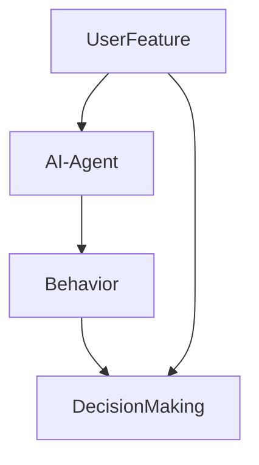
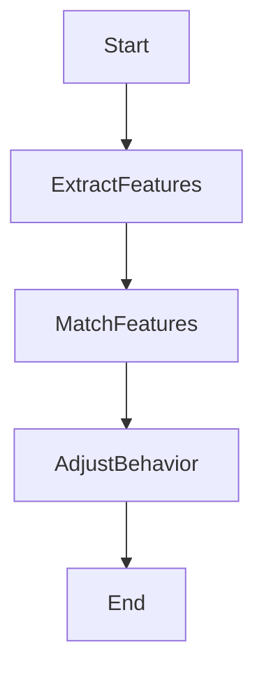
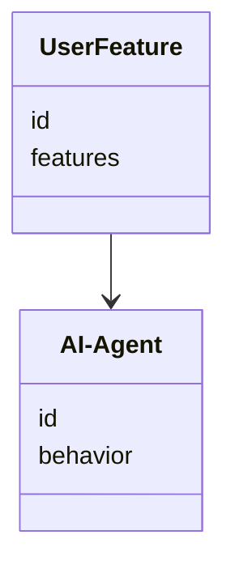
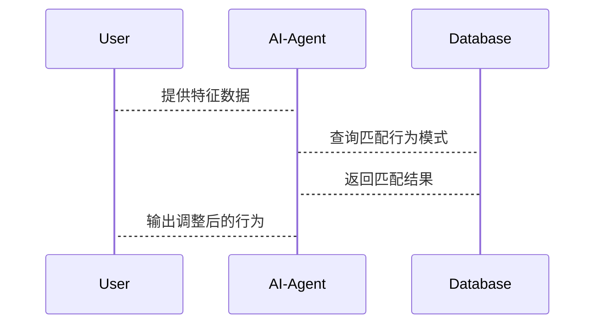

                 


# 个性化定制：根据用户特征调整AI Agent

## 关键词：个性化定制，AI Agent，用户特征，自适应系统，机器学习，算法优化

## 摘要：  
个性化定制是提升AI Agent性能和用户体验的关键技术。本文从用户特征分析入手，详细探讨如何根据用户特征调整AI Agent的行为模式。通过背景介绍、核心概念、算法原理、系统设计、项目实战和最佳实践等多维度分析，全面揭示个性化定制在AI Agent中的应用价值和实现方法。

---

# 第1章：个性化定制与AI Agent概述

## 1.1 个性化定制的背景与意义

### 1.1.1 个性化定制的定义与特点  
个性化定制是指根据用户的特定需求和特征，动态调整系统的行为模式或输出结果。其核心特点包括：  
1. **动态性**：能够实时感知用户特征并做出调整。  
2. **针对性**：针对不同用户特征提供差异化服务。  
3. **适应性**：能够适应用户特征的变化，持续优化系统表现。  

### 1.1.2 个性化定制在AI Agent中的应用价值  
AI Agent是一种具备自主决策能力的智能体，其功能和行为可以通过个性化定制进一步优化。个性化定制能够显著提升AI Agent的用户体验、效率和准确性。  

### 1.1.3 个性化定制的边界与外延  
个性化定制的边界在于用户隐私保护和系统性能的平衡。外延则涉及数据采集、特征分析、算法优化等多个技术领域。  

---

## 1.2 用户特征分析的核心要素  

### 1.2.1 用户特征的分类与层次  
用户特征可以分为以下几类：  
- **基本信息**：如年龄、性别、职业等。  
- **行为特征**：如使用习惯、操作频率等。  
- **兴趣特征**：如偏好、爱好等。  
- **需求特征**：如功能需求、性能需求等。  

### 1.2.2 用户特征与AI Agent的关联  
用户特征是AI Agent行为调整的重要依据。例如，根据用户的兴趣特征，AI Agent可以优先推荐相关内容。  

### 1.2.3 个性化定制的实现路径  
个性化定制的实现路径包括：数据采集、特征分析、算法优化和效果评估。  

---

## 1.3 本章小结  
本章从背景、核心概念和实现路径三个方面介绍了个性化定制与AI Agent的关系，为后续内容奠定了基础。

---

# 第2章：用户特征与AI Agent的关系

## 2.1 用户特征的核心属性  

### 2.1.1 用户行为特征  
用户行为特征包括操作频率、操作时间、操作路径等。例如，高频用户可能需要更快的响应速度。  

### 2.1.2 用户兴趣特征  
用户兴趣特征包括偏好、爱好等。例如，音乐爱好者可能需要AI Agent推荐不同风格的音乐。  

### 2.1.3 用户需求特征  
用户需求特征包括功能需求、性能需求等。例如，用户可能需要AI Agent具备多语言支持功能。  

---

## 2.2 AI Agent的核心功能  

### 2.2.1 信息处理能力  
AI Agent能够处理和分析大量数据，提取有用信息。  

### 2.2.2 交互能力  
AI Agent能够与用户进行自然语言交互，理解用户意图。  

### 2.2.3 自适应能力  
AI Agent能够根据用户特征动态调整自身行为。  

---

## 2.3 用户特征与AI Agent功能的关联  

### 2.3.1 用户特征对AI Agent行为的影响  
例如，用户的兴趣特征会影响AI Agent的内容推荐策略。  

### 2.3.2 AI Agent如何基于用户特征进行决策  
AI Agent通过分析用户特征，选择最优的行为模式。  

### 2.3.3 用户特征与AI Agent性能的优化关系  
个性化定制能够显著提升AI Agent的性能和用户体验。  

---

## 2.4 用户特征与AI Agent关系的Mermaid图  


---

## 2.5 本章小结  
本章详细分析了用户特征与AI Agent的关系，展示了个性化定制在AI Agent中的重要性。

---

# 第3章：基于用户特征的AI Agent调整算法

## 3.1 算法原理概述  

### 3.1.1 算法目标  
根据用户特征动态调整AI Agent的行为模式。  

### 3.1.2 算法输入  
用户特征数据，如兴趣、行为等。  

### 3.1.3 算法输出  
AI Agent的行为调整策略。  

---

## 3.2 算法流程  

### 3.2.1 用户特征提取  
通过数据采集和分析提取用户特征。  

### 3.2.2 特征匹配  
将用户特征与预设的特征库进行匹配。  

### 3.2.3 AI Agent行为调整  
根据匹配结果调整AI Agent的行为模式。  

---

## 3.3 算法实现的Mermaid图  


---

## 3.4 算法实现的Python代码  

### 3.4.1 数据预处理  
```python
import pandas as pd

# 加载数据
data = pd.read_csv('user_features.csv')

# 数据清洗
data.dropna(inplace=True)
```

### 3.4.2 特征匹配  
```python
from sklearn.metrics.pairwise import cosine_similarity

# 计算相似度
similarity_matrix = cosine_similarity(data)
```

### 3.4.3 行为调整  
```python
def adjust_behavior(similarity, threshold=0.8):
    if similarity > threshold:
        return 'recommended'
    else:
        return 'not recommended'
```

---

## 3.5 本章小结  
本章详细介绍了基于用户特征的AI Agent调整算法，通过Python代码和Mermaid图展示了实现过程。

---

# 第4章：系统分析与架构设计

## 4.1 问题场景介绍  
本系统旨在根据用户特征动态调整AI Agent的行为模式，提升用户体验和系统性能。  

---

## 4.2 系统功能设计  

### 4.2.1 领域模型Mermaid类图  


---

## 4.3 系统架构设计  

### 4.3.1 系统架构Mermaid图  


---

## 4.4 接口设计与交互流程  

### 4.4.1 系统接口设计  
- 用户特征采集接口  
- AI Agent行为调整接口  

### 4.4.2 交互流程Mermaid图  


---

## 4.5 本章小结  
本章从系统设计的角度，详细分析了个性化定制AI Agent的实现架构和交互流程。

---

# 第5章：项目实战

## 5.1 环境安装  
安装Python、Pandas、Scikit-learn等依赖库。  

## 5.2 核心代码实现  

### 5.2.1 数据预处理  
```python
import pandas as pd

data = pd.read_csv('user_features.csv')
data.dropna(inplace=True)
```

### 5.2.2 特征匹配  
```python
from sklearn.metrics.pairwise import cosine_similarity

similarity_matrix = cosine_similarity(data)
```

### 5.2.3 行为调整  
```python
def adjust_behavior(similarity, threshold=0.8):
    if similarity > threshold:
        return 'recommended'
    else:
        return 'not recommended'
```

## 5.3 代码解读与分析  
- 数据预处理：清洗数据，去除缺失值。  
- 特征匹配：计算相似度，匹配用户特征。  
- 行为调整：根据相似度结果调整AI Agent行为。  

---

## 5.4 实际案例分析  
以音乐推荐系统为例，展示如何根据用户的听歌习惯调整AI Agent的推荐策略。  

---

## 5.5 本章小结  
本章通过实际案例，详细展示了个性化定制AI Agent的实现过程。

---

# 第6章：最佳实践与注意事项

## 6.1 最佳实践  

### 6.1.1 数据采集  
确保数据的准确性和完整性。  

### 6.1.2 特征分析  
选择合适的特征进行分析，避免信息过载。  

### 6.1.3 算法优化  
根据实际需求选择合适的算法，并持续优化。  

---

## 6.2 小结  
个性化定制是提升AI Agent性能和用户体验的重要技术，需要结合实际需求灵活应用。  

---

## 6.3 注意事项  

### 6.3.1 数据隐私保护  
确保用户数据的安全性和隐私性。  

### 6.3.2 系统性能优化  
避免因个性化定制导致系统性能下降。  

---

## 6.4 拓展阅读  
推荐阅读《个性化推荐系统》和《人工智能入门》等书籍。  

---

# 结论

个性化定制是提升AI Agent性能和用户体验的关键技术。本文从背景、核心概念、算法原理、系统设计、项目实战和最佳实践等多个维度，详细探讨了个性化定制在AI Agent中的应用。通过本文的分析，读者可以更好地理解个性化定制的核心思想和实现方法。

---

# 作者：AI天才研究院/AI Genius Institute & 禅与计算机程序设计艺术 /Zen And The Art of Computer Programming

