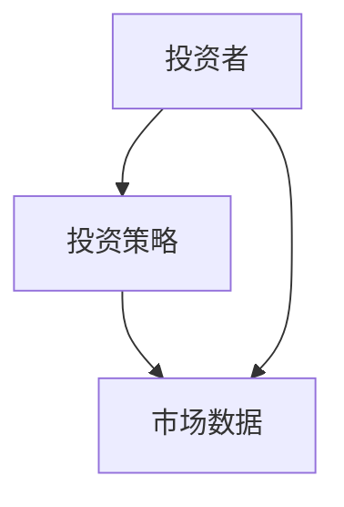
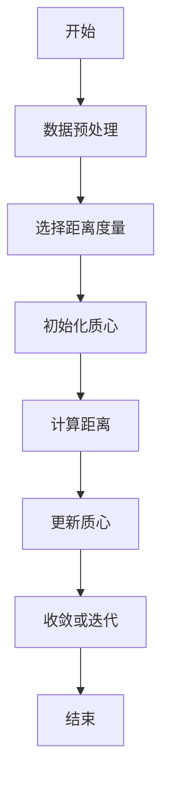
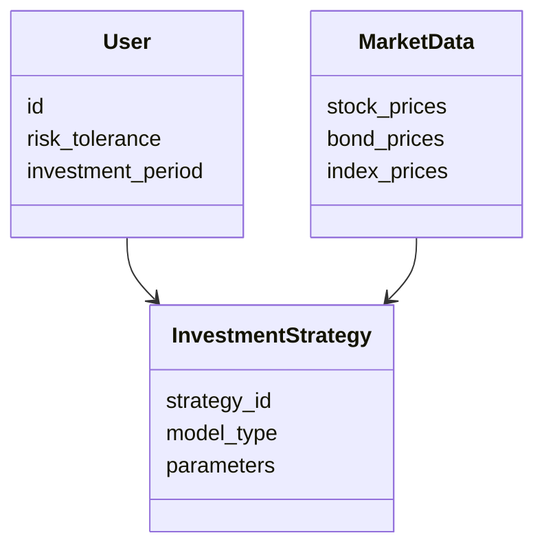
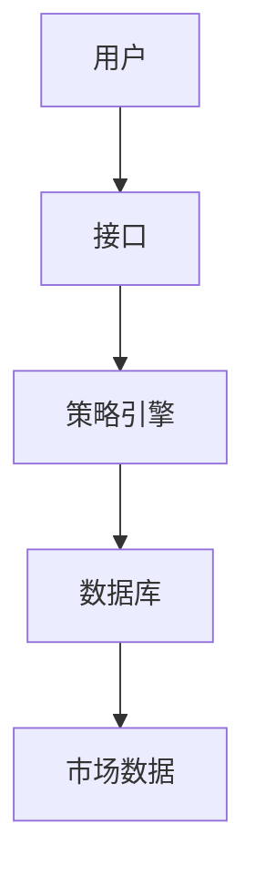

                 


# 个性化投资策略

---

## 关键词：个性化投资、算法驱动、数据驱动、投资策略、系统架构、项目实战、最佳实践

---

## 摘要：

个性化投资策略是一种基于投资者个人需求和市场数据的动态调整投资方案的方法，结合现代计算机技术和数据分析方法，能够实现高度定制化的投资策略。本文从背景、核心概念、算法原理、系统架构到项目实战，全面解析个性化投资策略的实现路径，帮助读者掌握从理论到实践的完整流程。

---

# 第1章: 个性化投资策略的背景与概念

## 1.1 个性化投资策略的背景

### 1.1.1 投资领域的问题背景

投资领域长期以来依赖传统的、固定的策略，但随着市场环境的复杂化和投资者需求的多样化，传统策略难以满足个性化需求。个性化投资策略的提出，旨在通过技术手段实现投资方案的精准匹配。

### 1.1.2 问题描述与解决方法

投资者在选择投资方案时，往往面临信息过载和个性化需求难以满足的问题。个性化投资策略通过数据分析和算法优化，能够根据投资者的风险承受能力、收益目标和市场动态，定制专属的投资方案。

### 1.1.3 边界与外延

个性化投资策略的边界在于投资者的个人特征和市场数据的可用性，其外延则扩展至金融市场的各个领域，包括股票、基金、债券等。

## 1.2 个性化投资策略的核心概念

### 1.2.1 核心要素与组成结构

个性化投资策略的核心要素包括投资者特征、市场数据、算法模型和反馈机制。这些要素共同构成了策略的生成与优化过程。

### 1.2.2 与传统投资策略的对比分析

传统投资策略通常基于通用模型，而个性化投资策略则通过动态调整模型参数，实现高度定制化。通过对比分析，可以看出个性化投资策略在灵活性和适应性上的优势。

## 1.3 本章小结

本章通过背景介绍和概念解析，帮助读者理解个性化投资策略的重要性和实现路径。

---

# 第2章: 核心概念与关联分析

## 2.1 核心概念原理

### 2.1.1 数据驱动的个性化分析

数据是个性化投资策略的核心，通过对投资者特征和市场数据的分析，提取关键信息。

### 2.1.2 算法驱动的策略生成

算法是实现个性化的关键，通过聚类分析、回归分析等方法，生成适合投资者的策略。

## 2.2 属性特征对比

### 2.2.1 用户特征分析

投资者特征包括风险偏好、投资期限、收益目标等。

### 2.2.2 投资标的特征分析

市场数据特征包括波动性、收益率、相关性等。

## 2.3 ER实体关系图



---

# 第3章: 算法原理讲解

## 3.1 聚类分析算法

### 3.1.1 K-means算法流程



### 3.1.2 聚类算法的Python实现

```python
from sklearn.cluster import KMeans

# 示例数据
X = [[1, 2], [3, 4], [5, 6], [7, 8]]

# 模型训练
kmeans = KMeans(n_clusters=2, random_state=0)
kmeans.fit(X)

# 输出结果
print(kmeans.labels_)
```

## 3.2 回归分析算法

### 3.2.1 线性回归模型

$$ y = \beta_0 + \beta_1x + \epsilon $$

### 3.2.2 回归算法的Python实现

```python
import numpy as np
from sklearn.linear_model import LinearRegression

# 示例数据
X = np.array([[1], [2], [3], [4]])
y = np.array([2, 3, 4, 5])

# 模型训练
reg = LinearRegression()
reg.fit(X, y)

# 输出结果
print(reg.coef_)
```

---

# 第4章: 系统分析与架构设计

## 4.1 问题场景介绍

### 4.1.1 投资者需求分析

投资者需要根据自身特征选择合适的投资策略。

### 4.1.2 市场环境分析

市场波动和经济周期对投资策略的影响。

## 4.2 系统功能设计

### 4.2.1 领域模型类图



### 4.2.2 系统架构图



---

# 第5章: 项目实战

## 5.1 环境安装与配置

### 5.1.1 安装Python和相关库

```bash
pip install numpy pandas scikit-learn
```

## 5.2 核心代码实现

### 5.2.1 数据预处理

```python
import pandas as pd

# 加载数据
data = pd.read_csv('market_data.csv')

# 数据清洗
data.dropna(inplace=True)
```

### 5.2.2 策略生成与优化

```python
from sklearn.metrics import mean_squared_error

# 训练模型
model = KMeans(n_clusters=3)
model.fit(data)

# 评估模型
print(mean_squared_error(data, model.predict(data)))
```

## 5.3 案例分析

### 5.3.1 投资者A的案例

投资者A风险偏好较低，适合配置债券和货币基金。

### 5.3.2 投资者B的案例

投资者B风险承受能力强，适合配置股票和成长型基金。

---

# 第6章: 最佳实践与总结

## 6.1 最佳实践 tips

### 6.1.1 数据质量的重要性

确保数据的准确性和完整性。

### 6.1.2 模型选择的策略

根据具体情况选择合适的算法。

## 6.2 小结

个性化投资策略通过技术手段实现了投资方案的精准匹配，为投资者提供了更大的灵活性和适应性。

## 6.3 注意事项

### 6.3.1 模型过拟合的风险

避免过度优化模型，确保模型的泛化能力。

### 6.3.2 数据隐私与安全

保护投资者的个人信息和交易数据。

## 6.4 拓展阅读

### 6.4.1 机器学习在金融领域的应用

### 6.4.2 时间序列分析与投资策略

---

# 附录

## 附录A: 术语表

### 个性化投资策略： 根据投资者需求和市场数据定制的投资策略。

## 附录B: 参考文献

- Bishop, C. M. (2006). Pattern Recognition and Machine Learning.
- Hastie, T., Tibshirani, R., & Friedman, J. (2009). The Elements of Statistical Learning.

---

# 作者：AI天才研究院/AI Genius Institute & 禅与计算机程序设计艺术 /Zen And The Art of Computer Programming

