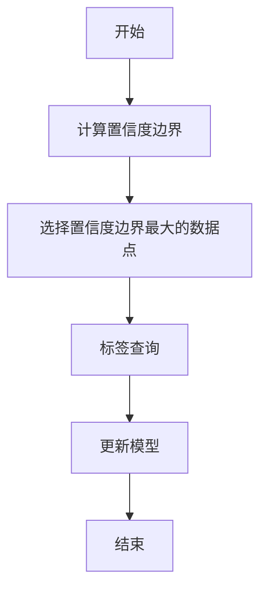

                 


# 《主动学习：优化AI Agent的学习效率》

---

## 关键词：
主动学习、AI Agent、机器学习、算法优化、学习效率

---

## 摘要：
本文深入探讨了主动学习在优化AI Agent学习效率中的作用，从核心概念、算法原理到系统设计，结合实际案例，全面解析了如何通过主动学习提升AI Agent的学习效率和准确性。文章内容涵盖背景介绍、算法推导、系统设计、项目实战等多方面，旨在为AI开发者和研究人员提供一份详实的技术指南。

---

## 第一部分: 主动学习的背景与基础

### 第1章: 主动学习的核心概念与背景

#### 1.1 主动学习的定义与背景
主动学习是一种机器学习方法，允许模型主动选择对学习最有帮助的数据点，从而提高学习效率和准确性。与监督学习不同，主动学习依赖于模型主动选择数据，而非被动接收数据。

- **主动学习的核心概念**：
  - 数据选择：模型主动选择对学习最有帮助的数据点。
  - 标签查询：模型可以对所选数据点进行标签查询。
  - 交互式学习：通过与数据标注者的交互，逐步优化模型。

- **主动学习的意义**：
  - 数据效率：减少对大量标注数据的依赖，降低数据标注成本。
  - 模型性能：通过选择性学习，提高模型的准确性和泛化能力。

#### 1.2 主动学习在AI Agent中的应用
AI Agent是一种智能体，能够在复杂环境中自主决策和执行任务。主动学习在AI Agent中的应用主要体现在以下几个方面：

- **任务优化**：通过主动选择相关任务数据，提高任务执行效率。
- **环境适应**：AI Agent能够主动探索环境，适应动态变化的环境条件。
- **数据稀疏性处理**：在数据稀疏的情况下，主动学习能够有效提升模型性能。

---

### 第2章: 主动学习的核心概念与联系

#### 2.1 核心概念原理
主动学习的核心概念包括不确定性度量、查询策略和反馈机制。

- **不确定性度量**：
  - 定义：模型对数据点的预测置信度。
  - 应用：选择置信度低的数据点进行标签查询。

- **查询策略**：
  - 定义：选择数据点的策略。
  - 常见策略包括最大不确定性规则、最小化风险规则等。

- **反馈机制**：
  - 定义：模型根据标签反馈进行更新。
  - 应用：通过反馈不断优化数据选择策略。

#### 2.2 算法原理讲解
主动学习的典型算法包括MCM（Maximum Confidence Margin）、UCB（Upper Confidence Bound）和QUIRE（Querying with Intervals and Regions）。

- **MCM算法**：
  - 原理：基于置信度边界选择数据点。
  - 步骤：
    1. 计算每个数据点的置信度边界。
    2. 选择置信度边界最大的数据点进行标签查询。

- **UCB算法**：
  - 原理：基于置信区间选择数据点。
  - 步骤：
    1. 计算每个数据点的置信区间。
    2. 选择置信区间上限最大的数据点进行标签查询。

- **QUIRE算法**：
  - 原理：基于数据点的区域划分选择数据点。
  - 步骤：
    1. 将数据空间划分为多个区域。
    2. 选择具有最大不确定性区域的数据点进行标签查询。

#### 2.3 算法流程图
以下是MCM算法的流程图：



---

### 第3章: 主动学习的数学模型与公式

#### 3.1 核心算法的数学模型
- **MCM算法的数学模型**：
  置信度边界计算公式：
  $$ \text{margin}(x_i) = \text{max}(0, \text{score}(x_i) - \text{score}(x_j)) $$
  其中，$x_i$ 是当前数据点，$x_j$ 是最接近的同类数据点。

- **UCB算法的数学模型**：
  置信区间计算公式：
  $$ \text{UCB}(x_i) = \text{score}(x_i) + \sqrt{\frac{\ln t}{n_i}} $$
  其中，$t$ 是时间步，$n_i$ 是数据点$x_i$的采样次数。

- **QUIRE算法的数学模型**：
  区域划分公式：
  $$ \text{region}(x_i) = \text{argmax}(|\text{score}(x_i) - \text{score}(x_j)|) $$

#### 3.2 公式推导与举例
- **MCM算法的公式推导**：
  通过计算置信度边界，选择置信度边界最大的数据点，从而减少模型预测的不确定性。

- **UCB算法的公式推导**：
  通过最大化置信区间上限，选择最有潜力的数据点，从而平衡探索与利用。

- **QUIRE算法的公式推导**：
  通过区域划分，选择具有最大不确定性的数据点，从而优化模型的泛化能力。

---

### 第4章: 系统分析与架构设计方案

#### 4.1 问题场景介绍
- **问题背景**：AI Agent在复杂环境中需要高效学习和决策。
- **问题描述**：如何通过主动学习优化AI Agent的学习效率。
- **问题解决思路**：通过主动学习选择最优数据点，减少数据标注成本，提高模型性能。

#### 4.2 系统功能设计
- **领域模型**：
  - 数据选择模块：负责选择最有帮助的数据点。
  - 标签查询模块：负责对所选数据点进行标签查询。
  - 模型更新模块：负责根据反馈更新模型参数。

- **系统架构设计**：
  ```mermaid
  graph TD
      A[数据源] --> B[数据选择模块]
      B --> C[标签查询模块]
      C --> D[模型更新模块]
      D --> E[AI Agent]
      E --> F[环境]
  ```

- **系统接口设计**：
  - 数据选择接口：`select_most_helpful_data()`
  - 标签查询接口：`query_labels()`
  - 模型更新接口：`update_model()`

---

### 第5章: 项目实战

#### 5.1 环境安装
- **Python环境**：Python 3.8+
- **依赖库安装**：
  ```bash
  pip install numpy scikit-learn mermaid
  ```

#### 5.2 核心实现代码
```python
import numpy as np
from sklearn.metrics import accuracy_score

def select_most_helpful_data(X, model, uncertainty_measure):
    uncertainties = uncertainty_measure(X)
    selected_index = np.argmax(uncertainties)
    return X[selected_index]

def query_labels(X, y_true, selected_index):
    selected_label = y_true[selected_index]
    return selected_label

def update_model(X, y_true, selected_label, model):
    X_new = np.vstack((X, selected_label))
    y_new = np.append(y_true, selected_label)
    model.fit(X_new, y_new)
    return model

# 示例使用
X = np.random.rand(100, 2)
y_true = np.random.randint(2, size=100)
model = ...  # 初始化模型
uncertainty_measure = lambda x: np.random.rand(len(x))

selected_data = select_most_helpful_data(X, model, uncertainty_measure)
selected_label = query_labels(X, y_true, selected_data)
updated_model = update_model(X, y_true, selected_label, model)
```

#### 5.3 案例分析
以智能客服场景为例，AI Agent需要通过主动学习优化意图分类模型。

- **环境描述**：智能客服系统需要准确分类用户意图。
- **数据选择**：模型主动选择最具代表性的用户查询。
- **标签查询**：通过人工标注获取意图标签。
- **模型更新**：根据新标签更新意图分类模型。

#### 5.4 项目小结
通过主动学习，AI Agent能够显著提高学习效率，减少数据标注成本，同时提升模型性能。

---

## 第六章: 最佳实践与总结

### 6.1 最佳实践
- **选择合适的主动学习算法**：根据具体任务选择适合的算法。
- **合理设置参数**：通过实验优化算法参数。
- **定期评估模型性能**：确保模型在主动学习过程中保持稳定性和准确性。

### 6.2 总结
本文全面解析了主动学习在优化AI Agent学习效率中的作用，从算法原理到系统设计，再到项目实战，为读者提供了系统的知识体系和实践指南。

---

## 作者：AI天才研究院/AI Genius Institute & 禅与计算机程序设计艺术 /Zen And The Art of Computer Programming

---

**全文完。**

