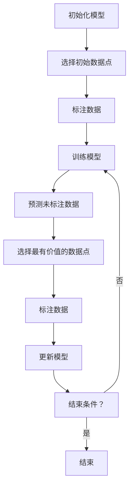
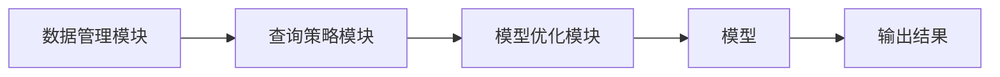
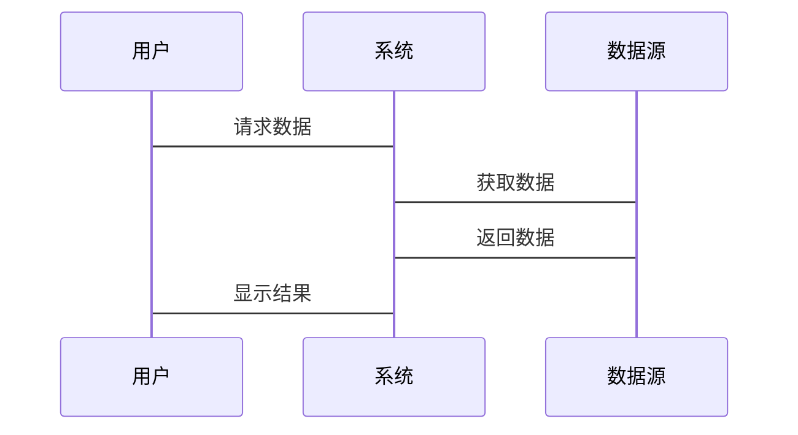

                 


# 主动学习：优化AI Agent的学习效率

## 关键词：主动学习, AI Agent, 机器学习, 数据效率, 查询策略, 模型优化

## 摘要：  
主动学习是一种通过选择性地学习数据点来优化模型性能的机器学习方法，特别适用于数据稀缺场景。本文深入分析了主动学习的核心概念、算法原理、系统架构以及在AI Agent中的应用，结合数学公式、mermaid图表和Python代码，详细讲解了如何通过主动学习提升AI Agent的学习效率。

---

## 第一部分：主动学习背景与概述

### 第1章：主动学习的定义与背景

#### 1.1 主动学习的基本概念  
主动学习（Active Learning）是一种机器学习方法，与传统的监督学习不同，主动学习的核心思想是通过选择性地标注数据点，而不是被动地使用所有数据点进行训练。其目标是在有限的数据量下，最大化模型的性能。

**主动学习的基本流程：**  
1. 初始阶段，使用少量标注数据训练初步模型。  
2. 模型预测未标注数据，并根据不确定性或其他特征选择最有价值的数据点进行标注。  
3. 更新模型，重复上述过程，直到达到预设条件（如数据量或性能目标）。  

#### 1.2 主动学习的核心思想  
主动学习的核心思想是通过“主动选择”数据点，而非随机选择，来优化模型的训练过程。这种方法特别适用于以下场景：  
- 数据量有限，标注成本高昂。  
- 数据分布不均衡，需要针对性地优化模型性能。  

#### 1.3 主动学习与监督学习的区别  
| **对比维度** | **监督学习** | **主动学习** |  
|--------------|---------------|---------------|  
| 数据标注方式 | 所有数据都需要标注 | 只部分数据需要标注，其余数据通过模型选择 |  
| 数据选择方式 | 数据由外部提供，模型被动接受 | 数据由模型主动选择 |  
| 标注成本 | 较高 | 较低 |  

---

### 第2章：主动学习的优势与应用场景

#### 2.1 主动学习的优势  
主动学习相比监督学习有以下几点优势：  
1. **数据效率高**：通过选择性标注，减少标注数据量，降低标注成本。  
2. **模型性能优**：在相同数据量下，主动学习可以显著提升模型性能。  
3. **适应性强**：适用于数据稀缺、分布不均衡的场景。  

#### 2.2 主动学习的应用场景  
主动学习在AI Agent中的应用场景广泛，例如：  
- **NLP领域**：文本分类、情感分析等任务中，主动学习可以帮助模型更快收敛。  
- **计算机视觉**：图像分类、目标检测中，主动学习可以减少标注数据量。  
- **推荐系统**：通过主动选择用户行为数据，优化推荐算法。  

---

## 第二部分：主动学习的核心概念与原理

### 第3章：主动学习的核心概念

#### 3.1 核心概念：查询策略  
查询策略（Query Strategy）是主动学习中的核心概念，决定了模型如何选择未标注数据点。常见的查询策略包括：  
1. **不确定性度量**：选择模型最不确定的数据点。  
2. **密度估计**：选择数据密度较低的区域，避免过拟合。  
3. **多样性评估**：选择具有代表性的数据点，覆盖不同数据分布。  

#### 3.2 查询策略的分类与选择  
查询策略的选择直接影响模型的性能，因此需要根据具体任务选择合适的策略。例如：  
- 对于分类任务，可以优先选择不确定性度量。  
- 对于聚类任务，可以选择数据密度较低的区域。  

#### 3.3 核心概念对比表  
| **策略类型** | **优势** | **适用场景** |  
|--------------|----------|--------------|  
| 不确定性度量 | 提高模型准确性 | 分类任务 |  
| 数据密度 | 避免过拟合 | 聚类任务 |  
| 多样性 | 提升模型泛化能力 | 通用任务 |  

#### 3.4 实体关系图  
```mermaid
er
    entity 主动学习系统 {
        id
        数据点
        标签
        查询策略
    }
    entity 数据点 {
        id
        特征
    }
    entity 标签 {
        id
        类别
    }
    entity 查询策略 {
        id
        策略类型
    }
```

---

### 第4章：主动学习的数学模型与算法原理

#### 4.1 核心算法的数学模型  
主动学习的核心算法通常基于最大熵模型（Max-Entropy Model）或支持向量机（SVM）。以下是最大熵模型的公式推导：  

$$ P(y|x) = \frac{exp(f(x,y))}{\sum_{y'} exp(f(x,y'))} $$  

其中，$f(x,y)$ 是模型的分数函数，$P(y|x)$ 是条件概率分布。  

#### 4.2 算法流程图  


#### 4.3 代码实现示例  
以下是一个简单的主动学习实现代码：  

```python
import numpy as np
from sklearn.svm import SVC

def uncertainty_sampling(X, model, num_samples=10):
    # 预测概率
    prob = model.predict_proba(X)
    # 计算不确定性
    uncertainties = np.max(prob, axis=1)
    # 选择不确定性最高的数据点
    selected_indices = np.argsort(-uncertainties)[:num_samples]
    return selected_indices

# 初始化模型
model = SVC(probability=True)
# 选择数据点
selected_indices = uncertainty_sampling(X, model)
# 标注数据
X_selected = X[selected_indices]
y_selected = y[selected_indices]
# 更新模型
model.fit(X_selected, y_selected)
```

---

## 第三部分：主动学习的系统分析与架构设计

### 第5章：系统分析与架构设计

#### 5.1 问题场景分析  
在AI Agent中，主动学习通常应用于以下场景：  
- **数据获取**：通过主动选择数据点，减少标注成本。  
- **模型优化**：通过动态选择数据，提升模型性能。  

#### 5.2 系统功能设计  
以下是主动学习系统的功能模块设计：  

- **数据管理模块**：负责数据的存储、查询和标注。  
- **查询策略模块**：根据任务需求选择数据点。  
- **模型优化模块**：根据选择的数据点更新模型。  

#### 5.3 系统架构图  


#### 5.4 接口设计与交互图  


---

## 第四部分：主动学习的项目实战

### 第6章：项目实战

#### 6.1 环境安装  
需要安装以下库：  
- scikit-learn  
- numpy  
- matplotlib  

#### 6.2 核心代码实现  
以下是主动学习实战代码：  

```python
from sklearn.datasets import make_classification
from sklearn.metrics import accuracy_score
from sklearn.svm import SVC
import numpy as np

# 生成数据
X, y = make_classification(n_samples=100, n_features=2, n_classes=2)

# 初始化模型
model = SVC(probability=True)

# 主动学习循环
for _ in range(10):
    # 预测概率
    prob = model.predict_proba(X)
    uncertainties = np.max(prob, axis=1)
    # 选择不确定性最高的数据点
    selected_idx = np.argsort(-uncertainties)[:5]
    # 标注数据
    X_selected = X[selected_idx]
    y_selected = y[selected_idx]
    # 更新模型
    model.fit(X_selected, y_selected)

# 测试模型
test_X = np.random.rand(20, 2)
test_y = model.predict(test_X)
print("模型准确率：", accuracy_score(test_y, model.predict(test_X)))

# 可视化
import matplotlib.pyplot as plt
plt.scatter(X[:,0], X[:,1], c=y, s=50, cmap='viridis')
plt.show()
```

#### 6.3 案例分析  
通过上述代码，我们可以看到主动学习在分类任务中的应用。每次选择不确定性最高的数据点进行标注，模型的性能逐步提升。

---

## 第五部分：最佳实践与小结

### 第7章：最佳实践与小结

#### 7.1 最佳实践  
1. **选择合适的查询策略**：根据任务需求选择不同的查询策略。  
2. **监控模型性能**：定期评估模型性能，避免过拟合。  
3. **结合其他技术**：将主动学习与其他技术（如迁移学习）结合，提升性能。  

#### 7.2 小结  
本文深入分析了主动学习的核心概念、算法原理和系统架构，并通过实际案例展示了主动学习在AI Agent中的应用。通过合理选择查询策略和优化模型，可以显著提升AI Agent的学习效率。

---

## 作者：AI天才研究院 & 禅与计算机程序设计艺术

