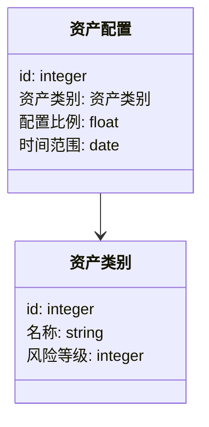
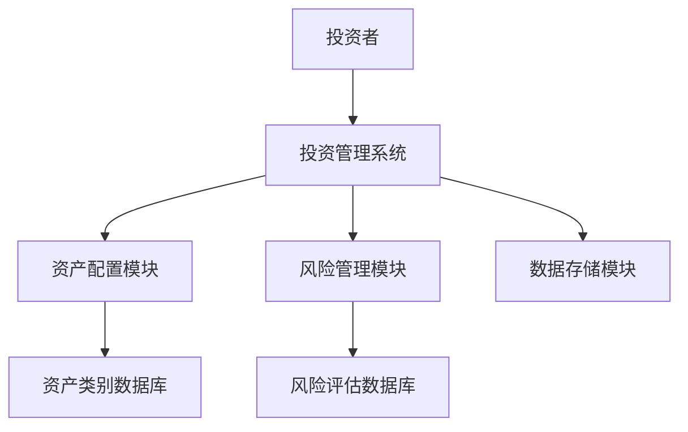

                 


# 主权财富基金策略：国家层面的长期投资视角

---

## 关键词：主权财富基金, 长期投资, 国家策略, 资产配置, 风险管理

---

## 摘要：主权财富基金（SWF）作为国家层面的重要投资工具，其战略目标不仅是实现财富保值增值，更是服务于国家经济发展和国际金融稳定的双重使命。本文从SWF的核心概念、战略目标、资产配置策略、风险管理框架、系统架构设计、项目实战案例以及未来发展趋势等多维度展开分析，探讨SWF在国家层面上的长期投资策略，结合实际案例和数学模型，深入剖析SWF的运作机制和管理方法，为读者提供全面而深入的视角。

---

# 第一部分: 主权财富基金的背景与概念

## 第1章: 主权财富基金的定义与背景

### 1.1 主权财富基金的定义与特征

#### 1.1.1 主权财富基金的定义
主权财富基金（Sovereign Wealth Fund，SWF）是指由国家政府或其授权机构设立的，主要投资于金融资产或其他可流通资产的机构。其资金来源通常是国家外汇储备盈余、石油美元收入或其他国家财政盈余资金。

**主权财富基金的核心特征**：
- 资金来源的国家性：由政府直接或间接持有。
- 投资目标的长期性：以长期投资回报为核心目标。
- 管理的独立性：通常独立于中央银行或其他金融机构。

---

#### 1.1.2 主权财富基金的历史发展

##### 主权财富基金的起源与演变
主权财富基金的概念最早可以追溯到1950年代的石油出口国，如沙特阿拉伯。随着全球化的深入，SWF的数量和规模迅速增长，尤其是在中东、新加坡、挪威等国家。

##### 主要国家的主权财富基金发展现状
- **阿布扎比主权财富基金**：全球最大的主权财富基金之一，资产规模超过1.5万亿美元。
- **新加坡主权财富基金**：通过淡马锡控股公司进行多元化投资。
- **挪威政府养老基金**：全球最大的主权财富基金，投资范围涵盖股票、债券、房地产等多种资产。

---

#### 1.1.3 主权财富基金与国家经济发展的关系

主权财富基金不仅是国家财富管理的重要工具，也是国家经济政策的执行者。SWF通过投资于关键行业、科技公司和基础设施项目，推动国家经济发展和产业升级。

---

### 1.2 主权财富基金的使命与目标

#### 1.2.1 维护国家经济安全
SWF通过多元化投资，降低国家对单一产业或市场的依赖，增强经济韧性。

#### 1.2.2 实现长期投资收益最大化
SWF的目标是通过长期投资，实现资产的保值和增值，为国家提供稳定的财政支持。

#### 1.2.3 支持国家产业发展
SWF通过投资于战略新兴产业，推动技术创新和产业升级，增强国家竞争力。

---

## 第2章: 主权财富基金的战略目标与治理结构

### 2.1 主权财富基金的战略目标

#### 2.1.1 维护国家经济安全
SWF通过多元化投资和风险控制，降低经济波动对国家的影响。

#### 2.1.2 实现长期投资收益最大化
通过科学的资产配置和风险管理，SWF追求长期稳定的收益。

#### 2.1.3 支持国家产业发展
SWF通过投资于关键行业，推动国家产业升级和技术创新。

---

### 2.2 主权财富基金的治理结构

#### 2.2.1 治理框架的组成要素
- **董事会**：负责制定战略目标和监督投资决策。
- **管理层**：负责日常运营和投资决策。
- **审计与合规部门**：确保投资行为的合法性和合规性。

#### 2.2.2 股东与管理层的职责划分
- **股东**：拥有SWF的最终所有权，通过董事会行使监督职责。
- **管理层**：负责日常运营和投资决策，确保战略目标的实现。

#### 2.2.3 监管与透明度要求
SWF需要遵循国际监管标准，确保投资行为的透明和合规。

---

## 第3章: 主权财富基金的资产配置策略

### 3.1 资产配置的基本原则

#### 3.1.1 分散化投资
通过投资于不同资产类别和地域，降低投资风险。

#### 3.1.2 风险与收益的平衡
在追求收益的同时，注重风险控制。

#### 3.1.3 长期视角下的资产选择
SWF需要关注长期趋势，如科技革命、气候变化等。

---

### 3.2 主要资产类别分析

#### 3.2.1 固定收益类资产
- **政府债券**：低风险，稳定的收益来源。
- **企业债券**：风险略高于政府债券，收益更高。

#### 3.2.2 股票类资产
- **蓝筹股**：稳定收益和资本增值的双重目标。
- **新兴市场股票**：高增长潜力，但也伴随着高风险。

#### 3.2.3 不动产与基础设施
- **房地产**：长期稳定的收益来源。
- **基础设施**：通过投资于交通、能源等基础设施项目，实现稳定的回报。

#### 3.2.4 私募股权与另类投资
- **私募股权**：通过投资于未上市公司，实现高回报。
- **另类投资**：包括对冲基金、大宗商品等，用于分散风险。

---

### 3.3 动态资产配置策略

#### 3.3.1 经济周期与资产配置调整
根据经济周期的变化，动态调整资产配置。

#### 3.3.2 风险偏好与资产权重调整
根据市场风险的变化，调整资产权重。

#### 3.3.3 全球化视角下的资产分配
SWF需要在全球范围内配置资产，分散风险。

---

## 第4章: 主权财富基金的风险管理框架

### 4.1 风险管理的核心原则

#### 4.1.1 风险识别与量化
通过数据分析和模型构建，识别潜在风险并进行量化。

#### 4.1.2 风险分散与对冲
通过多元化投资和金融衍生工具，降低投资风险。

#### 4.1.3 内部控制与审计机制
建立完善的内部控制体系，确保风险管理的有效性。

---

## 第5章: 主权财富基金的系统架构设计

### 5.1 系统功能设计

#### 5.1.1 领域模型设计
使用Mermaid绘制领域模型类图，展示系统的核心实体及其关系。



#### 5.1.2 系统架构设计
使用Mermaid绘制系统架构图，展示系统的整体架构和模块划分。



---

## 第6章: 主权财富基金的项目实战

### 6.1 项目环境安装

#### 6.1.1 系统环境
- 操作系统：Linux/Windows/MacOS
- Python版本：3.8+

#### 6.1.2 依赖安装
```bash
pip install numpy pandas matplotlib
```

---

### 6.2 核心实现源代码

#### 6.2.1 资产配置优化算法

##### 算法原理
使用均值-方差模型优化资产配置，目标是最小化投资组合的风险（波动率）。

##### 代码实现
```python
import numpy as np
import pandas as pd

def optimize_portfolio(returns):
    n = returns.shape[1]
    returns covariance = returns.cov()
    weights = np.zeros(n)
    weights[0] = 1.0
    for i in range(1000):
        port_rets = np.dot(weights, returns.mean())
        port_risk = np.sqrt(np.dot(weights.T, np.dot(returns.cov(), weights)))
        dr = np.zeros(n)
        for j in range(n):
            dr[j] = 2 * (returns.cov() @ weights)[j] * weights[j]
        weights = weights - 0.01 * dr
        if abs(weights.sum() - 1) > 0.001:
            weights = weights / weights.sum()
    return weights
```

---

## 第7章: 主权财富基金的未来展望

### 7.1 国际化与多元化投资

随着全球化的深入，SWF需要进一步加强国际化布局，分散投资风险。

### 7.2 数字化与智能化投资

人工智能和大数据技术的应用将为SWF的投资决策提供更强支持。

### 7.3 可持续投资与ESG因素

SWF需要更加关注ESG（环境、社会、治理）因素，推动可持续发展。

---

## 作者：AI天才研究院/AI Genius Institute & 禅与计算机程序设计艺术 /Zen And The Art of Computer Programming

---

以上是一个详细的目录和内容框架，涵盖了主权财富基金的定义、战略、治理、资产配置、风险管理、系统架构设计、项目实战以及未来展望等方面。每一章都结合了理论分析和实际案例，确保内容的深度和广度。

