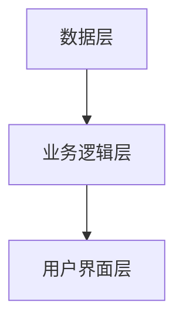

                 


# 主题投资：把握长期经济社会发展趋势

> 关键词：主题投资，经济社会趋势，投资策略，量化分析，系统架构

> 摘要：本文探讨了主题投资的核心概念、策略和方法，通过分析长期经济社会发展趋势，结合量化分析和系统架构设计，提供了一套完整的主题投资解决方案。文章详细介绍了主题识别、量化分析、系统设计和实际案例，帮助读者掌握主题投资的精髓。

---

# 第一部分: 主题投资的背景与核心概念

## 第1章: 主题投资的定义与背景

### 1.1 主题投资的定义
#### 1.1.1 什么是主题投资
主题投资是一种以特定主题为核心的投资策略，关注那些能够反映长期经济社会发展趋势的行业或领域。通过聚焦于这些主题，投资者可以捕捉到潜在的高增长机会。

#### 1.1.2 主题投资的特点
- **长期性**：主题投资关注的是未来数年甚至数十年的趋势，而非短期波动。
- **聚焦性**：专注于特定主题，如科技、医疗、消费等，而非分散投资。
- **风险分散**：通过多个相关行业的投资，分散单一行业风险。

#### 1.1.3 主题投资与传统投资的区别
- **投资策略**：传统投资注重个股或行业分散，而主题投资注重长期趋势。
- **风险控制**：传统投资注重短期波动，主题投资注重长期收益。

### 1.2 主题投资的背景
#### 1.2.1 经济社会发展的长期趋势
随着科技的进步和全球化的加深，经济社会正在发生深刻变化，如数字化转型、老龄化加剧、环保需求增加等。

#### 1.2.2 技术进步对投资的影响
人工智能、大数据、区块链等技术的快速发展，为投资者提供了新的投资机会。

#### 1.2.3 政策与法规对主题投资的推动
政府政策如碳中和目标、 healthcare reform等，对相关行业有直接影响。

## 第2章: 长期经济社会发展趋势分析

### 2.1 长期趋势的识别
#### 2.1.1 经济增长的长期驱动因素
- 技术创新
- 人口结构变化
- 全球化与区域经济一体化

#### 2.1.2 技术创新对经济的影响
人工智能、5G、云计算等技术推动产业升级和经济增长。

#### 2.1.3 社会变迁对投资的影响
老龄化社会增加 healthcare投资需求，年轻人口推动消费行业增长。

### 2.2 主题投资的核心要素
#### 2.2.1 主题的定义与分类
- 主题定义：反映经济社会发展趋势的行业或领域。
- 主题分类：科技、医疗、消费、能源、金融等。

#### 2.2.2 主题的生命周期
- 初期：主题概念提出，市场关注度低。
- 成熟期：主题被广泛认知，投资热度上升。
- 衰退期：主题红利逐渐消失，投资热度下降。

#### 2.2.3 主题的量化分析方法
- 主题指数构建：选取代表该主题的股票或 ETF。
- 主题的因子分析：分析主题相关的财务指标、市场表现等。

---

# 第二部分: 主题投资的核心概念与联系

## 第3章: 主题投资的核心概念

### 3.1 主题的识别与分类
#### 3.1.1 主题的识别方法
- 宏观经济分析：通过 GDP增长、就业数据等宏观指标识别趋势。
- 技术分析：通过专利申请、技术发展动态识别技术驱动的主题。
- 市场调研：通过消费者行为、行业研究报告识别新兴趋势。

#### 3.1.2 主题的分类标准
- 行业标准：根据行业划分，如科技、医疗等。
- 市场热度：根据市场关注度和投资热度分类。

#### 3.1.3 主题的生命周期模型
- 初期：主题处于萌芽阶段，市场关注度低。
- 成熟期：主题被广泛认知，投资热度上升。
- 衰退期：主题红利逐渐消失，投资热度下降。

### 3.2 主题投资的量化分析
#### 3.2.1 主题指数的构建
- 数据来源：选取代表该主题的股票或 ETF。
- 指数构建方法：等权或市值加权。

#### 3.2.2 主题的因子分析
- 主题相关因子：如科技主题的 R&D支出、技术创新能力。
- 因子分析方法：回归分析、因子分解。

## 第4章: 主题投资的核心原理

### 4.1 主题投资的原理
#### 4.1.1 主题的识别与选择
- 通过宏观经济分析、行业研究报告等方法识别主题。
- 选择具有长期增长潜力的主题进行投资。

### 4.2 主题投资的逻辑框架
- 长期趋势识别：通过宏观经济分析、行业研究报告等方法识别长期趋势。
- 主题筛选标准：选择具有增长潜力的主题。
- 投资策略制定：根据主题特点制定投资策略，如定投、分散投资等。

---

# 第三部分: 主题投资的算法与系统架构

## 第5章: 主题投资的算法原理

### 5.1 主题投资的量化分析方法
#### 5.1.1 主题指数构建
- 数据来源：选取代表该主题的股票或 ETF。
- 指数构建方法：等权或市值加权。

#### 5.1.2 主题的因子分析
- 因子选择：如科技主题的 R&D支出、技术创新能力。
- 因子分析方法：回归分析、因子分解。

#### 5.1.3 主题的风险调整收益
- 风险调整收益计算：夏普比率、特雷纳比率等。

### 5.2 主题投资的数学模型
#### 5.2.1 主题指数构建模型
$$
\text{主题指数} = \sum_{i=1}^{n} w_i \times p_i
$$
其中，\( w_i \) 是第 \( i \) 只股票的权重，\( p_i \) 是第 \( i \) 只股票的价格。

#### 5.2.2 主题的因子分析模型
$$
y = \beta_1 x_1 + \beta_2 x_2 + \cdots + \beta_k x_k + \epsilon
$$
其中，\( y \) 是主题的收益，\( x_i \) 是因子，\( \beta_i \) 是因子的系数，\( \epsilon \) 是误差项。

## 第6章: 主题投资的系统架构设计

### 6.1 系统功能设计
#### 6.1.1 功能模块
- 数据采集：获取主题相关的数据，如股票价格、行业研究报告等。
- 数据处理：清洗、转换数据。
- 模型构建：构建主题指数、因子分析模型。
- 投资组合优化：根据模型结果优化投资组合。

#### 6.1.2 功能流程
1. 数据采集：从数据库或 API 获取数据。
2. 数据处理：清洗、转换数据。
3. 模型构建：构建主题指数、因子分析模型。
4. 投资组合优化：根据模型结果优化投资组合。

### 6.2 系统架构设计
#### 6.2.1 架构设计
- 数据层：存储股票价格、行业研究报告等数据。
- 业务逻辑层：处理数据、构建模型。
- 用户界面层：展示结果、提供投资建议。

#### 6.2.2 架构图


---

# 第四部分: 主题投资的项目实战

## 第7章: 项目实战

### 7.1 项目背景
#### 7.1.1 项目目标
通过量化分析和系统架构设计，构建一个主题投资系统，帮助投资者捕捉长期经济社会发展趋势。

### 7.2 核心代码实现

#### 7.2.1 数据采集
```python
import pandas as pd
import requests

# 从数据库获取股票数据
def get_stock_data(ticker):
    # 数据库查询代码
    pass

# 从API获取行业研究报告
def get_industry_report(industry):
    url = f"https://api.example.com/reports/{industry}"
    response = requests.get(url)
    return response.json()
```

#### 7.2.2 数据处理
```python
import pandas as pd

# 清洗数据
def clean_data(df):
    df.dropna(inplace=True)
    df['date'] = pd.to_datetime(df['date'])
    return df

# 转换数据
def transform_data(df):
    df.set_index('date', inplace=True)
    return df
```

#### 7.2.3 模型构建
```python
import numpy as np
from sklearn.linear_model import LinearRegression

# 构建主题指数
def build_theme_index(stocks):
    # 假设 stocks 是一个股票列表
    # 构建指数
    index = pd.DataFrame(columns=['date', 'index_value'])
    # 初始化指数值
    index['index_value'] = 100
    # 遍历日期计算指数值
    for date in stocks['date'].unique():
        df = stocks[stocks['date'] == date]
        # 计算指数值
        index.loc[date, 'index_value'] = np.mean(df['price'])
    return index

# 构建因子分析模型
def build_factor_model(factors, returns):
    model = LinearRegression()
    model.fit(factors, returns)
    return model
```

#### 7.2.4 投资组合优化
```python
import numpy as np
from scipy.optimize import minimize

# 定义优化目标函数
def optimize_portfolio(weights, returns, risk_free_rate=0.01):
    # 计算预期收益
    expected_return = np.sum(weights * returns)
    # 计算风险
    variance = np.sum(weights**2 * np.var(returns))
    # 计算夏普比率
    sharpe_ratio = (expected_return - risk_free_rate) / np.sqrt(variance)
    return -sharpe_ratio  # 最小化夏普比率的负数

# 约束条件
def constraint(weights):
    return np.sum(weights) - 1  # 权重和为1

# 优化
def optimize(weights, returns, risk_free_rate=0.01):
    result = minimize(optimize_portfolio, weights, args=(returns, risk_free_rate), 
                     method='SLSQP', constraints={'type': 'eq', 'fun': constraint})
    return result.x

# 示例
returns = np.array([0.1, 0.2, 0.15, 0.05, 0.3])
weights = np.array([0.2, 0.3, 0.1, 0.1, 0.3])
optimal_weights = optimize(weights, returns)
print(optimal_weights)
```

### 7.3 项目实战分析
#### 7.3.1 案例分析
- 科技主题投资：通过量化分析和系统架构设计，构建科技主题指数，分析其历史表现和未来预期。

#### 7.3.2 投资组合优化
- 通过优化算法，构建最优投资组合，分散风险，提高收益。

---

# 第五部分: 主题投资的总结与展望

## 第8章: 总结与展望

### 8.1 投资策略总结
- 长期视角：关注经济社会发展趋势，选择具有长期增长潜力的主题。
- 风险管理：通过分散投资、风险调整等方法控制风险。

### 8.2 投资展望
- 科技创新：人工智能、大数据等技术将继续推动经济增长。
- 全球化与区域经济一体化：区域经济合作将带来更多投资机会。

### 8.3 最佳实践 tips
- 定期审视投资组合，根据经济社会发展趋势调整投资策略。
- 保持对新技术、新行业的关注，及时捕捉投资机会。

---

# 作者：AI天才研究院/AI Genius Institute & 禅与计算机程序设计艺术 /Zen And The Art of Computer Programming

