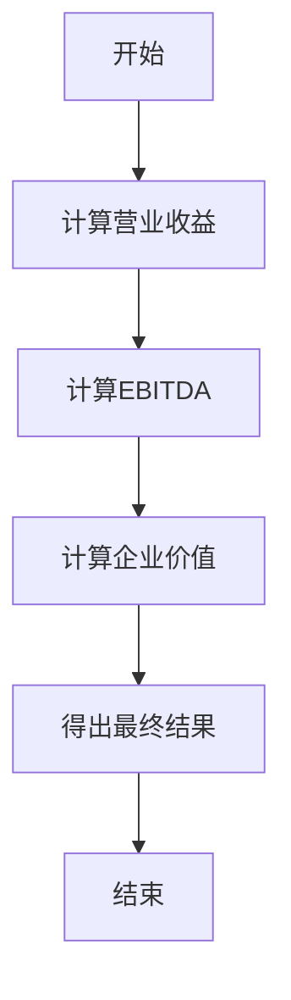
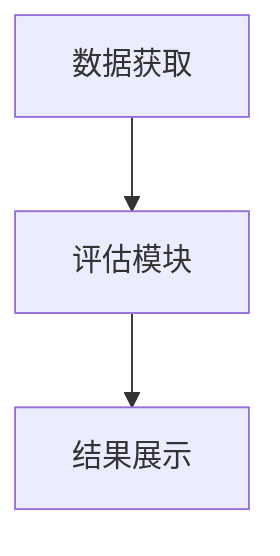
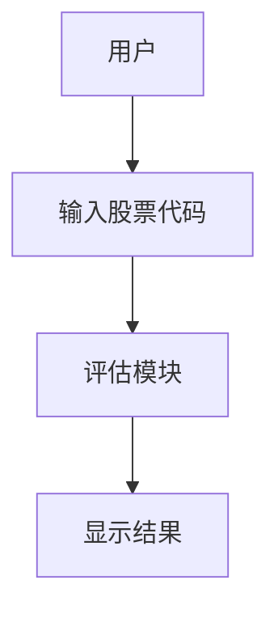

                 


# 目录大纲：《乔尔格林布拉特的魔术公式》

---

## 第一部分：投资与价值评估的背景

### 第1章：投资的基本概念与挑战

#### 1.1 投资的基本概念
- 1.1.1 什么是投资
- 1.1.2 投资的类型与分类
- 1.1.3 投资的目标与风险

#### 1.2 传统投资方法的局限性
- 1.2.1 市场情绪与非理性决策
- 1.2.2 财务报表分析的复杂性
- 1.2.3 传统估值方法的不足

#### 1.3 乔尔·格林布拉特与魔术公式
- 1.3.1 乔尔·格林布拉特的背景
- 1.3.2 魔术公式的核心理念
- 1.3.3 魔术公式的目标与应用场景

---

## 第二部分：魔术公式的核心概念与原理

### 第2章：魔术公式的核心概念

#### 2.1 魔术公式的定义与公式
- 2.1.1 魔术公式的数学表达
- 2.1.2 公式中的核心变量
- 2.1.3 公式的计算步骤

#### 2.2 魔术公式的核心要素
- 2.2.1 营业收益（ROE）
- 2.2.2 息税折旧及摊销前利润（EBITDA）
- 2.2.3 企业价值（EV）的计算

#### 2.3 魔术公式的属性特征对比
- 2.3.1 魔术公式与传统估值方法的对比
- 2.3.2 魔术公式的优点与缺点
- 2.3.2 魔术公式的适用场景

---

### 第3章：魔术公式的数学模型与公式

#### 3.1 魔术公式的数学推导
- 3.1.1 营业收益的计算
- 3.1.2 EBITDA的计算
- 3.1.3 企业价值的计算

#### 3.2 魔术公式的数学表达
- $$ EV = 市盈率 \times 收益 \times 营业利润率 \times 2.5 $$
- $$ ROE = \frac{\text{净利润}}{\text{平均股东权益}} $$

#### 3.3 魔术公式的流程图


---

## 第三部分：魔术公式在投资中的应用

### 第4章：系统分析与架构设计

#### 4.1 系统分析
- 4.1.1 问题场景介绍
- 4.1.2 项目介绍
- 4.1.3 系统功能设计

#### 4.2 系统架构设计
- 4.2.1 系统架构图


#### 4.3 系统接口设计
- 4.3.1 接口描述
- 4.3.2 接口实现

#### 4.4 系统交互设计


### 第5章：项目实战

#### 5.1 环境安装
- 5.1.1 安装Python
- 5.1.2 安装必要的库

#### 5.2 核心实现
- 5.2.1 数据获取与处理
- 5.2.2 指标计算
- 5.2.3 结果展示

#### 5.3 代码示例
```python
import pandas as pd

def calculate_roe(net_income, average_equity):
    return net_income / average_equity

def calculate_ev(pe, revenue, operating_margin):
    return pe * revenue * operating_margin * 2.5

# 示例数据
net_income = 100
average_equity = 500
pe = 15
revenue = 500
operating_margin = 0.2

roe = calculate_roe(net_income, average_equity)
ev = calculate_ev(pe, revenue, operating_margin)

print(f"ROE: {roe}")
print(f"EV: {ev}")
```

#### 5.4 案例分析
- 5.4.1 案例介绍
- 5.4.2 计算过程
- 5.4.3 结果解读

### 第6章：最佳实践与小结

#### 6.1 最佳实践
- 6.1.1 数据来源的可靠性
- 6.1.2 行业适用性
- 6.1.3 结果的动态调整

#### 6.2 小结
- 6.2.1 魔术公式的优势
- 6.2.2 魔术公式的局限性
- 6.2.3 未来的发展方向

---

## 作者：AI天才研究院 & 禅与计算机程序设计艺术

